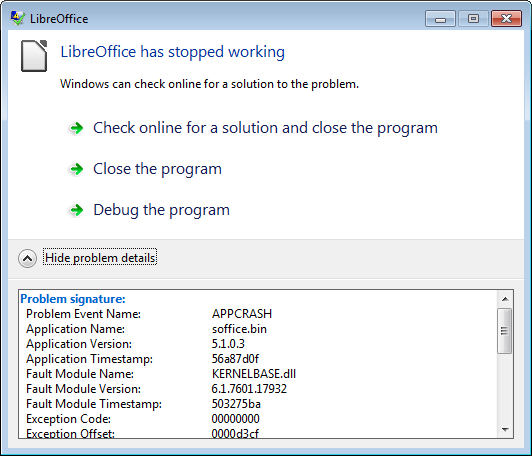
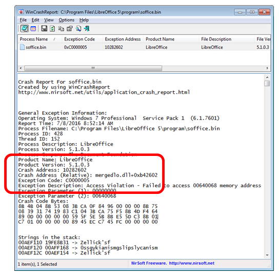
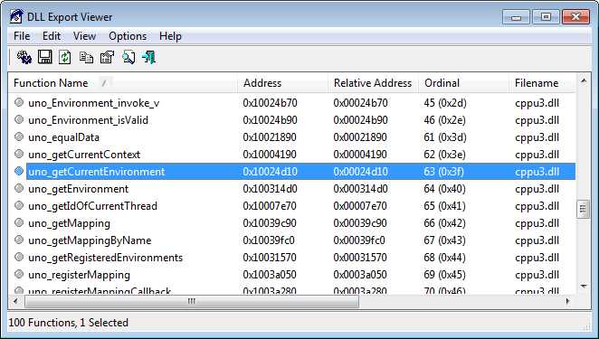
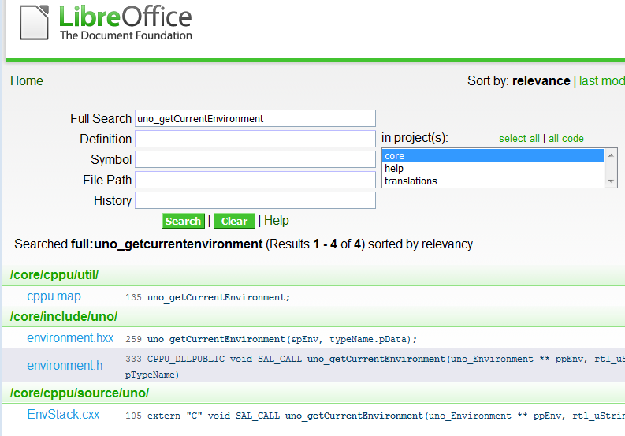

# Chapter 2. Starting and Stopping

!!! note "Topics"
    Starting Office;
    Closing Down/Killing
    Office; Opening a
    Document; Creating a
    Document; Saving;
    Closing; Document
    Conversion; Bug
    Detection and Reporting

    Example folders: "Office
    Tests" and "Utils"

Chapter 1 introduced some of the core ideas of Office.
Now it's time to show how these data structures and
relationships (e.g. service, interfaces, FCM, inheritance)
are programmed in Office's Java API.

This chapter will focus on the most fundamental tasks:
starting Office, loading (or creating) a document, saving
and closing the document, and shutting down Office. The
DocConverter.java example at the end pulls these together to show how to convert a
document into another format.

All the examples come from the "Office Tests" directory in the code download
associated with this book, and make liberal use of the classes in the "Utils" directory.
For details please visit https://fivedots.coe.psu.ac.th/~ad/jlop/.

My aim with these utilities is to hide some of the verbiage of Office. When (if?) a
programmer feels ready for more detail, then my code is documented. I'll only explain
functions here that illustrate Office ideas, such as service managers and components.

This is the first chapter with code, and so the first where programs could crash!
Section 8 gives a few tips on bug detection and reporting.


## 1.  Starting Office

Every program must load Office before working with a document, and shut it down
before exiting. These tasks are handled by loadOffice() and closeOffice() from the Lo
utility class. A typical program will look like the following:

```java
import com.sun.star.uno.*;
import com.sun.star.lang.*;
import com.sun.star.frame.*;


public class OfficeInfo
{
  public static void main(String[] args)
  {
    XComponentLoader loader = Lo.loadOffice();

    // load, manipulate and close a document

    Lo.closeOffice();
  } // end of main()

}  // end of OfficeInfo class
```

Lo.loadOffice() invokes Office and sets up a UNO bridge using named pipes. There's
also a Lo.loadSocketOffice() which uses sockets instead of pipes. Both functions
return a reference to a component loader which can be used to load a document.

loadOffice() and loadSocketOffice() call a one-argument version of loadOffice()
which uses a boolean to decide whether to use pipes or sockets to link to Office. In
both cases, a remote component context is created on the Java side (see Chapter 1,
Figure 2) and then a service manager, Desktop object, and component loader are
initialized. The code below shows some details:

```java
// in the Lo class
// globals
private static XComponentContext xcc = null;
private static XDesktop xDesktop = null;
private static XMultiComponentFactory mcFactory = null;


public static XComponentLoader loadOffice(boolean usingPipes)
{
  System.out.println("Loading Office...");
  if (usingPipes)
    xcc = bootstrapContext(); // connects to office via pipes
  else
    xcc = socketContext();    // connects to office via a socket
  if (xcc == null) {
    System.out.println("Office context could not be created");
    System.exit(1);
  }

  // get the remote office service manager
  mcFactory = xcc.getServiceManager();
  if (mcFactory == null) {
    System.out.println("Office Service Manager is unavailable");
    System.exit(1);
  }

  // desktop service handles application windows and documents
  xDesktop = createInstanceMCF(XDesktop.class,
                               "com.sun.star.frame.Desktop");
  if (xDesktop == null) {
    System.out.println("Could not create a desktop service");
    System.exit(1);
  }

  // XComponentLoader provides ability to load components
  return Lo.qi(XComponentLoader.class, xDesktop);
}  // end of loadOffice()
```

loadOffice() probably illustrates my most significant coding decisions – the use of
global static variables inside the Lo class. In particular, the XComponentContext,
XDesktop, and XMultiComponentFactory objects created by loadOffice() are stored
globally for later use. I chose this approach since it allows other support functions to
be called with simpler arguments because the objects can be accessed without the user
having to explicitly pass around references to them. The main drawback is that
loadOffice() cannot be safely called more than once (i.e. it is non-reentrant) since a
second call will overwrite the globals set during the first call.

The creation of the XDesktop interface object uses createInstanceMCF():

```java
// in the Lo class
public static <T> T createInstanceMCF(Class<T> aType,
                                            String serviceName)
{ if ((xcc == null) || (mcFactory == null)) {
    System.out.println("No office connection found");
    return null;
  }

  T interfaceObj = null;
  try {   // get service, then interface
    Object o = mcFactory.createInstanceWithContext(serviceName, xcc);
    interfaceObj = Lo.qi(aType, o);
  }
  catch (Exception e) {
    System.out.println("Couldn't create interface for \"" +
                                      serviceName + "\": " + e);
  }
  return interfaceObj;
}  // end of createInstanceMCF()


public static <T> T qi(Class<T> aType, Object o)
// the "Loki" function -- reduces typing
{  return UnoRuntime.queryInterface(aType, o);  }
```

If you ignore the error-checking, createInstanceMCF() does two things. The call to
XMultiComponentFactory.createInstanceWithContext() asks the service manager
(mcFactory) to create a service object inside the remote component context (xcc).
Then the call to UnoRuntime.queryInterface() looks inside the service instance for the
specified interface (aType), returning an instance of the interface as its result.

My Lo.qi() function's only purpose is to reduce programmer typing, since calls to
UnoRuntime.queryInterface() are very common.

The use of generics makes createInstanceMCF() useful for creating any type of
interface object. Unfortunately, generics aren't utilized in the Office API, which relies
instead on Object, Office's Any class, or the XInterface class which is inherited by all
interfaces.

#### A Quick Look at Sockets

Note: you can skip this section if socket communication with Office isn't of interest.

loadOffice() starts by calling bootstrapContext() or socketContext() to create a remote
component context. bootstrapContext() is very short since it build a UNO bridge
based on named pipes using Office's Bootstrap class. However, I also implemented a
socket-based bridge, in Lo.socketContext(). The steps it performs are:
* invoke Office as a process using sockets;
* create a local component context and service manager (local in the sense of
being in the Java process);
* connect to Office via its socket. I use the Connector service, but another
approach is to employ the UnoUrlResolver service;
* layer a UNO bridge on top of the socket link;
* retrieve a reference to the remote component context via the UNO bridge
(remote in the sense that it refers across process boundaries to Office).

Office's own Bootstrap class implements a similar sequence of steps for linking to
Office via pipes. It starts Office by calling Java's Runtime.exec(), and I've used the
same approach, but assumed that soffice.exe is part of Window's PATH environment
variable. The relevant code fragment is:

```java
String[] cmdArray = new String[3];
cmdArray[0] = "soffice";
cmdArray[1] = "-headless";
cmdArray[2] = "-accept=socket,host=localhost,port=" +
                                       SOCKET_PORT + ";urp;";
Process p = Runtime.getRuntime().exec(cmdArray);
```

SOCKET_PORT has the value 8100. Since this port number is fixed, it’s possible to
check the socket’s status outside Office. For example, on Windows, I type:
```netstat | grep 8100```
If you wondering where grep comes from, I got it from gow
(https://github.com/bmatzelle/gow/), a light-weight installer of UNIX command line
utilities for Windows.


## 2.  Closing Down/Killing Office

Lo.closeOffice() shuts down Office by calling terminate() on the XDesktop instance
created inside loadOffice():
`boolean isDead = xDesktop.terminate()`
This is usually sufficient but occasionally I've found it necessary to delay the
terminate() call for a few milliseconds in order to give Office components time to
finish. I noticed this especially when using an OfficeBean panel for displaying
documents (which I'll describe much later in Chapter 44). As a consequence,
Lo.closeDown() may actually call terminate() a few times, until it returns true.

While developing/debugging code, it's quite easy to inadvertently trigger a runtime
exception in the Office API. In the worst case, this can cause your program to exit
without calling Lo.closeDown(). This will leave an extraneous Office process running
in the OS, which should be killed. The easiest way is with a Windows batch file
containing:
`taskkill /f /t /im soffice.exe`

This uses the fact that the office process is called soffice.exe. Another useful batch
script is one that checks only if the process is running:
`tasklist /FI "IMAGENAME eq soffice.exe"`

These are packaged up as lokill.bat and lolist.bat in my code. So if you're unsure if
Office is really dead, type:
`lokill`
at a command prompt.

The Unix shell script versions of these files could use killall, pkill, ps, or kill.

Lo.killOffice() inelegantly terminates Office by calling the lokill.bat script from
inside Java:

```java
// part of the Lo class
public static void killOffice()
{
  try {
    Runtime.getRuntime().exec("cmd /c lokill.bat");
    System.out.println("Killed Office");
  }
  catch (java.lang.Exception e) {
    System.out.println("Unable to kill Office: " + e);
  }
}  // end of killOffice()
```

The code is nasty since it relies on there being a cmd.exe OS tool and a lokill.bat
batch file in the current directory.


## 3.  Opening a Document

The general format of a program that opens a document, manipulates it in some way,
and then saves it, is:

```java
public static void main(String[] args)
{
  XComponentLoader loader = Lo.loadOffice();
  XComponent doc = Lo.openDoc(args[0], loader);
  if (doc == null) {
    System.out.println("Could not open " + args[0]);
    Lo.closeOffice();
    return;
  }

  // use the Office API to manipulate doc...


  Lo.saveDoc(doc, "foo.docx");  // save as a Word file
  Lo.closeDoc(doc);
  Lo.closeOffice();
} // end of main()
```

The new methods are Lo.openDoc(), Lo.saveDoc(), and Lo.closeDoc().

openDoc() calls XComponentLoader.loadComponentFromURL(), which requires a
document URL, the type of Office frame used to display the document, optional
search flags, and an array of document properties. For example:

```java
String fileURL = FileIO.fnmToURL(fnm);
PropertyValue[] props = Props.makeProps("Hidden", true);
XComponent doc =
         loader.loadComponentFromURL(fileURL, "_blank", 0, props);
```

The frame type is almost always "_blank" which indicates that a new window will be
created for the newly loaded document. (Other possibilities are listed in the
XComponentLoader documentation which you can access with `lodoc XComponentLoader`.)
The search flags are usually set to 0, and document properties
are stored in the PropertyValue array, props.

loadComponentFromURL()'s return type is XComponent, which refers to the
document.

FileIO.fnmToURL() converts an ordinary filename (e.g. “foo.doc”) into a URL (a full
path prefixed with file:///).

Props.makeProps() takes a property name and value and returns a PropertyValue
array; there are several variants which accept different numbers of property name-
value pairs.

A complete list of document properties can be found in the MediaDescriptor
documentation (accessed with `lodoc MediaDescriptor service`), but some of the
important ones are listed in Table 1.


|Property Name    |Use                                                                       |
|-----------------|--------------------------------------------------------------------------|
|AsTemplate       |Creates a new document using a specified template                         |
|Hidden           |Determines if the document is invisible after being loaded                |
|ReadOnly         |Opens the document read-only                                              |
|StartPresentation|Starts showing a slide presentation immediately after loading the document|

Table 1. Some Document Properties.


## 4.  Creating a Document

A new document is created by calling
XComponentLoader.loadComponentFromURL() with a special URL string for the
document type. The possible strings are listed in Table 2.


|URL String                              |Document Type              |
|----------------------------------------|---------------------------|
|"private:factory/swriter"               |Writer                     |
|"private:factory/sdraw"                 |Draw                       |
|"private:factory/simpress"              |Impress                    |
|"private:factory/scalc"                 |Calc                       |
|"private:factory/sdatabase"             |Base                       |
|"private:factory/swriter/web"           |HTML document in Writer    |
|"private:factory/swriter/GlobalDocument"|A Master document in Writer|
|"private:factory/schart"                |Chart                      |
|"private:factory/smath"                 |Math Formulae              |
|".component:Bibliography/View1"         |Bibliography Entries       |
|".component:DB/QueryDesign"             |Database User Interfaces   |
|".component:DB/TableDesign"             |                           |
|".component:DB/RelationDesign"          |                           |
|".component:DB/DataSourceBrowser"       |                           |
|".component:DB/FormGridView"            |                           |

Table 2. URLs for Creating New Documents.

For instance, a Writer document is created by:

```java
XComponent doc =
     loader.loadComponentFromURL("private:factory/swriter",
                                 "_blank", 0, props);
```

The utility classes include code for simplifying the creation of Writer, Draw, Impress,
Calc, and Base documents, which I'll be looking at in later chapters.


#####  A Second Service Manager

Lo.loadDoc() and Lo.createDoc() do a bit of additional work after document
loading/creation – they instantiate a XMultiServiceFactory service manager which is
stored in the Lo class. This is done by applying Lo.qi() to the document:

```java
// global in Lo.java
private static XMultiServiceFactory msFactory = null;

// in loadDoc()
XComponent doc =
      loader.loadComponentFromURL(fileURL, "_blank", 0, props);
msFactory =  Lo.qi(XMultiServiceFactory.class, doc);
```

I first employed Lo.qi() in createInstanceMCF() to access an interface inside a
service. This time qi() is casting one interface (XComponent) to another
(XMultiServiceFactory).

The XMultiServiceFactory object is the second service manager we've encountered;
the first was an XMultiComponentFactory instance, created during Office's loading.

The reasons for Office having two service managers are historical: the
XMultiServiceFactory manager is older, and creates a service object without the need
for an explicit reference to the remote component context.

As Office developed, it was decided that service object creation should always be
relative to an explicit component context, and so the newer XMultiComponentFactory
service manager came into being. A lot of older code still uses the
XMultiServiceFactory service manager, so both are supported in the Lo class.

Another difference between the managers is that the XMultiComponentFactory
manager is available as soon as Office is loaded, while the XMultiServiceFactory
manager is initialized only when a document is loaded or created.


## 5.  Saving a Document

One of the great strengths of Office is that it can export a document in a vast number
of formats, but the programmer must specify the output format (which is called a filter
in the Office documentation).

XStorable.storeToURL() takes the name of the output file (in URL format), and an
array of properties, one of which should be "FilterName". Two other useful output
properties are "Overwrite" and "Password". Input and output document properties are
listed in the MediaDescriptor service documentation (`lodoc MediaDescriptor service`).

If "Overwrite" is set to true then the file will be saved without prompting the user if
the file already exists. The "Password" property contains a string which must be
entered into an Office dialog by the user before the file can be opened again.

The steps in saving a file are:

```java
String saveFileURL = FileIO.fnmToURL(fnm);
String[] nms = new String[] {"Overwrite", "FilterName", "Password"};
Object[] vals = new Object[] {true, format, password};
PropertyValue[] storeProps = Props.makeProps(nms, vals);

XStorable store = Lo.qi(XStorable.class, doc);
store.storeToURL(saveFileURL, storeProps);
```

I've used a variant of the Props.makeProps() method to create an array of three
properties. If you don't want a password, then the third property should be left out.

Lo.qi() is used again to cast an interface, this time from XComponent to XStoreable.

Figure 5 in Chapter 1 shows that XStoreable is part of the OfficeDocument service,
which means that it's inherited by all Office document types.


#### What's a Filter Name?

XStorable.storeToURL() needs a "FilterName" property value, but what should the
string be to export the document in Word format for example?

Info.getFilterNames() returns an array of all the filter names supported by Office.

There's an example call in OfficeInfo.java, but is commented out because it returns a
250+ element list!

Rather than force a programmer to search through this list for the correct name,
Lo.saveDoc() allows him to supply just the name and extension of the output file. For
example, in section 3, Lo.saveDoc() was called like so:

```java
Lo.saveDoc(doc, "foo.docx");
```

saveDoc() extracts the file extension (i.e. "docx") and maps it to a corresponding filter
name in Office (in this case, "Office Open XML Text"). One concern is that it's not
always clear which extension-to-filter mapping should be utilized. For instance,
another suitable filter name for "docx" is "MS Word 2007 XML". I've essentially
ignored this problem, by hardwiring a fixed selection into saveDoc().

Another issue is that the choice of filter sometimes depends on the extension and the
document type. For example, a Writer document saved as a PDF file should use the
filter "writer_pdf_Export", but if the document is a spreadsheet then
"calc_pdf_Export" is the correct choice. Consequently, saveDoc() examines both the
extension and the document's service name, which is accessed via the XServiceInfo
interface:

```java
XServiceInfo xInfo = Lo.qi(XServiceInfo.class, doc);
boolean isWriter =     // is it a Writer doc?
        xInfo.supportsService("com.sun.star.text.TextDocument");
```

The main document service names are listed in Table 3.


|Document|Type Service Name                             |
|--------|----------------------------------------------|
|Writer  |com.sun.star.text.TextDocument                |
|Draw    |com.sun.star.drawing.DrawingDocument          |
|Impress |com.sun.star.presentation.PresentationDocument|
|Calc    |com.sun.star.sheet.SpreadsheetDocument        |
|Base    |com.sun.star.sdb.OfficeDatabaseDocument       |

Table 3. Document Service Names.


We encountered these service names back in Chapter 1, Figure 8 – they're subclasses
of the OfficeDocument service.

A third problem is incompletness; I've only implemented saveDoc() mappings for a
small subset of Office's 250+ filter names, so if you try to save a file with an exotic
extension then my code will most likely break.

If you want to study the details, start with Lo.saveDoc(), and burrow down; the
trickiest part is Lo.ext2Format().


## 6.  Closing a Document

Closing a document is a pain if you want to check with the user beforehand: should a
modified file be saved, thereby overwriting the old version? My solution is not to
bother the user, so the file is closed without saving, irrespective of any modifications.
In other words, it's essential to explicitly save a changed document with
Lo.saveDoc() before calling Lo.closeDoc().

The code for closing employs Lo.qi() to cast the document's XComponent interface to
XCloseable:

```java
XCloseable closeable =  Lo.qi(XCloseable.class, doc);
closeable.close(false);   // doc. closed without saving
```


## 7.  A General Purpose Converter

The DocConverter.java example in "Office Tests/" takes two command line
arguments: the name of an input file and the extension that should be used when
saving the loaded document. For instance:

```java
run DocConverter points.ppt odp
```

will save slides in MS PowerPoint format as an Impress presentation. The following
converts a JPEG image into PNG:
```java
run DocConverter skinner.jpg png
```

The code for DocConverter is short:

```java
import com.sun.star.uno.*;
import com.sun.star.lang.*;
import com.sun.star.frame.*;


public class DocConverter
{
  public static void main(String args[])
  {
    if (args.length != 2) {
      System.out.println("Usage: DocConverter fnm extension");
      return;
    }

    XComponentLoader loader = Lo.loadOffice();
    XComponent doc = Lo.openDoc(args[0], loader);
    if (doc == null) {
      System.out.println("Could not open " + args[0]);
      Lo.closeOffice();
      return;
    }

    String name = Info.getName(args[0]);
    Lo.saveDoc(doc, name + "." + args[1]);
    Lo.closeDoc(doc);
    Lo.closeOffice();
  } // end of main()

}  // end of DocConverter class
```


## 8.  Bug Detection and Reporting

This chapter began our coding with the Office API, and so the possibility of bugs also
becomes an issue. If you find a problem with one of my support classes (e.g. in
Lo.java) or one of my examples (e.g. in DocConverter.java), then please contact me at
ad@fivedots.coe.psu.ac.th, supplying as much detail as possible.

Another source of bugs is the LibreOffice API itself, which is hardly a surprise
considering its complexity and age. If you find a problem, then you should first search
LibreOffice's Bugzilla site at https://bugs.documentfoundation.org/ to see if the
problem has been reported previously (it probably has). Various types of search are
explained in the Bugzilla documentation at
https://bugs.documentfoundation.org/docs/en/html/using/
If you want to report a new bug, then you'll need to set up an account, which is quite
simple, and also explained by the documentation.

Often when people report bugs they don't include enough information, perhaps
because the error window displayed by Windows is somewhat lacking. For example, a
typical crash report window  is shown in Figure 1.




Figure 1. The LibreOffice Crash Reported by Windows 7.


If you're going to make an official report, you should first read the article "How to
Report Bugs in LibreOffice" (https://wiki.documentfoundation.org/QA/BugReport).

Expert forum members and Bugzilla maintainers sometimes point people towards
WinDbg for Windows as a tool for producing good debugging details. The wiki has a
detailed explanation of how to install and use it
(https://wiki.documentfoundation.org/How_to_get_a_backtrace_with_WinDbg),
which is a bit scary in its complexity.

A much easier alternative is the `WinCrashReport` application from NirSoft
(https://nirsoft.net/utils/application_crash_report.html). It presents the Windows
Error Reporting (WER) data generated by a crash in a readable form.

When a crash window appears (like the one in Figure 1), start WinCrashReport to
examine the automatically-generated error report, as in Figure 2.




Figure 2. WinCrashReport GUI

Figure 2 indicates that the problem lies inside mergedlo.dll, an access violation (the
exception code 0xC0000005) to a memory address.

mergedlo.dll is part of LibreOffice which probably means that you can find the DLL
in <OFFICE>/program. Most Office DLLs are located in that directory, but it's useful
to have a fast file search utility on your machine to find files that might be in third-
party libraries or in Windows. I use `SwiftSearch`
(https://sourceforge.net/projects/swiftsearch/).

WinCrashReport generates two alternative call stacks, with slightly more information
in the second in this case. mergedlo.dll is called by the uno_getCurrentEnvironment()
function in cppu3.dll, as indicated in Figure 3.


Figure 3. The Second Call Stack in WinCrashReport.


This narrows the problem to a specific function and two DLLs, which is very helpful.

If you want to better understand the DLLs, they can be examined using `DLL Export Viewer`,
another NirSoft tool (https://nirsoft.net/utils/dll_export_viewer.html),
which lists a DLL's exported functions. Running it on mergedlo.dll turns up nothing,
but the details for cppu3.dll are shown in Figure 4.




Figure 4. DLL Export Viewer's view of cppu3.dll

mergedlo.dll appears to be empty inside DLL Export Viewer because it exports no
functions. That probably means it's being used as a store for resources, such as icons,
cursors, and images. There's another NirSoft tool for looking at DLL resources, called
ResourcesExtract (https://nirsoft.net/utils/resources_extract.html).

The offending function must be uno_getCurrentEnvironment() which Figure 4
confirms to be in cppu3.dll.

Looking at the Source Code
You might want to narrow the problem down further by looking at
uno_getCurrentEnvironment()'s source. This is easy with  the "OpenGrok for
LibreOffice" website (https://opengrok.libreoffice.org) for searching the gigantic code
base. Figure 5 shows the results for an "uno_getCurrentEnvironment" search.




Figure 5. OpenGrok Results for "uno_getCurrentEnvironment"

The function's code is in EnvStack.cxx, which can be examined by clicking on the
linked function name shown at the bottom of Figure 5.

If you're interested in exploring the code base more widely, there are some very good
blog posts about it by Eilidh McAdam: "Exploring the LibreOffice code base"
(https://lanedo.com/exploring-the-libreoffice-code-base/) and "LibreOffice
Development Howto" (https://lanedo.com/libreoffice-development-howto/).