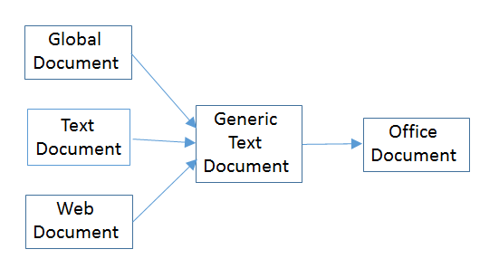
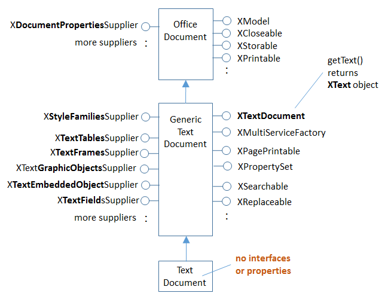
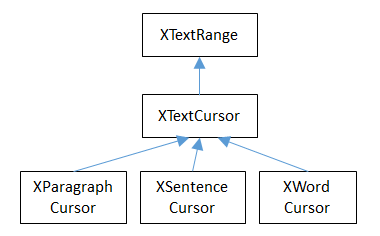
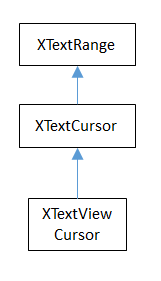
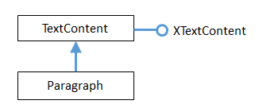
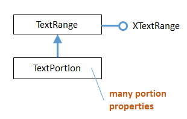

# Chapter 5. Text API Overview 
 
 
The next few chapters look at programming with the text 
document part of the Office API. This chapter begins with 
a quick overview of the text API, then a detailed look at 
text cursors for moving about in a document, extracting 
text, and adding/inserting new text.  

Text cursors aren't the only way to move around inside a 
document; it's also possible to iterate over a document by 
treating it as a sequence of paragraphs. 

The chapter finishes with a look at how two (or more) text 
documents can be appended. 

The online Developer's Guide begins text document programming at  
https://wiki.openoffice.org/wiki/Documentation/DevGuide/Text/Text_Documents 
(the easiest way of accessing that page is to type loguide writer). It corresponds to 
Chapter 7 in the printed guide (available at 
https://wiki.openoffice.org/w/images/d/d9/DevelopersGuide_OOo3.1.0.pdf), but the 
Web material is better structured and formatted. 

The guide's text programming examples are in TextDocuments.java, downloadable 
from http://api.libreoffice.org/examples/DevelopersGuide/examples.html#Text. 

Although the code is long, it's well-organized. Some smaller text processing examples 
are available at http://api.libreoffice.org/examples/examples.html#Java_examples. 

This chapter (and later ones) assume that you're familiar with Writer, including text 
concepts such as paragraph styles. If you're not, then I recommend the "Writer 
Guide", a user manual, available at http://www.libreoffice.org/get-
help/documentation/ or 
https://wiki.documentfoundation.org/Documentation/Publications. 

 
## 1.  An Overview of the Text Document API 

The API is centered around four text document services which subclass 
OfficeDocument, as shown in Figure 1. 

 

!!! note "Topics"
    API Overview; 
Text Cursors; Extracting 
Text; Cursor Iteration; 
Creating Cursors; 
Creating a Document; 
Using and Comparing 
Text Cursors; 
Inserting/Changing Text 
in a Document; Text 
Enumeration; 
Appending Documents 
Example folders: "Text 
Tests" and "Utils" 

Figure 1. The Text Document Services. 

 
I'll be concentrating on the TextDocument service, which is documented at 
http://api.libreoffice.org/docs/idl/ref/servicecom_1_1sun_1_1star_1_1text_1_1TextD
ocument.html. Or you can type lodoc TextDocument service, which unfortunately 
takes you to the IDL page for TextDocument; to reach the documentation, click on 
"TextDocument" under the "Classes" heading.  

The GlobalDocument service in Figure 1 is employed by master documents, such as a 
book or thesis. A master document is typically made up of links to files holding its 
parts, such as chapters, bibliography, and appendices.  

The WebDocument service in Figure 1 is for manipulating web pages, although its 
also possible to generate HTML files with the TextDocument service. 

TextDocument, GlobalDocument, and WebDocument are mostly empty because those 
services don't define any interfaces or properties. The GenericTextDocument service 
is where  the action takes place, as summarized in Figure 2. 

 

Figure 2. The Text Document Services, and some Interfaces. 

 
The numerous 'Supplier' interfaces in Figure 2 are Office's way of accessing different 
elements in a document. For example, XStyleFamiliesSupplier manages character, 
paragraph, and other styles, while XTextTableSupplier deals with tables.  

I'll be looking at these suppliers in later chapters, which is why they're highlighted, 
but for now let's only consider the XTextDocument interface at the top right of the 
GenericTextDocument service box in Figure 2  
XTextDocument has a getText() method for returning an XText object. XText 
supports functionality related to text ranges and positions, cursors, and text contents. 

It inherits XSimpleText and XTextRange, as indicated in Figure 3. 

 

Figure 3. XText and its Superclasses. 

 
Text content covers a multitude, such as embedded images, tables, footnotes, and text 
fields. Many of the suppliers shown in Figure 2 (e.g. XTextTablesSupplier) are for 
iterating through text content (e.g. accessing the document's tables).  

I'll concentrate on ordinary text in this chapter, and look at more esoteric content 
forms in Chapters 7 and 8. 

A text document can utilize eight different cursors, which fall into two groups, as in 

Figure 4. 

 

Figure 4. Types of Cursor. 

 
XTextCursor contains methods for moving around the document, and an instance is 
often called a model cursor because of its close links to the document's data. A 
program can create multiple XTextCursor objects if it wants, and can convert an 
XTextCursor into XParagraphCursor, XSentenceCursor, or XWordCursor. The 
differences are that while an XTextCursor moves through a document character by 
character, the others travel in units of paragraphs, sentences, and words.  

A program may employ a single XTextViewCursor cursor, to represent the cursor the 
user sees in the Writer application window; for this reason, it's often called the view 
cursor. XTextViewCursor can be converted into a XLineCursor, XPageCursor, or 
XScreenCursor object, which allows it to move in terms of lines, pages, or screens.  

A cursor's location is specified using a text range, which can be the currently selected 
text, or a position in the document. A text position is a text range that begins and ends 
at the same point. 

 
 
## 2.  Extracting Text from a Document 

The ExtractText.java example opens a document using Lo.openOffice(), and tries to 
print its text: 
 
public static void main(String[] args) 
{ 
  if (args.length != 1) { 
    System.out.println("Usage: ExtractText fnm"); 
    return; 
  } 
 
  XComponentLoader loader = Lo.loadOffice(); 
  XComponent doc = Lo.openDoc(args[0], loader); 
  if (doc == null) { 
    System.out.println("Could not open " + args[0]); 
    Lo.closeOffice(); 
    return; 
  } 
 
  if (Info.isDocType(doc, Lo.WRITER_SERVICE)) { 
    XTextDocument textDoc = Write.getTextDoc(doc); 
    XTextCursor cursor = Write.getCursor(textDoc); 
    String text = Write.getAllText(cursor); 
    System.out.println("--------- Text Content --------"); 
    System.out.println(text); 
    System.out.println("-------------------------------"); 
  } 
  else 
    System.out.println("Extraction unsupported for this doc type"); 
 
  Lo.closeDoc(doc); 
  Lo.closeOffice(); 
} // end of main() 
 
Info.isDocType() tests the document's type by casting it into an XServiceInfo 
interface. Then it calls XServiceInfo.supportsService() to check the document's 
service capabilities: 
 
public static boolean isDocType(Object doc, String docType) 
// in the Info utility class 
{ XServiceInfo si = Lo.qi(XServiceInfo.class, doc); 
  return si.supportsService(docType); 
} 
 
The argument type of the document is Object rather than XComponent so that a wider 
range of objects can be passed to the function for testing. 

The service names for documents are hard to remember, so they're defined as 
constants in my Lo class: 
 
// in the Lo class 
public static final String WRITER_SERVICE =  
               "com.sun.star.text.TextDocument"; 
public static final String BASE_SERVICE =  
               "com.sun.star.sdb.OfficeDatabaseDocument"; 
public static final String CALC_SERVICE =  
               "com.sun.star.sheet.SpreadsheetDocument"; 
public static final String DRAW_SERVICE =  
               "com.sun.star.drawing.DrawingDocument"; 
public static final String IMPRESS_SERVICE =  
              "com.sun.star.presentation.PresentationDocument"; 
public static final String MATH_SERVICE =  
              "com.sun.star.formula.FormulaProperties"; 
 
Write.getTextDoc() uses Lo.qi() to cast the document's XComponent interface into an 
XTextDocument: 
XTextDocument textDoc = Lo.qi(XTextDocument.class, doc); 
This may fail (i.e. return null) if the loaded document isn't an instance of the 
TextDocument service.  

The casting 'power' of Lo.qi() is confusing – it depends on the document's service 
type. All text documents are instances of the TextDocument service (see Figure 2). 

This means that Lo.qi() can 'switch' between any of the interfaces defined by 
TextDocument or its superclasses (i.e. the interfaces in GenericTextDocument or 
OfficeDocument). For instance, the following cast is fine: 
 
XStyleFamiliesSupplier xSupplier = 
                   Lo.qi(XStyleFamiliesSupplier.class, doc); 
 
This changes the instance into an XStyleFamiliesSupplier, which can access the 
document's styles.  

Alternatively, the following converts the instance into a supplier defined in 
OfficeDocument: 
XDocumentPropertiesSupplier xSupplier = 
               Lo.qi(XDocumentPropertiesSupplier.class, doc); 
 
Most of the examples in this chapter and the next few cast the document to 
XTextDocument since that interface can access the document's contents as an XText 
object: 
 
XTextDocument textDoc = Lo.qi(XTextDocument.class, doc); 
XText xText = textDoc.getText(); 
 
The XText instance can access all the capabilities shown in Figure 3.  

A common next step is to create a cursor for moving around the document. This is 
easy since XText inherits XSimpleText which has a createTextCursor() method: 
XTextCursor textCursor = xText.createTextCursor(); 
These few lines are so useful that I've put them inside a Write.getCursor() method: 
 
public static XTextCursor getCursor(XTextDocument textDoc) 
// get cursor from a text document 
{ 
  XText xText = textDoc.getText(); 
  if (xText == null) { 
    System.out.println("Text not found in document"); 
    return null; 
  } 
  else 
    return xText.createTextCursor(); 
}  // end of getCursor() 
 
An XTextCursor can be converted into other kinds of model cursors (e.g. 

XParagraphCursor, XSentenceCursor, XWordCursor; see Figure 4). That's not 
necessary in for the ExtractText.java example; instead, the XTextCursor is passed to 
Write.getAllText() to access the text as a sequence of characters: 
 
public static String getAllText(XTextCursor cursor) 
{ 
  cursor.gotoStart(false); 
  cursor.gotoEnd(true); 
  String text = cursor.getString(); 
  cursor.gotoEnd(false);    // to deselect everything in the doc 
  return text; 
}  // end of getAllText() 
 
All cursor movement operations take a boolean argument which specifies whether the 
movement should also select the text. For example, in getAllText(), 
cursor.gotoStart(false) shifts the cursor to the start of the text without selecting 
anything. The subsequent call to cursor.gotoEnd(true) moves the cursor to the end of 
the text and selects all the text moved over. The call to getString() on the third line 
returns the selection (i.e. all the text in the document). 

Two other useful XTextCursor methods are: 
boolean goLeft(short charCount, boolean isSelected)  
boolean goRight(short charCount, boolean isSelected) 
They move the cursor left or right by a given number of characters, and the boolean 
argument specifies whether the text moved over is selected.  

All cursor methods return a boolean result which indicates if the move (and optional 
selection) was successful. 

Another method worth knowing is: 
boolean gotoRange(XTextRange textRange, boolean isSelected)  
gotoRange() takes an XTextRange argument, which represents a selected region or 
position where the cursor should be moved to. For example, it's possible to find a 
bookmark in a document, extract its text range/position, and move the cursor to that 
location with gotoRange(). I'll show code for doing this in Chapter 7. 

The XTextCursor methods are documented at 
http://api.libreoffice.org/docs/idl/ref/interfacecom_1_1sun_1_1star_1_1text_1_1XTex
tCursor.html (or type lodoc XTextCursor). 

 
A Problem with Write.getAllText() 
Write.getAllText() may fail if supplied with a very large document because 
XTextCursor.getString() might be unable to construct a big enough String object. For 
that reason, it's better to iterate over large documents returning a paragraph of text at a 
time. These iteration techniques are described next. 

 
## 3.  Cursor Iteration  

My HighlightText.java example uses paragraph and word cursors (i.e. the 
XParagraphCursor and XWordCursor interfaces in Figure 4). It also employs the view 
cursor, an XTextViewCursor instance, to control the Writer application's visible 
cursor.  

The main() function of HighlightText: 
 
public static void main(String args[]) 
{ 
  if (args.length < 1) { 
    System.out.println("Usage: run HighlightText <fnm>"); 
    return; 
  } 
 
  XComponentLoader loader = Lo.loadOffice(); 
  XTextDocument doc = Write.openDoc(args[0], loader); 
  if (doc == null) { 
    System.out.println("Could not open " + args[0]); 
    Lo.closeOffice(); 
    return; 
  } 
 
  GUI.setVisible(doc, true);  // make doc visible on-screen 
 
  showParagraphs(doc); 
  System.out.println("Word count: " + countWords(doc)); 
  showLines(doc); 
 
  Lo.closeDoc(doc); 
  Lo.closeOffice(); 
}  // end of main() 
 
main() calls Write.openDoc() to return the opened document as an XTextDocument 
instance. If you recall, the previous ExtractText.java example started with an 
XComponent instance by calling Lo.openDoc(), and then converted it to 
XTextDocument. Write.openDoc() returns the XTextDocument reference in one go. 

showParagraphs() moves the visible on-screen cursor through the document, 
highlighting a paragraph at a time. This requires two cursors – an instance of 
XTextViewCursor and a separate XParagraphCursor. The paragraph cursor is capable 
of moving through the document paragraph-by-paragraph, but it's a model cursor, so 
invisible to the user looking at the document on-screen. showParagraphs() extracts the 
start and end positions of each paragraph and uses them to move the view cursor, 
which is visible. 

The code for showParagraphs(): 
 
private static void showParagraphs(XTextDocument doc) 
{ 
  XTextViewCursor tvc = Write.getViewCursor(doc); 
  XParagraphCursor paraCursor = Write.getParagraphCursor(doc); 
  paraCursor.gotoStart(false);      
              // go to start of text; no selection 
  do { 
    paraCursor.gotoEndOfParagraph(true); // select 1 paragraph 
    String currPara = paraCursor.getString(); 
    if (currPara.length() > 0) { 
      // move view cursor to highlight current paragraph 
      tvc.gotoRange( paraCursor.getStart(), false); 
      tvc.gotoRange( paraCursor.getEnd(), true); 
 
      Lo.wait(500);   // slow down paragraph changing speed 
    } 
  } while (paraCursor.gotoNextParagraph(false)); 
}  // end of showParagraphs() 
 
The code utilizes two Write utility functions (Write.getViewCursor() and 
Write.getParagraphCursor()) to create the cursors. The subsequent do-while loop is a 
common coding pattern for iterating over a text document: 
 
paraCursor.gotoStart(false);  
do { 
  paraCursor.gotoEndOfParagraph(true);   // select 1 paragraph 
 
  // do something to the selected text range... 

} while (paraCursor.gotoNextParagraph(false)); 
 
gotoNextParagraph() tries to move the cursor to the beginning of the next paragraph. 

If the moves fails (i.e. when the cursor has reached the end of the document), the 
function returns false, and the loop terminates.  

The call to gotoEndOfParagraph() at the beginning of the loop moves the cursor to the 
end of the paragraph and selects its text. Since the cursor was originally at the start of 
the paragraph, the selection will span that paragraph. 

XParagraphCursor and the sentence and word cursors inherit XTextCursor, as shown 
in Figure 5. 

 

Figure 5. The Model Cursors Inheritance Hierarchy. 

 
Since all these cursors also inherit XTextRange, they can easily access and change 
their text selections/positions. In the showParagraphs() method above, the two ends of 
the paragraph are obtained by calling the inherited XTextRange.getStart() and 
XTextRange.getEnd(), and the positions are used to move the view cursor: 
 
XTextViewCursor tvc = Write.getViewCursor(doc); 
       : 
tvc.gotoRange(paraCursor.getStart(), false); 
tvc.gotoRange(paraCursor.getEnd(), true); 
 
gotoRange() sets the text range/position of the view cursor: the first call moves the 
cursor to the paragraph's starting position without selecting anything, and the second 
moves it to the end position, selecting all the text in between. Since this is a view 
cursor, the selection is visible on-screen, as illustrated in Figure 6. 

 
 

Figure 6. A Selected Paragraph. 

 
Note that getStart() and getEnd() do not return integers but collapsed text ranges, 
which is Office-lingo for a range that starts and ends at the same cursor position. 

Somewhat confusingly, the XTextViewCursor interface inherits XTextCursor (as 
shown in Figure 7). This only means that XTextViewCursor supports the same 
character-based movement and text range operations as the model-based cursor. 

 

Figure 7. The XTextViewCursor Inheritance Hierarchy. 

 
 
## 4.  Creating Cursors 

An XTextCursor is created by calling Write.getCursor(), which can then be converted 
into a paragraph, sentence, or word cursor by using Lo.qi(). For example, the Write 
utility class defines getParagraphCursor() as: 
 
public static XParagraphCursor getParagraphCursor( 
                                      XTextDocument textDoc) 
{ XTextCursor cursor = getCursor(textDoc); 
  if (cursor == null) { 
    System.out.println("Text cursor is null"); 
    return null; 
  } 
  else 
    return Lo.qi(XParagraphCursor.class, cursor);   
}  // end of getParagraphCursor() 
 
Obtaining the view cursor is a little more tricky since it's only accessible via the 
document's controller.  

As described in Chapter 1, section 5 about the FCM relationship, the controller is 
reached via the document's model, as shown in the first two lines of 
Write.getViewCursor(): 
 
public static XTextViewCursor getViewCursor(XTextDocument textDoc) 
{ 
  XModel model = Lo.qi(XModel.class, textDoc); 
  XController xController = model.getCurrentController(); 
   
  // the controller supplies the TextViewCursor 
  XTextViewCursorSupplier supplier = Lo.qi( 
                   XTextViewCursorSupplier.class, xController); 
  return supplier.getViewCursor(); 
}  // end of getViewCursor() 
 
The view cursor isn't directly accessible from the controller; a supplier must be 
queried, even though there's only one view cursor per document. 

 
### 4.1.  Counting Words 

countWords() in HightlightText.java shows how to iterate over the document using a 
word cursor: 
 
private static int countWords(XTextDocument doc) 
{ 
  XWordCursor wordCursor = Write.getWordCursor(doc); 
  wordCursor.gotoStart(false);     // go to start of text 
 
  int wordCount = 0; 
  String currWord; 
  do { 
    wordCursor.gotoEndOfWord(true); 
    currWord = wordCursor.getString(); 
    if (currWord.length() > 0) 
      wordCount++; 
  } while( wordCursor.gotoNextWord(false)); 
  return wordCount; 
}  // end of countWords() 
 
This uses the same kind of do-while loop as showParagraphs() except that the 
XTextWordCursor methods gotoEndOfWord() and gotoNextWord() control the 
iteration. Also, there's no need for an XTextViewCursor instance since the selected 
words aren't shown on the screen. 

 
### 4.2.  Displaying Lines 

showLines() in HightlightText.java iterates over the document highlighting a line at a 
time. Don't confuse this with sentence selection because a sentence may consist of 
several lines on the screen. A sentence is part of the text's organization (i.e. in terms 
of words, sentences, and paragraphs) while a line is part of the document view (i.e. 

line, page, screen). This means that XLineCursor is a view cursor, which is obtained 
by converting XTextViewCursor with Lo.qi(): 
 
XTextViewCursor tvc = Write.getViewCursor(doc); 
XLineCursor lineCursor =  Lo.qi(XLineCursor.class, tvc);  
 
The line cursor has limited functionality compared to the model cursors (paragraph, 
sentence, word). In particular, there's no "next' function for moving to the next line 
(unlike gotoNextParagraph() or gotoNextWord()). The screen cursor also lacks this 
ability, but the page cursor offers jumpToNextPage().  

One way of getting around the absence of a 'next' operation is shown in showLines(): 
 
private static void showLines(XTextDocument doc) 
{ 
  XTextViewCursor tvc = Write.getViewCursor(doc); 
  tvc.gotoStart(false);     // go to start of text 
 
  XLineCursor lineCursor =  
         Lo.qi(XLineCursor.class, tvc);  
 
  boolean haveText = true; 
  do { 
    lineCursor.gotoStartOfLine(false); 
    lineCursor.gotoEndOfLine(true);  // select 1 line 
 
    Lo.wait(500);   // slow down the line changing speed 
    tvc.collapseToEnd();  // make selection disappear 
 
    haveText = tvc.goRight((short) 1, true); // move 1 char 
  } while (haveText); 
}  // end of showLines() 
 
The view cursor is manipulated using the XTextViewCursor object and the 
XLineCursor line cursor. This is possible since the two references point to the same 
on-screen cursor. Either one can move it around the display. 

Inside the loop, XLineCursor's gotoStartOfLine() and gotoEndOfLine() highlight a 
single line. Then the XTextViewCursor instance deselects the line, by moving the 
cursor to the end of the selection with collapseToEnd(). At the end of the loop, 
goRight() tries to move the cursor one character to the right. If goRight() succeeds 
then the cursor is shifted one position to the first character of the next line. When the 
loop repeats, this line will be selected. If doRight() fails, then there are no more 
characters to be read from the document, and the loop finishes. 

 
 
## 5.  Creating a Document 

All the examples so far have involved the manipulation of an existing document. The 
HelloText.java example creates a new text document, containing two short 
paragraphs, and saves it as "hello.odt". The main() function is: 
 
public static void main(String[] args) 
{ 
  XComponentLoader loader = Lo.loadOffice(); 
  XTextDocument doc = Write.createDoc(loader); 
 
  if (doc == null) { 
    System.out.println("Writer doc creation failed"); 
    Lo.closeOffice(); 
    return; 
  } 
 
  GUI.setVisible(doc, true);    // make the document visible 
 
  XTextCursor cursor = Write.getCursor(doc); 
  cursor.gotoEnd(false);    
           // move cursor to end of doc before appending 
 
  Write.appendPara(cursor, "Hello LibreOffice.\n"); 
  Lo.wait(1000);   // slow things down so they can be seen 
 
  Write.appendPara(cursor, "How are you?."); 
  Lo.wait(2000); 
 
  Lo.saveDoc(doc, "hello.odt"); 
         // or use extension doc, docx, rtf, pdf, txt 
  Lo.closeDoc(doc); 
  Lo.closeOffice(); 
} // end of main() 
 
Write.createDoc() calls Lo.createDoc() with the text document service name (the 
Lo.WRITER_STR constant is "swriter"). Office creates a TextDocument service with 
an XComponent interface, which is cast to the XTextDocument interface, and 
returned: 
 
// in the Write class 
public static XTextDocument createDoc(XComponentLoader loader) 
{  
  XComponent doc = Lo.createDoc(Lo.WRITER_STR, loader);   
  return Lo.qi(XTextDocument.class, doc); 
} 
 
Text documents are saved using Lo.saveDoc() which was described in Chapter 2. 

saveDoc() examines the filename's extension to determine its type. The known 
extensions include doc, docx, rtf, odt, pdf, and txt.  

Back in HelloText.java, a cursor is needed before text can be added; one is created by 
calling Write.getCursor().  

The call to XTextCursor.gotoEnd() isn't really necessary because the new cursor is 
pointing to an empty document so is already at its end. It's included to emphasize the 
assumption by Write.appendPara() (and other Write.appendXXX() functions) that the 
cursor is positioned at the end of the document before new text is added. 

Write.appendPara() calls three other methods in the Write utility class: 
 
// in the Write class 
public static int appendPara(XTextCursor cursor, String text) 
{ append(cursor, text); 
  append(cursor, ControlCharacter.PARAGRAPH_BREAK); 
  return getPosition(cursor); 
} 
 
The 'append' name is utilized several times in Write – one version takes a string as its 
second argument, the other a short representing a control character: 
 
// in the Write class 
public static int append(XTextCursor cursor, String text) 
{ cursor.setString(text); 
  cursor.gotoEnd(false); 
  return getPosition(cursor); 
}  // end of append() 
 
 
public static int append(XTextCursor cursor, short ctrlChar) 
{ XText xText = cursor.getText(); 
  xText.insertControlCharacter(cursor, ctrlChar, false); 
  cursor.gotoEnd(false); 
  return getPosition(cursor); 
} 
 
The first append() function uses XTextCursor.setString() to add the user-supplied 
string. The second function employs XTextCursor.insertControlCharacter(). After the 
addition of the text or character, the cursor is moved to the end of the document, and 
getPosition() is called to return the cursor's new position as an integer: 
 
public static int getPosition(XTextCursor cursor) 
{  return (cursor.getText().getString()).length();  } 
 
getPosition() is not very robust – it assumes that getString() will be able to convert the 
document's text into a string. This may fail if the document is very big (you may 
recall the same problem with my Write.getAllText() described earlier). 

Office deals with this size issue by using XTextRange instances, which encapsulate 
text ranges and positions. Write.getPosition() returns an integer because its easier to 
understand when you're first learning to program with Office. It's better style to use 
and compare XTextRanges rather than integer positions, an approach I'll demonstrate 
in the next section. 

 
 
## 6.  Using and Comparing Text Cursors 

My TalkingBook.java example utilizes the third-party library FreeTTS 
(http://freetts.sourceforge.net/) to convert text into speech. The inner workings of 
FreeTTS aren't relevant here, so are hidden inside a support class called Speaker. It 
has three public methods: 
 Speaker(): instantiates a FreeTTS instance – a male voice 
 say(String s): converts the string s into speech 
 dispose(): closes down the FreeTTS instance 
TalkingBook employs two text cursors: a paragraph cursor that iterates over the 
paragraphs in the document, and a sentence cursor that iterates over all the sentences 
in the current paragraph and passes each sentence to Speaker.say(). FreeTTS is 
capable of speaking long or short sequences of text, but TalkingBook processes a 
sentence at a time since this sounds more natural when spoken. 

The crucial function in TalkingBook.java is speakSentences(): 
 
private static void speakSentences(XTextDocument doc) 
{ 
  Speaker speaker = new Speaker();  // create FreeTTS voice 
 
  XTextViewCursor tvc = Write.getViewCursor(doc); 
  XParagraphCursor paraCursor = Write.getParagraphCursor(doc); 
  paraCursor.gotoStart(false);     // go to start of text 
 
  // create range comparer for the entire document 
  XTextRangeCompare comparer =  Lo.qi( 
                        XTextRangeCompare.class, doc.getText()); 
 
  String currParaStr, currSentStr; 
  do { 
    paraCursor.gotoEndOfParagraph(true);  // select 1 paragraph 
    XTextRange endPara = paraCursor.getEnd(); 
 
    currParaStr = paraCursor.getString(); 
 
    if (currParaStr.length() > 0) { 
      // set sentence cursor to start of paragraph 
      XTextCursor cursor =  
            paraCursor.getText().createTextCursorByRange( 
                                           paraCursor.getStart()); 
      XSentenceCursor sc = Lo.qi( 
                                  XSentenceCursor.class, cursor); 
      sc.gotoStartOfSentence(false);   // goto start  
      do { 
        sc.gotoEndOfSentence(true);   // select 1 sentence 
        if (comparer.compareRegionEnds(endPara, sc.getEnd()) > 0) 
          // has sentence cursor passed end of current paragraph? 
          break; 
 
        // move view cursor to highlight current sentence 
        tvc.gotoRange(sc.getStart(), false); 
        tvc.gotoRange(sc.getEnd(), true); 
 
        currSentStr = stripNonWordChars(sc.getString()); 
                      // clean up string to make speech nicer  
        if (currSentStr.length() > 0) 
          speaker.say(currSentStr); 
      } while (sc.gotoNextSentence(false)); 
    } 
  } while (paraCursor.gotoNextParagraph(false)); 
 
  speaker.dispose(); 
}  // end of speakSentences() 
 
speakSentences() comprises two nested loops: the outer loop iterates through the 
paragraphs, and the inner loop through the sentences in the current paragraph. 

The sentence cursor is created like so: 
 
XTextCursor cursor =  
        paraCursor.getText().createTextCursorByRange( 
                                     paraCursor.getStart()); 
XSentenceCursor sc =   
        Lo.qi(XSentenceCursor.class, cursor);  
 
The XText reference is returned by paraCursor.getText(), and a text cursor is created. 

createTextCursorByRange() allows the start position of the cursor to be specified. The 
text cursor is converted into a sentence cursor with Lo.qi(). 

The tricky aspect of this code is the meaning of paraCursor.getText() which is the 
XText object that paraCursor utilizes. This is not a single paragraph but the entire text 
document. Remember that the paragraph cursor is created with: 
XParagraphCursor paraCursor = Write.getParagraphCursor(doc); 
This corresponds to: 
 
XText xText = doc.getText(); 
XTextCursor textCursor = xText.createTextCursor(); 
XParagraphCursor paraCursor = Lo.qi( 
                         XParagraphCursor.class, textCursor); 
 
Both the paragraph and sentence cursors refer to 
the entire text document. This means that I cannot 
code the inner loop using the coding pattern from 
before. That would result in something like the 
following: 
 
// set sentence cursor to point to start 
of this paragraph 
XTextCursor cursor = paraCursor.getText().createTextCursorByRange( 
                                            paraCursor.getStart()) 
XSentenceCursor sc = Lo.qi( 
                                   XSentenceCursor.class, cursor); 
 
sc.gotoStartOfSentence(false);   // goto start  
do { 
  sc.gotoEndOfSentence(true);    // select 1 sentence 
  // do something with the sentence 
  //  : 
} while (sc.gotoNextSentence(false)); 
 
The problem with the above code fragment is that 
XSentenceCursor.gotoNextSentence() will keep moving to the next sentence until it 
reaches the end of the text document. This is not the desired behavior – what I want is 
for the loop to terminate when the last sentence of the current paragraph has been 
processed. 

We need to compare text ranges, in this case the end of the current sentence with the 
end of the current paragraph. This capability is handled by the XTextRangeCompare 
interface. A comparer object is created at the beginning of speakSentence(), initialized 
to compare ranges that can span the entire document: 
 
XTextRangeCompare comparer =  
   Lo.qi(XTextRangeCompare.class, doc.getText()); 
 
This comparer object is utilized inside the sentence-iterating loop to compare the end 
of the current paragraph (the endPara text range) with the end of current sentence (the 
sc.getEnd() text range):  
 
if (comparer.compareRegionEnds(endPara, sc.getEnd()) > 0) 
  break; 
 
If the sentence ends after the end of the paragraph then compareRegionEnds() returns 
a positive number, and the inner loop terminates.  

This approach doesn't suffer from the problem in Write.getPosition() with 
XTextRange.getString(), and using its length as a position:  
To further confuse matters, a 
XText object does not always 
correspond to the entire text 
document. For example, a text 
frame (e.g. like this one) can 
return an XText object for the 
text only inside the frame. 

 
public static int getPosition(XTextCursor cursor) 
{  return (cursor.getText().getString()).length();   
 
Since there's no String object being created by the comparer, there's no way that the 
instantiation can fail due to the size of the text. 

 
 
## 7.  Inserting/Changing Text in a Document 

My ShuffleWords.java example searches a document and changes the words it 
encounters. Figure 8 shows the program in progress: "predominates" has been 
selected but not yet changed, but all the previous 'big' words have been shuffled. 

 
 

Figure 8. Shuffling of Words. 

 
A word shuffle is applied to every word of four letters or more, but only involves the 
random exchange of the middle letters without changing the first and last characters. 

The applyShuffle() function which iterates through the words in the input file is 
similar to countWords() in HighlightText.java. One difference is the use of 
XText.insertString(): 
 
private static void applyShuffle(XTextDocument doc) 
{ 
  XText docText = doc.getText(); 
 
  XWordCursor wordCursor = Write.getWordCursor(doc); 
  wordCursor.gotoStart(false);     // go to start of text 
 
  XTextViewCursor tvc = Write.getViewCursor(doc); 
 
  String currWord; 
  do { 
    wordCursor.gotoEndOfWord(true); 
 
    // move the text view cursor, and highlight the current word 
    tvc.gotoRange(wordCursor.getStart(), false); 
    tvc.gotoRange(wordCursor.getEnd(), true); 
    currWord = wordCursor.getString().trim(); 
    if (currWord.length() > 0) { 
      Lo.wait(250);    
          // slow down so user can see selection before change 
      docText.insertString(wordCursor, midShuffle(currWord), true); 
    } 
  } while( wordCursor.gotoNextWord(false)); 
}  // end of applyShuffle() 
 
insertString() is located in XSimpleText: 
void insertString(XTextRange xRange, String s, boolean willReplace) 
The string s is inserted at the cursor's text range position. If willReplace is true then 
the string replaces the current selection (which is the case in applyShuffle()). 

midShuffle() shuffles the string in currWord, returning a new word. It doesn't use the 
Office API, so I won't explain it here. 

 
 
## 8.  Treating a Document as Paragraphs and Text Portions 

Another approach for moving around a document involves the XEnumerationAccess 
interface which treats the document as a series of Paragraph text contents.  

XEnumerationAccess is an interface in the Text service, which means that an XText 
reference can be converted into it by using Lo.qi(). These relationships are shown in 

Figure 9. 

 

Figure 9. The Text Service and its Interfaces. 

 
The following code fragment utilizes this technique: 
 
XText xText = doc.getText();    // get text of document 
XEnumerationAccess enumAccess =  
               Lo.qi(XEnumerationAccess.class, xText); 
 
XEnumerationAccess contains a single method, createEnumeration() which creates an 
enumerator (an instance of XEnumeration). Each element returned from this iterator is 
a Paragraph text content: 
 
// create enumerator over the document text 
XEnumeration textEnum = enumAccess.createEnumeration(); 
 
while (textEnum.hasMoreElements()) {    // loop through paragraphs 
   XTextContent textCon =  
         Lo.qi(XTextContent.class, textEnum.nextElement()); 
   // use the Paragraph text content (textCon) in some way... 

} 
 
Paragraph doesn't support its own interface (i.e. there's no XParagraph), so I've used 
Lo.qi() to access its XTextContent interface, which belongs to the TextContent 
subclass. The hierarchy is shown in Figure 10. 

 

Figure 10. The Paragraph Text Content Hierarchy. 

 
Iterating over a document to access Paragraph text contents doesn't seem much 
different from iterating over a document using a paragraph cursor, except that the 
Paragraph service offers a more structured view of a paragraph.  

In particular, you can use another XEnumerationAccess instance  to iterate over a 
single paragraph, viewing it as a sequence of text portions. 

The following code illustrates the notion, using the textCon text content from the 
previous piece of code: 
 
if (!Info.supportService(textCon, "com.sun.star.text.TextTable")) { 
  // create enumerator over a paragraph 
  XEnumerationAccess enumAccess =  
                 Lo.qi(XEnumerationAccess.class, textCon); 
  XEnumeration paraEnum = enumAccess.createEnumeration(); 
 
  while (paraEnum.hasMoreElements()) {    // loop through portions 
    XTextRange txtRange =  
           Lo.qi(XTextRange.class, paraEnum.nextElement()); 
    // use the text portion (txtRange) in some way... 

  } 
} 
 
The TextTable service is a subclass of Paragraph, and cannot be enumerated. 

Therefore, I surrounded the paragraph enumerator with an if-test to skip a paragraph if 
it's really a table. 

The paragraph enumerator returns text portions, represented by the TextPortion 
service. TextPortion contains a lot of useful properties which describe the paragraph, 
but it doesn't have its own interface (such as XTextPortion). However, TextPortion 
inherits the TextRange service, so I can use Lo.qi() to obtain its XTextRange 
interface. This hierarchy is shown in Figure 11. 

 

Figure 11. The TextPortion Service Hierarchy. 

 
TextPortion includes a "TextPortionType" property which identifies the type of the 
portion. Other properties access different kinds of portion data, such as a text field or 
footnote. 

For instance, the following prints the text portion type and the string inside the 
txtRange text portion (txtRange comes from the previous code fragment): 
 
System.out.println("  " +  
   Props.getProperty(txtRange, "TextPortionType") + 
   " = \"" + txtRange.getString() + "\""); 
 
These code fragments are combined together in my ShowBookText.java example.  

More details on enumerators and text portions are given in the Developers Guide at 
https://wiki.openoffice.org/wiki/Documentation/DevGuide/Text/Iterating_over_Text 
(or use loGuide "Iterating over Text"). 

 
 
## 9.  Appending Documents Together 

If you need to write a large multi-part document (e.g. a thesis with chapters, 
appendices, contents page, and an index) then you should utilize a master document, 
which acts as a repository of links to documents representing the component parts. 

You can find out about master documents in Chapter 13 of the Writers Guide, at 
https://wiki.documentfoundation.org/Documentation/Publications.  

However, the complexity of master documents isn't always needed. Often the aim is 
simply to append one document to the end of another. In that case, the 
XDocumentInsertable interface, and its insertDocumentFromURL() method is more 
suitable. 

My DocsAppend.java example uses 
XDocumentInsertable.insertDocumentFromURL(). A list of filenames is read from 
the command line; the first file is opened, and the other files appended to it by 
appendTextFiles(): 
 
// part of DocsAppend.java 
private static void appendTextFiles(XTextDocument doc, String[] args) 
{ 
  XTextCursor cursor = Write.getCursor(doc); 
  for (int i=1; i < args.length; i++) {   
    /* start at 1 to skip the first file, which has 
       been opened as doc */ 
    try { 
      cursor.gotoEnd(false); 
      // Write.pageBreak(cursor); 
 
      System.out.println("Appending " + args[i]); 
      XDocumentInsertable inserter =  
                      Lo.qi(XDocumentInsertable.class, cursor); 
      if (inserter == null) 
        System.out.println("Inserter could not be created"); 
      else 
        inserter.insertDocumentFromURL( 
            FileIO.fnmToURL(args[i]), new PropertyValue[0]); 
    } 
    catch (java.lang.Exception e) 
    {  System.out.println("Could not append " +  
                                     args[i] + ": " + e);    } 
  } 
}  // end of appendTextFiles() 
 
An XDocumentInsertable instance is obtained by converting the text cursor with 
UnoRuntime.queryInterface(). 

XDocumentInsertable.insertDocumentFromURL() requires two arguments – the URL 
of the file that's being appended, and an empty property value array. 

 
 
 
