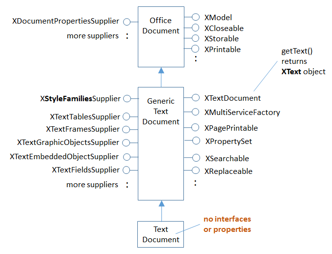
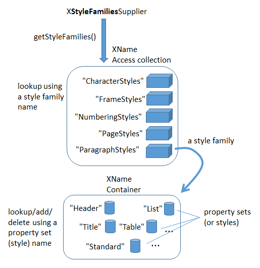
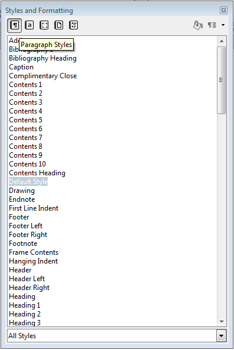
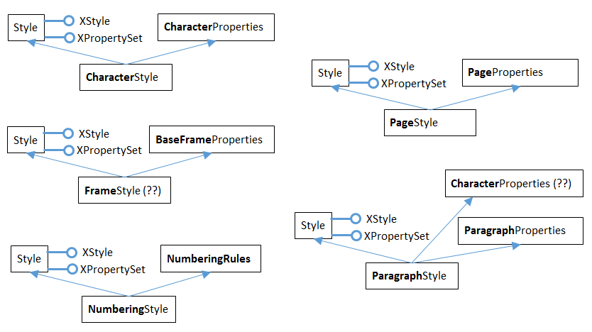
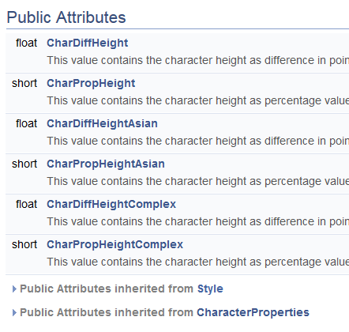
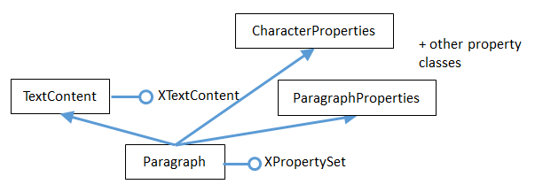
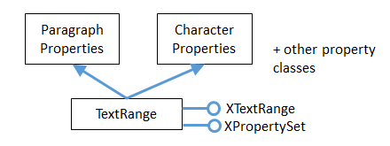
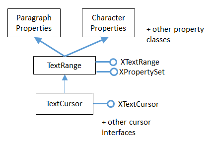
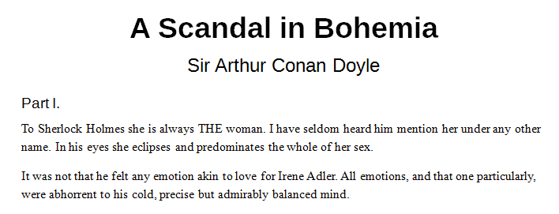

# Chapter 6. Text Styles

!!! note "Topics"
    Five Style
    Families; Properties;
    Listing Styles;  Creating
    a Style; Applying Styles;
    Paragraph/Word Styles;
    Hyperlink Styling; Text
    Numbering; Headers and
    Footers

    Example folders: "Text
    Tests" and "Utils"


This chapter focuses on how text documents styles can be
examined and manipulated. This revolves around the
XStyleFamiliesSupplier interface in
GenericTextDocument, which is highlighted in Figure 1 (a
repeat of Figure 2 in Chapter 5).




Figure 1. The Text Document Services, and some Interfaces.


XStyleFamiliesSupplier has a getStyleFamilies() method for returning text style
families. All these families are stored in an XNameAccess object, as depicted in
Figure 2.

XNameAccess is one of Office's collection types, and employed when the objects in a
collection have names. There's also an XIndexAccess for collections in index order.

XNameContainer and XIndexContainer add the ability to insert and remove objects
from a collection.




Figure 2. Style Families and their Property Sets.


Five style family names are used by text documents: "CharacterStyles",
"FrameStyles", "NumberingStyles", "PageStyles", and "ParagraphStyles". The
XNameAccess families collection can be accessed with one of those names, and
returns a style family. A style family is a modifiable collection of PropertySet objects,
stored in an XNameContainer object.

Figure 2 shows that if the "ParagraphStyles" family is retrieved, it contains property
sets labelled "Header", "List", "Standard", and quite a few more. Each property set
can format a paragraph, change the text's font, size, and many other attributes. These
property sets are called styles.

The "CharacterStyles" family is a container of property sets (styles) which affect
selected sentences, words, or characters in the document. The "FrameStyles"
container holds property sets (styles) for formatting graphic and text frames. The
"NumberingStyles" family is for adding numbers or bullets to paragraphs. The
"PageStyles" family is for formatting pages.

The names of the property sets (styles) in the style families can be listed using
LibreOffice's GUI. If you create a new text document in Writer, a "Styles and
Formatting" dialog window appears when you press F11 (or click on the brown
spanner icon in the "Formatting" toolbar). Within the window you can switch between
five icons representing the five style families. Figure 3 shows the list of property set
(style) names for the paragraph styles family. They corresponds to the property set
names shown in Figure 2.




Figure 3. Styles and Formatting Window in Writer.


The names listed in the window are the same as the names used in the API, except in
two cases: the "Default Style" name that appears in the GUI window for "Paragraph
Styles" and "Page Styles" is changed to "Standard" in the API. Strangely, the "Default
Style" name for "Character Styles" in the GUI is called "Default Style" in the API.

Accessing a style (a property set) is a three-step process, shown below. First the style
families, then the style family (e.g. "ParagraphStyle"), and then the style (e.g.

"Standard"):

```java
// 1. get the style families
XStyleFamiliesSupplier xSupplier =
                       Lo.qi(XStyleFamiliesSupplier.class, doc);
XNameAccess nameAcc = xSupplier.getStyleFamilies();

// 2. get the paragraph style family
XNameContainer paraStyleCon = Lo.qi(XNameContainer.class,
                          nameAcc.getByName("ParagraphStyles"));

// 3. get the 'standard' style (property set)
XPropertySet standardProps = Lo.qi(XPropertySet.class,
                          paraStyleCon.getByName("Standard"));
```

The code that implements this process in the Write utility class is a bit more
complicated since the calls to getByName() may raise exceptions if their string
arguments are incorrect.

The calls to Lo.qi() cast the object returned from a collection into the correct type.


## 1.  What Properties are in a PropertySet?

The "Standard" name in the "ParagraphStyles" style family refers to a property set
(style). Each set is a collection of name=value pairs, and there are get and set methods
using a name to get/set its value. This is simple enough, but what names should the
programmer use?
Each property set (style) in the same style family contain the same properties, but
with different values. For instance, in Figure 2 the "Header", "Title", "Standard",
"List", and "Table" sets contain the same named properties.

The names of the properties used by the sets in a style family can be found in the
documentation for their "XXXStyle" service. Table 1 summarizes the mapping.


|Style Family Name|Service where Properties are Defined|
|-----------------|------------------------------------|
|"CharacterStyles"|CharacterStyle                      |
|"FrameStyles"    |FrameStyle (??)                     |
|"NumberingStyles"|NumberingStyle                      |
|"PageStyles"     |PageStyle                           |
|"ParagraphStyles"|ParagraphStyle                      |

Table 1. Properties Information for Each Style Family.


The easiest way of finding Office documentation for the services in the second
column of Table 1 is with lodoc.bat. For example, the page about CharacterStyle
can be found with `lodoc CharacterStyle service`.

The FrameStyle service (full name: com.sun.star.style.FrameStyle) has a "??" against
it since there's no online documentation for that service, although such a service
exists.

A style's properties are usually defined across several classes in an inheritance
hierarchy. The hierarchies for the five styles are summarized in Figure 4.




Figure 4. The Inheritance Hierarchies for the Style Services.


Figure 4 shows the hierarchies for the five style services: CharacterStyle, FrameStyle,
NumberingStyle, PageStyle, and ParagraphStyle. There's clearly a lot of similarities
between them, so I'll focus on CharacterStyle.

There are three services containing character style properties: CharacterStyle, Style,
and CharacterProperties. If you visit the online documentation for CharacterStyle, the
properties are listed under the heading "Public Attributes", which is shown in Figure
5.




Figure 5. Part of the Online Documentation for CharacterStyle.


CharacterStyle defines six properties itself, but there are many more inherited from
the Style and CharacterProperties services. If you click on the triangles next to the
"Public Attributes inherited from" lines, the documentation expands to display those
properties.

Figure 4 contains two "(??)" strings – one is to indicate that there's no documentation
for FrameStyle, so I'm guessing about its inheritance hierarchy.

The other "(??)" is in the ParagraphStyle hierarchy. The documentation for
ParagraphStyle, and the information in the developers guide, indicate that
ParagraphStyle inherits only Style and ParagraphCharacter. I believe this to be
incorrect, based on my coding with ParagraphStyle (some of which you'll see in the
next sections). ParagraphStyle appears to inherits three services: Style,
ParagraphCharacter, and CharacterStyle, as indicated in Figure 6.




Figure 6. The Paragraph Service and its Superclasses.


For more information of the styles API, start in the development guide in the "Overall
Document Features" section, online at: https://wiki.openoffice.org/wiki/Documentation/DevGuide/Text/Overall_Document_Features/
or type `loGuide "Overall Document Features"`

The character and paragraph style properties are explained in the "Formatting"
section:
https://wiki.openoffice.org/wiki/Documentation/DevGuide/Text/Formatting/
or type  `loGuide writer Formatting`


## 2.  Listing Styles Information

My StylesInfo.java example illustrates some of the Writer and Info utility functions
for examining style families and their property sets. The main() function starts by
listing the style families names:

```java
XTextDocument doc = Write.openDoc(args[0], loader);

// get all the style families for this document
String[] styleFamilies = Info.getStyleFamilyNames(doc);
System.out.println("No. of Style Family Names: " +
                                  styleFamilies.length);
for(String styleFamily : styleFamilies)
  System.out.println("  " + styleFamily);
System.out.println();
```

The output lists the five family names:

```
No. of Style Family Names: 5
  CharacterStyles
  FrameStyles
  NumberingStyles
  PageStyles
  ParagraphStyles
```

Info.getStyleFamilyNames() starts by casting the document to an
XStyleFamiliesSupplier interface. Then the style families XNameAccess collection is
obtained by calling XStyleFamiliesSupplier.getStyleFamilies().The family names in
that collection are extracted with XNameAccess.getElementName():

```java
public static String[] getStyleFamilyNames(XComponent doc)
// in the Info class
{
  XStyleFamiliesSupplier xSupplier =  Lo.qi(
                            XStyleFamiliesSupplier.class, doc);
  XNameAccess nameAcc = xSupplier.getStyleFamilies();
  String[] names = nameAcc.getElementNames();
  Arrays.sort(names);
  return names;
}  // end of getStyleFamilyNames()
```

Back in StylesInfo.java, the main() function continues by looping through the list of
style family names, printing all the style (property set) names in each family:

```java
// list all the style names for each style family
for(int i=0; i < styleFamilies.length; i++) {
  String styleFamily = styleFamilies[i];
  System.out.println((i+1) + ". \"" + styleFamily +
                               "\" Style Family contains:");
  String[] styleNames = Info.getStyleNames(doc, styleFamily);
  Lo.printNames(styleNames);
}
```

The output is lengthy, but informative:

```
## 1. "CharacterStyles" Style Family contains:
  "Bullet Symbols"  "Caption characters"  "Citation"  "Default Style"
  "Definition"  "Drop Caps"  "Emphasis"  "Endnote Symbol"
  "Endnote anchor"  "Example"  "Footnote Symbol"  "Footnote anchor"
  "Index Link"  "Internet link"  "Line numbering"  "Main index entry"
  "Numbering Symbols"  "Page Number"  "Placeholder"  "Rubies"
  "Source Text"  "Strong Emphasis"  "Teletype"  "User Entry"
  "Variable"  "Vertical Numbering Symbols"  "Visited Internet Link"

## 2. "FrameStyles" Style Family contains containers:
  "Formula"  "Frame"  "Graphics"  "Labels"
  "Marginalia"  "OLE"  "Watermark"

## 3. "NumberingStyles" Style Family contains containers:
  "List 1"  "List 2"  "List 3"  "List 4"
  "List 5"  "Numbering 1"  "Numbering 2"  "Numbering 3"
  "Numbering 4"  "Numbering 5"

## 4. "PageStyles" Style Family contains containers:
  "Endnote"  "Envelope"  "First Page"  "Footnote"
  "HTML"  "Index"  "Landscape"  "Left Page"
  "Right Page"  "Standard"

## 5. "ParagraphStyles" Style Family contains containers:
  "Addressee"  "Bibliography 1"  "Bibliography Heading"  "Caption"
  "Contents 1"  "Contents 10"  "Contents 2"  "Contents 3"
  "Contents 4"  "Contents 5"  "Contents 6"  "Contents 7"
  "Contents 8"  "Contents 9"  "Contents Heading"  "Drawing"
  "Endnote"  "First line indent"  "Footer"  "Footer left"
  "Footer right"  "Footnote"  "Frame contents"  "Hanging indent"
  "Header"  "Header left"  "Header right"  "Heading"
  "Heading 1"  "Heading 10"  "Heading 2"  "Heading 3"
  "Heading 4"  "Heading 5"  "Heading 6"  "Heading 7"
  "Heading 8"  "Heading 9"  "Horizontal Line"  "Illustration"
  "Illustration Index 1"  "Illustration Index Heading"  "Index"
"Index 1"
  "Index 2"  "Index 3"  "Index Heading"  "Index Separator"
  "List"  "List 1"  "List 1 Cont."  "List 1 End"
  "List 1 Start"  "List 2"  "List 2 Cont."  "List 2 End"
  "List 2 Start"  "List 3"  "List 3 Cont."  "List 3 End"
  "List 3 Start"  "List 4"  "List 4 Cont."  "List 4 End"
  "List 4 Start"  "List 5"  "List 5 Cont."  "List 5 End"
  "List 5 Start"  "List Contents"  "List Heading"  "List Indent"
  "Marginalia"  "Numbering 1"  "Numbering 1 Cont."  "Numbering 1 End"
  "Numbering 1 Start"  "Numbering 2"  "Numbering 2 Cont."  "Numbering
2 End"
  "Numbering 2 Start"  "Numbering 3"  "Numbering 3 Cont."  "Numbering
3 End"
  "Numbering 3 Start"  "Numbering 4"  "Numbering 4 Cont."  "Numbering
4 End"
  "Numbering 4 Start"  "Numbering 5"  "Numbering 5 Cont."  "Numbering
5 End"
  "Numbering 5 Start"  "Object index 1"  "Object index heading"
"Preformatted
  "Quotations"  "Salutation"  "Sender"  "Signature"
  "Standard"  "Subtitle"  "Table"  "Table Contents"
  "Table Heading"  "Table index 1"  "Table index heading"  "Text"
  "Text body"  "Text body indent"  "Title"  "User Index 1"
  "User Index 10"  "User Index 2"  "User Index 3"  "User Index 4"
  "User Index 5"  "User Index 6"  "User Index 7"  "User Index 8"
  "User Index 9"  "User Index Heading"
```

Info.getStyleNames() retrieves the XNameContainer object for each style family, and
extracts its style (property set) names using getElementNames():

```java
public static String[] getStyleNames(XComponent doc,
                                String familyStyleName)
// in Info.java
{ XNameContainer styleContainer =
                getStyleContainer(doc, familyStyleName);
  if (styleContainer == null)
    return null;
  else {
    String[] names = styleContainer.getElementNames();
    Arrays.sort(names);
    return names;
  }
}  // end of getStyleNames()
```

The last part of StylesInfo.java lists the properties for a specific property set.
Info.getStyleProps() does that:

```java
XPropertySet getStyleProps(XComponent doc,
                     String familyStyleName, String propSetNm)
{ XNameContainer styleContainer =
           getStyleContainer(doc, familyStyleName);
           // container is a collection of named property sets
  if (styleContainer == null)
    return null;
  else {
    XPropertySet nameProps = null;
    try {
      nameProps = Lo.qi( XPropertySet.class,
                    styleContainer.getByName(propSetNm));
    }
    catch(Exception e)
    {  System.out.println("Could not access style: " + e);  }
    return nameProps;
  }
}  // end of getStyleProps()
```

Its arguments are the document, the style family name, and style (property set) name.

A reference to the property set is returned. Accessing the "Standard" style (property
set) of the "ParagraphStyle" family would require:

```java
XPropertySet props =
       Info.getStyleProps(doc, "ParagraphStyles", "Standard")
```

The property set can be nicely printed by calling Props.showProps():

```java
Props.showProps("ParagraphStyles \"Standard\"", props );
```

The output is long, but begins and ends like so:

```
ParagraphStyles "Standard" Properties
  BorderDistance == 0
  BottomBorder == com.sun.star.table.BorderLine2@1a8a1dc
  BottomBorderDistance == 0
  BreakType == com.sun.star.style.BreakType@18e5cde
  Category == 0
  CharAutoKerning == true
  CharBackColor == -1
  CharBackTransparent == true
       :
  Rsid == Any[Type[unsigned long], 0]
  SnapToGrid == true
  StyleInteropGrabBag == [Lcom.sun.star.beans.PropertyValue;@1701da1
  TopBorder == com.sun.star.table.BorderLine2@6f3b58
  TopBorderDistance == 0
  WritingMode == 0
```

This listing, and in fact any listing of a style from "ParagraphStyles", shows that the
properties are a mixture of those defined in the Style, ParagraphProperties, and
CharacterProperties services.


## 3.  Creating a New Style

My StoryCreator.java example adds a new style to the paragraph style family, and
uses it to format the document's paragraphs.

The new ParagraphStyle service is referenced using one of its interfaces, the usual one
being XStyle since all the different style services support it (as shown in Figure 4).

For example:

```java
// create a new paragraph style
XStyle paraStyle = Lo.createInstanceMSF(XStyle.class,
                       "com.sun.star.style.ParagraphStyle");
```

Lo.createInstanceMSF()'s second argument is the full name of the service, and the
first argument is the interface. All the style services are located in the
"com.sun.star.style" package.

Since I want to change property in this new style, I cast the XStyle interface to
XPropertySet:

```java
XPropertySet props = Lo.qi(XPropertySet.class, paraStyle);
```

A property is modified using setPropertyValue().

```java
props.setPropertyValue("ParaBottomMargin", 400);
props.setPropertyValue("CharFontName", "Times New Roman");
props.setPropertyValue("CharHeight", 12.0f);
```

These three properties are defined in one of the 'Properties' classes inherited by
ParagraphStyle (as shown in Figure 4). "ParaBottomMargin" appears in
ParagraphProperties, while "CharFontName" and "CharHeight" come from
CharacterProperties.

After setting the style's properties, the new style added to the document's paragraph
style family:

```java
// access the paragraph style family
XNameContainer paraStyles =
           Info.getStyleContainer(textDoc, "ParagraphStyles");

// store the style in the style family with the name "Foo"
paraStyles.insertByName("Foo", props);
```

The style is stored with the name "Foo", but any unique name would be good (perhaps
one a little more descriptive than "Foo" would be better).

The style creation code in StoryCreator.java is located in createParaStyle() and
follows the  code fragment sequence described above:

```java
public static boolean createParaStyle(XTextDocument textDoc,
                                               String styleName)
// create a new paragraph container/style called styleName
{
  XNameContainer paraStyles =
        Info.getStyleContainer(textDoc, "ParagraphStyles");
  if (paraStyles == null)
    return false;

  try {
    // create new paragraph style properties set
    XStyle paraStyle = Lo.createInstanceMSF(
                 XStyle.class, "com.sun.star.style.ParagraphStyle");
    XPropertySet props = Lo.qi(XPropertySet.class, paraStyle);

    // set some properties
    props.setPropertyValue("CharFontName", "Times New Roman");
    props.setPropertyValue("CharHeight", 12.0f);
    props.setPropertyValue("ParaBottomMargin", 400);
                                   //  4mm, in 100th mm units

    // set paragraph line spacing to 6mm
    LineSpacing lineSpacing = new LineSpacing();
      lineSpacing.Mode = LineSpacingMode.FIX;
      lineSpacing.Height = 600;
      props.setPropertyValue("ParaLineSpacing", lineSpacing);

    // some more common properties; not all used here
    /* props.setPropertyValue("CharWeight",
                               com.sun.star.awt.FontWeight.BOLD);
       props.setPropertyValue("CharAutoKerning", true);
       props.setPropertyValue("ParaAdjust",
                              ParagraphAdjust.CENTER_value);
       props.setPropertyValue("ParaFirstLineIndent", 0);
       props.setPropertyValue("BreakType", BreakType.PAGE_AFTER);
    */
      // store those properties in a container called styleName
      paraStyles.insertByName(styleName, props);
      return true;
    }
    catch(com.sun.star.uno.Exception e)
    { System.out.println("Could not set paragraph style");
      return false;
    }
  }  // end of createParaStyle()
```

The "ParaLineSpacing" property is a little more complex than the others since its
value isn't a basic type, but a LineSpacing object.

The ParagraphProperties documentation for "ParaLineSpacing" is shown in Figure 7.


Figure 7. The ParaLineSpacing Property in the ParagraphProperties Documentation.


Clicking on the "com::sun::star::style::LineSpacing" return type will load the
LineSpacing documentation page  into the browser.

In StoryCreator.java, createParaStyle() is called like so:

```java
XTextDocument doc = Write.createDoc(loader);

if (!createParaStyle(doc, "adParagraph")){
  System.out.println("Could not create new paragraph style");
  Lo.closeOffice();
  return;
}
```

A new style called "adParagraph" is added to the paragraph style family. It uses
Times New Roman 12pt font, and leaves a 6mm space between paragraphs.


## 4.  Applying Styles to Paragraphs (and Characters)

I've added an "adParagraph" style to the paragraph style family, but how do I apply
that style to some paragraphs in the document?
The easiest way is through the document's XTextRange interface. XTextRange is
supported by the TextRange service, which inherits ParagraphProperties and
CharacterProperties (and several other property classes), as illustrated in Figure 8.




Figure 8. The TextRange Service.


XTextRange can be cast to XPropertySet to make the properties in
ParagraphProperties and CharacterProperties accessible. An existing (or new)
paragraph style is applied to a text range by setting its "ParaStyleName" property:

```java
XTextRange xTextRange = doc.getText().getStart();
XPropertySet props = Lo.qi(XPropertySet.class, xTextRange);
props.setProperty("ParaStyleName", "adParagraph");
```

Using Props.setProperty(), simplifies this to:

```java
XTextRange xTextRange = doc.getText().getStart();
Props.setProperty(xTextRange, "ParaStyleName", "adParagraph");
```

The code above obtains the text range at the start of the document, and set its
paragraph style to "adParagraph". Any text added from this position onwards will use
that style.

This approach is used in StoryCreator.java: the style is set first, then text is added.


## 5.  Cursors and Text Ranges

Another technique for applying styles uses a cursor to select a text range. Then the
text's properties are accessed through the cursor.

All the different kinds of model and view cursor belong to the TextCursor service,
and this inherits TextRange. This allows us to extend Figure 8 to become Figure 9.




Figure 9. Cursor Access to Text Properties.


This hierarchy means that a cursor can access the TextRange service and its text
properties. The following code fragment demonstrates the idea:

```java
XTextCursor cursor = Write.getCursor(textDoc);
cursor.gotoEnd(true);   // select the entire document

XPropertySet props = Lo.qi(XPropertySet.class, cursor);
props.setProperty("ParaStyleName", "adParagraph");
```

Using Props.setProperty(), simplifies this to:

```java
XTextCursor cursor = Write.getCursor(textDoc);
cursor.gotoEnd(true);
Props.setProperty(cursor, "ParaStyleName", "adParagraph");
```

This approach is employed in StoryCreator.java when some paragraphs (such as
section headers) need to use a paragraph style other than "adParagraph". I'll supply
details in a moment.


## 6.  Building a Story Document

StoryCreator.java starts by setting the "adParagraph" style, then employs readText()
to read text from a file and add it to the document:

```java
XTextRange xTextRange = doc.getText().getStart();
Props.setProperty(xTextRange, "ParaStyleName", "adParagraph");

XTextCursor cursor = Write.getCursor(doc);
readText("scandal.txt", cursor);
Write.endParagraph(cursor);
```

readText() assumes the text file has a certain format. For example, "scandal.txt"
begins like so:

```
Title: A Scandal in Bohemia
Author: Sir Arthur Conan Doyle

Part I.


To Sherlock Holmes she is always THE woman. I have seldom heard
him mention her under any other name. In his eyes she eclipses
and predominates the whole of her sex.


It was not that he felt any emotion akin to love for Irene Adler.

All emotions, and that one particularly, were abhorrent to his
cold, precise but admirably balanced mind.
```

A paragraph is a series of text lines followed by a blank line. But there are exceptions:
lines that starts with "Title: ", "Author: " or "Part " are treated as headings, and styled
differently. When the text above is processed, the resulting document looks like
Figure 10.




Figure 10. The Output of StoryCreator.java.


readText() is implemented using Java's FileReader and BufferedReader:

```java
public static void readText(String fnm, XTextCursor cursor)
/* Write the text in fnm into a Office document.

   Use current paragraph styling unless the line starts
   with "Title: ", "Author: ", or "Part ".

*/
{
  StringBuilder sb = new StringBuilder(0);
  BufferedReader br = null;
  try {
    br = new BufferedReader(new FileReader(fnm));
    System.out.println("Reading text from: " + fnm);

    String line;
    while ((line = br.readLine()) != null) {
      // System.out.println("<" + line + ">");
      if (line.length() == 0) {
        if (sb.length() > 0)
          Write.appendPara(cursor, sb.toString());
        sb.setLength(0);
      }
      else if (line.startsWith("Title: ")) {
        Write.appendPara(cursor, line.substring(7));
        Write.stylePrevParagraph(cursor, "Title");
      }
      else if (line.startsWith("Author: ")) {
        Write.appendPara(cursor, line.substring(8));
        Write.stylePrevParagraph(cursor, "Subtitle");
      }
      else if (line.startsWith("Part ")) {
        Write.appendPara(cursor, line);
        Write.stylePrevParagraph(cursor, "Heading");
      }
      else {
        sb.append(line + " ");
      }
    }
    if (sb.length() > 0)
      Write.appendPara(cursor, sb.toString());
  }
  catch (FileNotFoundException ex)
  {  System.out.println("Could not open: " + fnm); }
  catch (IOException ex)
  {  System.out.println("Read error: " + ex); }
  finally {
    try {
      if (br != null)
        br.close();
    }
    catch (IOException ex)
    {  System.out.println("Problem closing " + fnm); }
  }
}  // end of readText()
```

The interesting bits are the calls to Write.appendPara() and
Write.stylePrevParagraph() which add a paragraph to the document and apply a style
to it. For instance:

```java
else if (line.startsWith("Author: ")) {
  Write.appendPara(cursor, line.substring(8));
  Write.stylePrevParagraph(cursor, "Subtitle");
}
```

Write.appendPara() writes the string into the document as a paragraph (the input line
without the "Author: " substring). Write.stylePrevParagraph() changes the paragraph
style from "adParagraph" to "Subtitle".

The hard part of Write.stylePrevParagraph() is making sure that the style change only
affects the previous paragraph. Text appended after this line should use "adParagraph"
styling.

```java
public static void stylePrevParagraph(XTextCursor cursor,
                                      Object propVal)
{  stylePrevParagraph(cursor, "ParaStyleName", propVal);  }


public static void stylePrevParagraph(XTextCursor cursor,
                             String propName, Object propVal)
{
  // save current property
  Object oldValue = Props.getProperty(cursor, propName);

  // apply property change to previous paragraph
  XParagraphCursor paraCursor = Lo.qi(
                                XParagraphCursor.class, cursor);
  paraCursor.gotoPreviousParagraph(true);   // select prev para
  Props.setProperty(paraCursor, propName, propVal);

  // reset the cursor and property
  paraCursor.gotoNextParagraph(false);
  Props.setProperty(cursor, propName, oldValue);
}  // end of stylePrevParagraph()
```

The current "ParaStyleName" value is stored before changing its value in the selected
range. Afterwards, that style name is applied back to the cursor.

stylePrevParagraph() changes the XTextCursor into a paragraph cursor so that it's
easier to move around across paragraphs.

readText() calls Write.stylePrevParagraph() with three style names ("Title",
"Subtitle", and "Heading"). I obtained those names from looking at the "Paragraph
Styles" dialog window in Figure 3.


## 7.  Style Changes to Words and Phrases

Aside from changing paragraph styles, it's useful to apply style changes to words or
strings inside a paragraph. For example, to highlight a word in bold, or write several
words in red italics for emphasis.

This is implemented by Write.styleLeft() using a similar approach to
Write.stylePrevParagraph(). styleLeft() is passed an integer position which lies to the
left of the current cursor position. Character style changes are applied to the text range
defined by that distance:

```java
public static void styleLeft(XTextCursor cursor,
                   int pos, String propName, Object propVal)
{
  // save current property
  Object oldValue = Props.getProperty(cursor, propName);

  // apply property change to the left of cursor
  int currPos = getPosition(cursor);
  cursor.goLeft((short)(currPos-pos), true);
  Props.setProperty(cursor, propName, propVal);

  // reset the cursor and property
  cursor.goRight((short)(currPos-pos), false);
  Props.setProperty(cursor, propName, oldValue);
}  // end of styleLeft()
```

An XTextCursor is used to select the range, and the new style is set. Then the cursor
is moved back to its old position, and the previous style reapplied.

The Write class contain a few support functions that set common styles using
styleLeft():

```java
public static void styleLeftBold(XTextCursor cursor, int pos)
{  styleLeft(cursor, pos, "CharWeight",
                           com.sun.star.awt.FontWeight.BOLD);  }


public static void styleLeftItalic(XTextCursor cursor, int pos)
{  styleLeft(cursor, pos, "CharPosture",
                           com.sun.star.awt.FontSlant.ITALIC);  }


public static void styleLeftColor(XTextCursor cursor,
                                   int pos, java.awt.Color col)
{  styleLeft(cursor, pos, "CharColor", Lo.getColorInt(col));  }


public static void styleLeftCode(XTextCursor cursor, int pos)
// code is text in 10pt Courier New
{  styleLeft(cursor, pos, "CharFontName", "Courier New");
   styleLeft(cursor, pos, "CharHeight", 10);
}
```

The position (the pos value) passed to styleLeft() can be obtained from
Write.getPosition(), or as the result of the Write.append() methods.

My BuildDoc.java example contains several examples of how to use
Write.styleLeft():

```java
// code fragment from BuildDoc.java
XTextCursor cursor = Write.getCursor(doc);

int pos = Write.append(cursor, "Some examples of simple text ");
Write.append(cursor, "styles.\n");
Write.styleLeftBold(cursor, pos);  // bold text back to pos

pos = Write.getPosition(cursor);
Write.appendPara(cursor, "This line is written in red italics.");
Write.styleLeftColor(cursor, pos, Color.RED);   // red
Write.styleLeftItalic(cursor, pos);             // italics

Write.appendPara(cursor, "Back to old style\n");
```

The resulting text in the document looks like Figure 11.


Figure 11. Styled Text.


The following fragment from BuildDoc.java applies a 'code' styling to several lines:

```java
// code fragment from BuildDoc.java
Write.appendPara(cursor, "Here's some code:");

pos = Write.getPosition(cursor);
Write.append(cursor, "\npublic class Hello\n");
Write.append(cursor, "{\n");
Write.append(cursor, "  public static void main(String args[]\n");
Write.append(cursor, " { System.out.println(\"Hello Andrew\"); }\n");
Write.appendPara(cursor, "}  // end of Hello class\n");
Write.styleLeftCode(cursor, pos);
```

Figure 12 shows the generated document text.


Figure 12. Text with Code Styling.


Unfortunately, styleLeft() depend on integer character positions, which are calculated
using Write.getPosition(). As I've mentioned before, this method could fail if asked to
generate too large a string, and this would cause styleLeft() to die.


## 8.  Hyperlink Styling

Text hyperlinks are implemented as styles, using "HyperLinkURL", and perhaps
"HyperLinkName", and "HyperLinkTarget". BuildDoc.java shows how the
"HyperLinkURL" property is set:

```java
Write.appendPara(cursor, "A link to my JLOP website:");
String urlStr = "https://fivedots.coe.psu.ac.th/~ad/jlop/";

pos = Write.getPosition(cursor);
Write.append(cursor, urlStr);

Write.styleLeft(cursor, pos, "HyperLinkURL", urlStr);
Write.endParagraph(cursor);
```

When the document is viewed, the text is drawn as a link as in Figure 13.


Figure 13. Text Containing a Hypertext Link.


If the user control-clicks on the link, then the URL value of "HyperLinkURL" will be
loaded into the browser.

The "HyperLinkName" property specifies a link name, which can be used when
searching a document. "HyperLinkTarget" corresponds to the HTML hypertext target
attribute, and has a default value of "_self".


## 9.  Text Numbering

It's straightforward to number paragraphs by using Write.styleLeft() and the
"NumberingStyleName" property. The following code from BuildDoc.java, numbers
three paragraphs:

```java
// code fragment from BuildDoc.java
Write.appendPara(cursor, "The following points are important:");

pos = Write.appendPara(cursor, "Have a good breakfast");
Write.appendPara(cursor, "Have a good lunch");
Write.appendPara(cursor, "Have a good dinner\n");
Write.styleLeft(cursor, pos, "NumberingStyleName", "Numbering 1");
```

The result is shown in Figure 14.


Figure 14. Numbered Paragraphs.


"NumberingStyleName" is a property in ParagraphProperties, and the "Numbering 1"
style is from the "Paragraph Styles" dialog window in Figure 3.

Bullets are drawn instead of numbers by changing the style name to "List 1" (see
Figure 15).


Figure 15. Bulleted Paragraphs.


One issue with numbered paragraphs is that their default behavior retains the current
count when numbering another group of text. For example, a second group of
numbered paragraphs appearing in the document after Figure 14 would start at '4'.
This is fixed by setting the "ParaIsNumberingRestart" property to true:

```java
Write.styleLeft(cursor, pos, "ParaIsNumberingRestart", true);
```

One large topic I won’t be looking at is document numbering. This includes the
numbering of chapter headings and lines. Chapter and line numbering are dealt with
differently from most document styles. Instead of being accessed via
XStyleFamiliesSupplier, they employ XChapterNumberingSupplier and
XNumberFormatsSupplier.

For more details, see the development guide:
https://wiki.openoffice.org/wiki/Documentation/DevGuide/Text/Line_Numbering_and_Outline_Numbering/
or type `loGuide "Line Numbering"`.


## 10.  Other Style Changes

StoryCreator.java illustrates three other styling effects: the creation of a header,
setting the page to A4 format, and employing page numbers in the footer. The
relevant calls are:

```java
// code fragment in StoryCreator.java
Write.setHeader(doc, "From: " + args[0]);
Write.setA4PageFormat(doc);
Write.setPageNumbers(doc);
```

Write.setA4PageFormat() sets the page formatting. Write.setPageNumbers() utilizes
text fields, which I'll examine in the "Text Fields" section in Chapter 7.

Changing the header in Write.setHeader() requires the setting of the "HeaderIsOn"
boolean in the "Standard" page style. Adding text to the header is done via an XText
reference. The code for Write.setHeader():

```java
public static void setHeader(XTextDocument textDoc, String hText)
/* Modify the header via the page style for the document.

   Put the text on the right hand side in the header in
   Times New Roman, 10pt */
{
  XPropertySet props =
         Info.getStyleProps(textDoc, "PageStyles", "Standard");
  if (props == null) {
    System.out.println("Could not access standard page style");
    return;
  }

  try {
    props.setPropertyValue("HeaderIsOn", true);
                 // header is turned on in the document

    // access the header's XText and cursor
    XText headerText = Lo.qi(XText.class,
                         props.getPropertyValue("HeaderText"));
    XTextCursor headerCursor = headerText.createTextCursor();
    headerCursor.gotoEnd(false);

    // header is on the rhs and in Times New Roman, 10pt
    XPropertySet headerProps = Lo.qi(
                                XPropertySet.class, headerCursor);
    headerProps.setPropertyValue("CharFontName","Times New Roman");
    headerProps.setPropertyValue("CharHeight", 10);
    headerProps.setPropertyValue("ParaAdjust",ParagraphAdjust.RIGHT);

    headerText.setString(hText + "\n");
  }
  catch (Exception ex)
  {  System.out.println(ex); }
}  // end of setHeader()
```

The header's XText reference is retrieved via the page style's "HeaderText" property,
and a cursor is created local to the header:

```java
XTextCursor headerCursor = headerText.createTextCursor();
```

This cursor can only move around inside the header not the entire document.

The properties of the header's XText are changed using the cursor, and then the text is
added.