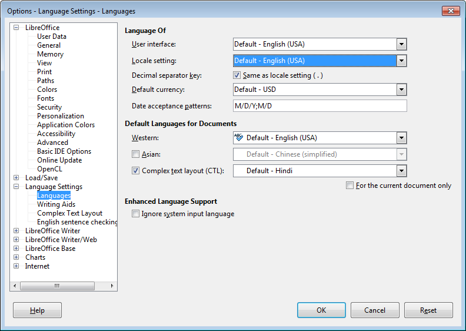
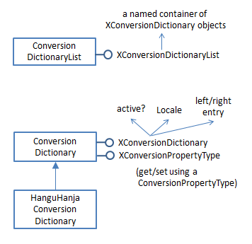
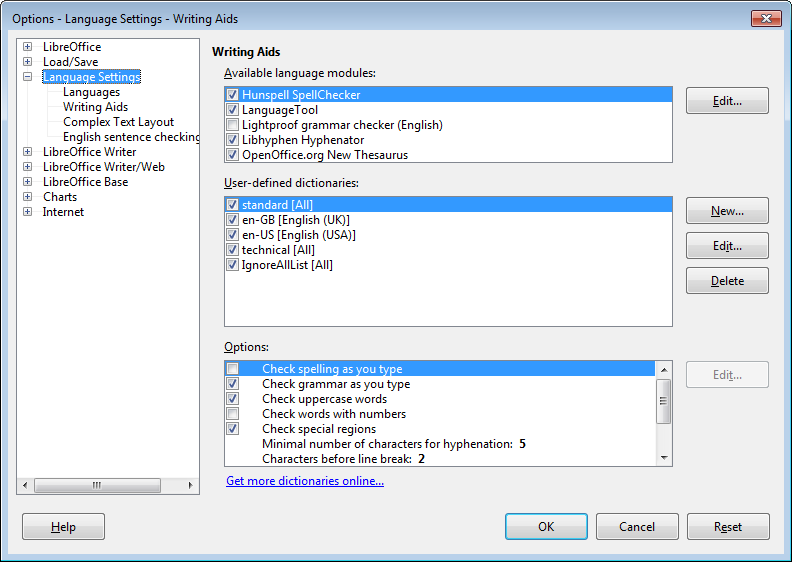
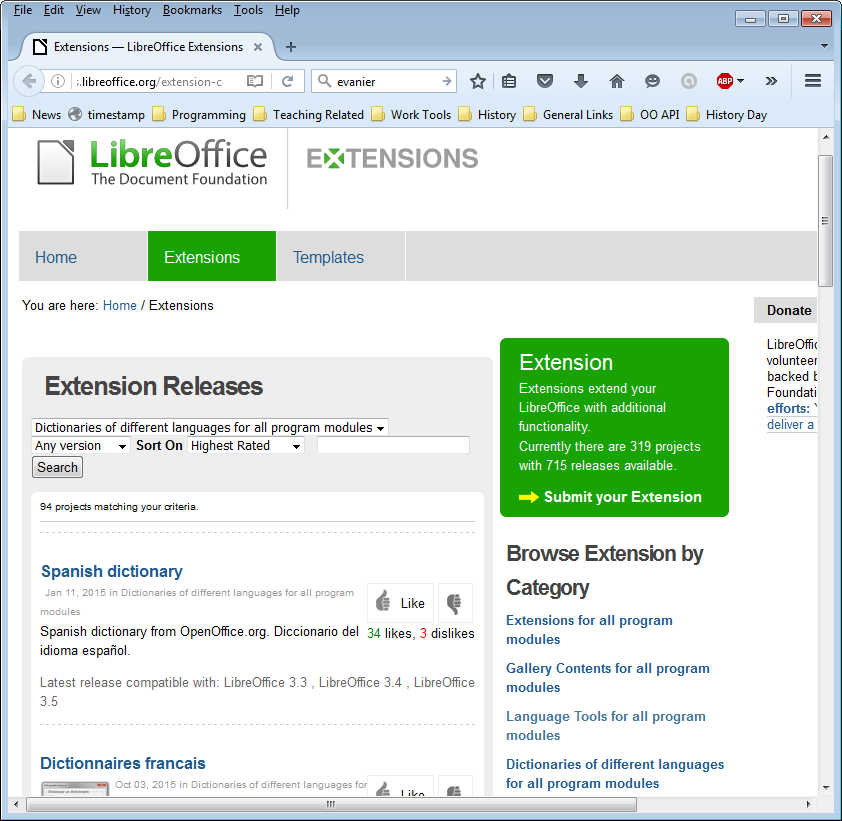
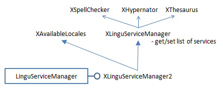
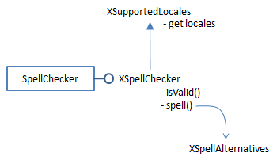
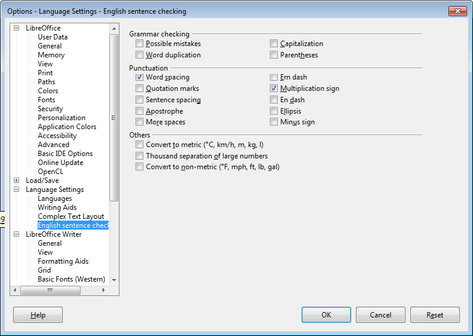
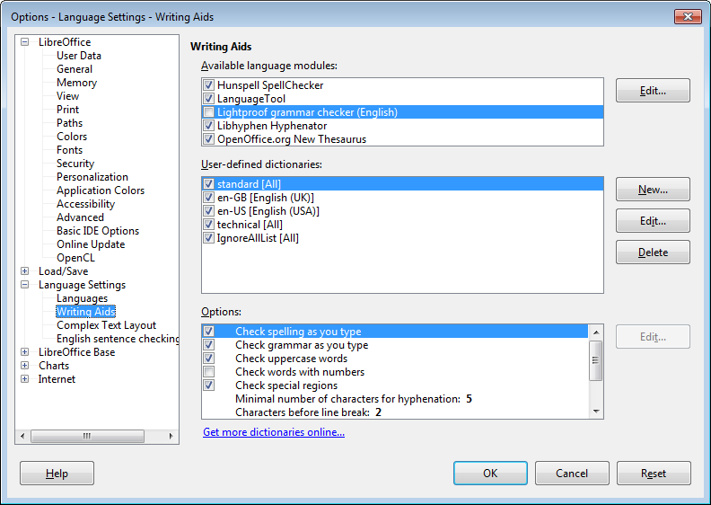
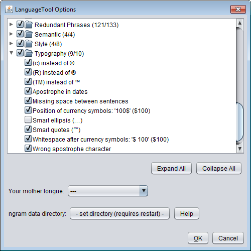
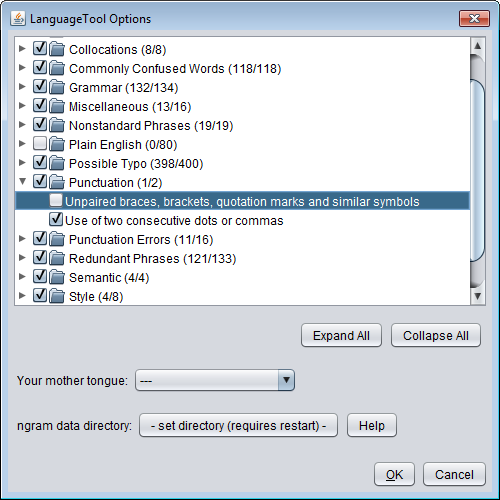

# Chapter 10. The Linguistics API 

!!! note "Topics"
    Linguistic 
    Tools; Using the Spell 
    Checker; Using the 
    Thesaurus; Grammar 
    Checking; Guessing the 
    Language used in a 
    String; Spell Checking 
    and Grammar Checking 
    a Document 

    Example folders: "Lingu 
    Tests" and "Utils" 
 
 
The linguistics API has four main components – a spell 
checker, a hyphenator, a thesaurus, and a grammar 
checker (which Office calls a proof reader). I'll look at 
how to program using the spell checker, thesaurus, and 
two grammar checkers, but I'll skip the hyphenator which 
is easier to use interactively through Office's  GUI. 

However, if you have an urge to hyphenate, then 
LingusticExamples.java in the Developer's Guide 
examples contains some code; it can be downloaded from 
http://api.libreoffice.org/examples/DevelopersGuide/OfficeDev/Linguistic/Linguistic
Examples.java. 

I'll describe two examples, Lingo.java and LingoFile.java. The first lists information 
about the linguistic services, then uses the spell checker, thesaurus, and grammar 
checker 'standalone' without having to load an Office document first. LingoFile.java 
automatically spell checks and grammar checks a complete file, reporting errors 
without altering the document. 

One topic I'll be ignoring is how to create and edit the data files used by the linguistic 
services. For that task, you should have a look at PTG (Proofing Tool GUI) developed 
by Marco Pinto at http://marcoagpinto.cidadevirtual.pt/proofingtoolgui.html. It's an 
open source tool for editing Office's  dictionary, thesaurus, hyphenation, and 
autocorrect files.  

Another area I'll be skipping is the use of events and listeners. Please refer to the 
"Linguistics" sub-section of chapter 6 of the Developer's Guide for details (loGuide 
Linguistics). Listener code can be found in LinguisticExamples.java mentioned 
above. 

The linguistic features accessible through Office's GUI are explained in chapter 3 of 
the "Writer Guide", available at http://www.libreoffice.org/get-help/documentation/, 
starting from the section called "Checking spelling and grammar". 

An older information source is the "Lingucomponent Project" page at the OpenOffice 
website, http://www.openoffice.org/lingucomponent/, which links to some useful 
tools, such as alternative grammar checkers. An interesting set of slides by Daniel 
Naber explaining the state of the project in 2005 can be found at 
http://www.danielnaber.de/publications/, along with more recent material. 

 
 
## 1.  The Linguistic Tools 

Lingo.java prints a variety of information about the linguistics services: 
 
public static void main(String args[]) 
{ 
  Lo.loadOffice(); 
 
  // print linguistics info 
  Write.dictsInfo(); 
 
  XLinguProperties linguProps = Write.getLinguProperties(); 
  Props.showProps("Linguistic Manager", linguProps); 
 
  Info.listExtensions(); 
 
  // get lingo manager 
  XLinguServiceManager2 lingoMgr =  
           Lo.createInstanceMCF(XLinguServiceManager2.class,  
                   "com.sun.star.linguistic2.LinguServiceManager"); 
  if (lingoMgr == null) { 
    System.out.println("No linguistics manager found"); 
    Lo.closeOffice(); 
    return; 
  } 
 
  Write.printServicesInfo(lingoMgr); 
 
    : // code for using the services; see later 
 
  Lo.closeOffice(); 
}  // end of main() 
 
 
### 1.1.  Dictionary Information 

Write.dictsInfo() prints brief details about Office's dictionaries: 
 
No. of dictionaries: 5 
  standard.dic (1); active; ""; positive 
  en-GB.dic (42); active; "GB"; positive 
  en-US.dic (42); active; "US"; positive 
  technical.dic (258); active; ""; positive 
  IgnoreAllList (0); active; ""; positive 
 
No. of conversion dictionaries: 0 
 
Each line includes the name of a dictionary, its number of entries, whether it's active 
(i.e. being used), its locale, and whether it's a positive, negative, or mixed dictionary. 

A positive dictionary holds correctly spelled words only, while a negative one lists 
incorrectly spelt words. A mixed dictionary contains both correctly and incorrectly 
spelt entries. 

If a dictionary has a locale, such as "GB" for en-GB.dic, then it's only utilized during 
spell checking if its locale matches Office's. The Office locale can be set via the Tools 
> Options > Language Settings > "Languages" dialog shown in Figure 1. 

 
 

Figure 1. The Languages Dialog. 

 
Figure 1 shows that my version of Office is using the American English locale, and so 
en-GB.dic won't be consulted when text is spell checked. 

Write.dictsInfo() is defined as: 
 
// in the Write class 
public static void dictsInfo() 
{ 
  XSearchableDictionaryList dictList =  
           Lo.createInstanceMCF(XSearchableDictionaryList.class,  
                   "com.sun.star.linguistic2.DictionaryList"); 
  if (dictList == null) 
    System.out.println("No list of dictionaries found"); 
  else 
    printDictsInfo(dictList); 
 
  XConversionDictionaryList cdList =  
           Lo.createInstanceMCF(XConversionDictionaryList.class,  
               "com.sun.star.linguistic2.ConversionDictionaryList"); 
  if (cdList == null) 
    System.out.println("No list of conversion dictionaries found"); 
  else 
    printConDictsInfo(cdList); 
}  // end of dictsInfo() 
 
It retrieves a conventional dictionary list first (called dictList), and iterates through its 
dictionaries using printDictsInfo(). Then it obtains the conversion dictionary list 
(called csList), and iterates over that with printConDictsInfo(). 

Figure 3 shows the main services and interfaces used by ordinary dictionaries. 

 
 

Figure 3. The DictionaryList and Dictionary Services. 

 
Each dictionary in the list has an XDictionary interface which contains methods for 
accessing and changing its entries. printDictsInfo() retrieves an XDictionary array 
from the list, and prints out a summary of each dictionary: 
 
// in the Write class 
public static void printDictsInfo( 
                      XSearchableDictionaryList dictList) 
{ if (dictList == null) { 
    System.out.println("Dictionary list is null"); 
    return; 
  } 
  System.out.println("No. of dictionaries: " +  
                                     dictList.getCount()); 
  XDictionary[] dicts = dictList.getDictionaries(); 
  for(XDictionary dict : dicts) 
    System.out.println("  " + dict.getName() +  
                    " (" + dict.getCount() +  
                    "); " + (dict.isActive() ? "active" : "na") + 
                    "; \"" + dict.getLocale().Country +  
                    "\"; " +  
                    getDictType(dict.getDictionaryType())); 
  System.out.println(); 
}  // end of printDictsInfo() 
 
 
public static String getDictType(DictionaryType dt) 
{ 
  if (dt == DictionaryType.POSITIVE) 
    return "positive"; 
  else if (dt == DictionaryType.NEGATIVE) 
    return "negative"; 
  else if (dt == DictionaryType.MIXED) 
    return "mixed"; 
  else 
    return "??"; 
}  // end of getDictType() 
 
 
Conversion dictionaries map words in one language/dialect to corresponding words in 
another language/dialect. Figure 4 shows that conversion dictionaries are organized in 
a similar way to ordinary ones. The interfaces for manipulating a conversion 
dictionary are XConversionDictionary and XConversionPropertyType. 

 
 

Figure 4. The ConversionDictionaryList and ConversionDictionary Services. 

 
Write.dictsInfo() calls printConDictsInfo() to print the names of the conversion 
dictionaries – by extracting an XNameContainer from the dictionary list, and then 
pulling a list of the names from the container:  
 
 
// in the Write clas 
public static void printConDictsInfo( 
                     XConversionDictionaryList cdList) 
{ if (cdList == null) { 
    System.out.println("Conversion Dictionary list is null"); 
    return; 
  } 
  XNameContainer dcCon = cdList.getDictionaryContainer();  
  String[] dcNames = dcCon.getElementNames(); 
  System.out.println("No. of conversion dictionaries: " +  
                                            dcNames.length); 
  for(String dcName : dcNames) 
    System.out.println("  " + dcName); 
  System.out.println(); 
}  // end of printConDictsInfo() 
 
 
Output similar to Write.dictsInfo() can be viewed via Office's Tools > Options> 
Language Settings > "Writing Aids" dialog, shown in Figure 5. 

 
 

Figure 5. The Writing Aids Dialog. 

 
The dictionaries are listed in the second pane of the dialog. Also, at the bottom of the 
window is a "Get more dictionaries online" hyperlink which takes the user to Office's 
extension website, and displays the "Dictionary" category (see Figure 6). 

 

Figure 6. The Dictionary Extensions at the LibreOffice Website. 

 
The URL of the page in Figure 6 is: 
http://extensions.libreoffice.org/ 
                 extension-center?getCategories=Dictionary 
The dictionary category currently has 94 entries, but if you can't find what you're 
looking for, don't forget the extensions for OpenOffice, at: 
http://extensions.openoffice.org/ 
If you're unclear about how to install extensions, the process is explained online at 
https://wiki.documentfoundation.org/Documentation/HowTo/install_extension, or in 
the "Installing Extensions" guide available at http://www.libreoffice.org/get-
help/documentation/. 

 
### 1.2.  Linguistic Properties 

Back in the Lingo.java example, Write.getLinguProperties() returns an instance of 
XLinguProperties, and its properties are printed by calling Props.showProps(): 
 
// in Lingo.java 
XLinguProperties linguProps = Write.getLinguProperties(); 
Props.showProps("Linguistic Manager", linguProps); 
 
The output: 
 
Linguistic Manager Properties 
  DefaultLanguage == 0 
  DefaultLocale == com.sun.star.lang.Locale@1f95c5d 
  DefaultLocale_CJK == com.sun.star.lang.Locale@cd43c2 
  DefaultLocale_CTL == com.sun.star.lang.Locale@a8f0b4 
  HyphMinLeading == 2 
  HyphMinTrailing == 2 
  HyphMinWordLength == 5 
  IsGermanPreReform == Any[Type[void], null] 
  IsHyphAuto == false 
  IsHyphSpecial == true 
  IsIgnoreControlCharacters == true 
  IsSpellAuto == false 
  IsSpellCapitalization == true 
  IsSpellHide == Any[Type[void], null] 
  IsSpellInAllLanguages == Any[Type[void], null] 
  IsSpellSpecial == true 
  IsSpellUpperCase == true 
  IsSpellWithDigits == false 
  IsUseDictionaryList == true 
  IsWrapReverse == false 
 
These properties are explained in the online documentation for the XLinguProperties 
interface (lodoc XLinguProperties), and also in the Developer's Guide.  

The properties are spread across several dialogs in Office's GUI, starting from the 
Tools > Options > "Language Settings" menu item. However,  most of them are in the 
"Options" pane of the "Writing Aids" Dialog in Figure 5.  

 
### 1.3.  Installed Extensions 

Additional dictionaries, and other language tools such as grammar checkers, are 
loaded into Office as extensions, so calling Info.listExtensions() can be informative. 

The output on one of my test machine is: 
 
Extensions: 
## 1.  ID: org.openoffice.en.hunspell.dictionaries 

   Version: 2011.12.05.1 
   Loc: file:///C:/Program%20Files/LibreOffice%205/program/ 
            ../share/extensions/dict-en 
 
## 2.  ID: French.linguistic.resources.from.Dicollecte.by.OlivierR 

   Version: 5.4.1 
   Loc: file:///C:/Program%20Files/LibreOffice%205/program/ 
            ../share/extensions/dict-fr 
 
## 3.  ID: org.openoffice.languagetool.oxt 

   Version: 3.4 
   Loc: file:///C:/Program%20Files/LibreOffice%205/program/ 
            ../share/uno_packages/cache/uno_packages/ 
            lu4156ef34f.tmp_/LanguageTool-3.4.oxt 
 
## 4.  ID: com.sun.star.comp.Calc.NLPSolver 

   Version: 0.9 
   Loc: file:///C:/Program%20Files/LibreOffice%205/program/ 
            ../share/extensions/nlpsolver 
 
## 5.  ID: spanish.es_ANY.dicts.from.rla-es 

   Version: 0.8 
   Loc: file:///C:/Program%20Files/LibreOffice%205/program/ 
            ../share/extensions/dict-es 
 
## 6.  ID: com.sun.wiki-publisher 

   Version: 1.2.0 
   Loc: file:///C:/Program%20Files/LibreOffice%205/program/ 
            ../share/extensions/wiki-publisher 
 
The "Loc" entries are the directories or OXT files containing the extensions. Most 
extensions are placed in the <OFFICE>\share\extensions\ folder on Windows. 

Office can display similar information via its Tools > "Extension Manager" dialog, as 
in Figure 7. 

 
 

Figure 7. The Extension Manager Dialog. 

 
The code for Info.listExtensions(): 
 
// in the Info class 
public static void listExtensions() 
{ 
  XPackageInformationProvider pip = getPip(); 
  if (pip == null) 
    System.out.println("No package info provider found"); 
  else { 
    String[][] extsTable = pip.getExtensionList(); 
    System.out.println("\nExtensions:"); 
    String serviceName; 
    for(int i=0; i < extsTable.length; i++) { 
      System.out.println((i+1) + ". ID: " + extsTable[i][0]); 
      System.out.println("   Version: " + extsTable[i][1]); 
      System.out.println("   Loc: " +  
                pip.getPackageLocation(extsTable[i][0])); 
      System.out.println(); 
    } 
  } 
}  // end of listExtensions() 
 
 
public static XPackageInformationProvider getPip() 
{  return PackageInformationProvider.get(Lo.getContext());  } 
 
Extensions are accessed via the XPackageInformationProvider interface. 

 
### 1.4.  Examining the Lingu Services 

The LinguServiceManager provides access to three of the four main linguistic 
services: the spell checker, the hyphenator, and thesaurus.The proof reader (i.e. the 
grammar checker) is managed by a separate Proofreader service, which I'll explain 
later. 

Figure 8 shows the interfaces accessible from the LinguServiceManager service. 

 
 

Figure 8. The LinguServiceManager Service and Interfaces. 

 
In Lingo.java, the LinguServiceManager is instantiated and then 
Write.printServicesInfo() reports details about its services: 
 
// in Lingo.java  
   : 
// get lingo manager 
XLinguServiceManager2 lingoMgr =  
         Lo.createInstanceMCF(XLinguServiceManager2.class,  
                 "com.sun.star.linguistic2.LinguServiceManager"); 
if (lingoMgr == null) { 
  System.out.println("No linguistics manager found"); 
  Lo.closeOffice(); 
  return; 
} 
 
Write.printServicesInfo(lingoMgr); 
 
Typical output from Write.printServicesInfo(): 
 
Available Services: 
SpellChecker (1): 
  org.openoffice.lingu.MySpellSpellChecker 
Thesaurus (1): 
  org.openoffice.lingu.new.Thesaurus 
Hyphenator (1): 
  org.openoffice.lingu.LibHnjHyphenator 
Proofreader (2): 
  org.languagetool.openoffice.Main 
  org.libreoffice.comp.pyuno.Lightproof.en 
 
Configured Services: 
SpellChecker (1): 
  org.openoffice.lingu.MySpellSpellChecker 
Thesaurus (1): 
  org.openoffice.lingu.new.Thesaurus 
Hyphenator (1): 
  org.openoffice.lingu.LibHnjHyphenator 
Proofreader (1): 
  org.languagetool.openoffice.Main 
 
Locales for SpellChecker (43): 
  AR  AU  BE  BO  BS  BZ  CA  CA  CH  CL 
  CO  CR  CU  DO  EC  ES  FR  GB  GH  GT 
  HN  IE  IN  JM  LU  MC  MW  MX  NA  NI 
  NZ  PA  PE  PH  PR  PY  SV  TT  US  UY 
  VE  ZA  ZW 
 
Locales for Thesaurus (43): 
  AR  AU  BE  BO  BS  BZ  CA  CA  CH  CL 
  CO  CR  CU  DO  EC  ES  FR  GB  GH  GT 
  HN  IE  IN  JM  LU  MC  MW  MX  NA  NI 
  NZ  PA  PE  PH  PR  PY  SV  TT  US  UY 
  VE  ZA  ZW 
 
Locales for Hyphenator (43): 
  AR  AU  BE  BO  BS  BZ  CA  CA  CH  CL 
  CO  CR  CU  DO  EC  ES  FR  GB  GH  GT 
  HN  IE  IN  JM  LU  MC  MW  MX  NA  NI 
  NZ  PA  PE  PH  PR  PY  SV  TT  US  UY 
  VE  ZA  ZW 
 
Locales for Proofreader (94): 
        AF  AO  AR  AT  AU  BE  BE 
  BE  BO  BR  BS  BY  BZ  CA  CA  CD  CH 
  CH  CH  CI  CL  CM  CN  CR  CU  DE  DE 
  DK  DO  EC  ES  ES  ES  ES  ES  FI  FR 
  FR  GB  GH  GR  GT  HN  HT  IE  IN  IN 
  IN  IR  IS  IT  JM  JP  KH  LI  LT  LU 
  LU  MA  MC  ML  MX  MZ  NA  NI  NL  NZ 
  PA  PE  PH  PH  PL  PR  PT  PY  RE  RO 
  RU  SE  SI  SK  SN  SV  TT  UA  US  US 
  UY  VE  ZA  ZW 
 
The print-out contains three lists: a list of available services, a list of configured 
services (i.e. ones that are activated inside Office), and a list of the locales available to 
each service. 

Figure 8 shows that LinguServiceManager only manages the spell checker, 
hyphenator, and thesaurus, and yet Write.printServicesInfo() includes information 
about the proof reader. Somewhat confusingly, although LinguServiceManager 
cannot instantiate a proof reader it can print information about it. 

The output shows that two proofreader services are available 
(org.languagetool.openoffice.Main and org.libreoffice.comp.pyuno.Lightproof.en), 
but only one is configured (i.e. active). I'll explain this setup when I talk about the 
proof reader later. 

The three lists are generated by Write.printServicesInfo() calling 
Write.printAvailServiceInfo(), Write.printConfigServiceInfo(), and 
Write.printLocales(): 
 
// in the Writer class 
public static void printServicesInfo( 
                          XLinguServiceManager2 lingoMgr) 
{ 
  com.sun.star.lang.Locale loc =  
                  new com.sun.star.lang.Locale("en","US",""); 
                        // American English locale 
 
  System.out.println("Available Services:"); 
  printAvailServiceInfo(lingoMgr, "SpellChecker", loc); 
  printAvailServiceInfo(lingoMgr, "Thesaurus", loc); 
  printAvailServiceInfo(lingoMgr, "Hyphenator", loc); 
  printAvailServiceInfo(lingoMgr, "Proofreader", loc); 
  System.out.println(); 
 
  System.out.println("Configured Services:"); 
  printConfigServiceInfo(lingoMgr, "SpellChecker", loc); 
  printConfigServiceInfo(lingoMgr, "Thesaurus", loc); 
  printConfigServiceInfo(lingoMgr, "Hyphenator", loc); 
  printConfigServiceInfo(lingoMgr, "Proofreader", loc); 
  System.out.println(); 
 
  printLocales("SpellChecker", lingoMgr.getAvailableLocales( 
                       "com.sun.star.linguistic2.SpellChecker")); 
  printLocales("Thesaurus", lingoMgr.getAvailableLocales( 
                       "com.sun.star.linguistic2.Thesaurus")); 
  printLocales("Hyphenator", lingoMgr.getAvailableLocales( 
                      "com.sun.star.linguistic2.Hyphenator")); 
  printLocales("Proofreader", lingoMgr.getAvailableLocales( 
                      "com.sun.star.linguistic2.Proofreader")); 
  System.out.println(); 
 
}  // end of printServicesInfo() 
 
The choice of services depends on the current locale, so printServicesInfo() begins by 
creating an American English locale, which matches my version of Office.  

Write.printAvailServiceInfo() utilizes XLinguServiceManager.getAvailableServices() 
to retrieve a list of the available services. In a similar way, 
Write.printConfigServiceInfo() calls 
XLinguServiceManager.getConfiguredServices(), and printLocales gets an array of 
Locale objects from XLinguServiceManager.getAvailableLocales(). 

 
 
## 2.  Using the Spell Checker 

There's a few examples in Lingo.java of applying the spell checker to individual 
words: 
 
// in Lingo.java 
XSpellChecker speller = lingoMgr.getSpellChecker(); 
 
Write.spellWord("horseback", speller);  
Write.spellWord("ceurse", speller); 
Write.spellWord("magisian", speller); 
Write.spellWord("ellucidate", speller); 
 
XLinguServiceManager.getSpellChecker() returns a reference to the spell checker, 
and Write.spellWord() checks the supplied word. For the code above, the following is 
printed: 
 
* "ceurse" is unknown. Try: 
No. of names: 8 
  "curse"  "course"  "secateurs"  "cerise" 
  "surcease"  "secure"  "cease"  "Ceausescu" 
 
* "magisian" is unknown. Try: 
No. of names: 7 
  "magician"  "magnesia"  "Malaysian"  "mismanage" 
  "imagining"  "mastication"  "fumigation" 
 
* "ellucidate" is unknown. Try: 
No. of names: 7 
  "elucidate"  "elucidation"  "hallucinate"  "pellucid" 
  "fluoridate"  "elasticated"  "illustrated" 
 
Nothing is reported for "horseback" because that's correctly spelt, and spellWord() 
returns the boolean true. 

The SpellChecker service and its important interfaces are shown in Figure 9. 

 
 

Figure 9. The SpellChecker Service and Interfaces. 

 
Write.spellWord() utilizes XSpellChecker.spell() to find a spelling mistake, then 
prints the alternative spellings: 
 
// in the Write class 
public static boolean spellWord(String word, XSpellChecker speller) 
{ 
  com.sun.star.lang.Locale loc =  
           new com.sun.star.lang.Locale("en", "US", "");   
                                   // American English 
  PropertyValue[] props = new PropertyValue[0]; 
 
  XSpellAlternatives alts = speller.spell(word, loc, props); 
  if (alts != null) { 
    System.out.println("* \"" + word + "\" is unknown. Try:"); 
    String[] altWords = alts.getAlternatives(); 
    Lo.printNames(altWords); 
    return false; 
  } 
  else 
    return true; 
}   // end of spellWord() 
 
XSpellChecker.spell() requires a locale and an array of properties, which I've left 
empty. The properties are those associated with XLinguProperties, which were listed 
above using Write.getLinguProperties(). Its output shows that "IsSpellCapitalization" 
is presently true, which means that words in all-caps will be checked. The property 
can be changed to false inside the PropertyValue array passed to 
XSpellChecker.spell(). For example: 
 
PropertyValue[] props =  
       Props.makeProps("IsSpellCapitalization", false); 
XSpellAlternatives alts = speller.spell(word, loc, props); 
 
Now an incorrectly spelt word in all-caps, such as "CEURSE", will be skipped over. 

This means that Write.spellWord("CEURSE", speller) should return true. 

Unfortunately, XSpellChecker.spell() seems to ignore the property array, and still 
reports "CEURSE" as incorrectly spelt.  

Even a property change performed through the XLinguProperties interface, such as: 
 
XLinguProperties linguProps = Write.getLinguProperties(); 
Props.setProperty(linguProps, "IsSpellCapitalization", false);  
 
fails to change XSpellChecker.spell()'s behavior. The only way to make a change to 
the linguistic properties that is acted upon is through the "Options" pane in the 
"Writing Aids" dialog, as in Figure 10. 

 
 

Figure 10. Changing the Capitalization Property. 

 
Office's default spell checker is Hunspell (from http://hunspell.github.io/), and has 
been part of OpenOffice since v.2, when it replaced MySpell, adding several features 
such as support for Unicode. The "MySpell" name lives on in a few places, such as in 
the spelling service (org.openoffice.lingu.MySpellSpellChecker). 

Hunspell offers extra properties in addition to those in the "Options" pane of the 
"Writing Aids" dialog. They can be accessed through the Tools > Options > Language 
Settings > "English sentence checking" dialog shown in Figure 11. 

 
 

Figure 11. The English Sentence Checking Dialog. 

 
The same dialog can also be reached through the Extension Manager window shown 
back in Figure 7. Click on the "English Spelling dictionaries" extension, and then 
press the "Options" button which appears as in Figure 12. 

 
 

Figure 12. The English Spelling Options Button. 

 
Unfortunately, there appears to be no API for accessing these Hunspell options. The 
best that can be done is to use a dispatch message to open the "English Sentence 
Checking" dialog in Figure 11. This done by calling Write.openSentCheckOptions(): 
 
GUI.setVisible(doc, true);   // Office must be visible... 

Lo.wait(2000); 
Write.openSentCheckOptions();  // for the dialog to appear 
 
Write.openSentCheckOptions() uses an ".uno:OptionsTreeDialog" dispatch along 
with an URL argument for the dialog's XML definition file: 
 
// in the Writer class 
public static void openSentCheckOptions() 
// open "Options - Language Settings - English sentence checking 
{ 
  XPackageInformationProvider pip = Info.getPip(); 
  String langExt = pip.getPackageLocation( 
                    "org.openoffice.en.hunspell.dictionaries"); 
  // System.out.println("Lang Ext: " + langExt); 
  String url = langExt + "/dialog/en.xdl"; 
 
  PropertyValue[] props = Props.makeProps("OptionsPageURL", url); 
  Lo.dispatchCmd("OptionsTreeDialog", props); 
  Lo.wait(2000); 
}  // end of openSentCheckOptions() 
 
The XML file's location is obtained in two steps. First the ID of the Hunspell service 
("org.openoffice.en.hunspell.dictionaries") is passed to 
XPackageInformationProvider.getPackageLocation() to obtain the spell checker's 
installation folder. Figure 13 shows the directory on my machine. 

 
 

Figure 13. The Hunspell Installation Folder. 

 
The directory contains a dialog\ subdirectory, which holds an XXX.xdl file that 
defines the dialog's XML structure and data. The "XXX" name will be Office's locale 
language, which in my case is "en".  

The URL required by the "OptionsTreeDialog" dispatch is constructed by appending 
"/dialog/en.xdl" to the installation folder string. 

 
 
## 3.  Using the Thesaurus 

Lingo.java contains two examples of how to use the thesaurus: 
 
// in Lingo.java 
   : 
XLinguServiceManager2 lingoMgr =  
         Lo.createInstanceMCF(XLinguServiceManager2.class,  
                 "com.sun.star.linguistic2.LinguServiceManager"); 
   : 
XThesaurus thesaurus = lingoMgr.getThesaurus(); 
Write.printMeaning("magician", thesaurus); 
Write.printMeaning("elucidate", thesaurus); 
 
The output from the first call to Write.printMeaning() is: 
 
"magician" found in thesaurus; number of meanings: 2 
## 1.  Meaning: (noun) prestidigitator 

  No. of synonyms: 6 
    prestidigitator 
    conjurer 
    conjuror 
    illusionist 
    performer (generic term) 
    performing artist (generic term) 
 
## 2.  Meaning: (noun) sorcerer 

  No. of synonyms: 6 
    sorcerer 
    wizard 
    necromancer 
    thaumaturge 
    thaumaturgist 
    occultist (generic term) 
 
XLinguServiceManager2.getThesaurus() returns an instance of XThesaurus whose 
service and main interfaces are shown in Figure 14. 

 
 

Figure 14. The Thesaurus Service and Interfaces. 

 
Write.printMeaning() calls XThesaurus.queryMeanings(), and prints the array of 
results: 
 
public static int printMeaning(String word, XThesaurus thesaurus) 
{ 
  com.sun.star.lang.Locale loc =  
               new com.sun.star.lang.Locale("en", "US", "");   
                                      // American English 
  PropertyValue[] props = new PropertyValue[0]; 
 
  XMeaning[] meanings = thesaurus.queryMeanings(word, loc, props); 
  if (meanings == null) { 
    System.out.println("\"" + word +  
                              "\" NOT found in thesaurus\n"); 
    return 0; 
  } 
  else { 
    System.out.println("\"" + word + "\" found in thesaurus;  
                   number of meanings: " + meanings.length); 
    for (int i=0; i < meanings.length; i++) { 
      System.out.println((i+1) + ". Meaning: " +  
                                       meanings[i].getMeaning()); 
      String[] synonyms = meanings[i].querySynonyms(); 
      System.out.println("  No. of synonyms: " + synonyms.length); 
      for (int k=0; k < synonyms.length; k++) 
        System.out.println("    " + synonyms[k]); 
      System.out.println(); 
    } 
    return meanings.length; 
  } 
}  // end of printMeaning() 
 
In a similar way to XSpellChecker.spell(), XThesaurus.queryMeanings() requires a 
locale and an optional array of properties. printMeaning() utilizes American English, 
and no properties. 

If you need a non-English thesaurus which isn't part of Office, then look through the 
dictionary extensions at http://extensions.libreoffice.org/extension-
center?getCategories=Dictionary; many include a thesaurus with the dictionary. 

Thesaurus data is stored as ".idx" and ".dat" files in the same directory as the spell 
checker (i.e. in <OFFICE>\share\extensions\dict-en\), as can be seen in Figure 13.  

The files are built from WordNet data (http://wordnet.princeton.edu/), but use a text-
based format explained very briefly in Daniel Naber's slides about the 
Lingucomponent Project (at http://www.danielnaber.de/publications/ooocon2005-
lingucomponent.pdf). Also, the Lingucomponent website has some C++ code for 
reading ".idx" and '.dat" files (in http://www.openoffice.org/lingucomponent/MyThes-
1.zip). 

However, if you want to write code using a thesaurus independently of Office, then 
I'd suggest programming with one of the many APIs for WordNet; there are currently 
nine for Java, listed at http://wordnet.princeton.edu/wordnet/related-projects/#Java. 

  
 
## 4.  Grammar Checking 

Office's default grammar checker (or proof reader) is Lightproof, a Python application 
developed by László Németh. Lightproof.py, and its support files, are installed in the 
same folder as the spell checker and thesaurus; on my machine that's 
<OFFICE>\share\extensions\dict-en\.  

Older versions of Lightproof are available from OpenOffice's extensions website at 
http://extensions.services.openoffice.org/project/lightproof. One reason for 
downloading the old version is that it contains documentation on adding new 
grammar rules missing from the version installed in Office.  

Another way to modify Lightproof's grammar rules is with its editor, which can be 
obtained from http://extensions.libreoffice.org/extension-center/lightproof-editor. 

There are a number of alternative grammar checkers for Office, including "After the 
Deadline" (http://www.afterthedeadline.com/) and "LanguageTool" 
(https://www.languagetool.org/), which are easily added to Office as extensions via 
the "Language Tools" subsection of the website, at 
http://extensions.libreoffice.org/extension-center?getCategories=Language%20Tools. 

When I first coded my examples, I used the default Lightproof for grammar checking, 
but it doesn't have a very extensive set of built-in grammar rules (it seems best at 
catching punctuation mistakes). I switched to LanguageTool because of its larger set 
of rules, and its support for many languages. I also like that it can be used as a 
standalone Java library, separate from Office, and that its site includes lots of 
documentation. Perhaps its biggest drawback is that it requires Java 8 or later.  

Another issue is that LanguageTool and Lightproof cannot happily coexist inside 
Office. Lightproof must be disabled and LanguageTool enabled via the Options > 
Language Settings > Writing aids > "Available language modules" pane at the top of 

Figure 15. 

 
 

Figure 15. Goodbye Lightproof, hello LanguageTool. 

 
I used Write.printServicesInfo() earlier to list the available and configured services. 

The output included: 
 
Available Services: 
    : 
Proofreader (2): 
  org.languagetool.openoffice.Main 
  org.libreoffice.comp.pyuno.Lightproof.en 
 
Configured Services: 
    : 
Proofreader (1): 
  org.languagetool.openoffice.Main 
 
"org.languagetool.openoffice.Main" refers to the LanguageTool extension, while 
"org.libreoffice.comp.pyuno.Lightproof.en" is the English version of Lightproof.  

This information can be used to set the proof reader. LanguageTool is made the 
default by calling Write.setConfiguredServices() like so: 
 
Write.setConfiguredServices(lingoMgr, "Proofreader",  
                          "org.languagetool.openoffice.Main"); 
 
Alternatively, Lightproof can be enabled with: 
 
Write.setConfiguredServices(lingoMgr, "Proofreader",  
                    "org.libreoffice.comp.pyuno.Lightproof.en"); 
 
The code for Write.setConfiguredServices() is: 
 
// in the Write class 
public static void setConfiguredServices( 
                      XLinguServiceManager2 lingoMgr, 
                      String service, String implName) 
{  
  com.sun.star.lang.Locale loc =  
                  new com.sun.star.lang.Locale("en","US",""); 
  String[] implNames = { implName }; 
  lingoMgr.setConfiguredServices( 
      "com.sun.star.linguistic2." + service, loc, implNames); 
}  // end of setConfiguredServices() 
 
The function utilizes XLinguServiceManager.setConfiguredServices() to attach a 
particular implementation service (e.g. LanguageTool) to a specified linguistic service 
(e.g. the Proofreader). 

 
### 4.1.  Error Reporting Options 

The kinds of errors reported by the proof reader can be adjusted through Office's GUI. 

One configuration pane, used by both Lightproof and LanguageTool, is in the 
"English Sentence Checking" dialog shown back in Figure 11. If you look closely, the 
first group of check boxes are titled "Grammar checking". 

If you install LanguageTool, Office's Tools menu will be modified to contain a new 
"LanguageTool" submenu shown in Figure 16. 

 
 

Figure 16. The LanguageTool Submenu. 

 
The "Options" menu item in the "LanguageTool" submenu brings up an extensive set 
of options, reflecting the greater number of grammar rules in the checker (see Figure 
17). 

 
 

Figure 17. The LanguageTool Options Dialog. 

 
Unfortunately, there seems to be no way to modify these options through Office's 
Proofreader API. 

 
### 4.2.  Using the Proof Reader 

In Lingo.java the proof reader is loaded and called like so: 
 
// in Lingo.java 
    : 
XProofreader proofreader = Write.loadProofreader(); 
System.out.println("Proofing..."); 
int numErrs =  
     Write.proofSentence("i dont have one one dogs.", proofreader); 
System.out.println("No. of proofing errors: " + numErrs + "\n"); 
 
The output is: 
 
Proofing... 

G* This sentence does not start with an uppercase letter in: "i" 
   Suggested change: "I" 
 
G* Spelling mistake in: "dont" 
   Suggested change: "don't" 
 
G* Word repetition in: "one one" 
   Suggested change: "one" 
 
No. of proofing errors: 3 
 
The proof reader isn't accessed through the linguistics manager; instead a Proofreader 
service is created, and its interfaces employed. A simplified view of the services and 
interfaces are shown in Figure 18. 

 
 

Figure 18. The Proofreader Service and Interfaces. 

 
Write.loadProofreader() creates the service: 
 
public static XProofreader loadProofreader() 
{  return Lo.createInstanceMCF(XProofreader.class, 
                    "com.sun.star.linguistic2.Proofreader");  } 
 
Write.proofSentence() passes a sentence to XProofreader.doProofreading(), and prints 
the errors inside the returned ProofreadingResult instance: 
 
public static int proofSentence(String sent,  
                                 XProofreader proofreader) 
{ com.sun.star.lang.Locale loc =  
             new com.sun.star.lang.Locale("en", "US", ""); 
                     // American English   
  PropertyValue[] props = new PropertyValue[0];  
  int numErrs = 0; 
  ProofreadingResult prRes =  
           proofreader.doProofreading("1", sent, loc,  
                                      0, sent.length(), props);  
  if (prRes != null) { 
    SingleProofreadingError[] errs = prRes.aErrors; 
    if (errs.length > 0) 
      for(SingleProofreadingError err : errs) { 
        printProofError(sent, err); 
        numErrs++; 
      } 
  } 
  return numErrs; 
}  // end of proofSentence() 
 
 
public static void printProofError(String str,  
                              SingleProofreadingError err) 
{ String errText = str.substring(err.nErrorStart,  
                               err.nErrorStart + err.nErrorLength); 
  System.out.println("G* " + err.aShortComment +  
                                    " in: \"" + errText + "\""); 
  if (err.aSuggestions.length > 0) 
    System.out.println("   Suggested change: \"" +  
                                     err.aSuggestions[0] + "\""); 
  System.out.println(); 
}  // end of printProofError() 
 
XProofreader.doProofreading() requires a locale and properties array in the same way 
as the earlier spell checking and thesaurus methods. It also needs two indices for the 
start and end of the sentence being checked, and a document ID which is used in the 
error results.  

The results are returned as an array of SingleProofreadingError objects, one for each 
detected error. It's worth having a look at the documentation for the  
SingleProofreadingError class (use "lodoc SingleProofreadingError"), since the 
object contains more information than I've used in Write.printProofError(); for 
example, the ID of the grammar rule that was 'broken', a full comment string, and 
multiple suggestions in a String array. 

Grammar rule IDs are one area where the proof reader API could be improved. The 
XProofreader interface includes methods for switching on and off rules based on their 
IDs, but there's no way to find out what these IDs are except by looking at 
SingleProofreadingError objects. 

 
 
## 5.  Guessing the Language used in a String 

An oft overlooked linguistics API feature is the ability to guess the language used in a 
string, which is implemented by one service, LanguageGuessing, and a single 
interface, XLanguageGuessing. The documentation for XLanguageGuessing includes 
a long list of supported languages, including Irish Gaelic, Scots Gaelic, and Manx 
Gaelic.  

There are two examples of language guessing in Lingo.java: 
 
// in Lingo.java 
   : 
Locale loc = Write.guessLocale( 
              "The rain in Spain stays mainly on the plain."); 
Write.printLocale(loc); 
if (loc != null) 
  System.out.println("Guessed language: " + loc.Language); 
 
loc = Write.guessLocale( 
            "A vaincre sans péril, on triomphe sans gloire."); 
          // To win without risk is a triumph without glory. 

if (loc != null) 
  System.out.println("Guessed language: " + loc.Language); 
 
The output is: 
 
Locale lang: "English"; country: ""; variant: "" 
Guessed language: en 
Guessed language: fr 
 
Write.guessLocale() creates the service, its interface, and calls 
XLanguageGuessing.guessPrimaryLanguage(): 
 
// in the Writer class 
public static com.sun.star.lang.Locale guessLocale(String testStr) 
{ 
  XLanguageGuessing guesser =  
       Lo.createInstanceMCF(XLanguageGuessing.class, 
               "com.sun.star.linguistic2.LanguageGuessing"); 
  if (guesser == null) { 
    System.out.println("No language guesser found"); 
    return null; 
  } 
  else 
    return guesser.guessPrimaryLanguage(testStr,  
                                         0, testStr.length()); 
}  // end of guessLocale() 
 
XLanguageGuessing actually guesses a locale rather than a language, and the locale 
includes information about the language, country and a variant BCP 47 language 
label. com.sun.star.lang.Locale stores that information as three strings, but XLocale 
has additional methods for displaying the string codes in longer formats (e.g. "th" as 
"Thailand"). Unfortunately, I was unable to get code using XLocale to compile, so fell 
back to Java's Locale class which includes similar methods.  

Write.printLocale() converts an Office locale into a Java version, then prints its data 
in long form: 
 
public static void printLocale(com.sun.star.lang.Locale loc) 
{ 
  if (loc != null)  { 
    java.util.Locale jloc =  
        new java.util.Locale(loc.Language, loc.Country, loc.Variant); 
    System.out.println("Locale lang: \"" +  
                                   jloc.getDisplayLanguage() +  
               "\"; country: \"" + jloc.getDisplayCountry() + 
               "\"; variant: \"" + jloc.getDisplayVariant() + "\""); 
  } 
}  // end of printLocale() 
 
 
## 6.  Spell Checking and Grammar Checking a Document 

Lingo.java only spell checks individual words, and grammar checks a single sentence. 

The LingoFile.java example shows how these features can be applied to an entire 
document. 

One way to scan every sentence in a document is to combine XParagraphCursor and 
XSentenceCursor, as in the TalkingBook.java example from Chapter 5, section 6. An 
outer loop iterates over every paragraph using XParagraphCursor, and an inner loop 
splits each paragraph into sentences with the help of XSentenceCursor. Initially, I 
coded LingoFile.java in this way, but found that XSentenceCursor  occasionally didn't 
divide a paragraph into the correct number of sentences; sometimes two sentences 
were treated as one.  

So I switched to a combined Office/Java approach – the outer loop in LingoFile.java 
still utilizes XParagraphCursor to scan the paragraphs, but the sentences in a 
paragraph are extracted using a sentence-based BreakIterator.  

The main() function of LingoFile.java: 
 
public static void main(String args[]) 
{ 
  if (args.length < 1) { 
    System.out.println("Usage: run LingoFile <fnm>"); 
    return; 
  } 
 
  XComponentLoader loader = Lo.loadOffice(); 
  XTextDocument doc = Write.openDoc(args[0], loader); 
  if (doc == null) { 
    System.out.println("Could not open " + args[0]); 
    Lo.closeOffice(); 
    return; 
  } 
 
  // load spell checker, proof reader 
  XSpellChecker speller = Write.loadSpellChecker(); 
  XProofreader proofreader = Write.loadProofreader(); 
 
  BreakIterator bi = BreakIterator.getSentenceInstance( 
                                          java.util.Locale.US); 
 
  // iterate through the doc by paragraphs 
  XParagraphCursor paraCursor = Write.getParagraphCursor(doc); 
  paraCursor.gotoStart(false);     // go to start of text 
  String currPara; 
  do { 
    paraCursor.gotoEndOfParagraph(true);    
                          // select all of paragraph 
    currPara = paraCursor.getString(); 
    if (currPara.length() > 0) 
      checkSentences(currPara, bi, speller, proofreader); 
  } while (paraCursor.gotoNextParagraph(false)); 
 
  Lo.closeDoc(doc); 
  Lo.closeOffice(); 
}  // end of main() 
 
Write.loadSpellChecker() hides the creation of the linguistics manager, and its 
retrieval of the spell checker: 
 
// in the Write class 
public static XSpellChecker loadSpellChecker() 
{ 
  XLinguServiceManager lingoMgr =  
           Lo.createInstanceMCF(XLinguServiceManager.class,  
                   "com.sun.star.linguistic2.LinguServiceManager"); 
  if (lingoMgr == null) { 
    System.out.println("No linguistics manager found"); 
    return null; 
  } 
  else 
    return lingoMgr.getSpellChecker(); 
}  // end of loadSpellChecker() 
 
The BreakIterator is instantiated in main() using: 
BreakIterator bi =  
        BreakIterator.getSentenceInstance(java.util.Locale.US); 
but employed inside checkSentences(), which splits a paragraph into sentences: 
 
// in LingoFile.java 
private static void checkSentences(String currPara,  
               BreakIterator bi,  
               XSpellChecker speller, XProofreader proofreader)  
{  
  System.out.println("\n>> " + currPara); 
  bi.setText(currPara); 
  int lastIdx = bi.first(); 
  while (lastIdx != BreakIterator.DONE) { 
    int firstIdx = lastIdx; 
    lastIdx = bi.next(); 
    if (lastIdx != BreakIterator.DONE) { 
      String sentence = currPara.substring(firstIdx, lastIdx); 
      Write.proofSentence(sentence, proofreader); 
      Write.spellSentence(sentence, speller); 
    } 
  } 
}  // end of checkSentences() 
 
The index positions of the start of the current sentence and the start of the next 
sentence are stored in firstIdx and lastIdx, and used to extract a substring spanning the 
current sentence. This is passed to Write.spellSentence() and Write.proofSentence() 
for spell and proof checking. Write.spellSentence() splits the sentence into an array of 
words, and calls Write.spellWord() on each one: 
 
// in the Write class 
public static int spellSentence(String sent, XSpellChecker speller) 
{ 
  String[] words = sent.split("\\W+");   // split into words 
  int count = 0; 
  boolean isCorrect; 
  for(String word : words) { 
    isCorrect = spellWord(word, speller); 
    count = count + (isCorrect? 0 : 1); 
  } 
  return count; 
}  // end of spellSentence() 
 
The poorly written "badGrammar.odt" is shown in Figure 19. 

 

Figure 19. Not a Good Example of my Writing Skills. 

 
The output from LingoFile.java when given "badGrammar.odt": 
 
>> I have a dogs. I have one dogs. 

G* Possible agreement error in: "a dogs" 
   Suggested change: "a dog" 
 
 
>> I allow of of go home.  i dogs. John don’t like dogs. So recieve 
no cats also. 

G* Word repetition in: "of of" 
   Suggested change: "of" 
 
G* This sentence does not start with an uppercase letter in: "i" 
   Suggested change: "I" 
 
G* Grammatical problem in: "dogs" 
   Suggested change: "dog" 
 
G* 'Also' at the end of sentence in: "also" 
   Suggested change: "as well" 
 
* "recieve" is unknown. Try: 
No. of names: 8 
  "receive"  "relieve"  "retrieve"  "reprieve" 
  "reverie"  "recitative"  "Recife"  "reserve" 
 
The grammar errors (those starting with "G*") are produced  by the LanguageTool 
proof checker. If the default Lightproof checker is utilized instead, then less errors are 
found: 
 
>> I have a dogs. I have one dogs. 

 
>> I allow of of go home.  i dogs. John don’t like dogs. So recieve 
no cats also. 

G* Word duplication? in: "of of" 
   Suggested change: "of" 
 
G* Missing capitalization? in: "i" 
   Suggested change: "I" 
 
* "recieve" is unknown. Try: 
No. of names: 8 
  "receive"  "relieve"  "retrieve"  "reprieve" 
  "reverie"  "recitative"  "Recife"  "reserve" 
 
On larger documents, such as the Sherlock Holmes short story in "bigStory.doc", it's a 
good idea to redirect the voluminous output to a temporary file so it can be examined 
easily.  

More than half the errors for "bigStory.doc" are spurious reports of unpaired quotes. 

The output can be considerably reduced if LanguageTool's unpaired rule is disabled, 
via the Options dialog in Figure 17. Figure 20 shows the dialog with the "Unpaired" 
checkbox deselected in the Punctuation section. 

 
 

Figure 20. The LanguageTool Options Dialog  
with the Unpaired Rule Deselected. 

 
The majority of the remaining errors are words unknown to the spell checker, such as 
names and places, and British English spellings. 

Most of the grammar errors relate to how direct speech is written. The grammar 
checker mistakenly reports an error if the direct speech ends with a question mark or 
exclamation mark without a comma after the quoted text. 

On balance, I'd say that Sir Arthur Conan Doyle was an excellent speller and 
grammarian, or his copy editor was. 

 
 
 
 
