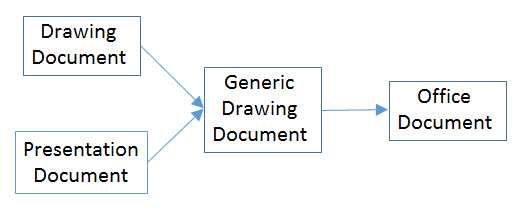
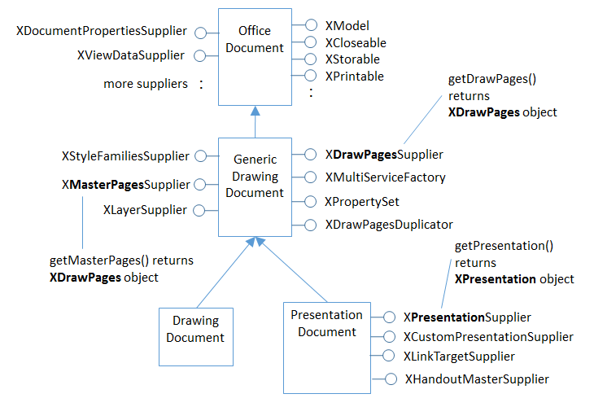
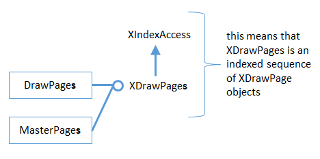
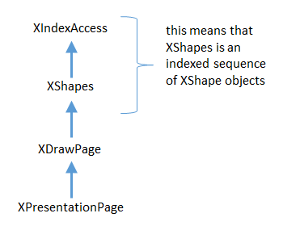
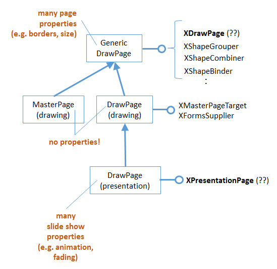
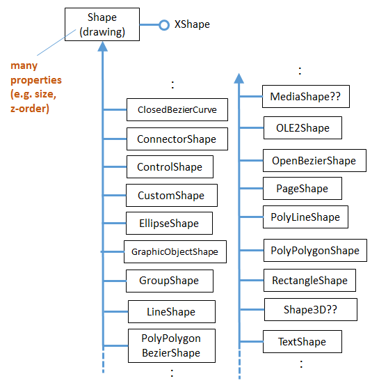
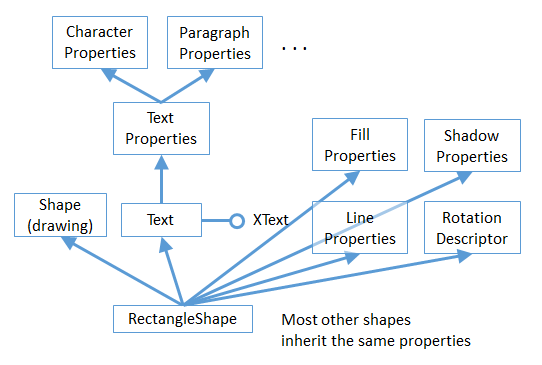
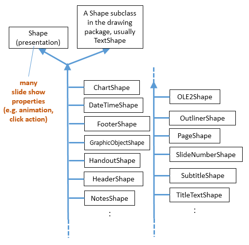
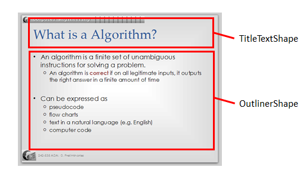
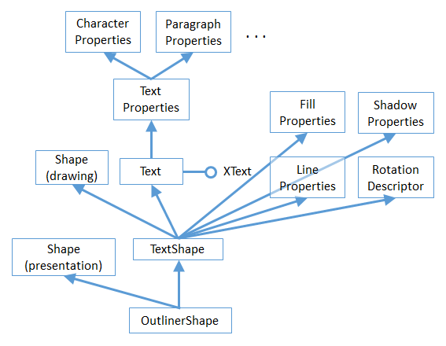

# Chapter 11. Draw/Impress APIs Overview

!!! note "Topics"
    Draw Pages and
    Master Pages; Draw
    Page Details; API
    Hierarchy Code
    Examples; Shapes in a
    Drawing; Shapes in a
    Presentation ; The Slide
    Show APIs

    Example folders: "Draw
    Tests" and "Utils"


This part discusses the APIs for both Draw and Impress
since the presentations API is an extension of Office's
drawing functionality, adding such things as slide-related
shapes (e.g. for the title, subtitle, header, and footer), more
data views (e.g. an handout mode), and slide shows.

You'll get a good feel for the APIs' capabilities by reading
the Draw and Impress user guides, downloadable from
https://www.libreoffice.org/get-help/documentation/.

Details about the APIs can be found in Chapter 9 of the Developer's Guide, starting at
https://wiki.openoffice.org/wiki/Documentation/DevGuide/Drawings/Drawing_Documents_and_Presentation_Documents
(or type `loGuide draw`). The guide can also be
retrieved as a PDF file from
https://wiki.openoffice.org/w/images/d/d9/DevelopersGuide_OOo3.1.0.pdf.

The guide's drawing and presentation examples are online at
http://api.libreoffice.org/examples/DevelopersGuide/examples.html#Drawing, and
there's a short Draw example in
http://api.libreoffice.org/examples/examples.html#Java_examples.

This chapter gives a broad overview of the drawing and presentation APIs, with some
small code snippets to illustrate the ideas. Subsequent chapters will return to these
features in much more detail.

The APIs are organized around three services which subclass OfficeDocument, as
depicted in Figure 1.




Figure 1. The Drawing and Presentation Document Services.


The DrawingDocument service, and most of its related services and interfaces are in
Office's com.sun.star.drawing package (or module), which is documented at
http://api.libreoffice.org/docs/idl/ref/namespacecom_1_1sun_1_1star_1_1drawing.html.
Or you can reach it using `lodoc drawing module reference`.

The presentation API is mostly located in Office's com.sun.star.presentation package
(or module), which is documented at
http://api.libreoffice.org/docs/idl/ref/namespacecom_1_1sun_1_1star_1_1presentation.html.
You can also find it with `lodoc presentation module reference`.

Figure 2 shows a more detailed version of Figure 1 which includes some of the
interfaces defined by the services.




Figure 2. Drawing and Presentation Document Services and Interfaces.


The interfaces highlighted in bold in Figure 2 will be discussed in this chapter.

The DrawingDocument service is pretty much empty, with the real drawing 'action' in
GenericDrawingDocument (which is in the com.sun.star.drawing package).
PresentationDocument subclasses GenericDrawingDocument to inherit its drawing
capabilities, and adds features for slide shows (via the XPresentationSupplier and
XCustomPresntationSupplier interfaces).

The word "presentation" is a little overloaded in the API – PresentationDocument
corresponds to the slide deck, while XPresentationSupplier.getPresentation() returns
an XPresentation object which represents a slide show.


## 1.  Draw Pages and Master Pages

A drawing (or presentation) document consists of a series of draw pages, one for each
page (or slide) inside the document. Perhaps the most surprising aspect of this is that a
Draw document can contain multiple pages.

A document can also contain one or more master pages. A master page contains
drawing/slide elements which appear on multiple draw page. This idea is probably
most familiar from slide presentations where a master page holds the header, footer,
and graphics that appear on every slide.

As illustrated in Figure 2, GenericDrawingDocument supports an
XDrawPagesSupplier interface whose getDrawPages() returns an XDrawPages object.
It also has an XMasterPagesSupplier whose getMasterPages() returns the master
pages as an object. Office views master pages as special kinds of draw pages, and so
getMasterPages() also returns an XDrawPages object.

Note the "s" in "XDrawPages": an XDrawPages object is an indexed container of
XDrawPage (no "s") objects, as illustrated by Figure 3.




Figure 3. The XDrawPages Interface

Since XDrawPages inherit XIndexAccess, its elements (pages) can be accessed using
index-based lookup (i.e. to return page 0, page 1, etc.).


## 2.  Draw Page Details

A draw page is a collection of shapes: often text shapes, such as a title box or a box
holding bulleted points. But a shape can be many more things: an ellipse, a polygon, a
bitmap, an embedded video, and so on.

This "page as shapes" notion is implemented by the API hierarchy shown in Figure 4.




Figure 4. The API Hierarchy for a Draw Page.


XPresentationPage is the interface for a slide's page, but most of its functionality
comes from XDrawPage (see `lodoc XPresentationPage`). The XDrawPage
interface doesn't do much either, except for inheriting XShapes (note the "s").
XShapes inherits XIndexAccess, which means that an XShapes object can be
manipulated as an indexed sequence of XShape objects.

The XDrawPage and XPresentationPage interfaces are supported by services, some of
which are shown in Figure 5. These services are in some ways more important than
the interfaces, since they contain many properties related to pages and slides.




Figure 5. Some of the Draw Page Services.


There are two DrawPage services in the Office API, one in the drawing package, and
another in the presentation package. This is represented in Figure 5 by including the
package names in brackets after the service names. You can access the documentation
for these services by typing `lodoc drawpage service drawing` and
`lodoc drawpage service presentation`.

No properties are defined in the drawing DrawPage, instead everything is inherited
from GenericDrawPage.

I've put "(??)" next to the XDrawPage and XPresentationPage interfaces in Figure 5
because they're not listed in the GenericDrawPage and presentation DrawPage
services in the documentation, but must be there because of the way that the code
works. Also, the documentation for GenericDrawPage lists XShapes as an interface,
rather than XDrawPage.


## 3.  API Hierarchy Code Examples

Some code snippets will help clarify the hierarchies shown in Figures 2-5. The
following lines load a Draw (or Impress) document called "foo" as an XComponent
object.

```java
XComponentLoader loader = Lo.loadOffice();
XComponent doc = Lo.openDoc("foo", loader);
```

A common next step is to access the draw pages in the document using the
XDrawPagesSupplier interface shown in Figure 2:

```java
XDrawPagesSupplier supplier = Lo.qi(XDrawPagesSupplier.class, doc);
XDrawPages pages = supplier.getDrawPages();
```

This code works whether the document is a sequence of draw pages (i.e. a Draw
document) or slides (i.e. an Impress document).

Using the ideas shown in Figure 3, a particular draw page is accessed based on its
index position. The first draw page in the document is retrieved with:

```java
XDrawPage page = Lo.qi(XDrawPage.class, pages.getByIndex(0));
```

Pages are numbered from 0, and a newly created document always contains one page.

The XDrawPage interface is supported by the GenericDrawPage service (see Figure
5), which holds the page's properties. The following snippet returns the width of the
page and its page number:

```java
int width =  (Integer)Props.getProperty(page, "Width");
int pageNumber = (Short)Props.getProperty(page, "Number");
```

The "Width" and "Number" properties are documented in the GenericDrawPage
service page at
http://api.libreoffice.org/docs/idl/ref/servicecom_1_1sun_1_1star_1_1drawing_1_1GenericDrawPage.html
(or use `lodoc GenericDrawPage service`).

Once a single page has been retrieved, it's possible to access its shapes (as shown in
Figure 4). The following code converts the XDrawPage object to XShapes, and
accesses the first XShape in its indexed container:

```java
XShapes shapes = Lo.qi(XShapes.class, page);
XShape shape = Lo.qi(XShape.class, shapes.getByIndex(0))
```


## 4.  Shapes in a Drawing

Shapes fall into two groups – drawing shapes that subclass the Shape service in
com.sun.star.drawing, and presentation-related shapes which subclass the Shape
service in com.sun.star.presentation. The first type are described here, and the
presentation shapes in section 5.

Figure 6 shows the com.sun.star.drawing Shape service and some of its subclasses.




Figure 6. Some of the Drawing Shapes.


I'll be explaining many of these shapes in Chapters 13 and 15, but you can probably
guess what most of them do – EllipseShape is for drawing ellipses and circles,
LineShape is for lines and arrows, RectangleShape is for rectangles.

The two "??"s in Figure 6 indicate that those services aren't shown in the online
documentation, but appear in examples.

The hardest aspect of this hierarchy is searching it for information on a shape's
properties. Many general properties are located in the Shape service, so are
documented on the Shape page (use `lodoc shape service drawing` to reach it).
More specialized properties are located in the specific shape's service. For instance,
RectangleShape has a "CornerRadius" property which allows  a rectangle's corners to
be rounded to make it more button-like.

Unfortunately, most shapes inherit a lot more properties than just those in Shape.
Figure 7 shows a typical example – RectangleShape inherits properties from at least
eight services (I've not shown the complete hierarchy)!




Figure 7. RectangleShape's Properties.


Aside from RectangleShape inheriting properties from Shape, it also obtains its fill,
shadow, line, and rotation attributes from the FillProperties, ShadowProperties,
LineProperties, and RotationDescriptor services. For instance, to make the rectangle
red, the "FillColor" property, defined in the FillProperties service, must be set. The
code for doing this is not complex:

```java
Props.setProperty(shape, "FillColor", 0xFF0000);
                              // hexadecimal for red
```

The complication comes in knowing that a property called "FillColor" exists. Visit the
shape's service documentation (e.g. the RectangleShape page at
http://api.libreoffice.org/docs/idl/ref/servicecom_1_1sun_1_1star_1_1drawing_1_1RectangleShape.html,
or use `lodoc RectangleShape service`), and look inside each
inherited Property service until you find the relevant property.

If the shape contains some text (e.g. the rectangle has a label inside it), and you want
to change one of the text's properties, then you'll need to look in the three property
services above the Text service (see Figure 7).

Changing text requires that the text be selected first, which takes us back XText and
Chapter 5. For example, the text height is changed to 18pt by:

```java
XText xText = Lo.qi(XText.class, shape);
XTextCursor cursor = xText.createTextCursor();
cursor.gotoStart(false);
cursor.gotoEnd(true);   // select all text
Props.setProperty(cursor, "CharHeight", 18);
```

First the shape is converted into an XText reference so that text selection can be done
using a cursor.

The "CharHeight" property is inherited from the CharacterProperties service.

Figure 7 doesn't show all the text property services. For instance, there are also
services called CharacterPropertiesComplex and ParagraphPropertiesComplex.


## 5.  Shapes in a Presentation

If the document is a slide deck, then presentation-related shapes will be subclasses of
the com.sun.star.presentation.Shape service (see the documentation with
`lodoc shape service presentation`). Some of those shapes are shown in Figure 8.




Figure 8. Some of the Presentation Shapes.


The com.sun.star.presentation.Shape service doesn't subclass the
com.sun.star.drawing.Shape service. Instead, every presentation shape inherits the
presentation Shape service and a drawing shape (usually TextShape). This means that
all the presentation shapes can be treated as drawing shapes when being manipulated
in code.

Most of the presentation shapes are special kinds of text shapes. For instance,
TitleTextShape and OutlinerShape are text shapes which usually appear automatically
when you create a new slide inside Impress – the slide's title is typed into the
TitleTextShape, and bulleted points added to OutlinerShape. This is shown in Figure
9.




Figure 9. Two Presentation Shapes in a Slide.


Using OutlinerShape as an example, its 'simplified' inheritance hierarchy looks like
Figure 10.




Figure 10. The OutlinerShape Hierarchy.


OutlinerShape has at least nine property services that it inherits.


## 6.  The Slide Show APIs

One difference between slides and drawings is that the presentations API supports
slide shows. This extra functionality can be seen in Figure 2 since the
PresentationDocument service offers an XPresntationSupplier interface which has a
getPresentation() method for returning an XPresentation object. Don't be confused by
the name – an XPresentation object represents a slide show.

XPresentation offers start() and end() methods for starting and ending a slide show,
and the Presentation service contains properties for affecting how the show
progresses, as illustrated by Figure 11.


Figure 11. The Slide Show Presentation Services.


Code for starting a slide show for the "foo" document:

```java
XComponentLoader loader = Lo.loadOffice();
XComponent doc = Lo.openDoc("foo", loader);

XPresentationSupplier ps = Lo.qi(XPresentationSupplier.class, doc);
XPresentation show = Lo.qi(XPresentation.class,
                                         ps.getPresentation());
show.start();
```

The Presentation service is a bit lacking, so an extended service, Presentation2, was
added more recently. It can access an XSlideShowController interface which gives
finer-grained control over how the show progresses; I'll give examples later.