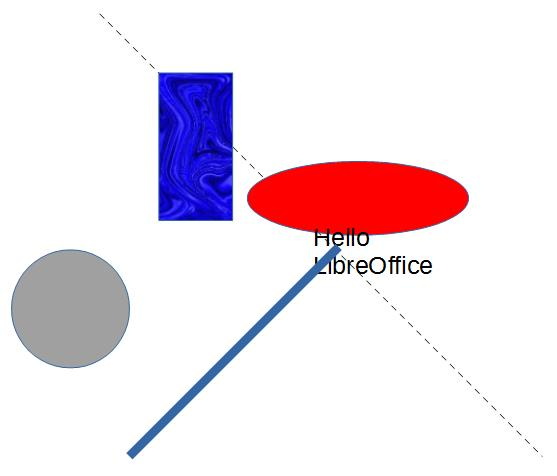
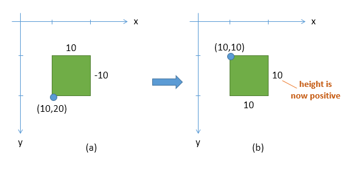
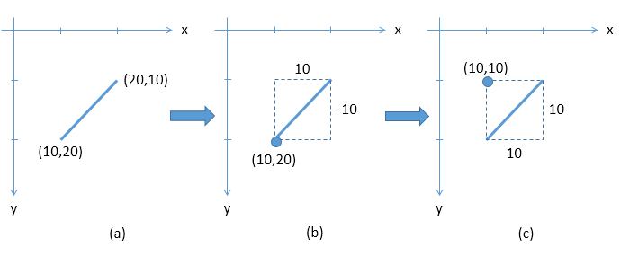
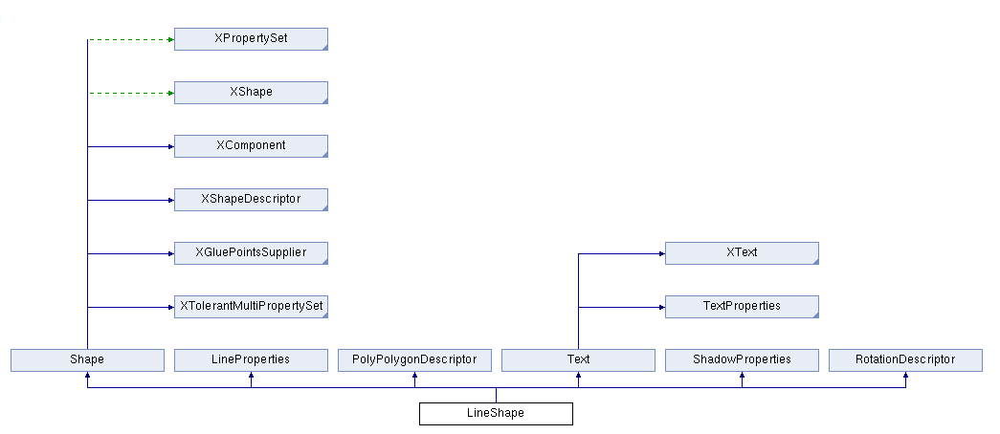
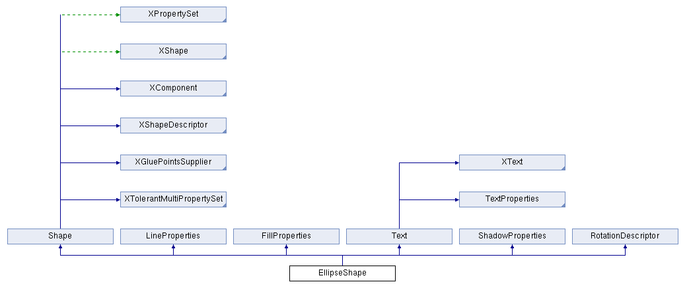
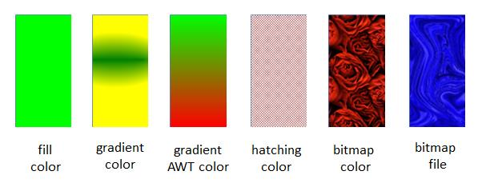
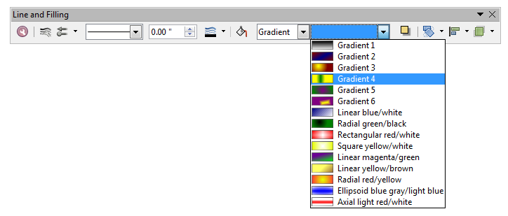
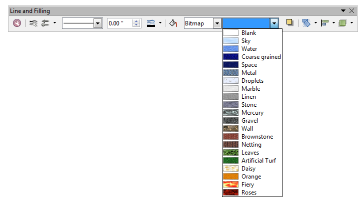
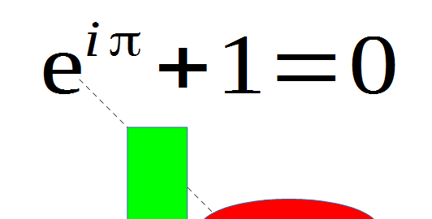

# Chapter 13. Drawing Basic Shapes

!!! note "Topics"
    A Black Dashed
    Line; A Red Ellipse;
    Filled Rectangles; Text;
    Shape Names; A
    Transparent Circle and a
    Polar Line; A Math
    Formula as an OLE
    Shape; Polygons;
    Multiple Lines, Partial
    Elipses

    Example folders: "Draw
    Tests" and "Utils"


This chapter contains an assortment of basic shape
creation examples, including the following:

* simple shapes: line, ellipse, rectangle, text;
* shape fills: solid, gradients, hatching, bitmaps;
* an OLE shape (a math formulae);
* polygons, multiple lines, partial ellipses.

The examples come from two files, DrawPicture.java and
AnimBicycle.java. The main() function of DrawPicture.java:

```java
public static void main (String args[])
{
  XComponentLoader loader = Lo.loadOffice();
  XComponent doc = Draw.createDrawDoc(loader);
  if (doc == null) {
    System.out.println("Draw doc creation failed");
    Lo.closeOffice();
    return;
  }

  GUI.setVisible(doc, true);
  Lo.delay(1000);    // need delay or zoom may not work
  GUI.zoom(doc, GUI.ENTIRE_PAGE);

  XDrawPage currSlide = Draw.getSlide(doc, 0); //access first page
  drawShapes(currSlide);

  Draw.drawFormula(currSlide, "func e^{i %pi} + 1 = 0",
                                           23, 20, 20, 40);
  // animShapes(currSlide);  // explained in Chapter 9

  XShape s = Draw.findShapeByName(currSlide, "text1");
  Draw.reportPosSize(s);

  Lo.saveDoc(doc, "picture.odg");
  Lo.closeDoc(doc);
  Lo.closeOffice();
} // end of main()
```

DrawPicture.java creates a new Draw document, and finishes by saving it to the file
"picture.odg":

```java
XComponent doc = Draw.createDrawDoc(loader);
       :  // add shapes to the document
       :
Lo.saveDoc(doc, "picture.odg"); // "odg" is Draw's extension
```

Aside from saving Office formats,  Lo.saveDoc() recognizes other graphical forms
based on the filename extension (e.g. a document saved to "picture.png" will create a
PNG file).

Draw.createDrawDoc() is a wrapper around Lo.createDoc() to create a  Draw
document:

```java
public static XComponent createDrawDoc(XComponentLoader loader)
{  return Lo.createDoc("sdraw", loader);  }
```

There's also Draw.createImpressDoc():

```java
public static XComponent createImpressDoc(XComponentLoader loader)
{  return Lo.createDoc("simpress", loader);  }
```


## 1.  Drawing Shapes

The drawShapes() method inside DrawPictures.java draws the six shapes shown in
Figure 1.




Figure 1. The Six Shapes Drawn by drawShapes().


Almost every Draw method call Draw.makeShape() which creates a shape instance
and sets its size and position on the page:

```java
// in the Draw class
public static XShape makeShape(String shapeType,
                       int x, int y, int width, int height)
{ XShape shape = null;
  try {
    shape = Lo.createInstanceMSF(XShape.class,
                         "com.sun.star.drawing." + shapeType);
    shape.setPosition( new Point(x*100,y*100) );
    shape.setSize( new Size(width*100, height*100) );
  }
  catch(Exception e)
  {  System.out.println("Unable to create shape: " + shapeType);  }

  return shape;
}  // end of makeShape()
```

The method assumes that the shape is defined inside the com.sun.star.drawing
package, i.e. that it's a shape which subclasses com.sun.star.drawing.Shape, like those
in Figure 6 of Chapter 11. The code converts the supplied (x, y) coordinate, width,
and height from millimeters to Office's 1/100 mm values.

The exact meaning of the position and the size of a shape is a little tricky. If its width
and height are positive, then the position is the top-left corner of the rectangle defined
by those dimensions. However, the user can supply negative dimensions, which
means that "top-left corner" may be on the right or bottom of the rectangle (see Figure
2(a)). Office handles this by storing the rectangle with a new top-left point, so all the
dimensions can be positive (see Figure 2(b)).




Figure 2. How Office Stores a Shape with a Negative Height.


This means that your code should not assume that the position and size of a shape
remain unchanged after being set with XShape.setPosition() and XShape.setSize().

makeShape() is called by Draw.addShape() which adds the generated shape to the
page. It also check if the (x, y) coordinate is located on the page. If it isn't,
warnPosition() prints a warning message.

```java
// in the Draw class
public static XShape addShape(XDrawPage slide, String shapeType,
                            int x, int y, int width, int height)
{ warnsPosition(slide, x, y);
  XShape shape = makeShape(shapeType, x, y, width, height);
  if (shape != null)
    slide.add(shape);
  return shape;
}  // end of addShape()
```

drawShapes() in the DrawPicture.java example is shown below. It creates the six
shapes shown in Figure 1.

```java
// in DrawPicture.java
private static void drawShapes(XDrawPage currSlide)
{
  // black dashed line; uses (x1, y1) (x2, y2)
  XShape line1 = Draw.drawLine(currSlide, 50, 50, 200, 200);
  Props.setProperty(line1, "LineColor", 0x000000);   // black
  Draw.setDashedLine(line1, true);
  // Lo.delay(2000);  // to reduce the speed of the change
  // Draw.setDashedLine(line1, false);


  // red ellipse; uses (x, y) width, height
  XShape circle1 = Draw.drawEllipse(currSlide, 100, 100, 75, 25);
  Props.setProperty(circle1, "FillColor", 0xFF0000);


  // rectangle with different fills; uses (x, y) width, height
  XShape rect1 = Draw.drawRectangle(currSlide, 70, 70, 25, 50);
  // Props.setProperty(rect1, "FillColor", 0x00FF00); // green
  // Draw.setGradientColor(rect1, "Gradient 4");
                               // "Radial red/yellow");
  // Draw.setGradientColor(rect1, java.awt.Color.GREEN,
                                  java.awt.Color.RED);
  // Draw.setHatchingColor(rect1, "Red crossed 45 degrees");
  // Draw.setBitmapColor(rect1, "Roses");
  Draw.setBitmapFileColor(rect1, "crazy_blue.jpg");


  // text defined using (x, y), width, height [size]
  XShape text1 = Draw.drawText(currSlide, "Hello LibreOffice",
                                     120, 120, 60, 30, 24);
  Props.setProperty(text1, "Name", "text1");
  Props.showProps("TextShape's Text Properties",
                              Draw.getTextProperties(text1));


  // gray transparent circle; uses (x,y), radius
  XShape circle2 = Draw.drawCircle(currSlide, 40, 150, 20);
  Props.setProperty(circle2, "FillColor",
                      Lo.getColorInt(java.awt.Color.GRAY));
  Draw.setTransparency(circle2, 25);


  // thick line; uses (x,y), angle clockwise from x-axis, length
  XShape line2 = Draw.drawPolarLine(currSlide, 60, 200, 45, 100);
  Props.setProperty(line2, "LineWidth", 300);    // 3mm
}  // end of drawShapes()
```

There's a number of variations possible for each shape, represented by commented out
code. The following sections look at how the six shapes are drawn.


## 2.  A Black Dashed Line

Draw.drawLine() calls Draw.addShape() to create a com.sun.star.drawing.LineShape
instance. In common with other shapes, a line is defined in terms of its enclosing
rectangle, represented by its top-left corner, width, and height. Draw.drawLine()
allows the programmer to define the line using its endpoints:

```java
// in the Draw class
public static XShape drawLine(XDrawPage slide,
                  int x1, int y1, int x2, int y2)
{
  // make sure size is non-zero
  if ((x1 == x2) && (y1 == y2)) {
    System.out.println("Line is a point");
    return null;
  }
  int width = x2 - x1;   // may be negative
  int height = y2 - y1;  // may be negative
  return addShape(slide, "LineShape",  x1, y1, width, height);
}  // end of drawLine()
```

As mentioned above, Office will store a shape with a modified position and size if one
or both of its dimensions is negative. As an example, consider if Draw.drawLine() is
called with the coordinates (10,20) and (20,10). The call to addShape() would be
passed a positive width (10mm) and a negative height (-10mm). This would be drawn
as in Figure 3(a) but would be stored using the shape position and size in Figure 3(c).




Figure 3. How a Line with a Negative Height is Stored as a Shape.


This kind of transformation may be important if your code modifies a shape after it
has been added to the slide, as my animation examples do in the next chapter.

Back in DrawPicture.java's drawShapes(), the line's properties are adjusted. The
hardest part of this is finding the property's name in the API documentation, because
properties are typically defined across multiple services, including LineShape, Shape,
FillProperties, ShadowProperties, LineProperties, and RotationDescriptor. If the
property is related to the shape's text then you should check TextProperties,
CharacterProperties, and ParagraphProperties as well. Figure 7 of Chapter 11 shows
the situation for RectangleShape, and its much the same for other shapes. You should
start looking in the documentation for the shape (i.e. use
`lodoc LineShape drawing`), and move up the hierarchy.

You can click on the inheritance diagram at the top of the page (e.g. like the one in
Figure 4) to look in the different services.




Figure 4. The LineShape Inheritance Diagram in the
LibreOffice Online Documentation.


drawShapes() will color the line black and make it dashed, which suggests that I
should examine the LineProperties class. Its relevant properties are "LineColor" for
color and "LineStyle" and "LineDash" for creating dashes, as in Figure 5.


Figure 5. Relevant Properties in the LineProperties Class.


Line color can be set with a single call to Props.setProperty(), but line dashing is a
little more complicated, so is handled by Draw.setDashedLine():

```java
// in drawShapes() in DrawPicture.java
Props.setProperty(line1, "LineColor", 0x000000);   // black
Draw.setDashedLine(line1, true);
```

The color parameter for "LineColor" is an RGB hexadecimal. There are other ways of
defining color, which I'll explain in a moment.

Draw.setDashedLine() has to assign a LineStyle object to "LineStyle" and a LineDash
object to "LineDash". The line style is easily set since LineStyle is an enumeration
with three possible values. A LineDash object requires more work:

```java
// in the Draw class
public static void setDashedLine(XShape shape, boolean isDashed)
{
  // create a LineDash object
  LineDash ld = new LineDash();
  ld.Dots = 0; ld.DotLen = 100;  // dashes only; no dots
  ld.Dashes = 5;
  ld.DashLen = 200;
  ld.Distance = 200;

  // set the properties for the line
  XPropertySet props = Lo.qi(XPropertySet.class, shape);
  try {
    if (isDashed) {  // draw a dashed line
      props.setPropertyValue("LineStyle", LineStyle.DASH);
      props.setPropertyValue("LineDash", ld);
    }
    else // draw a solid line
      props.setPropertyValue("LineStyle", LineStyle.SOLID);
  }
  catch(Exception e)
  {  System.out.println("Could not set dashed line property");  }
}  // end of setDashedLine()
```

setDashedLine() can be used to toggle a line's dashes on or off.


## 3.  A Red Ellipse

A red ellipse is drawn using:

```java
// in drawShapes() in DrawPicture.java
XShape circle1 = Draw.drawEllipse(currSlide, 100, 100, 75, 25);
Props.setProperty(circle1, "FillColor", 0xFF0000);
```

Draw.drawEllipse() is similar to drawLine() except that an EllipseShape is created by
Draw.addShape():

```java
// in the Draw class
public static XShape drawEllipse(XDrawPage slide,
                           int x, int y, int width, int height)
{  return addShape(slide, "EllipseShape", x, y, width, height);  }
```

I want to fill the circle with a solid color, which suggests the setting of a property in
FillProperties. A visit to the online documentation for EllipseShape reveals an
inheritance diagram like the one in Figure 6.




Figure 6. The EllipseShape Inheritance Diagram in the
LibreOffice Online Documentation.


Clicking on the FillProperties rectangle jumps to its documentation, which lists a
"FillColor" property (see Figure 7).


Figure 7. Relevant Properties in the FillProperties Class.


Both the "FillColor" and "FillStyle" properties should be set, but the default value for
"FillStyle" is already FillStyle.SOLID, which is what's needed.


## 4.  A Rectangle with a Variety of Fills

The rectangle example in drawShapes() comes in six different colors:

```java
  // in drawShapes() in DrawPicture.java
  // rectangle with different fills
  XShape rect1 = Draw.drawRectangle(currSlide, 70, 70, 25, 50);
  // Props.setProperty(rect1, "FillColor", 0x00FF00); // green

  // Draw.setGradientColor(rect1, "Gradient 4");
                                      // "Radial red/yellow");

  // Draw.setGradientColor(rect1, java.awt.Color.GREEN,
                                  java.awt.Color.RED);

  // Draw.setHatchingColor(rect1, "Red crossed 45 degrees");

  // Draw.setBitmapColor(rect1, "Roses");

  Draw.setBitmapFileColor(rect1, "crazy_blue.jpg");
```

They're shown in Figure 8.




Figure 8. Six Ways of Filling a Rectangle.


### 4.1.  Gradient Color

The second example in Figure 8 ("gradient color") is implemented using
Draw.setGradientColor():

```java
// in the Draw class
public static void setGradientColor(XShape shape, String name)
{
  XPropertySet props = Lo.qi(XPropertySet.class, shape);
  try {
    props.setPropertyValue("FillStyle", FillStyle.GRADIENT);
    props.setPropertyValue("FillGradientName", name);
  }
  catch(com.sun.star.lang.IllegalArgumentException e)
  {  System.out.println("\"" + name + "\" is not a
                        recognized gradient color name");  }
  catch(Exception e)
  {  System.out.println("Could not set to \"" + name + "\"");  }
}  // end of setGradientColor()
```

The hardest part of using this function is determining what name value to pass to the
"FillGradientName" property (e.g. "Gradient 4" in the call in drawShapes()). The
easiest solution is to fire up Office's Draw application, and check out the gradient
names listed in the "Line and Filling" toolbar. Figure 9 shows what happens when the
user selects a shape and chooses the "Gradient" menu item from the combo box.




Figure 9. The Gradient Names in LibreOffice.


If you supply a name which is not in Figure 9's list, then "Linear blue/white" is used
instead.


### 4.2.  Gradient AWT Color

The third example in Figure 8 shows what happens when you define your own
gradient and angle of change. In drawShapes(), the call is:

```java
Draw.setGradientColor(rect1, java.awt.Color.GREEN,
                                  java.awt.Color.RED);
```

This creates a gradient change from green to red downwards through the shape.

Draw.setGradientColor() calls a four argument version of itself which specifies the
gradient angle:

```java
// in the Draw class
public static void setGradientColor(XShape shape,
              java.awt.Color startColor, java.awt.Color endColor)
{  setGradientColor(shape, startColor, endColor, 0);  }


public static void setGradientColor(XShape shape,
   java.awt.Color startColor, java.awt.Color endColor, int angle)
/* if angle == 90 then the gradient changes from the left
   to the right side of the shape */
{
  // create Gradient object
  Gradient grad = new Gradient();
  grad.Style = GradientStyle.LINEAR;
  grad.StartColor = Lo.getColorInt(startColor);
  grad.EndColor = Lo.getColorInt(endColor);

  grad.Angle = (short)(angle*10);    // in 1/10 degree units
  grad.Border = 0;
  grad.XOffset = 0; grad.YOffset = 0;
  grad.StartIntensity = 100; grad.EndIntensity = 100;
  grad.StepCount = 10;

  XPropertySet props = Lo.qi(XPropertySet.class, shape);
  try {
    props.setPropertyValue("FillStyle", FillStyle.GRADIENT);
    props.setPropertyValue("FillGradient", grad);
  }
  catch(Exception e)
  {  System.out.println("Could not set gradient colors");  }
}  // end of setGradientColor()
```

setGradientColor() sets the properties "FillStyle" and "FillGradient". The latter
requires a Gradient object, which is documented in the FillProperties class, as shown
in Figure 10.


Figure 10. The "FillGradient" Property in the FillProperties Class.


The online documentation for FillProperties can be reached using lodoc
FillProperties service reference.

Clicking on the "com::sun::star::awt::Gradient" name in Figure 10 loads its
documentation, which lists ten fields that need to be set.

The colors passed to Draw.setGradientColor() are the Java AWT constants for red and
green (java.awt.Color.RED and java.awt.Color.GREEN), but any Color objects could
be used. They're converted to hexadecimals by Lo.getColorInt():

```java
public static int getColorInt(java.awt.Color color)
// return the color as an integer, ignoring the alpha channel
{
  if (color == null) {
    System.out.println("No color supplied");
    return 0;
  }
  else
    return (color.getRGB() & 0xffffff);
} // end of getColorInt()
```


### 4.3.  Hatching

The fourth fill in Figure 8 employs hatching. In drawShapes(), the call is:

```java
Draw.setHatchingColor(rect1, "Red crossed 45 degrees");
```

Draw.setHatchingColor() is:

```java
public static void setHatchingColor(XShape shape, String name)
{
  XPropertySet props = Lo.qi(XPropertySet.class, shape);
  try {
    props.setPropertyValue("FillStyle", FillStyle.HATCH);
    props.setPropertyValue("FillHatchName", name);
  }
  catch(com.sun.star.lang.IllegalArgumentException e)
  {  System.out.println("\"" + name + "\" not a hatching name");  }
  catch(Exception e)
  {  System.out.println("Could not set color \"" + name + "\"");  }
}  // end of setHatchingColor()
```

This function is much the same as setGradientColor() except that it utilizes
"FillHatchName" rather than "FillGradientName", and the fill style is set to
FillStyle.HATCH. Suitable hatching names can be found by looking at the relevant
list in Draw's "Line and Filling" toolbar. Figure 11 shows the "Hatching" menu item.


Figure 11. The Hatching Names in LibreOffice.


### 4.4.  Bitmap Color

The fifth rectangle fill in Figure 8 utilizes a bitmap color:

```java
Draw.setBitmapColor(rect1, "Roses");
```

The function is:

```java
public static void setBitmapColor(XShape shape, String name)
{
  XPropertySet props = Lo.qi(XPropertySet.class, shape);
  try {
    props.setPropertyValue("FillStyle", FillStyle.BITMAP);
    props.setPropertyValue("FillBitmapName", name);
  }
  catch(com.sun.star.lang.IllegalArgumentException e)
  {  System.out.println("\"" + name + "\" is not a bitmap");  }
  catch(Exception e)
  {  System.out.println("Could not set to \"" + name + "\"");  }
}  // end of setBitmapColor()
```

This is also similar to setGradientColor() and setHatchingColor() but uses a different
"FillStyle" value, and assigns a name to "FillBitmapName". As you might have
guessed by now, the best source for these names is the  "Line and Filling" toolbar
shown in Figure 12.




Figure 12. The Bitmap Names in LibreOffice.


### 4.5.  Bitmap File Color

The final fill in Figure 8 loads a bitmap from "crazy_blue.jpg":
Draw.setBitmapFileColor(rect1, "crazy_blue.jpg");
setBitmapFileColor() is:

```java
public static void setBitmapFileColor(XShape shape, String fnm)
{
  XPropertySet props = Lo.qi(XPropertySet.class, shape);
  try {
    props.setPropertyValue("FillStyle", FillStyle.BITMAP);
    props.setPropertyValue("FillBitmapURL", FileIO.fnmToURL(fnm));
  }
  catch(Exception e)
  {  System.out.println("Could not set color \"" + fnm + "\"");  }
}  // end of setBitmapFileColor()
```

The "FillBitmapURL" property requires a URL, so the filename is converted by
FileIO.fnmToURL().


## 5.  Text

The "Hello LibreOffice" text shape in Figure 1 is created by calling Draw.drawText():

```java
XShape text1 = Draw.drawText(currSlide, "Hello LibreOffice",
                             120, 120, 60, 30, 24);
```

The first four numerical parameters define the shape's bounding rectangle in terms of
its top-left coordinate, width, and height. The fifth, optional number specifies a font
size (in this case, 24pt).

drawText() calls addShape() with "TextShape":

```java
// in the Draw class
public static XShape drawText(XDrawPage slide, String msg,
            int x, int y, int width, int height, int fontSize)
{ XShape shape = addShape(slide, "TextShape", x,y, width, height);
  addText(shape, msg, fontSize);
  return shape;
}  // end of drawText()
```

addText() adds the message to the shape, and sets its font size:

```java
public static void addText(XShape shape, String msg, int fontSize)
{
  XText xText = Lo.qi(XText.class, shape);
  XTextCursor cursor = xText.createTextCursor();
  cursor.gotoEnd(false);
  if (fontSize > 0)
    Props.setProperty(cursor, "CharHeight", fontSize);
  XTextRange range = Lo.qi(XTextRange.class, cursor);
  range.setString(msg);
}  // end of addText()
```

The shape is converted into an XText reference, and the text range selected with a
cursor.

The "CharHeight" property comes from the CharacterProperties service, which is
inherited by the Text service (as shown in Figure 7 of Chapter 11).


#### Some Help with Text Properties

The text-related properties for a shape can be accessed with
Draw.getTextProperties():

```java
public static XPropertySet getTextProperties(XShape xShape)
{
  XText xText = Lo.qi(XText.class, xShape);
  XTextCursor cursor = xText.createTextCursor();
  cursor.gotoStart(false);
  cursor.gotoEnd(true);
  XTextRange xTextRange = Lo.qi(XTextRange.class, cursor);
  return Lo.qi(XPropertySet.class, xTextRange);
}  // end of getTextProperties()
```

drawShapes() in DrawPicture.java calls Draw.getTextProperties() on the text1
TextShape, and prints all its properties:

```java
// in drawShapes() in DrawPicture.java
Props.showProps("TextShape's Text Properties",
                                Draw.getTextProperties(text1));
```

The output is long, but includes the line:

```
CharHeight == 24.0
```

which indicates that the font size was correctly changed by the earlier call to
Draw.drawText().


## 6.  Using a Shape Name

Immediately after the call to Draw.drawText(), the shape's name is set:

```java
// in drawShapes() in DrawPicture.java
Props.setProperty(text1, "Name", "text1");
```

The "Name" property, which is defined in the Shape class, is a useful way of referring
to a shape. The main() function of DrawPicture.java passes a name to
Draw.findShapeByName():

```java
// in main() in DrawPicture.java
XShape s = Draw.findShapeByName(currSlide, "text1");
Draw.reportPosSize(s);

Draw.findShapeByName() iterates through a list of shapes extracted from the slide,
and returns the shape with the supplied name:

// in the Draw class
public static XShape findShapeByName(XDrawPage slide,
                                     String shapeName)
{ ArrayList<XShape> shapes = getShapes(slide);
  if (shapes == null) {
    System.out.println("No shapes were found in the draw page");
    return null;
  }

  for (XShape shape : shapes) {
    String nm = (String)Props.getProperty(shape, "Name");
    if (shapeName.equals(nm))
      return shape;
  }

  System.out.println("No shape named \"" + shapeName + "\"");
  return null;
}  // end of findShapeByName()
```

Draw.getShapes() builds a list of shapes by iterating through the XDrawPage object
as an indexed container of shapes:

```java
// in the Draw class
public static ArrayList<XShape> getShapes(XDrawPage slide)
{
  if (slide == null) {
    System.out.println("Slide is null");
    return null;
  }
  if (slide.getCount() == 0) {
    System.out.println("Slide does not contain any shapes");
    return null;
  }

  ArrayList<XShape> xShapesList = new ArrayList<XShape>();
  try {
    for(int j=0; j < slide.getCount(); j++)
      xShapesList.add( Lo.qi(XShape.class, slide.getByIndex(j)));
  }
  catch(Exception e)
  {   System.out.println("Shapes extraction error in slide");  }

  return xShapesList;
}  // end of getShapes()
```

Draw.reportPosSize() prints some brief information about a shape, including its name,
shape type, position, and size:

```java
// in the Draw class
public static void reportPosSize(XShape shape)
{
  if (shape == null) {
    System.out.println("The shape is null");
    return;
  }
  System.out.println("Shape name: " +
                        Props.getProperty(shape, "Name"));
  System.out.println("  Type: " + shape.getShapeType());
  Point pt = shape.getPosition();
  Size sz = shape.getSize();
  System.out.println("  Position/size: (" +
               pt.X/100 + ", " +  pt.Y/100 +  ") / (" +
               sz.Width/100 + ", " + sz.Height/100 + ")");
}  // end of reportPosSize()
```

XShape.getShapeType() returns the class name of the shape as a string (in this case,
"com.sun.star.drawing.TextShape").


## 7.  A Transparent Circle and a Polar Line

The last two shapes created by DrawPicture.java's drawShapes() are a gray
transparent circle and a polar line.

```java
// in drawShapes() in DrawPicture.java
// gray transparent circle; uses (x,y), radius
XShape circle2 = Draw.drawCircle(currSlide, 40, 150, 20);
Props.setProperty(circle2, "FillColor",
                  Lo.getColorInt(java.awt.Color.GRAY));
Draw.setTransparency(circle2, 25);

// thick line; uses (x,y), angle clockwise from x-axis, length
XShape line2 = Draw.drawPolarLine(currSlide, 60, 200, 45, 100);
Props.setProperty(line2, "LineWidth", 300);    // 3mm
```

A polar line is one defined using polar coordinates, which specifies the coordinate of
one end of the line, and the angle and length of the line from that point.

Draw.drawCircle() uses an EllipseShape, and Draw.drawPolarLine() converts the
polar values into two coordinates so Draw.drawLine() can be called.


## 8.  A Math formula as an OLE Shape

Draw/Impress documents can include OLE objects through OLE2Shape, which
allows a shape to link to an external document. Probably the most popular kind of
OLE shape is the chart, but I'll delay a detailed discussion of that topic until Part 5,
although there is a code snippet below.

The best way of finding out what OLE objects are available is to go to Draw's (or
Impress') Insert menu, Object, "OLE Object" dialog. It lists Office spreadsheet,
chart, drawing, presentation, and formula documents, and a range of Microsoft and
PDF types (when you click on "Further objects").

The DrawPicture.java OLE example displays a mathematical formula, as in Figure 13.




Figure 13. A Math Formula in a Draw Document.


DrawPicture.java renders the formula by calling Draw.addFormula(), which hides the
tricky aspects of instatiating the OLE shape:

```java
// in main() in DrawPicture.java
Draw.drawFormula(currSlide, "func e^{i %pi} + 1 = 0",
                                         23, 20, 20, 40);
```

The second argument is a formula string, written using Office's Math notation. For an
overview, see the "Commands Reference" appendix of the "Math Guide", available
from https://www.libreoffice.org/get-help/documentation/.

Draw.drawFormula() is coded as:

```java
public static XShape drawFormula(XDrawPage slide, String formula,
                                 int x, int y, int width, int height)
{
  XShape shape = addShape(slide, "OLE2Shape", x, y, width, height);
  Props.setProperty(shape, "CLSID", Lo.MATH_CLSID);  // a formula

  XModel model = Lo.qi(XModel.class,
                          Props.getProperty(shape, "Model") );
  Props.setProperty(model, "Formula", formula);
                      // from FormulaProperties
  return shape;
}  // end of drawFormula()
```

OLE2Shape uses a "CLSID" property to hold the class ID of the OLE object. Setting
this property affects the shape's model (data format), which is stored in the "Model"
property. drawFormula() casts this property to XModel and, since the model
represents formula data, it has a "Formula" property where the formula string is
stored.

#### Creating Other Kinds of OLE Shape

The use of a "Formula" property in Draw.drawFormula() only works for an OLE
shape representing a formula. How are other kinds of data stored?

The first step is to set the OLE shape's class ID to the correct value, which will affect
its "Model" property. A short list of class ID constants are included at the start of the
Lo utility class, along with a few commented out IDs which I haven’t tested.

```java
Creating an OLE2Shape for a chart begins like so:

XShape shape = addShape(slide, "OLE2Shape", x, y, width, height);
Props.setProperty(shape, "CLSID", Lo.CHART_CLSID);  // a chart

XModel model = Lo.qi(XModel.class,
                          Props.getProperty(shape, "Model") );
```

Online information on how to use XModel to store a chart, a graphic, or something
else, is pretty sparse. I've found the best start is to list the services that support the
XModel reference. This is done by calling Info.showServices():

```java
Info.showServices("OLE2Shape Model", model);
```

For the version of model in drawFormula(), it reports:

```
OLE2Shape Model Supported Services (2)
  "com.sun.star.document.OfficeDocument"
  "com.sun.star.formula.FormulaProperties"
```

This gives a strong hint to look inside the FormulaProperties service, to find a
property for storing the formula string. A look at the documentation
(`lodoc FormulaProperties service`) reveals a "Formula" property, which I used in
drawFormula().

When the model refers to chart data, the same call to Info.showServices() prints:

```
OLE2Shape Model Supported Services (3)
  "com.sun.star.chart.ChartDocument"
  "com.sun.star.chart2.ChartDocument"
  "com.sun.star.document.OfficeDocument"
```

The com.sun.star.chart2 package is the newer way of manipulating charts, which
suggests that the XModel interfaces should be converted to an interface of
com.sun.star.chart2.ChartDocument. The most useful is XChartDocument, which is
obtained via:
XChartDocument chartDoc = Lo.qi(XChartDocument.class, model);
XChartDocument supports a rich set of chart manipulation methods.  I'll return to
charts in Part 5.


## 9.  Polygons

The main() function of AnimBicycle.java calls Draw.drawPolygon() twice to create
regular polygons for a square and pentagon:

// in AnimBicycle.java
XShape square = Draw.drawPolygon(currSlide, 125, 125, 25, 4);
                                  // (x,y), radius, no. of sides
Props.setProperty(square, "FillColor", 0x3fe694);  // pale green


XShape pentagon = Draw.drawPolygon(currSlide, 150, 75, 5);
                                  // (x,y), no. of sides
                                  // radius uses a default value
Props.setProperty(pentagon, "FillColor", 0xe7b9c7);  // purple

The polygons can be seen in Figure 14.


Figure 14. Bicycle and Shapes.


Draw.drawPolygon() is:

// in the Draw class
public static XShape drawPolygon(XDrawPage slide,
                    int x, int y, int radius, int nSides)
{
  XShape polygon = addShape(slide, "PolyPolygonShape", 0, 0, 0, 0);
     // for shapes formed by one *or more* polygons

  Point[] pts = genPolygonPoints(x, y, radius, nSides);
  Point[][] polys = new Point[][] {pts};
     // an array of Point arrays, one Point array for each polygon

  Props.setProperty(polygon, "PolyPolygon", polys);
  return polygon;
}  // end of drawPolygon()

drawPolygon() creates a "PolyPolygonShape" shape which is designed to store
multiple polygons. This is why the polys data structure instantiated at the end of
drawPolygon()  is an array of points arrays, since the shape's "PolyPolygon" property
can hold multiple point arrays. However, drawPolygon() only creates a single points
array by calling genPolygonPoints().

A points array defining the four points of a square could be:

```
Point[] pts = new Point[4];
pts[0] = new Point(4000, 1200);
pts[1] = new Point(4000, 2000);
pts[2] = new Point(5000, 2000);
pts[3] = new Point(5000, 1200);
```

Note that the coordinates of each point use Office's 1/100 mm units.

genPolygonPoints() generates a points array for a regular polygon based on the
coordinate of the center of the polygon, the distance from the center to each point (the
shape's radius), and the required number of sides:

```java
private static Point[] genPolygonPoints(int x, int y,
                                  int radius, int nSides)
{ if (nSides < 3) {
    System.out.println("Too few sides; must be 3 or more");
    nSides = 3;
  }
  else if (nSides > 30) {
    System.out.println("Too many sides; must be 30 or less");
    nSides = 30;
  }

  Point[] pts = new Point[nSides];
  double angleStep = Math.PI/nSides;
  for (int i = 0; i < nSides; i++) {
    pts[i] = new Point(
       (int) Math.round(x*100 +
                        radius*100 * Math.cos(i*2*angleStep)),
       (int) Math.round(y*100 +
                        radius*100 * Math.sin(i*2*angleStep)) );
  }
  return pts;
}  // end of genPolygonPoints()
```


## 10. Mult-line Shapes

A PolyLineShape can hold multiple line paths, where a path is a sequence of
connected lines. Draw.drawLines() only creates a single line path, based on being
passed arrays of x- and  y- axis coordinates. For example, the following code in
AnimBicycle creates the crossed lines at the top-left of Figure 14:

```java
// in AnimBicycle.java
int[] xs = {10, 30, 10, 30};
int[] ys = {10, 100, 100, 10};
Draw.drawLines(currSlide, xs, ys);
```

Draw.drawLines() is:

```java
// in the Draw class
public static XShape drawLines(XDrawPage slide, int[] xs, int[] ys)
{
  if (xs.length != ys.length) {
    System.out.println("The two arrays must be the same length");
    return null;
  }

  int numPoints = xs.length;
  Point[] pts = new Point[numPoints];
  for (int i = 0; i < numPoints; i++)
    pts[i] = new Point(xs[i]*100, ys[i]*100);  //in 1/100 mm units

  Point[][] linePaths = new Point[][] {pts};
    // an array of Point arrays, one Point array for each line path

  XShape polyLine = addShape(slide, "PolyLineShape", 0, 0, 0, 0);
     // for a shape formed from multiple line paths

  Props.setProperty(polyLine, "PolyPolygon", linePaths);
  return polyLine;
}  // end of drawLines()
```

drawLines() creates an array of Point arrays which is stored in the PolyLineShape
property called "PolyPolygon". However, drawLines() only adds a single points array
to the linePaths data structure since only one line path is being created.


## 11.  Partial Ellipses

EllipseShape contains a "CircleKind" property that determines whether the entire
ellipse should be drawn, or only a portion of it. The properties "CircleStartAngle" and
"CircleEndAngle" define the angles where the solid part of the ellipse starts and
finishes. Zero degrees is the positive x-axis, and the angle increase in 1/100 degrees
units counter-clockwise around the center of the ellipse.

AnimBicycle.java contains the following example:

```java
// in AnimBicycle.java
XShape pie = Draw.drawEllipse(currSlide, 30,
                               slideSize.Width-100, 40, 20);

Props.setProperty(pie, "CircleStartAngle", 9000); // 90 degrees ccw
Props.setProperty(pie, "CircleEndAngle", 36000);  // 360 degrees ccw

Props.setProperty(pie, "CircleKind", CircleKind.SECTION);
                         // CircleKind.CUT, CircleKind.ARC
```

This creates the blue partial ellipse shown at the bottom left of Figure 14.

Figure 15 shows the different results when "CircleKind" is set to
CircleKind.SECTION, CircleKind.CUT, and CircleKind.ARC.


Figure 15. Different Types of Partial Ellipse