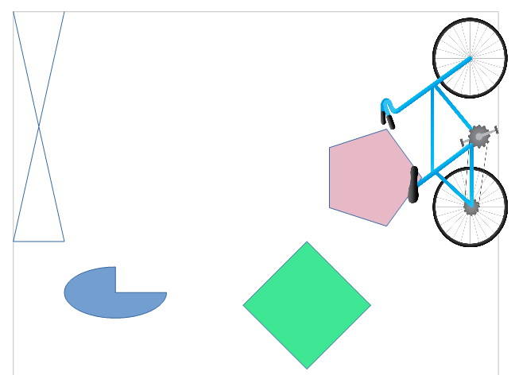
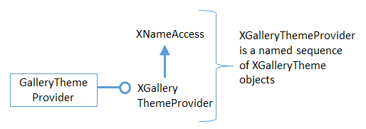

# Chapter 14. Animation 
 
 
DrawPicture.java contains a commented-out call to 
animShapes() which shows how to animate a circle and a 
line. There's a second animation example in 
AnimBicycle.java which translates and rotates a bicycle 
image. The chapter ends with a brief outline of the 
com.sun.star.gallery module. 

 
## 1.  Animating a Circle and a Line 

animShapes() in DrawPicture.java implements two animation loops that work in a 
similar manner. Inside a loop, a shape is drawn, the function (and program) sleeps for 
a brief period, then the shape's position, size, or properties are updated, and the loop 
repeats. 

The first animation loop moves a circle across the page from left to right, reducing its 
radius at the same time. The second loop rotates a line counter-clockwise while 
changing its length. The animShapes() code: 
 
// in DrawPicture.java 
private static void animShapes(XDrawPage currSlide) 
{ 
  // reduce circle size and move to the right 
  int xc = 40; 
  int yc = 150; 
  int radius = 40; 
  XShape circle = null; 
  for (int i=0; i < 20; i++) {  
    if (circle != null) 
      currSlide.remove(circle); 
    circle = Draw.drawCircle(currSlide, xc, yc, radius); 
                               // (x-center, y-center, radius) 
    Lo.delay(200); 
    xc += 5;         // move right 
    radius *= 0.95;  // reduce size 
  } 
 
  // rotate line counter-clockwise, and change length 
  int x2 = 140; 
  int y2 = 110; 
  XShape line = null; 
  for (int i=0; i <= 25; i++) { 
    if (line != null) 
      currSlide.remove(line); 
    line = Draw.drawLine(currSlide, 40, 100, x2, y2); 
    Lo.delay(200); 
    x2 -= 4; 
    y2 -= 4; 
  } 
}  // end of animShapes() 
 

!!! note "Topics"
    Circle 
Movement; Line 
Rotation; Animating an 
Image; The Gallery 
Module  
 
Example folders: "Draw 
Tests" and "Utils" 
The shape (circle or line) is changed by removing the current version from the page 
and inserting a new updated instance. This means that a lot of objects are created and 
removed in a short amount of time. The alternative approach, which retains the shape 
and only update its properties, is used in the bicycle animation explained next.  

 
## 2.  Animating an Image 

The AnimBicycle.java example moves a bicycle image to the right and rotates it 
counter-clockwise. Figure 1 shows the page after the animation has finished. 

 

Figure 1. Animated Bicycle and Shapes. 

 
The animation is performed by animateBike(): 
 
private static void animateBike(XDrawPage currSlide) 
{ 
  String fnm = Info.getGalleryDir() +  
                   "/transportation/Bicycle-Blue.png";    
  XShape shape = Draw.drawImage(currSlide, fnm, 60, 100, 90, 50); 
                                      // (x,y), width, height 
  if (shape == null) { 
    System.out.println("Bike shape not created"); 
    return; 
  } 
 
  Point pt = Draw.getPosition(shape); 
  int angle = Draw.getRotation(shape); 
  for (int i=0; i <= 18; i++) { 
     Draw.setPosition(shape, pt.X+(i*5), pt.Y); // move right 
     Draw.setRotation(shape, angle+(i*5));   // rotates 
     Lo.delay(200); 
  } 
 
  System.out.println("Final Angle: " + Draw.getRotation(shape)); 
  Draw.printMatrix( Draw.getTransformation(shape)); 
}  // end of animateBike() 
 
The image comes from Office’s Gallery collection whose location is returned by 
Info.getGalleryDir(). There are several gallery locations that Office might use, but 
getGalleryDir() returns the main one, which is <OFFICE>/share/gallery/. This 
directory divides the collection into a number of subdirectories, and the bicycle is in  
transportation/Bicycle-Blue.png. 

The animation loop in animateBike() is similar to the ones in animShapes(), using 
Lo.delay() to space out changes over time. However, instead of creating a new shape 
on each iteration, a single GraphicObjectShape is created by Draw.drawImage() 
before the loop starts. Inside the loop, that shape’s position and orientation are 
repeatedly updated by Draw.setPosition() and Draw.setRotation(). 

 
### 2.1.  Drawing the Image 

There are several versions of Draw.drawImage(); the main one is: 
 
// in the Draw class 
public static XShape drawImage(XDrawPage slide,String imFnm,  
                          int x, int y, int width, int height) 
// units in mm's 
{ 
  System.out.println("Adding the picture \"" + imFnm + "\""); 
  XShape imShape = addShape(slide, "GraphicObjectShape",  
                                            x, y, width, height); 
  setImage(imShape, imFnm); 
  setLineStyle(imShape, LineStyle.NONE);     
                     // so no border around the image 
  return imShape; 
}  // end of drawImage() 
 
 
public static void setImage(XShape shape, String imFnm) 
{ 
  String bitmap = Images.getBitmap(imFnm); 
  Props.setProperty(shape, "GraphicURL", bitmap); 
              // embed bitmap from image file 
}  // end of setImage() 
 
drawImage() uses the supplied (x, y) position, width, and  height to create an empty 
GraphicObjectShape. An image is added by setImage(), which loads a bitmap from a 
file, and assigns it to the shape's "GraphicURL" property. By using a bitmap, the 
image is embedded in the document.  

Alternatively, a URL could be assigned to "GraphicURL", causing the document's 
image to be a link back to its original file. That version is coded using: 
 
Props.setProperty(shape, "GraphicURL", FileIO.fnmToURL(imFnm)); 
                              // link to image file 
 
A second version of Draw.drawImage() doesn't require width and height arguments – 
they're obtained from the image’s dimensions: 
 
// in the Draw class 
public static XShape drawImage(XDrawPage slide, String imFnm,  
                                                   int x, int y) 
// units in mm's 
{ 
  Size imSize = Images.getSize100mm(imFnm);   // in 1/100 mm units 
  if (imSize == null) { 
    System.out.println("Could not calculate size of " + imFnm); 
    return null; 
  } 
  else 
    return drawImage(slide, imFnm, x, y,  
                  imSize.Width/100, imSize.Height/100); 
}  // end of drawImage() 
 
The image’s size is returned in 1/100 mm units by Images.getSize100mm(). It loads 
the image as an XGraphic object so that its "Size100thMM" property can be 
examined: 
 
// in the Images class 
public static Size getSize100mm(String imFnm) 
{ 
  XGraphic graphic = loadGraphicFile(imFnm); 
  if (graphic == null) 
    return null; 
  return (Size) Props.getProperty(graphic, "Size100thMM"); 
}  // end of getSize100mm() 
 
This approach isn’t very efficient since it means that the image is being loaded twice, 
once as an XGraphic object by getSize100mm(), and also as a bitmap by setImage().  

 
### 2.2.  Updating the Bike’s Position and Orientation 

The animateBike() animation uses Draw methods for getting and setting the shape’s 
position and orientation: 
 
// in the Draw class 
public static Point getPosition(XShape shape) 
{ Point pt = shape.getPosition(); 
  return new Point(pt.X/100, pt.Y/100);  // convert to mm 
} 
 
public static void setPosition(XShape shape, int x, int y) 
{   shape.setPosition(new Point(x*100, y*100));  }  
 
 
public static int getRotation(XShape shape) 
{ return ((Integer)Props.getProperty(shape, "RotateAngle"))/100;  } 
 
public static void setRotation(XShape shape, int angle) 
{  Props.setProperty(shape, "RotateAngle", angle*100);  }  
 
The position is accessed and changed using the XShape methods getPosition() and 
setPosition(), with the only complication being the changes of millimeters into 1/100 
mm units, and vice versa.  

Rotation is handled by getting and setting the shape's"RotateAngle" property, which is 
inherited from the RotationDescriptor class. The angle is expressed in "1/100 of a 
degree" units (e.g. 4500 rather than 45 degrees), and a positive rotation is counter-
clockwise. 

One issue is that RotationDescriptor is deprecated; the modern programmer is 
encouraged to rotate a shape using the matrix associated with the "Transformation" 
property. 

The Draw class has are two support functions for "Transformation": one extracts the 
matrix from a shape, and the other prints it: 
 
public static HomogenMatrix3 getTransformation(XShape shape) 
/* Returns a transformation matrix, which seems to  
   represent a clockwise rotation: 
      cos(t)  sin(t) x 
     -sin(t)  cos(t) y 
        0       0    1      */ 
{ return (HomogenMatrix3)  
              Props.getProperty(shape, "Transformation"); 
} // end of getTransformation() 
 
 
public static void printMatrix(HomogenMatrix3 mat) 
{ 
  System.out.println("Transformation Matrix:"); 
  System.out.printf("\t%10.2f\t%10.2f\t%10.2f\n",  
      mat.Line1.Column1, mat.Line1.Column2, mat.Line1.Column3); 
  System.out.printf("\t%10.2f\t%10.2f\t%10.2f\n",  
      mat.Line2.Column1, mat.Line2.Column2, mat.Line2.Column3); 
  System.out.printf("\t%10.2f\t%10.2f\t%10.2f\n",  
      mat.Line3.Column1, mat.Line3.Column2, mat.Line3.Column3); 
 
  double radAngle = Math.atan2(mat.Line2.Column1,  
                               mat.Line1.Column1); 
                            // sin(t), cos(t) 
  int currAngle = (int)Math.round( Math.toDegrees(radAngle)); 
  System.out.println("  Current angle: " + currAngle); 
  System.out.println(); 
}  // end of printMatrix() 
 
These methods are called at the end of animateBike(): 
 
// in animateBike() in AnimBicycle.java 
Draw.printMatrix( Draw.getTransformation(shape)); 
 
The output is: 
 
Transformation Matrix: 
              0.00         5001.00        15383.00 
          -9001.00            0.00        10235.00 
              0.00            0.00            1.00 
  Current angle: -90 
 
These numbers suggests that the transformation was a clockwise rotation, but the calls 
to Draw.setRotation() in the earlier animation loop made the bicycle turn counter-
clockwise. This discrepancy led me to stay with the deprecated approach for shape 
rotation. 

 
 
## 3.  Another Way to Access the Gallery  

There's an alternative way to obtain gallery images based around themes and items, 
implemented by the com.sun.star.gallery module (see lodoc Gallery module). 

Subdirectories of gallery/ are themes (e.g. there's a transportation theme), and the files 
in those directories are items.  

The three interfaces in the module are: XGalleryThemeProvider, XGalleryTheme, and 
XGalleryItem. XGalleryThemeProvider represents the gallery/ directory as a 
sequence of named XGalleryTheme objects, as shown in Figure 2. 

 

Figure 2. The GalleryThemeProvider Service. 

 
A XGalleryTheme represents the file contents of a subdirectory (such as 
transportation/) as a container of indexed XGalleryItem objects, which is depicted in 

Figure 3. 

 

Figure 3. The GalleryTheme Service. 

 
Each XGalleryItem represents a file, which may be a graphic or some other resource, 
such as an audio file. The details about each item (file) are stored as properties which 
are defined in the GalleryItem service (see lodoc GalleryItem service). 

The Gallery.java utility class helps access the gallery in this way, and 
GalleryInfo.java contains some examples of its use: 
 
public static void main(String args[]) 
{ 
  XComponentLoader loader = Lo.loadOffice(); 
 
  // list all gallery themes (i.e. the sub-dirs below gallery/) 
  Gallery.reportGallerys(); 
  System.out.println(); 
 
  // list all items for the Transportation theme 
  // i.e. list all the files in gallery/transportation 
  Gallery.reportGalleryItems("Transportation"); 
  System.out.println(); 
 
  // find an item that has "bicycle" as part of its name  
  // in the Transportation theme 
  XGalleryItem gItem =  
       Gallery.findGalleryItem("Transportation", "bicycle"); 
  System.out.println(); 
 
  // print out the item's properties 
  Gallery.reportGalleryItem(gItem); 
 
  Lo.closeOffice(); 
} // end of main() 
 
Gallery.reportGallerys() gives details about 14 themes, Gallery.reportGalleryItems() 
prints the names of the 14 items (files) in the transportation theme. 

Gallery.findGalleryItem() searches that theme for an item name containing "bicycle", 
and  Gallery.reportGalleryItem() reports its details: 
 
Gallery item information: 
  Fnm: "Bicycle-Blue.png" 
  Path: "C:\Program Files\LibreOffice 5\share\gallery 
                           \transportation\Bicycle-Blue.png" 
  Title: "" 
  Type: graphic 
 
 
