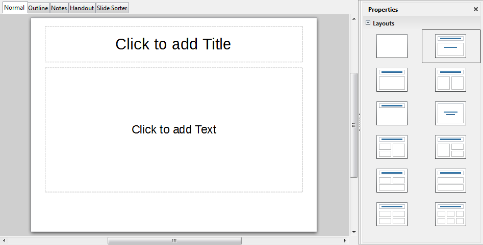
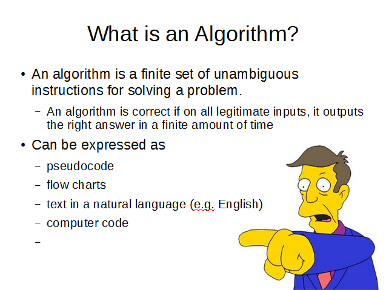
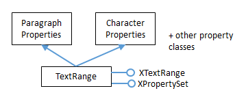
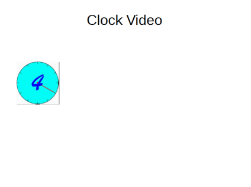
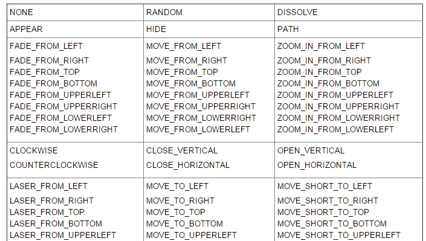
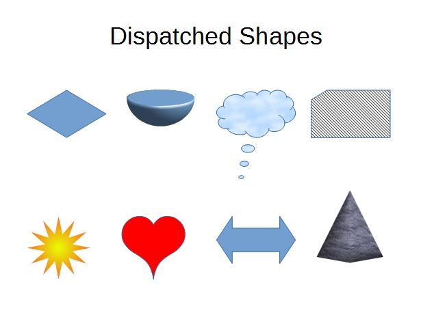
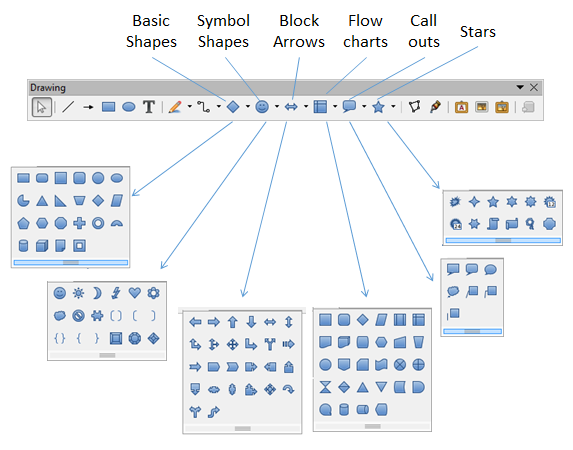
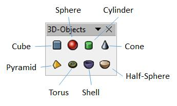

# Chapter 16. Making Slides 

!!! note "Topics"
    Creating Slides: 
    title, subtitle, bullets, 
    images, video, buttons; 
    Shape Animations; 
    Dispatch Shapes (special 
    symbols, block arrows, 
    3D shapes, flowchart 
    elements, callouts, and 
    stars); Slide Viewing 

    Example folders: "Draw 
    Tests" and "Utils" 
 
 
The MakeSlides.java example creates a deck of five slides, 
illustrating different aspects of slide generation: 
 Slide 1. A slide combining a title and subtitle (see 
Figure 3); 
 Slide 2. A slide with a title, bullet points, and an image 
(see Figure 4); 
 Slide 3. A slide with a title, and an embedded video 
which plays automatically when that slide appears during a slide show (see Figure 
6); 
 Slide 4. A slide with an ellipse and a rounded rectangle acting as buttons. During a 
slide show, clicking on the ellipse starts a video playing in an external viewer. 

Clicking on the rounded rectangle causes the slide show to jump to the first slide 
in the deck (see Figure 7); 
 Slide 5. This slide contains eight shapes generated using dispatches, including 
special symbols, block arrows, 3D shapes, flowchart elements, callouts, and stars 
(see Figure 9). 

MakeSlides.java creates a slide deck, adds the five slides to it, and finishes by saving 
the presentation in "makeslides.odp": 
 
public static void main (String args[]) 
{ 
  XComponentLoader loader = Lo.loadOffice(); 
  XComponent doc = Draw.createImpressDoc(loader);  // Impress doc 
  if (doc == null) { 
    System.out.println("Impress doc creation failed"); 
    Lo.closeOffice(); 
    return; 
  } 
 
  // first slide: title + subtitle 
  XDrawPage currSlide = Draw.getSlide(doc, 0); 
  Draw.showShapesInfo(currSlide); 
  Draw.titleSlide(currSlide, "Java-Generated Slides",  
                                      "Using LibreOffice"); 
  Draw.showShapesInfo(currSlide); 
 
  // second slide (bullets and image) 
  currSlide = Draw.addSlide(doc); 
  doBullets(currSlide); 
 
  // third slide: title and video 
  currSlide = Draw.addSlide(doc); 
  Draw.titleOnlySlide(currSlide, "Clock Video"); 
  Draw.drawMedia(currSlide, "clock.avi", 20, 70, 50, 50); 
 
  // fourth slide: buttons 
  currSlide = Draw.addSlide(doc); 
  buttonShapes(currSlide); 
 
  // fifth slide: shapes created with dispatches 
  dispatchShapes(doc);     
 
  System.out.println("Total no. of slides: " +  
                              Draw.getSlidesCount(doc)); 
  Lo.saveDoc(doc, "makeslides.odp"); 
  Lo.closeDoc(doc); 
  Lo.closeOffice(); 
} // end of main() 
 
The five slides are explained in the following sections. 

 
 
## 1.  The First Slide (Title and Subtitle) 

Draw.createImpressDoc() calls Lo.createDoc(), supplying it with the Impress 
document string type: 
  
// in the Draw class 
public static XComponent createImpressDoc(XComponentLoader loader) 
{  return Lo.createDoc("simpress", loader);  } 
 
This creates a new slide deck with one slide whose layout depends on Impress' default 
settings. Figure 1 shows the usual layout when a user starts Impress. 

 
 

Figure 1. The Default New Slide in Impress. 

 
The slide contains two empty presentation shapes – the text rectangle at the top is a 
TitleTextShape, and the larger rectangle below is a SubTitleShape. 

This first slide, which is at index position 0 in the deck, can be referred to by calling 
Draw.getSlide(): 
XDrawPage currSlide = Draw.getSlide(doc, 0); 
This is the same method used to get the first page in a Draw document, so I won't go 
through it again. The XDrawPage object can be examined by calling 
Draw.showShapesInfo() which lists all the shapes (both draw and presentation ones) 
on the slide: 
 
// in Draw 
public static void showShapesInfo(XDrawPage dp) 
{ 
  System.out.println("Draw Page shapes:"); 
  ArrayList<XShape> shapes = getShapes(dp); 
  if (shapes != null) { 
    for(XShape shape : shapes) 
      showShapeInfo(shape); 
  } 
}  // end of showShapesInfo() 
 
 
public static void showShapeInfo(XShape xShape) 
{ System.out.println("  Shape service: " + xShape.getShapeType() +  
                     "; z-order: " + getZOrder(xShape)); 
}  // end of showShapeInfo() 
 
public static int getZOrder(XShape shape) 
{  return (Integer) Props.getProperty(shape, "ZOrder");  } 
 
Draw.showShapesInfo() output for the first slide is: 
 
Draw Page shapes: 
  Shape service: com.sun.star.presentation.TitleTextShape; z-order: 0 
  Shape service: com.sun.star.presentation.SubtitleShape; z-order: 1 
 
Obviously, the default layout sometimes isn't the one we want. One solution would be 
to delete the unnecessary shapes on the slide, then add the shapes that we do want. A 
better approach is the programming equivalent of selecting a different slide layout. 

This is implemented as several Draw methods, called titleSlide(), bulletsSlide(), 
titleOnlySlide(), and blankSlide(), which change the slide's layout to those shown in 

Figure 2. 

 

Figure 2. Slide Layout Methods. 

 
A title/subtitle layout is used for the first slide by calling: 
Draw.titleSlide(currSlide, "Java-Generated Slides",  
                                       "Using LibreOffice"); 
It generates the slide shown in Figure 3. 

 

Figure 3. The Title and Subtitle Slide. 

 
Having a Draw.titleSlide() method may seem a bit silly since we've seen that the first 
slide already uses this layout (e.g. in Figure 1). That's true for my Impress setup, but 
may not be the case for other installations with different configurations. 

The other layouts shown on the right of Figure 1 could also be implemented as Draw 
methods, but the four in Figure 2 seem most useful. They set the "Layout" property in 
the DrawPage service in the com.sun.star.presentation module (not the one in the 
drawing module). 

The documentation for DrawPage (use lodoc DrawPage presentation service) 
only says that "Layout" stores a short; it doesn't list the possible values or how they 
correspond to layouts. However, there is a list at the excellent Japanese Office 
website,  http://openoffice3.web.fc2.com/OOoBasic_Impress.html#OOoIPLy01a, 
which I used as the basis of the layout constants in my Draw class: 
 
// in Draw 
public static final int LAYOUT_TITLE_SUB = 0;      
            // title, and subtitle below (the default, usually) 
 
public static final int LAYOUT_TITLE_BULLETS = 1;    
           // the usual one you want 
 
public static final int LAYOUT_TITLE_CHART = 2; 
public static final int LAYOUT_TITLE_2CONTENT = 3;      
                   // 2 boxes: 1x2  (row x column), 1 row 
public static final int LAYOUT_TITLE_CONTENT_CHART = 4; 
public static final int LAYOUT_TITLE_CONTENT_CLIP = 6; 
public static final int LAYOUT_TITLE_CHART_CONTENT = 7; 
public static final int LAYOUT_TITLE_TABLE = 8; 
public static final int LAYOUT_TITLE_CLIP_CONTENT = 9; 
public static final int LAYOUT_TITLE_CONTENT_OBJECT = 10; 
 
public static final int LAYOUT_TITLE_OBJECT = 11; 
public static final int LAYOUT_TITLE_CONTENT_2CONTENT = 12; 
            // 3 boxes in 2 columns: 1 in first col, 2 in second 
public static final int LAYOUT_TITLE_OBJECT_CONTENT = 13; 
public static final int LAYOUT_TITLE_CONTENT_OVER_CONTENT = 14;    
            // 2 boxes: 2x1, 1 column 
public static final int LAYOUT_TITLE_2CONTENT_CONTENT = 15; 
            // 3 boxes in 2 columns: 2 in first col, 1 in second 
public static final int LAYOUT_TITLE_2CONTENT_OVER_CONTENT = 16;    
            // 3 boxes on 2 rows: 2 on first row, 1 on second 
public static final int LAYOUT_TITLE_CONTENT_OVER_OBJECT = 17;    
public static final int LAYOUT_TITLE_4OBJECT = 18;  // 4 boxes: 2x2 
 
public static final int LAYOUT_TITLE_ONLY = 19;     
            // title only; no body shape 
public static final int LAYOUT_BLANK = 20; 
 
public static final int LAYOUT_VTITLE_VTEXT_CHART = 27;    
       // vertical title, vertical text, and chart 
public static final int LAYOUT_VTITLE_VTEXT = 28;    
public static final int LAYOUT_TITLE_VTEXT = 29;    
public static final int LAYOUT_TITLE_VTEXT_CLIP = 30;    
 
public static final int LAYOUT_CENTERED_TEXT = 32; 
 
public static final int LAYOUT_TITLE_4CONTENT = 33; // 4 boxes: 2x2 
public static final int LAYOUT_TITLE_6CONTENT = 34; // 6 boxes: 2x3 
 
The four constants highlighted above are used by the Draw methods described next. 

Draw.titleSlide() starts by setting the slide's "Layout" property to 
LAYOUT_TITLE_SUB: 
 
// in Draw 
public static void titleSlide(XDrawPage currSlide,  
                              String title, String subTitle) 
{ 
  Props.setProperty(currSlide, "Layout", LAYOUT_TITLE_SUB);   
                                 // title and subtitle 
 
  // add the title text to the title shape 
  XShape xs = Draw.findShapeByType(currSlide, Draw.TITLE_TEXT); 
  XText textField = Lo.qi(XText.class, xs); 
  textField.setString(title); 
 
  // add the subtitle text to the subtitle shape 
  xs = Draw.findShapeByType(currSlide, Draw.SUBTITLE_TEXT); 
  textField = Lo.qi(XText.class, xs); 
  textField.setString(subTitle); 
}  // end of titleSlide() 
 
This changes the slide's layout to an empty TitleTextShape and SubtitleShape. The 
functions adds title and subtitle strings to these shapes, and returns. The tricky part  is 
obtaining a reference to a particular shape so it can be modified.  

One (bad) solution is to use the index ordering of the shapes on the slide, which is 
displayed by Draw.showShapesInfo(). It turns out that TitleTextShape is first (i.e. at 
index 0), and SubtitleShape second. This can be used to write the following code: 
 
XShapes xShapes = Lo.qi(XShapes.class, currSlide); 
 
XShape titleShape = Lo.qi(XShape.class, xShapes.getByIndex(0)); 
XShape subTitleShape = Lo.qi(XShape.class, xShapes.getByIndex(1)); 
 
This is a bit hacky, so I coded Draw.findShapeByType() instead, which searches for a 
shape based on its type: 
 
// in Draw  
public static XShape findShapeByType(XDrawPage slide,  
                                     String shapeType) 
{ ArrayList<XShape> shapes = getShapes(slide); 
  if (shapes == null) { 
    System.out.println("No shapes were found in the draw page"); 
    return null; 
  } 
  for (XShape shape : shapes) { 
    if (shapeType.equals(shape.getShapeType())) 
      return shape; 
  } 
  System.out.println("No shape found of type \"" +  
                                        shapeType + "\""); 
  return null; 
}  // end of findShapeByType() 
 
I added constants to the Draw class so the programmer wouldn't have to remember 
long shape type names: 
 
// in Draw 
public static final String TITLE_TEXT =  
                   "com.sun.star.presentation.TitleTextShape"; 
public static final String SUBTITLE_TEXT =  
                   "com.sun.star.presentation.SubtitleShape"; 
public static final String BULLETS_TEXT =  
                   "com.sun.star.presentation.OutlinerShape"; 
 
This allows me to find the title shape by calling: 
XShape xs = Draw.findShapeByType(currSlide, Draw.TITLE_TEXT); 
 
 
## 2.  The Second Slide (Title, Bullets, and Image) 

The second slide uses a title and bullet points layout, with an image added at the 
bottom right corner. The relevant lines in MakeSlides.java are: 
 
// in main() in MakeSlides.java... 

currSlide = Draw.addSlide(doc); 
doBullets(currSlide); 
 
The result is shown in Figure 4. 

 
 

Figure 4. A Slide with a Title, Bullet Points, and an Image. 

 
The slide is created by doBullets() in MakeSlides.java: 
 
// in MakeSlides.java 
private static void doBullets(XDrawPage currSlide) 
{ 
  XText body = Draw.bulletsSlide(currSlide,  
                                 "What is an Algorithm?"); 
 
  // bullet levels are 0, 1, 2,... 

  Draw.addBullet(body, 0, "An algorithm is a finite  
                          set of unambiguous instructions  
                          for solving a problem."); 
  Draw.addBullet(body, 1, "An algorithm is correct if on  
                          all legitimate inputs, it outputs  
                          the right answer in a finite amount  
                          of time"); 
  Draw.addBullet(body, 0, "Can be expressed as"); 
  Draw.addBullet(body, 1, "pseudocode"); 
  Draw.addBullet(body, 1, "flow charts"); 
  Draw.addBullet(body, 1, "text in a natural language  
                                          (e.g. English)"); 
  Draw.addBullet(body, 1, "computer code"); 
 
  // add the image 
  XShape im = Draw.drawImageOffset(currSlide, "skinner.png",  
                                               0.6, 0.5); 
            // in bottom right corner, and scaled if necessary 
  Draw.moveToBottom(currSlide, im);  //move pic below slide text 
}  // end of doBullets() 
 
Draw.bulletsSlide() works in a similar way to Draw.titleSlide() – first the slide's 
layout is set, then the presentation shapes are found and modified: 
 
// in Draw 
public static XText bulletsSlide(XDrawPage currSlide, String title) 
{ 
  Props.setProperty(currSlide, "Layout", LAYOUT_TITLE_BULLETS);  
 
  // add the title text to the title shape 
  XShape xs = Draw.findShapeByType(currSlide, Draw.TITLE_TEXT); 
  XText textField = Lo.qi(XText.class, xs); 
  textField.setString(title); 
 
  // return a reference to the bullet text area 
  xs = Draw.findShapeByType(currSlide, Draw.BULLETS_TEXT); 
  return Lo.qi(XText.class, xs); 
}  // end of bulletsSlide() 
 
The Draw.LAYOUT_TITLE_BULLETS constant changes the slide's layout to contain 
two presentation shapes – a TitleTextShape at the top, and an OutlinerShape beneath 
it (as in the second picture in Figure 2). Draw.bulletsSlide() calls 
Draw.findShapeByType() twice to find these shapes, but it does nothing to the 
OutlinerShape itself, returning it as an XText reference. This allows text to be inserted 
into the shape by other code (i.e. by Draw.addBullet()). 

 
### 2.1.  Adding Bullets to a Text Area 

Draw.addBullet() converts the shape's XText reference into an XTextRange, which 
offers a setString() method: 
 
  public static void addBullet(XText bullsText, int level,  
                                                     String text) 
  { // access the end of the bullets text 
    XTextRange tr = Lo.qi(XTextRange.class,bullsText).getEnd(); 
 
    // set the bullet's level 
    Props.setProperty(tr, "NumberingLevel",(short)level); 
 
    tr.setString(text + "\n");  // add the text 
  }  // end of addBullet() 
 
As explained in Chapter 5, XTextRange is part of the TextRange service which 
inherits both paragraph and character property classes, as indicated by Figure 5. 

 

Figure 5. The TextRange Service. 

 
A look through the ParagraphProperties documentation reveals a "NumberingLevel" 
property which affects the displayed bullet level (use lodoc ParagraphProperties).  

Another way of finding out about the properties associated with XTextRange is to use 
my Props.showObjProps() to list all of them: 
Props.showObjProps("TextRange in OutlinerShape", tr); 
The bullet text is added with XTextRange.setString(). A newline is added to the text 
before the set, to ensure that the string is treated as a complete paragraph. The 
drawback is that the newline causes an extra bullet symbol to be drawn after the real 
bullet points. This can be seen in Figure 4, at the bottom of the slide. (Principal 
Skinner is pointing at it.) 
 
### 2.2.  Offsetting an Image 

The AnimBicycle.java example in Chapter 14 employed a version of 
Draw.drawImage() based around specifying an (x, y) position on the page and a width 
and height for the image frame. Draw.drawImageOffset() used here is a variant which 
specifies its position in terms of fractional offsets from the top-left corner of the slide. 

For example: 
XShape im = Draw.drawImageOffset(currSlide, "skinner.png", 0.6, 0.5); 
The last two arguments mean that the image's top-left corner will be placed at a point 
that is 0.6 of the slide's width across and 0.5 of its height down. drawImageOffset() 
also scales the image so that it doesn't extend beyond the right and bottom edges of 
the slide. The scaling is the same along both dimensions so the picture isn't distorted. 

The code for Draw.drawImageOffset(): 
 
// in Draw 
public static XShape drawImageOffset(XDrawPage slide, 
                String imFnm, double xOffset, double yOffset) 
{ 
  if ((xOffset < 0) || (xOffset >= 1)) { 
    System.out.println("xOffset should be between 0-1; using 0.5"); 
    xOffset = 0.5; 
  } 
  if ((yOffset < 0) || (yOffset >= 1)) { 
    System.out.println("yOffset should be between 0-1; using 0.5"); 
    yOffset = 0.5; 
  } 
 
  Size slideSize = Draw.getSlideSize(slide);  // in mm units 
  if (slideSize == null) { 
    System.out.println("Image drawing cannot proceed"); 
    return null; 
  } 
  int x = (int)Math.round(slideSize.Width * xOffset); //in mm units 
  int y = (int)Math.round(slideSize.Height * yOffset); 
 
  int maxWidth = slideSize.Width - x; 
  int maxHeight = slideSize.Height - y; 
  Size imSize = Images.calcScale(imFnm, maxWidth, maxHeight); 
 
  return drawImage(slide, imFnm, x, y,  
                         imSize.Width, imSize.Height); 
}  // end of drawImageOffset() 
 
drawImageOffset()  uses the slide's size to determine an (x, y) position for the image, 
and its width and height. Images.calcScale() calculates the best width and height for 
the image frame such that the image will be drawn entirely on the slide: 
 
// in the Images class 
public static Size calcScale(String fnm, int maxWidth,  
                                             int maxHeight) 
{ Size imSize = Images.getSize100mm(fnm);   // in 1/100 mm units 
  if (imSize == null) 
    return null; 
 
  // calculate the scale factors to obtain these maximums 
  double widthScale = ((double)maxWidth*100)/imSize.Width; 
  double heightScale = ((double)maxHeight*100)/imSize.Height; 
 
  // use the smallest scale factor 
  double scaleFactor = (widthScale < heightScale) ?  
                                      widthScale : heightScale; 
  // calculate new dimensions for the image 
  int w = (int)Math.round(imSize.Width * scaleFactor/100); 
  int h = (int)Math.round(imSize.Height * scaleFactor/100); 
  return new Size(w, h); 
}  // end of calcScale() 
 
calcScale() uses Images.getSize100mm() to retrieve the size of the image in 1/100 
mm units, and then a scale factor is calculated for both the width and height. This is 
used to set the image frame's dimensions when the graphic is loaded by drawImage(). 

 
## 3.  The Third Slide (Title and Video) 

The third slide consists of a title shape and a video frame, which looks like Figure 6. 

 

Figure 6. A Slide Containing a Video Frame. 

 
When this slide appears in a slide show, the video will automatically start playing. 

The code for generating this slide is: 
 
// main() of MakeSlides.java... 

currSlide = Draw.addSlide(doc); 
Draw.titleOnlySlide(currSlide, "Clock Video"); 
Draw.drawMedia(currSlide, "clock.avi", 20, 70, 50, 50); 
 
Draw.titleOnlySlide()  works in a similar way to titleSlide() and bulletsSlide(): 
 
// in Draw 
public static void titleOnlySlide(XDrawPage currSlide, String header) 
{ 
  Props.setProperty(currSlide, "Layout", LAYOUT_TITLE_ONLY);  
                                  // title only; no body shape 
  // add the text to the title shape 
  XShape xs = Draw.findShapeByType(currSlide, Draw.TITLE_TEXT); 
  XText textField = Lo.qi(XText.class, xs); 
  textField.setString(header); 
}  // end of titleOnlySlide() 
 
The MediaShape service doesn't appear in the Office documentation. Perhaps one 
reason for its absence is that the shape behaves a little 'erratically'. In particular, 
although MakeSlides.java successfully builds a slide deck containing the video, 
Office crashes upon exiting. Also, when the deck is run as a slide show, the video 
frame is sometimes incorrectly placed, although the video plays correctly. 

Draw.drawMedia() is defined as: 
 
// in Draw 
public static XShape drawMedia(XDrawPage slide, String fnm, 
                            int x, int y, int width, int height) 
// causes Office to crash on exiting 
{   
  XShape shape = addShape(slide, "MediaShape",  
                                       x, y, width, height); 
  // Props.showObjProps("Shape", shape); 
  System.out.println("Loading media: \"" + fnm + "\""); 
  Props.setProperty(shape, "MediaURL", FileIO.fnmToURL(fnm));  
  Props.setProperty(shape, "Loop", true);  
  return shape; 
}  // end of drawMedia() 
 
In the absence of documentation, I used Props.showObjProps() to list the properties 
for the MediaShape:  
Props.showObjProps("Shape", shape); 
The "MediaURL" property requires a file in URL format, and "Loop" is a boolean for 
making the animation play repeatedly. 

Office supports the AVI and WMV video formats, but not MP4. 

 
 
## 4.  The Fourth Slide (Title and Buttons) 

The fourth slide has two 'buttons' – an ellipse which starts a video playing in an 
external application, and a rounded rectangle which makes the presentation jump to 
the first slide. These actions are both implemented using the "OnClick" property for 
presentation shapes. Figure 7 shows how the slide looks. 

 

Figure 7. A Slide with Two 'Buttons'. 

 
The relevant code in main() of MakeSlides.java is: 
 
currSlide = Draw.addSlide(doc); 
buttonShapes(currSlide); 
 
This button approach to playing a video doesn't suffer from the strange behavior when 
using MediaShape on the third slide.  

The buttonShapes() method in MakeSlides.java creates the slide: 
 
// in MakeSlides.java 
private static void buttonShapes(XDrawPage currSlide) 
{ 
  Draw.titleOnlySlide(currSlide, "Wildlife Video Via Button"); 
 
  // button in the center of the slide 
  com.sun.star.awt.Size sz = Draw.getSlideSize(currSlide); 
  int width = 80; 
  int height = 40; 
  XShape ellipse = Draw.drawEllipse(currSlide, (sz.Width-width)/2,  
                        (sz.Height-height)/2, width, height); 
  Draw.addText(ellipse, "Start Video", 30); 
 
  Props.setProperty(ellipse, "OnClick", ClickAction.DOCUMENT); 
  Props.setProperty(ellipse, "Bookmark",  
                        FileIO.fnmToURL("wildlife.wmv")); 
 
  // draw a rounded rectangle with text 
  XShape button = Draw.drawRectangle(currSlide,  
           sz.Width-width-5, sz.Height-height-5, width, height); 
  Draw.addText(button, "Click to go\nto Slide 1"); 
  Draw.setGradientColor(button, "Radial red/yellow"); 
  Props.setProperty(button, "CornerRadius", 300); // 1/100 mm units 
 
  Props.setProperty(button, "OnClick", ClickAction.FIRSTPAGE); 
     // clicking makes the presentation jump to first slide 
}  // end of buttonShapes() 
 
A minor point of interest is that a rounded rectangle is a RectangleShape, but with its 
"CornerRadius" property set.  

The more important part of the method is the two uses of the "OnClick" property from 
the presentation Shape class.  

Clicking on the ellipse executes the video file "wildlife.wmv". This requires 
"OnClick" to be assigned the ClickAction.DOCUMENT constant, and "Bookmark" to 
refer to the file as an URL.  

Clicking on the rounded rectangle causes the slide show to jump back to the first 
page. This needs "OnClick" to be set to ClickAction.FIRSTPAGE. 

Several other forms of click action are listed in Table 1. 

 
|ClickAction     |Name Effect                                       |
|----------------|--------------------------------------------------|
|NONE            |No action is performed on the click.              |
|                |Animation and fade effects are also switched off. |
|PREVPAGE        |The presentation jumps to the previous page.      |
|NEXTPAGE        |The presentation jumps to the next page.          |
|FIRSTPAGE       |The presentation continues with the first page.   |
|LASTPAGE        |The presentation continues with the last page.    |
|BOOKMARK        |The presentation jumps to a bookmark.             |
|DOCUMENT        |The presentation jumps to another document.       |
|INVISIBLE       |The object renders itself invisible after a click.|
|SOUND           |A sound is played after a click.                  |
|VERB            |An OLE verb is performed on this object.          |
|VANISH          |The object vanishes with its effect.              |
|PROGRAM         |Another program is executed after a click.        |
|MACRO           |An Office macro is executed after the click.      |
|STOPPRESENTATION|The presentation is stopped after the click.      |

Table 1. ClickAction Effects. 

 
Table 1 shows that it's possible to jump to various places in a slide show, and also 
execute macros and external programs. In both cases, the "Bookmark" property is 
used to specify the URL of the macro or program. For example, the following will 
invoke Windows' calculator when the button is pressed: 
 
Props.setProperty(button, "OnClick", ClickAction.PROGRAM); 
Props.setProperty(button, "Bookmark",  
           FileIO.fnmToURL(System.getenv("SystemRoot") +  
                           "\\System32\\calc.exe") ); 
 
"Bookmark" requires an absolute path to the application, converted to URL form. 

The ClickAction documentation can be reached using lodoc ClickAction, which 
loads the IDL webpage for the enumeration. Clicking on the "ClickAction" enum 
name takes you to a table very like the one in Table 1. 

 
 
## 5.  Shape Animation 

Shape animations are performed during a slide show, and are regulated through three 
presentation Shape properties: "Effect", "Speed" and "TextEffect".  

"Effect" can be assigned a large range of animation effects, which are defined as 
constants in the AnimationEffect enumeration. Use lodoc AnimationEffect  to 
reach the presentation Shape service, then browse for its "Effect" property. 

Alternatively, you can find details in the com.sun.star.presentation module (use lodoc 
presentation module). Another nice summary, in the form of a large table, is in the 
Developer's Guide at 
https://wiki.openoffice.org/wiki/Documentation/DevGuide/Drawings/Animations_and
_Interactions (use loGuide "Animations and Interactions"). Figure 8 shows 
part of that table. 

 
 

Figure 8. Part of the AnimationEffect Constants Table 
in the Developer's Guide. 

 
There are two broad groups of effects: those that move a shape onto the slide when the 
page appears, and fade effects that make a shape gradually appear in a given spot. 

The following code fragment makes the ellipse on the fourth slide fade into view, 
starting with the bottom of the shape: 
 
// in buttonShapes() in MakeSlides.java 
Props.setProperty(ellipse, "Effect",  
                      AnimationEffect.FADE_FROM_BOTTOM); 
Props.setProperty(ellipse, "Speed", AnimationSpeed.SLOW); 
 
The animation speed can be set to AnimationSpeed.SLOW, 
AnimationSpeed.MEDIUM, or AnimationSpeed.FAST. 

Unfortunately, there seems to be a problem saving these effects in the presentation file 
("makeSlides.odp") created by MakeSlides.java. When that file is opened as a slide 
show, no animation effects occur – the ellipse is simply displayed. 

It seems that the shape animation properties are not saved to the ODP file, because 
when the ellipse is examined inside Impress, its "Custom Animation" task pane is 
empty.  

 
More Complex Shape Animations 
If you browse chapter 9 of the Impress user's guide on slide shows, its animation 
capabilities extend well beyond the constants in AnimationEffect. These features are 
available through the XAnimationNode interface, which is obtained like so: 
 
XAnimationNodeSupplier nodeSupp =  
                 Lo.qi(XAnimationNodeSupplier.class, slide); 
XAnimationNode slideNode = nodeSupp.getAnimationNode(); 
 
XAnimationNode allows a programmer much finer control over animation timings 
and animation paths for shapes. XAnimationNode is part of the large 
com.sun.star.animations package (see lodoc animations module). I won't be use 
XAnimationNode here. 

 
 
## 6.  The Fifth Slide (Various Dispatch Shapes) 

The fifth slide is a hacky, slow solution for generating the numerous shapes in 
Impress' GUI which have no corresponding classes in the API. The approach uses 
dispatch commands, JNA, and Java's Robot class (first described back in Chapter 4). 

The resulting slide is shown in Figure 9. 

 
 

Figure 9. Shapes Created by Dispatch Commands. 

 
The shapes in Figure 9 are just a few of the many available via Impress' "Drawing 
Toolbar", shown in Figure 10. The relevant menus are labeled and their sub-menus 
are shown beneath the toolbar. 

 
 

Figure 10. The Shapes Available from the Drawing Toolbar. 

 
Each sub-menu shape has a name which appears in a tooltip when the cursor is placed 
over the shape's icon. This text turns out to be very useful when writing the dispatch 
commands. 

There's also a "3D-Objects" toolbar which offers the shapes in Figure 11. 

 

Figure 11. The 3D-Objects Toolbar. 

 
Some of these 3D shapes are available in the API as undocumented Shape subclasses, 
but I was unable to programmatically resize the shapes to make them visible. The 
only way I could get them to appear at a reasonable size was by creating them with 
dispatch commands. 

Although there's no mention of these custom and 3D shapes in the Developer's Guide, 
their dispatch commands do appear in the UICommands.ods spreadsheet (available 
from https://arielch.fedorapeople.org/devel/ooo/UICommands.ods). They're also 
mentioned, in less detail, in the online documentation for Impress dispatches at 
https://wiki.documentfoundation.org/Development/DispatchCommands#Impress_slot
s_.28sdslots.29. 

It's quite easy to match up the tooltip names in the GUI with the dispatch names. For 
example, the smiley face in the Symbol shapes menu is called "Smiley Face" in the 
GUI and ".uno:SymbolShapes.smiley" in the UICommands spreadsheet. 

MakeSlides.java generates the eight shapes in Figure 9 by calling dispatchShapes(): 
 
// in MakeSlides.java 
private static void dispatchShapes(XComponent doc) 
{ 
  XDrawPage currSlide = Draw.addSlide(doc); 
  Draw.titleOnlySlide(currSlide, "Dispatched Shapes"); 
 
  GUI.setVisible(doc, true); 
  Lo.wait(1000); 
  Draw.gotoPage(doc, currSlide); 
  System.out.println("Viewing Slide number: " +  
       Draw.getSlideNumber(Draw.getViewedPage(doc))); 
 
  // first row 
  XShape dShape = Draw.addDispatchShape(currSlide,  
                      "BasicShapes.diamond", 20, 60, 50, 30); 
 
  Draw.addDispatchShape(currSlide,  
                      "HalfSphere", 80, 60, 50, 30);  // 3D 
 
  dShape = Draw.addDispatchShape(currSlide,  
               "CalloutShapes.cloud-callout", 140, 60, 50, 30); 
  Draw.setBitmapColor(dShape, "Sky"); 
 
  dShape = Draw.addDispatchShape(currSlide,  
            "FlowChartShapes.flowchart-card", 200, 60, 50, 30); 
  Draw.setHatchingColor(dShape, "Black -45 degrees"); 
 
  // second row 
  dShape = Draw.addDispatchShape(currSlide,  
                    "StarShapes.star12", 20, 140, 40, 40); 
  Draw.setGradientColor(dShape, "Radial red/yellow"); 
  Props.setProperty(dShape, "LineStyle", LineStyle.NONE); 
                                         // no outline 
 
  dShape = Draw.addDispatchShape(currSlide,  
                    "SymbolShapes.heart", 80, 140, 40, 40); 
  Props.setProperty(dShape, "FillColor", 0xFF0000); 
 
  Draw.addDispatchShape(currSlide,  
             "ArrowShapes.left-right-arrow", 140, 140, 50, 30);                      
             // Block Arrow sub-menu 
 
  dShape = Draw.addDispatchShape(currSlide,  
                      "Cyramid", 200, 120, 50, 50);     
                      // 3D pyramid, misspelt 
  Draw.setBitmapColor(dShape, "Stone"); 
 
  Draw.showShapesInfo(currSlide); 
}  // end of dispatchShapes() 
 
A title-only slide is created, followed by eight calls to Draw.addDispatchShape() to 
create two rows of four shapes in Figure 9. 

 
### 6.1.  Viewing the Fifth Slide 

Draw.addDispatchShape() requires the fifth slide to be the active, visible window on-
screen. This necessitates a call to GUI.setVisible() to make the document visible, but 
that isn't quite enough. Making the document visible causes the first slide to be 
displayed, not the fifth one.  

Impress offers many ways of viewing slides, which are implemented in the API as 
view classes that inherit the Controller service. The inheritance structure is shown in 

Figure 12. 

 

Figure 12. Impress View Classes. 

 
When a Draw or Impress document is being edited, the view is 
DrawingDocumentDrawView, which supports a number of useful properties, such as 
"ZoomType" and "VisibleArea". Its XDrawView interface is employed for getting 
and setting the current page displayed in this view. 

Draw.gotoPage() gets the XController interface for the document, and converts it to 
XDrawView so the visible page can be set: 
 
// in Draw 
public static void gotoPage(XComponent doc, XDrawPage page)  
{ XController ctrl = GUI.getCurrentController(doc); 
  gotoPage(ctrl, page); 
}  // end of jumpToPage() 
 
 
public static void gotoPage(XController ctrl, XDrawPage page)  
{ 
  XDrawView xDrawView = Lo.qi(XDrawView.class, ctrl); 
  xDrawView.setCurrentPage(page); 
}  // end of gotoPage() 
 
After the call to Draw.gotoPage(), the specified draw page will be visible on-screen, 
and so receive any dispatch commands. 

Draw.getViewedPage()  returns a reference to the currently viewed page by calling 
XDrawView.getCurrentPage(): 
 
// in Draw 
public static XDrawPage getViewedPage(XComponent doc) 
{ 
  XController ctrl = GUI.getCurrentController(doc); 
  XDrawView xDrawView = Lo.qi(XDrawView.class, ctrl); 
  return xDrawView.getCurrentPage(); 
}  // end of getViewedPage() 
 
 
### 6.2.  Adding a Dispatch Shape to the Visible Page  

If you try adding a smiley face to a slide inside Impress, it's a two-step process. It isn't 
enough only to click on the icon, it's also necessary to drag the cursor over the page in 
order for the shape to appear and be resized.  

These steps are necessary for all the Drawing toolbar and 3D-Objects shapes, and are 
emulated by my code. The programming equivalent of clicking on the icon is done by 
calling Lo.dispatchCmd(), while implementing a mouse drag utilizes JNA and Java's 
Robot class. 

Draw.addDispatchShape() uses createDispatchShape() to create the shape, and then 
positions and resizes it: 
 
// in Draw 
public static XShape addDispatchShape(XDrawPage slide,  
              String shapeDispatch,  
              int x, int y, int width, int height) 
{ 
  warnsPosition(slide, x, y); 
  XShape shape = createDispatchShape(slide, shapeDispatch); 
  if (shape != null) { 
    setPosition(shape, x, y); 
    setSize(shape, width, height); 
  } 
  return shape; 
}  // end of addDispatchShape() 
 
Draw.createDispatchShape() implements icon selection and click-and-drag: 
 
// in Draw 
public static XShape createDispatchShape(XDrawPage slide,  
                                      String shapeDispatch) 
{ int numShapes = slide.getCount(); 
 
  Lo.dispatchCmd(shapeDispatch);    
            // select the shape icon; Office must be visible 
  Lo.wait(1000); 
 
  // click and drag on the page to create the shape on the page; 
  // the current page must be visible 
  java.awt.Point p1 =  
              JNAUtils.getClickPoint( JNAUtils.getHandle() ); 
  java.awt.Point p2 = JNAUtils.getOffsetPoint(p1, 100, 100);   
                                          // hardwired offset  
  JNAUtils.doDrag(p1, p2);  // drag the cursor between p1 and p2 
  Lo.wait(2000); 
 
  /* get a reference to the shape by assuming it's  
     the top one on the page */ 
  int numShapes2 = slide.getCount(); 
  if (numShapes2 == numShapes+1) {  // there's a new shape 
    System.out.println("Shape \"" + shapeDispatch + "\" created"); 
    return Draw.findTopShape(slide); 
  } 
  else {   // no new shape  
    System.out.println("Shape \"" + shapeDispatch +  
                                              "\" not created"); 
    return null; 
  } 
}  // end of createDispatchShape() 
 
The click-and-drag operation doesn't return a reference to the shape, so 
createDispatchShape() ends by calling Draw.findTopShape(). It returns a reference to 
the top-most shape on the page, which I'm assuming is the new shape. 

 
### 6.3.  Using JNA to Click and Drag 

JNAUtils.getHandle() returns Window's handle for Office, and getClickPoint() 
calculates the center of the Office window: 
 
// in JNAUtils 
public static Point getClickPoint(HWND handle) 
{ 
  Rectangle bounds = getBounds(handle); 
  if (bounds == null) { 
    System.out.println("Bounding rectangle is null"); 
    return null; 
  } 
 
  int xCenter = bounds.x + bounds.width/2; 
  int yCenter = bounds.y + bounds.height/2; 
  return new Point(xCenter, yCenter); 
}  // end of getClickPoint() 
 
I'm hoping that this point is somewhere on the slide. 

JNAUtils.getOffsetPoint() creates a second point offset some distance from the first: 
 
public static Point getOffsetPoint(Point p1, int xDist, int yDist) 
{  return new Point( p1.x + xDist, p1.y + yDist);  } 
 
Again, I'm hoping this point is on the slide. 

JNAUtils.doDrag() employs Java's Robot class to send mouse actions to the active 
window. doDrag() moves the cursor to the first point, then sends press and move 
events to simulate a cursor drag to the second point. It finishes by sending a release 
event for the mouse button: 
 
// in JNAUtils 
public static void doDrag(final Point clickPt,  
                                    final Point releasePt) 
// drag the cursor between the two points 
{ if (clickPt == null) { 
    System.out.println("Click point is null"); 
    return; 
  } 
  if (releasePt == null) { 
    System.out.println("Release point is null"); 
    return; 
  } 
 
  EventQueue.invokeLater(new Runnable() { 
    public void run() { 
      try { 
        Point oldPos = MouseInfo.getPointerInfo().getLocation(); 
        Robot r = new Robot(); 
        r.mouseMove(clickPt.x, clickPt.y); 
        Lo.delay(300); 
        r.mousePress(InputEvent.BUTTON1_MASK); 
        Lo.delay(300); 
        r.mouseMove(releasePt.x, releasePt.y); 
        Lo.delay(300); 
        r.mouseRelease(InputEvent.BUTTON1_MASK); 
        r.mouseMove(oldPos.x, oldPos.y); 
      } 
      catch(AWTException e) 
      {  System.out.println("Unable to carry out Drag: " + e); } 
    } 
  }); 
}  // end of doDrag() 
 
The Robot events must be added to Java's event queue, so are wrapped up in a call to 
EventQueue.invokeLater(). The final call to Robot.mouseMove() moves the cursor 
back to its original position. 

 
### 6.4.  Things that Can Go Wrong 

createDispatchShape() assumes that the slide being edited by Office is the visible, 
active window. If these conditions aren't met then the dispatch and the dragging will 
go to the wrong window. Unfortunately, calling GUI.setVisible() and 
Draw.gotoPage() do not guarantee these conditions, since after their call the OS or the 
user may inadvertently change the desktop's focus. A different window could become 
active, and so receive those commands. 

There are also timing issues: the call to Lo.dispatchCmd() returns immediately, but 
the processing of the dispatch by Office may take hundreds of milliseconds. This is 
why calls to Lo.delay() are scattered through the code, to give the dispatches time to 
be processed.  

There's also a timing problem with EventQueue.invokeLater() which returns 
immediately after queuing up the Robot actions. The processing of its events may also 
take many hundreds of milliseconds, so createDispatchShape() must call Lo.delay() 
after returning from JNAUtils.doDrag(). 

Yet another problem is my assumption that the press and drag points are on the slide, 
and not some other part of the application window, such as the toolbar. 

 
### 6.5.  3D Shapes Might be Different (but aren't) 

3D shapes are available both through the 3D-Objects toolbar (see Figure 11), and as 
undocumented Shape APIs. The classes don't match up exactly with the eight shapes 
in the toolbar, but are similar.The classes are Shape3DCubeObject, 
Shape3DSphereObject, , Shape3DPolygonObject, Shape3DLatheObject, 
Shape3DExtrudeObject, and Shape3DSceneObject, which all belong to the 
com.sun.star.drawing package.  

It should be possible to build a 3D cube by calling: 
 
XShape shape3D = Draw.addShape(currSlide,  
                      "Shape3DCubeObject", 120, 120, 60, 60); 
 
I tried this, and it nearly worked. The resulting slide contains a Shape3DCubeObject 
object, which I deduced by listing all the shapes on the current slide with 
Draw.showShapesInfo(). Unfortunately, the shape is invisible because its width and 
height are 0. No amount of fiddling with its properties could change these zero 
dimensions.  

The conclusion of all this programming ugliness is that the API needs to be brought 
up to date so it can access all the shapes available through the GUI. 

 
