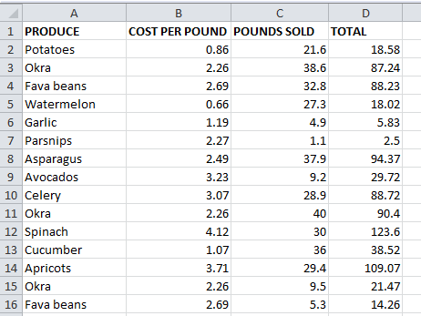
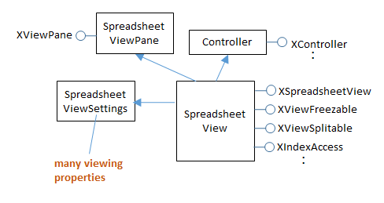
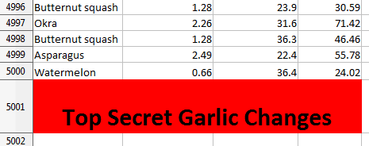
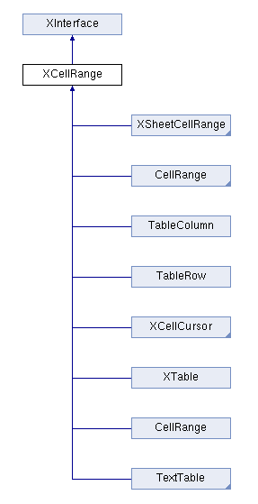
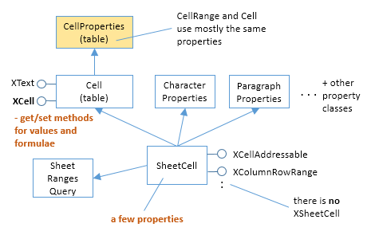
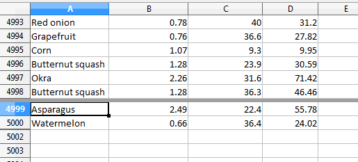
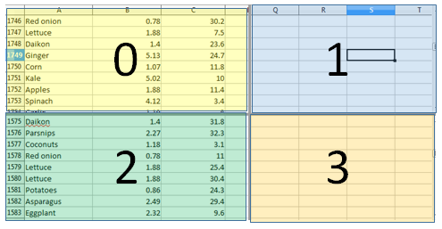
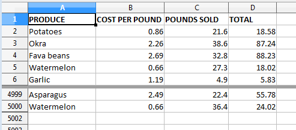
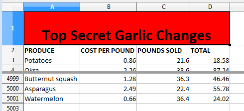
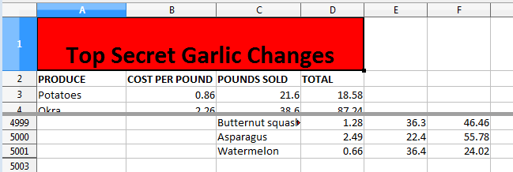

# Chapter 23. Garlic Secrets

!!! note "Topics"
    Freezing Rows;
    GeneralFunctions; Sheet
    Searching; Sheet Range
    Queries; Hidden  Cells;
    Cell Merging; Splitting
    Windows; View Panes;
    View State Data; Active
    Panes;  Inserting Rows
    and Columns; Shifting
    Cells

    Example folders: "Calc
    Tests" and "Utils"

This chapter's GarlicSecrets.java example illustrates how
data can be extracted from an existing spreadsheet
("produceSales.xlsx") using 'general' functions, sheet
searching, and sheet range queries. It also has more
examples of cell styling, and demonstrates sheet freezing,
view pane splitting, pane activation, and the insertion of
new rows into a sheet.

The idea for this chapter, and the data, comes from the
Excel example in chapter 12 of "Automate the Boring Stuff with Python" by Al
Sweigart. However, he utilized the Python library OpenPyXL to manipulate his file.

The beginning of the spreadsheet is shown in Figure 1.




Figure 1. Part of the "produceSales.xlsx" Spreadsheet.


Each row holds information about the sale of fruit or vegetables. The columns are the
type of produce sold (column A), the cost per pound of that produce (B), the number
of pounds sold (C), and the total revenue from the sale (D). The TOTAL column is
calculated using a formula which multiplies the cost per pound by the number of
pounds sold, and rounds the result to the nearest cent. For example, cell "D2" contains
"=ROUND(B2*C2, 2)".

Most of the main() function for GarlicSecrets.java is shown below. I'll explain the
commented out parts in later sections:

```java
// in GarlicSecrets.java

private static final String FNM = "produceSales.xlsx";
private static final String OUT_FNM = "garlicSecrets.ods";


public static void main(String args[])
{
  XComponentLoader loader = Lo.loadOffice();
  XSpreadsheetDocument doc = Calc.openDoc(FNM, loader);
  if (doc == null) {
    System.out.println("Could not open " + FNM);
    Lo.closeOffice();
    return;
  }

  GUI.setVisible(doc, true);
  XSpreadsheet sheet = Calc.getSheet(doc, 0);
  Calc.gotoCell(doc, "A1");  // make sure top of sheet is visible

  // freeze first 3 rows of view
  // Calc.freezeRows(doc, 3);

  // report total for the "Total" column
  XCellRange totalRange = Calc.getColRange(sheet, 3);
  double total =
      Calc.computeFunction(GeneralFunction.SUM, totalRange);
  System.out.printf("Total before change: %.2f\n", total);

  increaseGarlicCost(doc, sheet);

  // recalculate total and print again
  total = Calc.computeFunction(GeneralFunction.SUM, totalRange);
  System.out.printf("Total after change:  %.2f\n", total);


  // add a label at the bottom of the data, and hide it...

  // split sheet into panes...

  // make top pane the active one in the first sheet...

  // add a new first row, and label that as at the bottom...

  Lo.saveDoc(doc, OUT_FNM);

  Lo.waitEnter();
  Lo.closeDoc(doc);
  Lo.closeOffice();
}  // end of main()
```


## 1.  Freezing Rows

Calc.freezeRows() specifies the number of rows that should be 'frozen' on-screen as
Office's view of the spreadsheet changes (e.g. when the user scrolls downwards). The
function's argument is the number of rows to freeze, not a row index, and the choice
of which rows are frozen depends on which row is currently selected (active) in the
application window when the function is called.

The earlier call to Calc.gotoCell() in main() means that "A1" is the active cell in the
spreadsheet, and so row "1" is the active row (and "A" the active column). For that
reason, Calc.freezeRows(doc, 3) will freeze rows "1", "2", and "3" so they remain in
view when the spreadsheet is scrolled up or down.

Calc.freezeRows() and Calc.freezeCols() are implemented using Calc.freeze():

```java
// in the Calc class
public static void freezeRows(XSpreadsheetDocument doc, int numRows)
{  freeze(doc, 0, numRows);  }


public static void freezeCols(XSpreadsheetDocument doc, int numCols)
{  freeze(doc, numCols, 0);  }


public static void freeze(XSpreadsheetDocument doc,
                               int numCols, int numRows)
{ XViewFreezable xFreeze =
           Lo.qi(XViewFreezable.class, getController(doc));
  xFreeze.freezeAtPosition(numCols, numRows);
}
```

Calc.freeze() accesses the SpreadsheetView service (see Figure 2) via the document's
controller, and utilizes its XViewFreezable interface to call freezeAtPosition().



Figure 2. The SpreadsheetView Services and Interfaces.


## 2.  General Functions

Office has a small set of functions (called GeneralFunctions) which can be applied to
cell ranges without the need for formula strings (i.e. a string starting with "=").

They're listed in the enum section at the end of the sheet module at
https://api.libreoffice.org/docs/idl/ref/namespacecom_1_1sun_1_1star_1_1sheet.html,
or use `lodoc GeneralFunctions`. The more important functions  are shown in Table
1.


|GeneralFunction Name|Calculation Applied to the Cell Values                   |
|--------------------|---------------------------------------------------------|
|SUM                 |Sum the numerical values.                                |
|COUNT               |Count all the values, including the non-numerical ones.  |
|COUNTNUMS           |Count only the numerical values.                         |
|AVERAGE             |Average all the numerical values.                        |
|MAX                 |Find the maximum of all the numerical values.            |
|MIN                 |Find the minimum of all the numerical values.            |
|PRODUCT             |Return the product of all the numerical values.          |
|STDEV               |The standard deviation is calculated for the values based|
|                    |on using a sample size.                                  |
|STDEVP              |The standard deviation is calculated for the values based|
|                    |on using the entire population.                          |
|VAR                 |The variance is calculated for the values based on using |
|                    |a sample size.                                           |
|VARP                |The variance is calculated for the values based on using |
|                    |the entire population.                                   |

Table 1. Some GeneralFunctions.


GeneralFunction.SUM is used in main(), to sum the "TOTALS" column of the
spreadsheet:

```java
// in GarlicSecrets.java
XCellRange totalRange = Calc.getColRange(sheet, 3);
double total =
      Calc.computeFunction(GeneralFunction.SUM, totalRange);
```

Cal.getColRange() utilizes the XColumnRowRange interface to access the sheet as a
series of columns. The required column is extracted from the series via its index
position:

```java
// in the Calc class
public static XCellRange getColRange(XSpreadsheet sheet, int idx)
{
  XColumnRowRange crRange = Lo.qi(XColumnRowRange.class, sheet);
  XTableColumns cols = crRange.getColumns();  // get all columns

  XIndexAccess con = Lo.qi(XIndexAccess.class, cols);
  try {   // get column at idx position
    return Lo.qi(XCellRange.class, con.getByIndex(idx));
  }
  catch(Exception e)
  {  System.out.println("Could not access range for col pos " +idx);
     return null;
  }
}  // end of getColRange()
```

The sheet can also be treated as a series of rows by calling
XColumnRowRange.getRows(), as in Calc.getRowRange():

```java
// in the Calc class
public static XCellRange getRowRange(XSpreadsheet sheet, int idx)
{
  XColumnRowRange crRange = Lo.qi(XColumnRowRange.class, sheet);
  XTableRows rows = crRange.getRows();  // get all rows
  XIndexAccess con = Lo.qi(XIndexAccess.class, rows);
  try {  // get row at idx position
    return Lo.qi(XCellRange.class, con.getByIndex(idx));
  }
  catch(Exception e)
  {  System.out.println("Could not access range for row pos " +idx);
     return null;
  }
}  // end of getRowRange()
```

The column returned by `Calc.getColRange(sheet,3)` includes the cell containing
the word "TOTALS", but GeneralFunction.SUM only sums cells holding numerical
data.

Calc.computeFunction() obtains the XSheetOperation interface for the cell range, and
calls XSheetOperation.computeFunction() to apply a GeneralFunction:

```java
// in the Calc class
public static double computeFunction(GeneralFunction fn,
                                       XCellRange cellRange)
{ try {
    XSheetOperation sheetOp =
                     Lo.qi(XSheetOperation.class, cellRange);
    return sheetOp.computeFunction(fn);
  }
  catch(Exception e)
  {  System.out.println("Compute function failed: " + e);
     return 0;
  }
}  // end of computeFunction()
```


## 3.  Searching for the Cost of Garlic, and Increasing it

GarlicSecrets.java increases the "Code per Pound" value for every garlic entry. The
source document uses $1.19 (e.g. see row 6 of Figure 1). Due to a worldwide garlic
shortage, this must be increased by 5% to $1.2495.

increaseGarlicCost() in GarlicSecrets.java scans every used row in the sheet,
examining the "Produce" cell to see if it contains the string "Garlic". When the string
is found, the corresponding "Cost per Pound" entry on that row is changed. When the
scanning reaches an empty cell, the end of the data has been reached, and the function
returns.


```java
// in GarlicSecrets.java
private static int increaseGarlicCost(XSpreadsheetDocument doc,
                                      XSpreadsheet sheet)
{ int row = 0;
  XCell prodCell = Calc.getCell(sheet, 0, row);
              // get produce cell in first row
  XCell costCell;
  while (prodCell.getType() !=  CellContentType.EMPTY) {
    // iterate down produce column until an empty cell is reached
    if (prodCell.getFormula().equals("Garlic")) {
      Calc.gotoCell(doc, Calc.getCellStr(0, row));
                              // show the cell on-screen
      costCell = Calc.getCell(sheet, 1, row);
                              // change cost/pound entry in the row
      costCell.setValue( 1.05* costCell.getValue());
      Props.setProperty(costCell, "CharWeight",
                           com.sun.star.awt.FontWeight.BOLD);
      Props.setProperty(costCell, "CharColor", 0xFF0000);  // red
    }
    row++;
    prodCell = Calc.getCell(sheet, 0, row);
                   // get produce cell in next row
  }
  return row;
}  // end of increaseGarlicCost()
```

To help the user see that changes have been made to the sheet, the text of each
updated "Cost per Pound" cell is made bold and red. The cell properties being altered
come from the CharacterProperties class.

The progression of the function is also highlighted by calling Calc.gotoCell() inside
the loop. This causes the spreadsheet to scroll down, to follow the changes.

Back in main() after the updates, the "Totals" column is summed once again, and the
new value reported:

```
Total before change: 231353.57
Total after change:  231488.58
```


## 4.  Adding a Secret, Hidden Message

The change made by increaseGarlicCost() are of a top-secret nature, and so the code
adds an invisible message to the end of the sheet:

```java
// in main() of GarlicSecrets.java
    :
int emptyRowNum = findEmptyRow(sheet);
addGarlicLabel(doc, sheet, emptyRowNum);  // add msg to row

Lo.delay(2000);       // wait a bit before hiding row

XCellRange rowRange = Calc.getRowRange(sheet, emptyRowNum);
Props.setProperty(rowRange, "IsVisible", false);
    :
```

findEmptyRow() returns the index of the first empty row in the sheet, which happens
to be the first row after the end of the data. It passes the index to addGarlicLabel()
which inserts the large red text "Top Secret Garlic Changes" into the first cell on the
row. The message is so big that several cells are merged together to make enough
space; the row's height is also increased. The result is shown in Figure 3.




Figure 3. The Message at the end of the Sheet.


This message is visible for about 2 seconds before it's hidden by setting the height of
the row to 0. This results in Figure 4.


Figure 4. The Hidden Message at the end of the Sheet.


findEmptyRow() utilizes a sheet ranges query to find all the empty cell ranges in the
first column (XCellRangesQuery.queryEmptyCells()). Then it extracts the smallest
row index from those ranges:

```java
// in GarlicSecrets.java
public static int findEmptyRow(XSpreadsheet sheet)
{
  // create a cell range spanning the first column of the sheet
  XCellRange colRange = Calc.getColRange(sheet, 0);
  Calc.printAddress(colRange);

  // build query using the column cell range
  XCellRangesQuery crQuery =
                   Lo.qi(XCellRangesQuery.class, colRange);

  // find all empty cell ranges in the column
  XSheetCellRanges scRanges = crQuery.queryEmptyCells();

  CellRangeAddress[] addrs = scRanges.getRangeAddresses();
  Calc.printAddresses(addrs);

  // find smallest row index in those ranges
  int row = -1;
  if (addrs != null) {
    row  = addrs[0].StartRow;
    for (int i = 1; i < addrs.length; i++) {
      if (row < addrs[i].StartRow)
        row = addrs[i].StartRow;
    }
    System.out.println("First empty row is at position: " + row);
  }
  else
    System.out.println("Could not find an empty row");
  return row;
}  // end of findEmptyRow()
```

The XCellRangesQuery interface needs a cell range to search, which is obtained by
calling Calc.getColRange() to get the first column. The cell range is printed by
Calc.printAddress():

```
Range: Sheet1.A1:A1048576
```

The first column extends down to row 1048576.

XCellRangesQuery.queryEmptyCells() returns an XSheetCellRanges object, and an
array of cell range addresses are extracted from it. Calc.printAddresses() prints:

```java
Range: Sheet1.A5001:A1048576
```

There's only one empty cell range in the column, starting at row position 5001 and
extending to the bottom of the sheet. This is correct because the produce data is made
up of 5000 records.

findEmptyRow() returns the smallest start row (i.e. 5001).


## 5.  Adding the Label

addGarlicLabel() adds the large text string "Top Secret Garlic Changes" to the first
cell in the supplied row. The cell is made wider by merging a few cells together, made
taller by adjusting the row height, and turned bright red.

```java
// in GarlicSecrets.java
private static void addGarlicLabel(XSpreadsheetDocument doc,
                          XSpreadsheet sheet, int emptyRowNum)
{
  Calc.gotoCell(doc, Calc.getCellStr(0, emptyRowNum));
     // goto first cell of the empty row

  // merge first few cells of the row
  XCellRange cellRange = Calc.getCellRange(sheet, 0, emptyRowNum,
                                                  3, emptyRowNum);
  XMergeable xMerge = Lo.qi(XMergeable.class, cellRange);
  xMerge.merge(true);

  Calc.setRowHeight(sheet, emptyRowNum, 18);  // make row taller

  // set text and properties in the cell
  XCell cell = Calc.getCell(sheet, 0, emptyRowNum);
  cell.setFormula("Top Secret Garlic Changes");  // add text

  // adjust cell text properties
  Props.setProperty(cell, "CharWeight",
                              com.sun.star.awt.FontWeight.BOLD);
  Props.setProperty(cell, "CharHeight", 24);
  Props.setProperty(cell, "CellBackColor", 0xFF0000);  // red
  Props.setProperty(cell, "HoriJustify", CellHoriJustify.CENTER);
  Props.setProperty(cell, "VertJustify", CellVertJustify.CENTER);
}  // end of addGarlicLabel()
```

Cell merging requires a cell range, which is obtained by calling the version of
Calc.getCellRange that employs start and end cell positions in (column, row) order.

The range spans the first four cells of the empty row, making it wide enough for the
large text.

The XMergeable  interface is supported by the SheetCellRange service and uses
merge() with a boolean argument to merge or unmerge a cell range.

Changing the cell height affects the entire row, not just the merged cells, and so
Calc.setRowHeight() manipulates a cell range representing the row:

```java
// in the Calc class
public static void setRowHeight(XSpreadsheet sheet,
                                        int idx, int height)
{ XCellRange rowRange = getRowRange(sheet, idx);
  Props.setProperty(rowRange, "Height", height*100);
                                        // in 1/100 mm units
}
```

setRowHeight() illustrates the difficulties of finding property documentation. The first
line obtains an XCellRange interface for the row, and the second line changes a
property in the cell range's service. Pretend for a moment, that we don't know the
name of this height property ("Height"). How could we find it?

That depends on finding the cell range's service. First turn to the online
documentation for the XCellRange class, which includes the class diagram shown in
Figure 5 (which can be reached with lodoc XCellRange).




Figure 5. Classes that Inherit XCellRange.


This diagram combines the service and interface inheritance hierarchies. Ignoring the
interfaces that inherit XCellRange  is easy because their names always begin with
"X". The remaining names mean that XCellRange is implemented by almost every
service in the Calc API: CellRange (twice), TableColumn, TableRow, and TextTable.
CellRange appears twice because the blue triangle in the bottom-right corner of the
first CellRange box means that there's more subclass hierarchy that's not shown; in
this case, SheetCellRange, SheetCellCursor, and Spreadsheet. The height property
must be in one of these services, or one of their superclasses.

The correct choice is TableRow because the cell range is representing a spreadsheet
row. TableRow contains four properties, one of which is "Height".

Another approach for finding the service is to call Info.showServices(). For example,
by adding the following line to Calc.setRowHeight():

```java
Info.showServices("Cell range for a row", cellRange);
```

The following is printed:

```
Cell range for a row Supported Services (1)
  "com.sun.star.table.TableRow"
```

Back in addGarlicLabel(), text is stored in the cell, and its properties set. Although
XMergeable changes a cell range into a cell, it doesn't return a reference to that cell. It
can be accessed by calling Calc.getCell():

```java
XCell cell = Calc.getCell(sheet, 0, emptyRowNum);
```

The various cell properties changed in addGarlicLabel() are inherited from different
classes shown in Figure 6.



Figure 6. The SheetCell Services and Interfaces.


"CharWeight" and "CharHeight" come from CharacterProperties, and
"CellBackColor", "HoriJustify", and "VertJustify" from CellProperties.

Back in main(), the newly created label is hidden after an interval of  2 seconds:

```java
// in main() of GarlicSecrets.java
Lo.delay(2000);       // wait a bit before hiding last row

XCellRange rowRange = Calc.getRowRange(sheet, emptyRowNum);
Props.setProperty(rowRange, "IsVisible", false);
   :
```

Row invisibility requires a property change to the row. The row's cell range is
obtained by calling Calc.getRowRange(), and then the "IsVisible" property is
switched off. Finding the name of this property involves the same investigative skills
as the search for "Height" in Calc.setRowHeight(). As with "Height", "IsVisible" is
defined in the TableRow service.


## 6.  Splitting a Window into Two View Panes

The produce sales data is quite lengthy, so it's useful to split the window into two
view panes: one showing the modified rows at the end, and the other the first few
rows at the top of the sheet. My first attempt at splitting the sheet is shown in Figure
7.  The division occurs just above row 4999, drawn as a thick dark gray line.




Figure 7. Two Views of the Sheet.


The code in main() of GarlicSecrets.java for this:

```java
// in GarlicSecrets.java
    :
// split window into 2 view panes
String cellName = Calc.getCellStr(0, emptyRowNum-2);
System.out.println("Splitting at: " + cellName);
Calc.splitWindow(doc, cellName);   // doesn't work with Calc.freeze()
    :
```

Calc.splitWindow() can utilize the SpreadsheetView service (see Figure 2), and its
XViewSplitable interface:

```java
XController controller = Calc.getController(doc);
XViewSplitable viewSplit = Lo.qi(XViewSplitable.class, xController);
```

Unfortunately, XViewSplitable only offers a splitAtPosition() method which specifies
the split location in terms of pixels. In addition, the interface is deprecated.

A better alternative is to employ the "splitWindow" dispatch command, which has a
"ToPoint" property argument for a cell name (e.g. "A4999") where the split will
occur. Therefore, Calc.splitWindow() is coded as:

```java
// in the Calc class
public static void splitWindow(XSpreadsheetDocument doc,
                                      String cellName)
{ XFrame frame = getController(doc).getFrame();
  gotoCell(frame, cellName);
  Lo.dispatchCmd(frame, "SplitWindow",
                   Props.makeProps("ToPoint", cellName));
  }  // end of splitWindow()


public static void gotoCell(XFrame frame, String cellName)
{  Lo.dispatchCmd(frame, "GoToCell",
                  Props.makeProps("ToPoint", cellName));  }
```

The call to Calc.gotoCell() changes the on-screen active cell. If it's left out then the
"SplitWindow" dispatch creates a split at the currently selected cell rather than the
one stored in the "ToPoint" property. In other words, it appears that the
"SplitWindow" dispatch ignores the property.

Figure 7 shows another problem with the split – the top pane still shows the rows of
data immediately above the split line. I want the top view to show the first rows at the
start of the sheet.

One way of changing the displayed rows is via the view's XViewPane interface (see
Figure 2). Each view (or pane) created by a split is represented by an XViewPane
object, and a collection of all the current panes can be accessed through the
SpreadsheetView service. This approach is implemented in Calc.getViewPanes(),
which returns the collection as an array:

```java
// in the Calc class
public static XViewPane[] getViewPanes(XSpreadsheetDocument doc)
{
  XIndexAccess con = Lo.qi(XIndexAccess.class, getController(doc));
  if (con == null) {
    System.out.println("Could not access the view pane container");
    return null;
  }
  if (con.getCount() == 0) {
    System.out.println("No view panes found");
    return null;
  }

  // put each XViewPane obj in container into an array
  XViewPane[] panes = new XViewPane[con.getCount()];
  for (int i=0; i < con.getCount(); i++) {
    try {
      panes[i] = Lo.qi(XViewPane.class, con.getByIndex(i));
    }
    catch(Exception e)
    {  System.out.println("Could not get view pane " + i);  }
  }
  return panes;
}  // end of getViewPanes()

Calc.getViewPanes() is called like so:

XViewPane[] panes = Calc.getViewPanes(doc);
System.out.println("No of panes: " + panes.length);
```

The XViewPane interface has methods for setting and getting the visible row and
column in the view. For example, the first pane can be made to show the first row, by
calling:

```java
panes[0].setFirstVisibleRow(0);
```


## 7.  View States, and Making the Top Pane Active

The previous section split the window into two panes, and changed the view in the top
pane to show the first rows of the sheet. But there's still a problem which can be seen
in Figure 7 – the active cell is still in the bottom pane, and I want it to be in the first
row of the top pane. More coding is required.

Hidden away in the XController interface are the methods getViewData() and
restoreViewData() . They allow a programmer to access and change the view details
of all the sheets in the document. For example, the following retrieval of the view data
for a document:

```
XController ctrl = getController(doc);
System.out.println( ctrl.getViewData() );
prints:
100/60/0;0;tw:270;3/13/0/0/0/0/2/0/0/0/1;5/15/0/0/0/0/2/0/0/0/0;0/0/0
/0/0/0/2/0/0/0/0
```

This can be better understood by separating the data according to the ";'s, producing:

```
100/60/0
0
tw:270
3/13/0/0/0/0/2/0/0/0/1
5/15/0/0/0/0/2/0/0/0/0
0/0/0/0/0/0/2/0/0/0/0
```

The first three lines refer to the document's zoom settings, the active sheet index, and
the position of the scrollbar. The fourth line and below give the view state information
for each sheet. In the example document, there are three sheets, so three view state
lines.

Each view state consists of 11 values, separated by "/"s. Their meaning, based on their
index positions:

* indices 0 and 1 contain the current cursor position in terms of column and row positions;
* index 2: this records if column split mode is being used (0 or 1);
* 3: is row split mode being used? (0 or 1);
* 4: the vertical split position (in pixels);
* 5: the horizontal split position (in pixels);
* 6: the active/focused pane number for this sheet;
* 7: the left column index of the left-hand panes;
* 8: the left column index of the right-hand panes;
* 9: the top row index of the upper panes;
* 10: the top  row index of the lower panes.

A sheet can be split horizontal and/or vertically, which can generate a maximum of
four panes, which are numbered as in Figure 8.




Figure 8. The Four Panes in a Split Window.


If a window is split only horizontally, then numbers 0 and 1 are used. If the split is
only vertical, then the numbers used are 0 and 2.

Only one pane can be active (i.e. have keyboard focus) at a time. For example, in
Figure 8, pane 1 is active. The active pane number is stored in view state index 6.

The view state information at index positions 7 to 10 define the top-left corners of
each pane. For example, since pane 1 is in the top-right of the sheet, its top-left corner
is obtained by combining the values in view state index positions 8 and 9. Position 8
supplies the column index of the two right-hand panes, and position 9 the row index
of the top two panes.

If a sheet is not split at all, then its top-left corner is reconstructed by accessing index
positions 7 and 10.

Although it's possible for a programmer to extract all this information from the view
data string by himself, I've implemented a support class called ViewState which stores
the data in a more easily accessible form. Calc.getViewStates() parses the view data
string, creating an array of ViewState objects, one object for each sheet in the
document. For example, the following code is in GarlicSecrets.java:

```java
// in GarlicSecrets.java
   :
ViewState[] states = Calc.getViewStates(doc);
for(ViewState s : states)
  s.report();
```

When it's executed after the sheet has been split as shown in Figure 7, the following is
printed:

```
Sheet View State
  Cursor pos (column, row): (0, 4998) or "A4999"
  Sheet is split horizontally at 138
  Number of focused pane: 2
  Left column indices of left/right panes: 0 / 0
  Top row indices of upper/lower panes: 4992 / 4998
```

One view state is reported since the document only contains one sheet. The output
says that the sheet is split vertically, and the lower pane is active (in focus).

Calc.getViewStates() is implemented as:

```java
// in the Calc class
public static ViewState[] getViewStates(XSpreadsheetDocument doc)
{
  // get view data from controller
  XController ctrl = getController(doc);
  String viewData = (String) ctrl.getViewData();

  // split into parts based on ";" delimiter
  String[] viewParts = viewData.split(";");
  if (viewParts.length < 4) {
    System.out.println("No sheet view states found in view data");
    return null;
  }

  // build view states array from view data after first 3 entries
  ViewState[] states = new ViewState[viewParts.length-3];
  for(int i=3; i < viewParts.length; i++)
    states[i-3] = new ViewState(viewParts[i]);
                       // construct view state object
  return states;
} // end of getViewStates()
```

The first three entries in the view data (i.e. the document's zoom, active sheet, and
scrollbar position) are discarded, so only the document's view states are stored.

Paired with Calc.getViewStates() is Calc.setViewStates() which uses an array of
ViewState objects to update the view states of a document. It is coded as:

```java
// in the Calc class
public static void setViewStates(XSpreadsheetDocument doc,
                                  ViewState[] states)
{
  // get view data from controller
  XController ctrl = getController(doc);
  String viewData = (String) ctrl.getViewData();
  String[] viewParts = viewData.split(";");
  if (viewParts.length < 4) {
    System.out.println("No sheet states found in view data");
    return;
  }

  // start building a string holding the modified view data
  StringBuilder vdNew = new StringBuilder();
  for (int i=0; i < 3; i++)  // copy first 3 parts unchanged
    vdNew.append(viewParts[i]).append(";");

  // build rest of string using supplied view states array
  for(int i=0; i < states.length; i++) {
    vdNew.append( states[i].toString());  //add new state as string
    if (i != states.length-1)
      vdNew.append(";");
  }

  // use string to update controller's view data
  ctrl.restoreViewData(vdNew.toString());
 } // end of setViewStates()
```

A new view data string is constructed, and loaded into the document by calling
XController.restoreViewData(). The string is composed from view state strings
obtained by calling ViewState.toString() for each ViewState object. Also, the existing
values for the document's zoom, active sheet, and scrollbar position are copied over
unchanged by extracting their current values from a call to
XController.getViewData().

I'm finally able to change the active pane to be the top view. While I'm at it, I'll also
move the view in that newly activated pane to the top of the sheet:

```java
// in main() in GarlicSecrets.java
       :
ViewState[] states = Calc.getViewStates(doc);

// move focus to top pane in the first sheet
states[0].movePaneFocus(ViewState.MOVE_UP);
Calc.setViewStates(doc, states);

Calc.gotoCell(doc, "A1");    // move selection to top cell

// print revised view states
states = Calc.getViewStates(doc);
for(ViewState s : states)
  s.report();
```
     :

The view states are obtained by calling Calc.getViewStates(). The states[] array will
hold one ViewState object for each sheet in the document, so by using states[0] the
panes in the first sheet will be affected. ViewState.movePaneFocus(), which I'll
describe shortly, changes the focus to the top pane. Finally, the modified view states
are written back to the document by Calc.setViewStates().

Figure 9 shows the outcome of this code: the active cell is now in the top pane, at cell
"A1".




Figure 9. A Changed Active Cell and Pane.


The code fragment above also prints out the revised view state, which is:

```
Sheet View State
  Cursor pos (column, row): (0, 0) or "A1"
  Sheet is split horizontally at 138
  Number of focused pane: 0
  Left column indices of left/right panes: 0 / 0
  Top row indices of upper/lower panes: 0 / 4998
```

ViewState.movePaneFocus() changes one value in the view state – the focused pane
number (index no. 6 in the list given earlier). I decided not to implement this by
having the programmer supply a pane number  (i.e., 0, 1, 2, or 3 as shown in Figure 8)
since these numbers may not all be used in a given split. Instead the focus change is
specified in terms of a direction, as shown in the code:

```java
// in the ViewState class

// globals for moving the pane focus
public static final int MOVE_UP = 0;
public static final int MOVE_DOWN = 1;
public static final int MOVE_LEFT = 2;
public static final int MOVE_RIGHT = 3;

private int focusNum;


public void movePaneFocus(int dir)
{
  if (dir == MOVE_UP) {
    if (focusNum == 3)
      focusNum = 1;
    else if (focusNum == 2)
      focusNum = 0;
    else
      System.out.println("cannot move up");
  }
  else if (dir == MOVE_DOWN) {
    if (focusNum == 1)
      focusNum = 3;
    else if (focusNum == 0)
      focusNum = 2;
    else
      System.out.println("cannot move down");
  }
  else if (dir == MOVE_LEFT) {
    if (focusNum == 1)
      focusNum = 0;
    else if (focusNum == 3)
      focusNum = 2;
    else
      System.out.println("cannot move left");
  }
  else if (dir == MOVE_RIGHT) {
    if (focusNum == 0)
      focusNum = 1;
    else if (focusNum == 2)
      focusNum = 3;
    else
      System.out.println("cannot move right");
  }
  else
    System.out.println("Unknown move direction");
}  // end of movePaneFocus()
```


## 8.  Adding a New First Row and Shifting Cells

The final task in GarlicSecrets.java is to add the "Top Secret Garlic Changes" text to
the sheet again, this time as a visible title for the spreadsheet. The only new API
feature used is the insertion of a row. This is done with:

```java
// in GarlicSecrets.java
// add a new first row, and label it
Calc.insertRow(sheet, 0);
addGarlicLabel(doc, sheet, 0);
```

The addGarlicLabel() method is unchanged from earlier, but is now passed row index
0 rather than the last row. The result is shown in Figure 10.




Figure 10. The Sheet with a New Title Row.


Calc.insertRow()  manipulates a row as a cell range, so it's once again necessary to
access the sheet's XColumnRowRange interface, to retrieve a TableRows object. The
XTableRows interface supports the adding and removal of rows at specified index
positions. This allows Calc.insertRow() to be coded as:

```java
// in the Calc class
public static void insertRow(XSpreadsheet sheet, int idx)
{
  XColumnRowRange crRange = Lo.qi(XColumnRowRange.class, sheet);
  XTableRows rows = crRange.getRows();
  rows.insertByIndex(idx, 1);   // add 1 row at idx position
}
```

There's a similar Calc.insertCols() method that utilizes the XTableColumns interface:

```java
// in the Calc class
public static void insertColumn(XSpreadsheet sheet, int idx)
{
  XColumnRowRange crRange = Lo.qi(XColumnRowRange.class, sheet);
  XTableColumns cols = crRange.getColumns();
  cols.insertByIndex(idx, 1);   // add 1 column at idx position
}
```

The insertion of an arbitrary number of blank cells into a sheet is a bit more
complicated because existing cells must be 'moved' out of the way, and this can be
done by moving them downwards or to the right. The shift-able cells are specified as a
cell range, and the sheet's XCellRangeMovement interface moves them in a specific
direction. XCellRangeMovement is supported by the Spreadsheet service.

The Calc.insertCells() method implements this approach:

```java
// in the Calc class
public static void insertCells(XSpreadsheet sheet,
                        XCellRange cellRange, boolean isShiftRight)
/* insert blank cells at cellRange, moving the existing ones
   to the right or down depending on the boolean argument */
{
  XCellRangeMovement mover =
                       Lo.qi(XCellRangeMovement.class, sheet);
  CellRangeAddress addr = getAddress(cellRange);  // cells to shift
  if (isShiftRight)   // move right
    mover.insertCells(addr, CellInsertMode.RIGHT);
  else                // or move down
    mover.insertCells(addr, CellInsertMode.DOWN);
}  // end of insertCells()
```

An example call:

```java
XCellRange blanks = Calc.getCellRange(sheet, "A4999:B5001");
Calc.insertCells(sheet, blanks, true);  // shift right
```

This shifts the last three rows of the produce sheet (A4999:B5001) to the right by two
cells, producing Figure 11.




Figure 11. Shifted Cells at the end of the Produce Sheet.