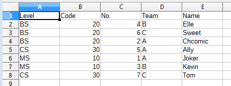
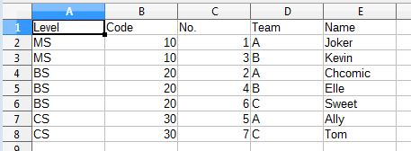
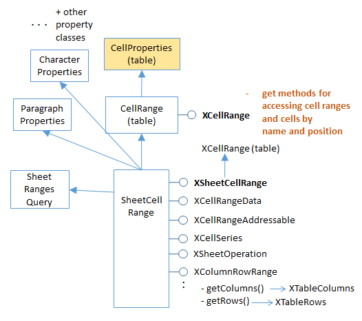
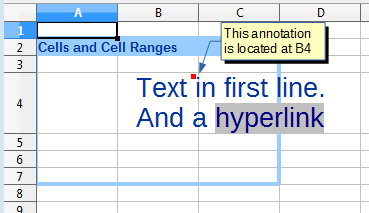

# Chapter 24. Complex Data Manipulation

!!! note "Topics"
    Sorting Data;
    Generating Data:
    Automatic, LINEAR
    Mode, DATE Mode,
    GROWTH Mode; Fancy
    Text: borders, headlines,
    hyperlinks, annotations

    Example folders: "Calc
    Tests" and "Utils"

This chapter looks at a variety of less common text
manipulation techniques, including the sorting of data,
generating data based on examples, and the use of borders,
headlines, hyperlinks, and annotations in cells.


## 1.  Sorting Data

Sorting is available through SheetCellRange's XSortable interface. There are four
basic steps required for sorting a block of cells:

1.  Obtain an XSortable interface for the cell range;
2.  Specify the sorting criteria as a TableSortField array;
3.  Create a sort descriptor;
4.  Execute the sort.

These steps are illustrated by the DataSort.java example, which begins by building a
small table:

```java
// in DataSort.java
public static void main(String args[])
{
  XComponentLoader loader = Lo.loadOffice();
  XSpreadsheetDocument doc = Calc.createDoc(loader);
  if (doc == null) {
    System.out.println("Document creation failed");
    Lo.closeOffice();
    return;
  }
  GUI.setVisible(doc, true);
  XSpreadsheet sheet = Calc.getSheet(doc, 0);

  // create a table that needs sorting
  Object[][] vals = {
    { "Level", "Code", "No.", "Team", "Name" },
    { "BS", 20, 4, "B", "Elle" },
    { "BS", 20, 6, "C", "Sweet" },
    { "BS", 20, 2, "A", "Chcomic" },
    { "CS", 30, 5, "A", "Ally" },
    { "MS", 10, 1, "A", "Joker" },
    { "MS", 10, 3, "B", "Kevin" },
    { "CS", 30, 7, "C", "Tom" } };
  Calc.setArray(sheet, "A1:E8", vals);    // or just "A1"

     : // sorting code; explained below

  Lo.saveDoc(doc, "dataSort.ods");
  Lo.waitEnter();
  Lo.closeDoc(doc);
  Lo.closeOffice();

}  // end of main()
```

The unsorted table is shown in Figure 1.




Figure 1. An Unsorted Table.


The table is sorted so that its rows are in ascending order depending on their "Code"
column values. When two rows have the same code number then the sort uses the
"No." column. Figure 2 shows the result of applying these two sorting criteria:




Figure 2. The Sorted Table, Using Two Sort Criteria.


The four sorting steps mentioned above are implemented like so:

```java
// in DataSort.java
    :
// 1. obtain an XSortable interface for the cell range
XCellRange sourceRange = Calc.getCellRange(sheet, "A1:E8");
XSortable xSort = Lo.qi(XSortable.class, sourceRange);

// 2. specify the two sorting criteria as a TableSortField array
TableSortField[] sortFields = new TableSortField[2];
sortFields[0] = makeSortAsc(1, true);     // sort by "B" col
sortFields[1] = makeSortAsc(2, true);     // then sort by "C" col

// 3. define a sort descriptor
PropertyValue[] props = Props.makeProps("SortFields", sortFields,
                                        "ContainsHeader", true);
Lo.wait(2000);
   //wait a bit so user can see original table before it's sorted

System.out.println("Sorting...");
xSort.sort(props);   // 4. do the sort
    :
```

The "A1:E8" cell range referenced using the XCellRange interface is converted to
XSortable. This interface is defined in Office's util module, not in sheet or table,
probably because it's also used in text documents for sorting tables. You can find its
documentation by calling `lodoc xsortable`.

The two sorting criteria are represented by two TableSortField objects in an array.
The makeSortAsc() function is defined in DataSort.java as:

```java
// in DataSort.java
private static TableSortField makeSortAsc(int index,
                                          boolean isAscending)
// make a TableSortField object
{ TableSortField sf = new TableSortField();
  sf.Field = index;
  sf.IsAscending = isAscending;  // ascending or descending
  sf.IsCaseSensitive = false;
  return sf;
}  // end of makeSortAsc()
```

A sort descriptor is an array of PropertyValue objects which affect how
XSortable.sort() executes. The most commonly used properties are "SortFields" and
"ContainsHeader". "SortFields" is assigned the sorting criteria (i.e. the TableSortField
array), and the "ContainsHeader" boolean specifies whether  the sort should exclude
the first row because it contains header text.

The sort descriptor properties are defined in a number of classes (SortDescriptor2,
TableSortDescriptor2, and TextSortDescriptor2), which are most easily accessed from
the XSortable documentation page.


## 2.  Generating Data

Cell data is generated by supplying numbers to a function which treats them as the
initial values in a arithmetic (or geometric) series. The function employs the series to
churn out as many more numbers as are needed to fill a given cell range.

A series is created by the XCellSeries interface, which is part of the SheetCellRange
service (see Figure 3).




Figure 3. The Cell Range Services.


Several examples of how to use XCellSeries' two methods, fillAuto() and fillSeries(),
are contained in the Filler.java example described next.

Filler.java starts by filling a blank sheet with an assortment of data, which will be
used by the XCellSeries methods to initialize several series. The original sheet is
shown in Figure 4.


Figure 4. The Filler.java Sheet before Data Generation.


The simpler of the two XCellSeries methods, XCellSeries.fillAuto(), requires a cell
range, fill direction, and how many cells should be examined as 'seeds'. For example,
rows 7, 8, and 9 of Figure 4 are filled using:

```java
// in fillSeries() in Filler.java
  :
// store two values in three rows...


// ascending integers: 1, 2
Calc.setVal(sheet, "A7", 1);
Calc.setVal(sheet, "B7", 2);

// dates, decreasing by month
Calc.setDate(sheet, "A8", 28, 2, 2015);
Calc.setDate(sheet, "B8", 28, 1, 2015);

// descending integers: 6, 4
Calc.setVal(sheet, "A9", 6);
Calc.setVal(sheet, "B9", 4);

// get cell range series
XCellSeries series = Calc.getCellSeries(sheet, "A7:G9");

// use first 2 cells for series, and fill to the right
series.fillAuto(FillDirection.TO_RIGHT, 2);
```

The supplied cell range (A7:G9) includes the seed values, and the cells to be filled.

It's converted into an XCellSeries interface by Calc.getCellSeries(), which is defined
as:

```java
// in the Calc class
public static XCellSeries getCellSeries(XSpreadsheet sheet,
                                                String rangeName)
{ XCellRange cellRange = sheet.getCellRangeByName(rangeName);
  return Lo.qi(XCellSeries.class, cellRange);
}
```

XCellSeries.fillAuto() can be supplied with four possible fill directions
(TO_BOTTOM, TO_RIGHT, TO_TOP, and TO_LEFT) which also dictate which
cells are examined for seeds. By setting the direction to be TO_RIGHT, seed cells in
the left-hand parts of the rows are examined. The numerical argument (2) in the call to
fillAuto() shown above specifies how many of those cells will be considered in order
to automatically determine the series used for the generated cell values.

Figure 5 shows the result of filling rows 7, 8, and 9.


Figure 5.  Row Filling Using XCellSeries.fillAuto().


If XCellSeries.fillAuto() doesn't guess the correct series for the data generation, then
XCellSeries.fillSeries() offers finer control over the process. It supports five modes:
SIMPLE, LINEAR , GROWTH, DATE, and AUTO.

SIMPLE switches off the series generator, and the seed data is copied unchanged to
the other blank cells. AUTO makes Office generate its data series automatically, so
performs in the same way as fillAuto(). LINEAR , GROWTH, and DATE give more
control to the programmer.


### 2.1.  Using the LINEAR Mode

Rows 2 and 3 of the spreadsheet contain the numbers 1 and 4 (see Figure 4). By using
the LINEAR mode, a step, and a stopping value, it's possible to specify an arithmetic
series. For example:

```java
// in fillSeries() in Filler.java
   :
Calc.setVal(sheet, "A2", 1);
Calc.setVal(sheet, "A3", 4);

/* Fill 2 rows; the 2nd row is not filled completely since
   the end value is reached */
series = Calc.getCellSeries(sheet, "A2:E3");
series.fillSeries(FillDirection.TO_RIGHT, FillMode.LINEAR,
                                                Calc.NO_DATE, 2, 9);
                      // ignore date mode; step == 2; end at 9
```

The Calc.NO_DATE argument means that dates are not being generated. The '2' value
is the step, and '9' is the maximum. The resulting rows 2 and 3 are shown in Figure 6.


Figure 6. Data Generation Using the LINEAR Mode.


Note that the second row is incomplete since the generated values for those cells (10
and 12) exceeded the stopping value.

If no stopping value is required, then the last argument can be replaced with
Calc.MAX_VALUE.


### 2.2.  Using the DATE Mode

If XCellSeries.fillSeries() is called using the DATE mode then it's possible to specify
whether the day, weekday, month, or year parts of the seed date are changed by the
series. For example, the seed date at the start of row 4 (20th Nov. 2015) can be
incremented one month at a time with the code:

```java
// in fillSeries() in Filler.java
   :
Calc.setDate(sheet, "A4", 20, 11, 2015);    // day, month, year

// fill by adding one month to date
series = Calc.getCellSeries(sheet, "A4:E4");
series.fillSeries(FillDirection.TO_RIGHT, FillMode.DATE,
                  FillDateMode.FILL_DATE_MONTH, 1, Calc.MAX_VALUE);
```

The result is shown in Figure 7.


Figure 7. Data Generation Using the DATE Mode.


When the month is incremented past 12, it resets to 1, and the year is incremented.


### 2.3.  Using the GROWTH Mode

Whereas the LINEAR mode is for creating arithmetic series (i.e. ones incrementing or
decrementing in steps), GROWTH mode is for geometric progressions where the
'step' value is repeatedly multiplied to the seed.

In the following example, the seed in "G6" (10; see Figure 7) is used in a geometric
progression using multiples of 2. The series is placed in cells going up the sheet
starting from "G6". The code:

```java
// in fillSeries() in Filler.java
    :
Calc.setVal(sheet, "G6", 10);

// Fill from  bottom to top with a geometric series (*2)
series = Calc.getCellSeries(sheet, "G2:G6");
series.fillSeries(FillDirection.TO_TOP, FillMode.GROWTH,
                            Calc.NO_DATE, 2, Calc.MAX_VALUE);
```

The resulting sheet is shown in Figure 8.


Figure 8. Data Generation Using the GROWTH Mode.


## 3.  Cells with Fancy Text

The CellsText.java example brings together a few techniques for manipulating text in
cells, namely the addition of borders, headlines, hyperlinks, and annotations. The
sheet ends up looking like Figure 9.




Figure 9. Text manipulation in a Sheet.


### 3.1.  Creating a Border and Headline

CellTexts.java draws a decorative border and headline by calling:

```java
// in CellTexts.java
Calc.highlightRange(sheet, "A2:C7", "Cells and Cell Ranges");
```

Calc.highlightRange() adds a light blue border around the specified cell range
(A2:C7), and the string argument is added to the top-left cell of the range. It's
intended to be a headline, so is drawn in dark blue, and the entire top row is made
light blue to match the border. The method is implemented as:

```java
// in the Calc class
// some hex values for commonly used colors
public static final int DARK_BLUE = 0x003399;
public static final int LIGHT_BLUE = 0x99CCFF;


public static void highlightRange(XSpreadsheet sheet,
                      String rangeName, String headline)
{
  Calc.addBorder(sheet, rangeName, LIGHT_BLUE);

  // color the headline row
  CellRangeAddress addr = Calc.getAddress(sheet, rangeName);
  XCellRange headerRange = getCellRange(sheet,
                       addr.StartColumn, addr.StartRow,
                       addr.EndColumn, addr.StartRow);
  Props.setProperty(headerRange, "CellBackColor", LIGHT_BLUE);

  // add headline text to the first cell of the row
  XCell firstCell = getCell(headerRange, 0, 0);
                                 // location is relative to range
  setVal(firstCell, headline);

  // make text dark blue and bold
  Props.setProperty(firstCell, "CharColor", DARK_BLUE);
  Props.setProperty(firstCell, "CharWeight",
                        com.sun.star.awt.FontWeight.BOLD);
}  // end of highlightRange()
```

The three-argument addBorder() method calls the four-argument version which was
described back in Chapter 22, section 2.3. It passes it a bitwise composition of all the
border constants:

```java
// in the Calc class
public static void addBorder(XSpreadsheet sheet,
                                   String rangeName, int color)
{ addBorder(sheet, rangeName,
                 Calc.LEFT_BORDER | Calc.RIGHT_BORDER |
                 Calc.TOP_BORDER | Calc.BOTTOM_BORDER, color);
}
```

The cell range for the top row is extracted from the larger range supplied to
Calc.highlightRange(). The easiest way of doing this is to get the address of the larger
range as a CellRangeAddress object, and use its row and column positions. The
header cell range uses the same row index for its starting and finishing rows:

```java
// part of Calc.highlightRange()
   :
CellRangeAddress addr = Calc.getAddress(sheet, rangeName);
XCellRange headerRange = getCellRange(sheet,
                 addr.StartColumn, addr.StartRow,
                 addr.EndColumn, addr.StartRow);
  // header row uses same start and end row from addr
```

Perhaps the most confusing part of Calc.highlightRange() is how the first cell of the
header range is referenced:

```java
XCell firstCell = getCell(headerRange, 0, 0);
```

This is a somewhat different use of getCell() than previous examples, which have
always found a cell within a sheet. For instance:

```java
XCell cell = Calc.getCell(sheet, 0, 0);
```

The definition for this version of getCell() is:

```java
// in the Calc class
public static XCell getCell(XCellRange cellRange,
                                    int column, int row)
{ try {
    return cellRange.getCellByPosition(column, row);
  }
  catch (Exception e) {
    System.out.println("Could not access cell in at: " +
                                     column + " - " + row);
    return null;
  }
}  // end of getCell()
```

A position in a cell range (e.g. a (column, row) coordinate)  is defined relative to the
cell range. This means that the call:
XCell firstCell = getCell(headerRange, 0, 0);
is requesting the top-left cell in headerRange. Since the headerRange covers A2:C2,
(0, 0) means the "A2" cell.


### 3.2.  Adding Hyperlink Text

Figure 9 shows that the "B4" cell contains two paragraphs. The second ends with a
hyperlink, which means that if the user control-clicks on the "hypertext" text, then the
URL "http://fivedots.coe.psu.ac.th/~ad/jlop/" is opened in the OSes default web
browser.

The SheetCell service inherits the Cell service which allows a cell to be manipulated
with the XCell or the XText interfaces (see Figure 10).


Figure 10. The SheetCell Services and Interfaces.


Once the cell is converted into XText, many of my Writer support methods can be
utilized. For example:

```java
// in CellTexts.java
     :
// Insert two text paragraphs and a hyperlink into the cell
XText xText = Lo.qi(XText.class, xCell);  // cell  text
XTextCursor cursor = xText.createTextCursor();

Write.appendPara(cursor, "Text in first line.");
Write.append(cursor, "And a ");
Write.addHyperlink(cursor, "hyperlink",
         "http://fivedots.coe.psu.ac.th/~ad/jlop/");
```

A text cursor is created for the cell, and used to add the two paragraphs and the
hyperlink.

Cell formatting is done through its properties. As Figure 10 shows, the SheetCell
service inherits the CharacterProperties and ParagraphProperties classes, which
contain the properties related to cell text:

```java
// in CellTexts.java
     :
// beautify the cell with big, blue, indented text
// properties from CharacterProperties
Props.setProperty(xCell, "CharHeight", 20.0);
Props.setProperty(xCell, "CharColor", Calc.DARK_BLUE);

// property from ParagraphProperties
Props.setProperty(xCell, "ParaLeftMargin", 500);
```

### 3.3.  Printing the Cell's Text

The cell's text is accessed via its XText interface:

```java
// in CellTexts.java
private static void printCellText(XCell xCell)
{
  XText xText = Lo.qi(XText.class, xCell);
  System.out.println("Cell Text: \"" + xText.getString() + "\"");
         : // more code, explained below
}
```

The call to XText.getString() returns all the text, which is printed as:

```
Cell Text: "Text in first line.
And a hypertext"
```

The text can also be examined by moving a text cursor through it:

```java
XTextCursor cursor = xText.createTextCursor();
```

However, I was surprised to discover that this text cursor can not be converted into a
sentence or paragraph cursor. Both the following calls return null:

```java
XSentenceCursor sentCursor = Lo.qi(XSentenceCursor.class, cursor);
XParagraphCursor paraCursor = Lo.qi(XParagraphCursor.class, cursor);
```

### 3.4.  Adding an Annotation

Cells can be annotated, which causes a little yellow text box to appear near the cell,
linked to the cell by an arrow (as in Figure 9). Creating a new annotation is a two-step
process: the XSheetAnnotationsSupplier interface is used to access the collection of
existing annotations, and a new one is added by supplying the annotation text and the
address of the cell where its arrow will point. These steps are performed by the first
half of Calc.addAnnotation():

```java
// in the Calc class
public static void addAnnotation(XSpreadsheet sheet,
                                String cellName, String msg)
{
  // get the existing annotations
  CellAddress addr = getCellAddress(sheet, cellName);
  XSheetAnnotationsSupplier annsSupp =
                     Lo.qi(XSheetAnnotationsSupplier.class, sheet);
  XSheetAnnotations anns = annsSupp.getAnnotations();

  anns.insertNew(addr, msg); // add the new annotation

  // get a reference to the new annotation
  XCell xCell = getCell(sheet, cellName);
  XSheetAnnotationAnchor annAnchor =
               Lo.qi(XSheetAnnotationAnchor.class, xCell);
  XSheetAnnotation ann = annAnchor.getAnnotation();

  ann.setIsVisible(true);  // make annotation visible
} // end of addAnnotation()
```

Annotation creation doesn't return a reference to the new annotation object. For that
it's necessary to examine the cell pointed to by the annotation. XCell is converted into
a XSheetAnnotationAnchor, which has a getAnnotation() method for returning the
annotation (if one exists).

XSheetAnnotation has several methods for obtaining information about the position,
author, and modification date of the annotation. setIsVisible() allows its visibility to
be switched on and off.