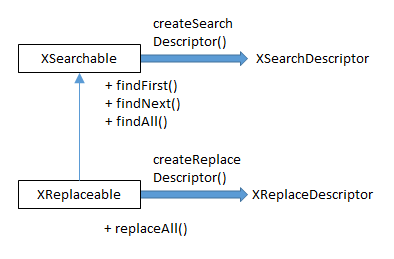
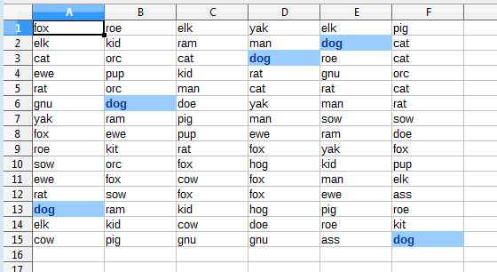
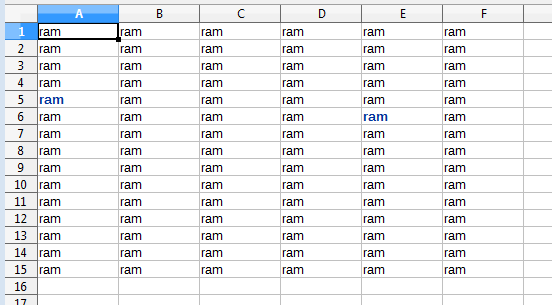

# Chapter 26. Search and Replace 

!!! note "Topics"
    XSearchable; 
    XReplaceable; 
    SearchDescriptor; 
    ReplaceDescriptor;  
    Searching Iteratively; 
    Searching For All 
    Matches; Replacing All 
    Matches     

    Example folders: "Calc 
    Tests" and "Utils" 
 
 
The increaseGarlicCost() method in GarlicSecrets.java 
(Chapter 23, section 3) illustrates how to use loops and if-
tests to search for and replace data. Another approach is to 
employ the XSearchable and XReplaceable interfaces, as 
in the ReplaceAll.java example shown below: 
 
// global array 
private static final String[] animals = 
     { "ass", "cat", "cow", "cub", "doe", "dog", "elk",  
       "ewe", "fox", "gnu", "hog", "kid", "kit", "man", 
       "orc", "pig", "pup", "ram", "rat", "roe", "sow", "yak" }; 
 
 
public static void main(String args[]) 
{ 
  // read search animal from command line 
  if (args.length != 1) { 
    System.out.println("Usage: run ReplaceAll <animal>"); 
    return; 
  } 
  XComponentLoader loader = Lo.loadOffice(); 
  XSpreadsheetDocument doc = Calc.createDoc(loader); 
  if (doc == null) { 
    System.out.println("Document creation failed"); 
    Lo.closeOffice(); 
    return; 
  } 
  GUI.setVisible(doc, true); 
  XSpreadsheet sheet = Calc.getSheet(doc, 0); 
 
 // randomly fill a grid of 6 x 15 cells with animal names 
  Random rand = new Random(); 
  for (int i=0; i < 6; i++) 
    for (int j=0; j < 15; j++) 
      Calc.setVal(sheet, i, j,  
                animals[ rand.nextInt(animals.length)] ); 
   
  // create a cell range that covers the animals grid 
  XCellRange cellRange = Calc.getCellRange(sheet, 0, 0, 5, 14); 
                           // colStart, rowStart, colEnd, rowEnd 
 
  // two ways to search for an animal 
  // searchIter(sheet, cellRange, args[0]); 
  searchAll(sheet, cellRange, args[0]); 
 
  /* replace all occurrences of the args[0] animal  
     with a randonly chosen one */ 
  replaceAll(cellRange, args[0],  
                       animals[ rand.nextInt(animals.length)] ); 
 
  Lo.saveDoc(doc, "replace.ods"); 
  Lo.waitEnter(); 
  Lo.closeDoc(doc); 
  Lo.closeOffice(); 
}  // end of main() 
 
A blank sheet is filled with a 15 x 6 grid of randomly chosen animal names, such as 
the one shown in Figure 1.  

 
 

Figure 1. A Grid Of Animals for Searching and Replacing. 

 
The SheetCellRange supports the XReplaceable interface, which is a subclass of 
XSearchable, as in Figure 2. 

 

Figure 2. The XReplaceable and XSearchable Interfaces. 

 
A cell range's XSearchable interface is accessed through casting: 
 
XCellRange cellRange = //... 

XSearchable srch = Lo.qi(XSearchable.class, cellRange); 
 
The XReplaceable interface for the range is obtained in the same way: 
XReplaceable repl = Lo.qi(XReplaceable.class, cellRange); 
XSearchable offers iterative searching using its findFirst() and findNext() methods, 
which I'll demonstrate shortly in the searchIter() method in ReplaceAll.java. 

XSearchable can also search for all matches at once with findAll(), which I employ in  
ReplaceAll.java's searchAll(). Only one of these methods is needed by the program, 
so the other is commented out in the main() function shown above. 

XReplaceable only offers replaceAll() which searches for and replaces all of its 
matches in a single call. It's utilized by ReplaceAll.java's replaceAll(). 

Before a search can begin, it's usually necessary to tweak the search properties, e.g. to 
employ regular expressions, be case sensitive, or use search similarity. Similarity 
allows a text match to be a certain number of characters different from the search text. 

These search properties are stored in the SearchDescriptor service, which is accessed 
by calling XSearchable.createSearchDescriptor(). For example: 
 
// in searchIter() in ReplaceAll.java 
   : 
XSearchable srch = Lo.qi(XSearchable.class, cellRange); 
XSearchDescriptor sd = srch.createSearchDescriptor(); 
 
sd.setPropertyValue("SearchWords", true); 
                     // only complete words will be found 
sd.setPropertyValue("SearchRegularExpression", true);  // use regexs 
 
XSearchDescriptor is the interface for the SearchDescriptor service, as shown in 

Figure 3. 

 

Figure 3. The ReplaceDescriptor and SearchDescriptor Services. 

 
Aside from being used to set search properties, XSearchDescriptor  is also where the 
search string is stored: 
sd.setSearchString("dog");   // search for "dog" 
If regular expressions have been enabled, then the search string can utilize them: 
 
sd.setSearchString("[a-z]+");    
      // search for a non-empty series of lower-case letters 
 
The regular expression syntax is standard, and documented online at 
https://help.libreoffice.org/Common/List_of_Regular_Expressions. 

 
## 1.  Searching Iteratively 

The searchIter() method in ReplaceAll.java is passed the cell range for the 15 x 6 grid 
of animals, and creates a search based on finding complete words. It uses 
XSearchable.findFirst() and XSearchable.findNext() to incrementally move through 
the grid: 
 
// in ReplaceAll.java 
private static void searchIter(XSpreadsheet sheet, 
                              XCellRange cellRange, String srchStr) 
{  
  System.out.println("Searching for \"" + srchStr + "\""); 
  try { 
    XSearchable srch = Lo.qi(XSearchable.class, cellRange); 
 
    // set up search string and properties 
    XSearchDescriptor sd = srch.createSearchDescriptor(); 
    sd.setSearchString(srchStr); 
    sd.setPropertyValue("SearchWords", true); 
                         // only complete words will be found 
 
    // search iteratively 
    XCellRange cr = Lo.qi(XCellRange.class, srch.findFirst(sd)); 
    int count = 0; 
    while (cr != null) { 
      highlightMatch(cr); 
      System.out.println("  Match " + (count+1) + ": " +   
                                         Calc.getRangeStr(cr)); 
      cr = Lo.qi(XCellRange.class, srch.findNext(cr, sd)); 
      count++; 
    } 
  } 
  catch(Exception e) 
  {  System.out.println(e);  } 
}  // end of searchIter() 
 
 
private static void highlightMatch(XCellRange cr) 
// highlight the matching of the cell range 
{  
  Props.setProperty(cr, "CharWeight",  
                         com.sun.star.awt.FontWeight.BOLD); 
  Props.setProperty(cr, "CharColor", Calc.DARK_BLUE); 
  Props.setProperty(cr, "CellBackColor", Calc.LIGHT_BLUE); 
}  // end of highlightMatch() 
 
XSearchable.findNext() requires a reference to the previous match as its first input 
argument, so it can resume the search after that match. 

The Office documentation for XSearchable.findFirst() and XSearchable.findNext() 
specify that they return an XInterface reference, which seems to be incorrect (use 
lodoc XSearchable to look for yourself). In my code, the result had to be assigned 
to an Object variable or a runtime type exception occurs.  

Another surprise was when I listed the services supported by the references returned 
by XSearchable.findFirst() and XSearchable.findNext() by calling 
Info.showServices(): 
 
Object oFirst = srch.findFirst(sd); 
Info.showServices("Find First", oFirst); 
 
As I'd expected, the main service supported by the findFirst() result is SheetCell. This 
makes sense since the search is looking for a cell containing the search string. As a 
consequence, the oFirst reference can be converted to XCell: 
    XCell cr = Lo.qi(XCell.class, srch.findFirst(sd)); 
However, checking out XSearchable.findNext() in the same way showed an 
occasional problem: 
 
Object oNext = srch.findNext(oFirst , sd); 
Info.showServices("Find Next", oNext); 
 
The reference returned by findNext() usually supports the SheetCell service, but 
sometimes represents SheetCellRange instead! When that occurs, code that attempts 
to convert oNext to XCell will return null: 
XCell cell = Lo.qi(XCell.class, srch.findNext(oFirst, sd)); 
My solution is shown in the searchIter() listing above – instead of converting the 
XSearchable.findFirst() and XSearchable.findNext() results to XCell, they're changed 
into XCellRange references, which always succeeds. 

searchIter() calls highlightMatch() on each match so the user can see the results more 
clearly, as in Figure 4. 

 
 

Figure 4. The Results of searchIter() when Looking for "dog". 

 
 
## 2.  Searching For All Matches 

The searchAll() method in ReplaceAll.java utilizes XSearchable.findAll() to return all 
the search matches at once, in the form of an indexed container. Calc.findAll() adds 
an extra conversion step, creating an array of XCellRange objects from the values in 
the container: 
 
// in the Calc class 
public static XCellRange[] findAll(XSearchable srch,  
                                   XSearchDescriptor sd) 
{ 
  XIndexAccess con = srch.findAll(sd); 
  if (con == null) { 
    System.out.println("Match result is null"); 
    return null; 
  } 
  if (con.getCount() == 0)  { 
    System.out.println("No matches found"); 
    return null; 
  } 
 
  // put container contents into an array 
  XCellRange[] crs = new XCellRange[con.getCount()]; 
  for (int i=0; i < con.getCount(); i++) { 
    try { 
      crs[i] = Lo.qi(XCellRange.class, con.getByIndex(i)); 
    } 
    catch(Exception e) 
    {  System.out.println("Could not access match index " + i);  } 
  } 
  return crs; 
}  // end of findAll() 
 
searchAll() iterates through the XCellRange array returned by Calc.findAll(), 
highlighting each match in the same way as the searchIter() function: 
 
// in ReplaceAll.java 
private static void searchAll(XSpreadsheet sheet, 
                              XCellRange cellRange, String srchStr) 
{  
  System.out.println("Searching for all of \"" + srchStr + "\""); 
  try { 
    XSearchable srch = Lo.qi(XSearchable.class, cellRange); 
 
    // set up search string and properties 
    XSearchDescriptor sd = srch.createSearchDescriptor(); 
    sd.setSearchString(srchStr); 
    sd.setPropertyValue("SearchWords", true); 
 
    XCellRange[] matchCrs = Calc.findAll(srch, sd); 
    if (matchCrs == null)  
      return; 
 
    System.out.println("Search text found " +  
                             matchCrs.length + " times"); 
    // highlight each match in the array 
    for (int i=0; i < matchCrs.length; i++) { 
      highlightMatch(matchCrs[i]); 
      System.out.println("  Index " + i + ": " +   
                                  Calc.getRangeStr(matchCrs[i])); 
    } 
  } 
  catch(Exception e) 
  {  System.out.println(e);  } 
}  // end of searchAll() 
 
 
## 3.  Replacing All Matches 

The XReplaceable interface only contains a replaceAll() method (see Figure 2), so 
there's no way to implement an iterative replace function. In addition, 
XReplaceable.replaceAll() returns a count of the number of changes, not a container 
of the matched cells like XSearchable.findAll(). This means that its not possible to 
code a replace-like version of my searchAll() method which highlights all the changed 
cells. 

The best that can be done is to execute two searches over the grid of animal names. 

The first looks only for the search string so it can highlight the matching cells. The 
second search calls XReplaceabl.replaceAll() to make the changes.  

My replaceAll() method is: 
 
// in ReplaceAll.java 
private static void replaceAll(XCellRange cellRange, 
                                String srchStr, String replStr) 
{  
  System.out.println("Replacing \"" + srchStr +  
                                "\" with \"" + replStr + "\""); 
  Lo.delay(2000);   // wait a bit before search & replace 
  try { 
    XReplaceable repl = Lo.qi(XReplaceable.class, cellRange); 
 
    // set up search and replace strings and properties 
    XReplaceDescriptor rd = repl.createReplaceDescriptor(); 
    rd.setSearchString(srchStr); 
    rd.setReplaceString(replStr); 
    rd.setPropertyValue("SearchWords", true); 
    // rd.setPropertyValue("SearchRegularExpression", true); 
 
    int count = repl.replaceAll(rd); 
    System.out.println("Search text replaced " +  
                                  count + " times\n"); 
  } 
  catch(Exception e) 
  {  System.out.println(e);  } 
}  // end of replaceAll() 
 
The coding style is similar to my searchAll() method from above. One difference is 
that XReplaceDescriptor is used to setup the search and replacement strings. 

One way of calling replaceAll() is to use regular expressions in the function: 
 
replaceAll(cellRange, "[a-z]+", 
                    animals[ rand.nextInt(animals.length)] ); 
 
The search string ("[a-z]+") will match every cell's text, and change all the animal 
names to one chosen at random. Typical output is shown in Figure 5. 

 
 

Figure 5. All Animals Become One. 

 
 
