# Chapter 28. Chart2 API Overview

!!! note "Topics"
    Charting
    Elements; Chart
    Creation: TableChart,
    ChartDocument, linking
    template, diagram, and
    data source; Modifying
    Chart Elements:
    diagram, coordinate
    system, chart type, data
    series

    Example folders:
    "Chart2 Tests" and
    "Utils"

At over 1,600 pages the OpenOffice Developer's Guide
isn't a quick read, but you might expect it to cover all the
major parts of the Office API. That's mostly true, except
for one omission – there's no mention of the `chart2`
charting module. It's absent from the guide, the online
examples, and only makes a brief appearance in the Wiki,
at https://wiki.openoffice.org/wiki/Chart.

That's not to say that chart creation isn't explained in the
guide; chapter 10 is all about that topic, but using the older
charting module, called `chart` (as you might guess). One
source of confusion is that both modules have a similar
top-level interface to Calc via XTableChart and XChartDocument, but they rapidly
diverge as you progress further into the APIs. A sure way to make code crash is to
mix services and interfaces from the two modules.

Since newer is obviously better, the question arises as to why the Developer's Guide
skips `chart2`? The reason seems to be historical – the guide was written for
OpenOffice version 3.1, which dates from the middle of 2009. The chart2 module was
released two years before, in September 2007, for version 2.3. That release came with
dire warnings in the Wiki about the API being unstable and subject to change,
comments that are still there. I'm sure those warnings were valid back in 2007, but
chart2 underwent a lot of development over the next three years before LibreOffice
was forked off in September 2010. After that the pace of change slowed, mainly
because the module was stable. For example, Calc's charting wizard is implemented
using chart2.

Since the developer's guide hasn't been updated in six years, the chart2 module hasn't
received much notice. I'll be rectifying that by concentrating solely on chart2
programming; I won't be using the old chart API.

The primary source of online information about chart2 is its API documentation at
https://api.libreoffice.org/docs/idl/ref/namespacecom_1_1sun_1_1star_1_1chart2.html,
or you can access it with `lodoc chart2`.

The only extensive programming resource I've found on chart2 is a Japanese site
(https://hermione.s41.xrea.com/pukiwiki/index.php?OOoBasic%2FCalc%2Fchart2)
which uses the OOoBasic version of the API. It's a great site, but often offline; one
partly remedy is to use Google's cached copies of some of its pages.

One problem with searching the Web for examples is that programs using the chart2
and chart modules look similar. The crucial difference for Java is that most of the
chart2 services and interfaces are inside the "com.sun.star.chart2" package whereas
the older chart services and interfaces are inside "com.sun.star.chart" (no "2").

Another way to distinguish between examples, especially for programs written in
Basic, is to look at the names of the chart services. The old chart names end with the
word "Diagram" (e.g. BarDiagram, DonutDiagram, LineDiagram) whereas the chart2
names either end with the word "ChartType" (e.g. BarChartType, PieChartType,
LineChartType), or with no special word (e.g. Bar, Donut, Line).

A good way to get a feel for chart2's functionality is to look at chapter 3 of Calc's user
guide, available from https://libreoffice.org/get-help/documentation. It
describes the charting wizard, which acts as a very nice GUI for most of the chart2
API. The chapter also introduces a lot of charting terminology (e.g. chart types, data
ranges, data series) used in the API.


## 1.  Charting Elements

Different chart types share many common elements, as illustrated in Figure 1.


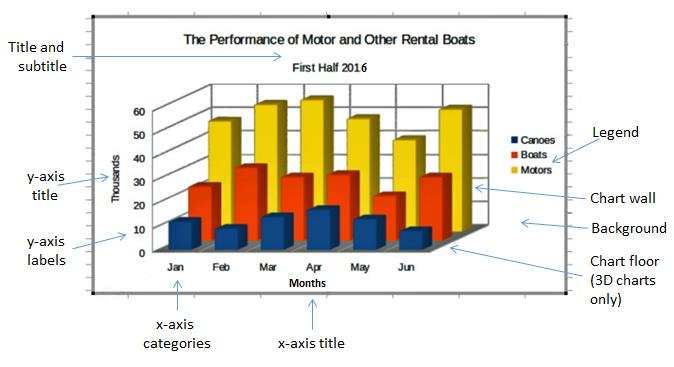

Figure 1. Typical Chart Elements.


Most of the labeled components in Figure 1 are automatically included when a chart
template is instantiated; the programmer typically only has to supply text and a few
property settings, such as the wall color and font size.

There are ten main chart types, which are listed when the "Chart Wizard" is started
via Calc's Insert, Chart menu item. Figures 2 shows the possibilities.


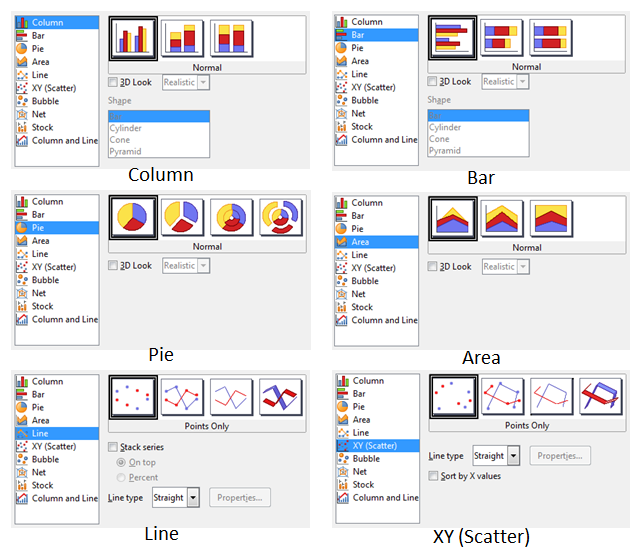

Figure 2. Ten Chart Types.


Most of the types offer variants, which are displayed as icons to the right of the dialog
window. When you position the mouse over an icon, the name of the variant appears
briefly in a tooltip, as in Figure 3.


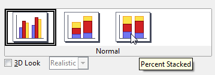

Figure 3. A Column Chart Icon with its Tooltip Name.


When the checkboxes, buttons, or combo boxes are selected in the dialog, the icons
change to reflect changes in the variants.

The three most common variants are "3D", "Stacked" and "Percent". "Stacked" is
utilized when the chart displays multiple data sequences stacked on top of each other.
"Percent" is combined with "Stacked" to stack the sequences in terms of their
percentage contribution to the total. A lengthy discussion about chart variants can be
found in chapter 3 of the Calc User Guide, in the section "Gallery of Chart Types".

In the chart2 API, the variants are accessed via template names, which are listed in
Table 1.


|Chart     |Types  |Template Names                                |
|----------|-------|----------------------------------------------|
|Column    |Stacked|Column, StackedColumn, PercentStackedColumn,  |
|          |Percent|ThreeDColumnDeep, ThreeDColumnFlat,           |
|          |3D     |StackedThreeDColumnFlat,                      |
|          |       |PercentStackedThreeDColumnFlat                |
|Bar       |Stacked|Bar, StackedBar, PercentStackedBar,           |
|          |Percent|ThreeDBarDeep, ThreeDBarFlat,                 |
|          |3D     |StackedThreeDBarFlat,                         |
|          |       |PercentStackedThreeDBarFlat                   |
|Pie       |Donut  |Pie, Donut,                                   |
|          |Explode|PieAllExploded, DonutAllExploded,             |
|          |3D     |ThreeDPie, ThreeDPieAllExploded,              |
|          |       |ThreeDDonut, ThreeDDonutAllExploded           |
|Area      |Stacked|Area, StackedArea, PercentStackedArea,        |
|          |Percent|ThreeDArea, StackedThreeDArea,                |
|          |3D     |PercentStackedThreeDArea                      |
|Line      |Symbol |Line, Symbol, LineSymbol,                     |
|          |Stacked|StackedLine, StackedSymbol, StackedLineSymbol,|
|          |Percent|PercentStackedLine, PercentStackedSymbol,     |
|          |3D     |PercentStackedLineSymbol,                     |
|          |       |ThreeDLine, ThreeDLineDeep,                   |
|          |       |StackedThreeDLine, PercentStackedThreeDLine   |
|XY        |Line   |ScatterSymbol, ScatterLine, ScatterLineSymbol,|
|(Scatter) |3D     |ThreeDScatter                                 |
|Bubble    |       |Bubble                                        |
|Net       |Line   |Net, NetLine, NetSymbol, FilledNet,           |
|          |Symbol |StackedNet, StackedNetLine,                   |
|          |Filled |StackedNetSymbol, StackedFilledNet,           |
|          |Stacked|PercentStackedNet, PercentStackedNetLine,     |
|          |       |PercentStackedNetSymbol,                      |
|          |Percent|PercentStackedFilledNet                       |
|Stock     |Open   |StockLowHighClose,                            |
|          |Volume |StockOpenLowHighClose,                        |
|          |       |StockVolumeLowHighClose,                      |
|          |       |StockVolumeOpenLowHighClose                   |
|Column    |Stacked|ColumnWithLine, StackedColumnWithLine         |
|and Line  |       |                                              |

Table 1. Chart Types and Template Names.


The templates I'll be using are highlighted in bold in Table 1.

The template names are closely related to the tooltip names in Calc's chart wizard. For
example, the tooltip name in Figure 3 corresponds to the "PercentStackedColumn"
template.

It's also possible to create a chart using a chart type name, which are listed in Table 2.


|Chart |Chart Type Names                |
|------|--------------------------------|
|Column|ColumnChartType                 |
|Bar   |BarChartType                    |
|Pie   |PieChartType                    |
|Area  |AreaChartType                   |
|Line  |LineChartType                   |
|XY    |(Scatter) ScatterChartType      |
|Bubble|BubbleChartType                 |
|Net   |NetChartType, FilledNetChartType|
|Stock |CandleStickChartType            |

Table 2. Chart Type Names.


Note that a stock chart graph is drawn using a CandleStickChartType, and that there's
no type name for a column and line chart because it's implemented as a combination
of ColumnChartType and BarChartType.

Almost all my examples will use chart templates. I'll only use chart type names when
I want to add extra data to an existing chart (e.g. add a line graph to a stock chart).

The chart2 module is quite complex, so I've hidden a lot of details inside methods in
my Chart2.java class. It simplifies four kinds of operation:

1.  The creation of a new chart in a spreadsheet document, based on a template name.
2.  The accessing and modification of elements inside a chart, such as the title,
legend, axes, and colors.
3.  The addition of extra data to a chart, such as error bars or a second graph.
4.  The embedding of a chart in a document other than a spreadsheet, namely in a text
document or slide presentation.

Operations no. 1 (chart creation) and no. 2 (element modification) are used by all my
examples, so the rest of this chapter will give an overview of how the corresponding
Chart2.java methods work.

Programming details specific to particular charts will be discussed in subsequent
chapters:

* column: chapter 29;
* bar, pie, area, line: chapter 30;
* XY (scatter): chapter 31;
* bubble, net, stock: chapter 32.


## 2.  Chart Creation

Chart creation can be divided into three steps:

1.  A TableChart service is created inside the spreadsheet.
2.  The ChartDocument service is accessed inside the TableChart.
3.  The ChartDocument is initialized by linking together a chart template, diagram,
and data source.

The details are explained in the following sub-sections.


### 2.1.  Creating a Table Chart

XTableCharts.addNewByName() adds a new TableChart to the TableCharts
collection in a spreadsheet. This is shown graphically in Figure 4, and is implemented
by Chart2.addTableChart().


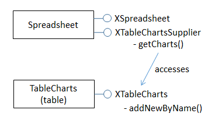

Figure 4. Creating a new TableChart Service.


Chart2.addTableChart() is defined as:

```java
// in the Chart2 class
public static void addTableChart(XSpreadsheet sheet,
               String chartName, CellRangeAddress cellsRange,
               String cellName, int width, int height)
// create table chart at cell name and size width x height
{
  XTableChartsSupplier chartsSupplier =
                   Lo.qi(XTableChartsSupplier.class, sheet);
  XTableCharts tableCharts = chartsSupplier.getCharts();

  com.sun.star.awt.Point pos = Calc.getCellPos(sheet, cellName);
  Rectangle rect = new Rectangle(pos.X, pos.Y,
                                 width*1000, height*1000);

  CellRangeAddress[] addrs = new CellRangeAddress[]{ cellsRange };
  tableCharts.addNewByName(chartName, rect, addrs, true, true);
}  // end of addTableChart()
```

The arguments passed to Chart2.addTableChart() include the new chart's name, the
cell range used as a data source, and the chart's position and dimensions when drawn
in the Calc window.

The position is a cell name (e.g. "A1"), which becomes the location of the top-left
corner of the chart in the Calc window. The name is converted into a position by
calling Calc.getCellPos(). The size of the chart is supplied as millimeter width and
height arguments and converted into a Rectangle in 1/100mm units.

My methods assume that the data range has a specific format, which is illustrated by
Figure 5.


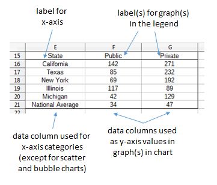

Figure 5. Cell Range Data Format.


The data is organized into columns, the first for the x-axis categories, and the others
for the y-axis data displayed as graphs. The first row of the data range contains labels
for the x-axis and the graphs.

For example, the data range in Figure 5 is drawn as a Column chart in Figure 6.


Figure 6. A Column Chart Using the Data in Figure 5.


The assumption that the first data column are x-axis categories doesn't apply to scatter
and bubble charts which use numerical x-axis values. I'll give examples of those in
later chapters.

The data format assumptions are used in the call to XTableCharts.addNewByName()
in Chart2.addTableChart() by setting its last two arguments to true. This specifies that
the top row and left column will be used as categories and/or labels. More specific
format information will be supplied later.


### 2.2.  Accessing the Chart Document

Although Chart2.addTableChart() adds a table chart to the spreadsheet, it doesn't
return a reference to the new chart document. That's obtained by calling
Chart2.getChartDoc():

```java
Chart2.addTableChart(sheet, chartName, cellsRange, cellName,
                                                width, height);
XChartDocument chartDoc = Chart2.getChartDoc(sheet, chartName);
```

Chart2.getChartDoc() accesses the spreadsheet's collection of TableCharts, searching
for the one with the given name. The matching TableChart service is treated as an
XEmbeddedObjectSupplier interface, which lets its embedded chart document be
referenced. These steps are illustrated by Figure 7.


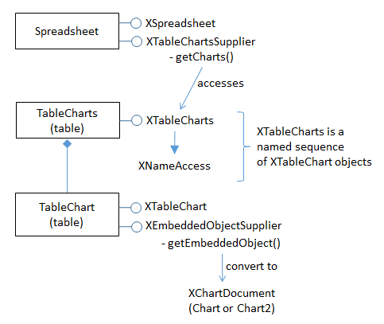

Figure 7. Accessing a Chart Document.


Chart2.getChartDoc() implements Figure 7, using Chart2.getTableChart() to access
the named table chart:

```java
// in the Chart2 class
public static XChartDocument getChartDoc(XSpreadsheet sheet,
                                         String chartName)
// return the chart doc from the sheet
{ // get the named table chart
  XTableChart tableChart = getTableChart(sheet, chartName);
  if (tableChart == null)
    return null;

  // chart doc is embedded inside table chart
  XEmbeddedObjectSupplier eos =
              Lo.qi(XEmbeddedObjectSupplier.class, tableChart);
  return Lo.qi(XChartDocument.class, eos.getEmbeddedObject());
}  // end of getChartDoc()


public static XTableChart getTableChart(XSpreadsheet sheet,
                                        String chartName)
// return the named table chart from the sheet
{ // get the supplier for the table charts
  XTableChartsSupplier chartsSupplier =
                       Lo.qi(XTableChartsSupplier.class, sheet);
  XTableCharts tableCharts = chartsSupplier.getCharts();
  XNameAccess tcAccess = Lo.qi(XNameAccess.class, tableCharts);

  // try to access the chart with the specified name
  XTableChart tableChart = null;
  try {
    tableChart = Lo.qi(XTableChart.class,
                           tcAccess.getByName(chartName));
  }
  catch(Exception ex)
  {  System.out.println("Could not access " + chartName); }
  return tableChart;
}  // end of getTableChart()
```


### 2.3.  Initializing the Chart Document

The chart document is initialized by linking three components: the chart template, the
chart's diagram, and a data source, as illustrated by Figure 8.


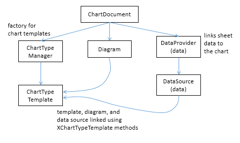

Figure 8. Initializing a Chart Document.


The initialization steps in Figure 8, and the earlier calls to Chart2.addTableChart() and
Chart2.getChartDoc() are carried out by Chart2.insertChart(). A typical call to
insertChart() would be:

```java
CellRangeAddress rangeAddr = Calc.getAddress(sheet, "E15:G21");
XChartDocument chartDoc =
      Chart2.insertChart(sheet, rangeAddr, "A22", 20,11, "Column");
```

The first line converts "E15:G21" into a data range (this corresponds to the cells
shown in Figure 5), which is passed to Chart2.insertChart(). The "A22" string and the
20x11 mm dimensions specify the position and size of the chart, and the last argument
("Column") is the desired chart template (see Table 1). The result is the column chart
shown in Figure 6.

Chart2.insertChart() is:

```java
// in the Chart2 class
// globals
private static final String CHART_NAME = "chart$$_";


public static XChartDocument insertChart(XSpreadsheet sheet,
                    CellRangeAddress cellsRange, String cellName,
                    int width, int height, String diagramName)
{
  String chartName = CHART_NAME + (int)(Math.random()*10000);
                     // generate a random name

  addTableChart(sheet, chartName, cellsRange, cellName,
                                            width, height);
  // get newly created (empty) chart
  XChartDocument chartDoc = getChartDoc(sheet, chartName);

  // assign chart template to the chart's diagram
  System.out.println("Using chart template: " + diagramName);
  XDiagram diagram = chartDoc.getFirstDiagram();
  XChartTypeTemplate ctTemplate =
               setTemplate(chartDoc, diagram, diagramName);
  if (ctTemplate == null)
    return null;

  boolean hasCats = hasCategories(diagramName);

  // initialize data source
  XDataProvider dp = chartDoc.getDataProvider();
  PropertyValue[] aProps = Props.makeProps(
        new String[] { "CellRangeRepresentation", "DataRowSource",
                       "FirstCellAsLabel" , "HasCategories" },
        new Object[] { Calc.getRangeStr(cellsRange, sheet),
                       ChartDataRowSource.COLUMNS, true, hasCats });
  XDataSource ds = dp.createDataSource(aProps);

  // add data source to chart template
  PropertyValue[] args = Props.makeProps("HasCategories", hasCats);
  ctTemplate.changeDiagramData(diagram, ds, args);

  // apply style settings to chart doc
  setBackgroundColors(chartDoc, Calc.PALE_BLUE, Calc.LIGHT_BLUE);
                                // background and wall colors

  if (hasCats)  // charts using x-axis categories
    setDataPointLabels(chartDoc, Chart2.DP_NUMBER);
                         // show y-axis values

  printChartTypes(chartDoc);
  return chartDoc;
}  // end of insertChart()
```

insertChart() creates a new chart document by calling addTableChart() and
getChartDoc(), and then proceeds to link the chart template, diagram, and data source.


#### Get the Diagram

The chart diagram is the easiest to obtain, since it's directly accessible via the
XChartDocument reference:

```java
// part of Chart2.insertChart()...
XDiagram diagram = chartDoc.getFirstDiagram();
```

#### Creating a Template

Creating a chart template is a few more steps. requiring the creation of a
XChartTypeManager interface inside Chart2.setTemplate():

```java
// in the Chart2 class
public static XChartTypeTemplate setTemplate(
              XChartDocument chartDoc,
              XDiagram diagram, String diagramName)
// set diagram to use the specified chart template
{ try {
    XChartTypeManager ctMan = chartDoc.getChartTypeManager();
    XMultiServiceFactory msf =
           Lo.qi(XMultiServiceFactory.class, ctMan);
    String templateNm = "com.sun.star.chart2.template." +
                                               diagramName;
    XChartTypeTemplate ctTemplate =
          Lo.qi(XChartTypeTemplate.class,
                      msf.createInstance(templateNm));
    if (ctTemplate == null) {
      System.out.println("Could not create chart template \"" +
                 diagramName +  "\"; using a column chart");
      ctTemplate = Lo.qi(XChartTypeTemplate.class,
                msf.createInstance(
                  "com.sun.star.chart2.template.Column"));
    }
    ctTemplate.changeDiagram(diagram);
    return ctTemplate;
  }
  catch(Exception ex) {
    System.out.println("Could not set chart to "+diagramName);
    return null;
  }
}  // end of setTemplate()
```

The diagramName value is one of the template names shown in Table 1 (e.g.
"Column"). The string "com.sun.star.chart2.template." is added to the front to create a
fully qualified service name, which is then instantiated. If the instance creation fails,
then the function falls back to creating an instance of the "Column" template.
setTemplate() ends by calling XChartTypeTemplate.changeDiagram() which links the
template to the chart's diagram.


#### Get the Data Source

Back in Chart2.insertChart(), the right-most branch of Figure 8 involves the creation
of an XDataProvider instance:

```java
// part of Chart2.insertChart()...
XDataProvider dp = chartDoc.getDataProvider();
```

This data provider converts the chart's data range into an XDataSource:

```java
// part of Chart2.insertChart()...

boolean hasCats = hasCategories(diagramName);

PropertyValue[] aProps = Props.makeProps(
      new String[] { "CellRangeRepresentation", "DataRowSource",
                     "FirstCellAsLabel" , "HasCategories" },
      new Object[] { Calc.getRangeStr(cellsRange, sheet),
                     ChartDataRowSource.COLUMNS, true, hasCats });

XDataSource ds = dp.createDataSource(aProps);
```

The properties passed to XDataProvider.createDataSource() specify more details
about the format of the data in Figure 5 – the data for each graph is organized into
columns with the first cell being the label for the graph. The "HasCategories" property
is set to true when the first column of the data is to be used as x-axis categories.

These properties passed to createDataSource() are described in the documentation for
the TabularDataProviderArguments service, which you can access using
`lodoc TabularDataProviderArguments`.

The hasCats boolean is set by examining the diagram name: if it's an XY scatter chart
or bubble chart then the first column of data will not be used as x-axis categories, so
the boolean is set to false:

```java
// in the Chart2 class
public static boolean hasCategories(String diagramName)
{
  String name = diagramName.toLowerCase();
  if (name.contains("scatter") || name.contains("bubble"))
     return false;
  return true;
}  // end of hasCategories()
```

#### Linking the template, diagram, and data source

Now the data source can populate the diagram using the specified chart template
format:

```java
// part of Chart2.insertChart()...
PropertyValue[] args = Props.makeProps("HasCategories", hasCats);
ctTemplate.changeDiagramData(diagram, ds, args);
```

At this point the chart will be drawn in the Calc application window, and
Chart2.insertChart() could return. Instead my code modifies the appearance of the
chart in two ways:

```java
// part of Chart2.insertChart()...
// apply some style settings to chart doc
setBackgroundColors(chartDoc, Calc.PALE_BLUE, Calc.LIGHT_BLUE);
                 // color the background and wall colors

if (hasCats)     // charts using x-axis categories
  setDataPointLabels(chartDoc, Chart2.DP_NUMBER);
                 // show y-axis values on the data points
```

Chart2.setBackgroundColors() changes the background and wall colors of the chart
(see Figure 6). Chart2.setDataPointLabels() switches on the displaying of the y-axis
data points as numbers which appear just above the top of each column in a column
chart. I'll describe how these methods work in the next section.

The call to Chart2.printChartTypes() at the end of Chart2.insertChart() could be
commented out since it's a diagnostic check. It prints the names of the chart types
used by the template.


## 3.  Accessing and Modifying Chart Elements

Almost every aspect of a chart can be adjusted, including such things as its color
scheme, the fonts, the scaling of the axes, the positioning of the legend, axis labels,
and titles. It's also possible to augment charts with regression line details, error bars,
and additional graphs.

These elements are located in a number of different places in the hierarchy of services
accessible through the ChartDocument service. A simplified version of this hierarchy
is shown in Figure 9.


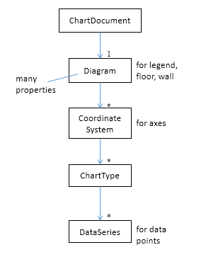

Figure 9. The Hierarchy of Services Below ChartDocument.


I'll supply more information about the Diagram, CoordinateSystem, ChartType, and
DataSeries services as this section progresses, but Figure 9 indicates that Diagram
manages the legend, floor and chart wall, CoordinateSystem is in charge of the axes,
and the data points are manipulated via DataSeries.

The "1" and "*" in the figure indicate that a diagram may utilize multiple coordinate
systems, that a single coordinate system may display multiple chart types, and a single
chart type can employ many data series. Fortunately, this generality isn't often needed
for the charts created by Chart2.insertChart(). In particular, the chart diagram only
uses a single coordinate system and a single chart type (most of the time).


### 3.1.  Accessing the Diagram

A chart's Diagram service is easily reached by calling
ChartDocument.getFirstDiagram(), which returns a reference to the diagram's
XDiagram interface:

```java
XDiagram diagram = chartDoc.getFirstDiagram();
```

XDiagram contains several useful methods (e.g. getLegend(), getWall(), getFloor()),
and its services hold many properties (e.g. "StartingAngle" used in pie charts and
"RotationVertical" for 3D charts). This is summarized by Figure 10.


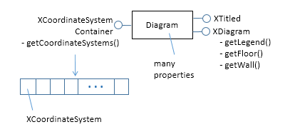

Figure 10. The Diagram Service.


The easiest way to access the documentation for Diagram and XDiagram is via loDoc:

```
> loDoc chart2 diagram

> loDoc xdiagram
```

Chart2.setBackgroundColors() changes the background and wall colors of the chart
through the ChartDocument and Diagram services:

```java
// in the Chart2 class
public static void setBackgroundColors(XChartDocument chartDoc,
                                  int bgColor, int wallColor)
{ if (bgColor > 0) {
    XPropertySet bgProps = chartDoc.getPageBackground();
    // Props.showProps("Background", bgProps);
    Props.setProperty(bgProps, "FillBackground", true);
    Props.setProperty(bgProps, "FillStyle", FillStyle.SOLID);
    Props.setProperty(bgProps, "FillColor", bgColor);
  }

  if (wallColor > 0) {
    XDiagram diagram = chartDoc.getFirstDiagram();
    XPropertySet wallProps = diagram.getWall();
    // Props.showProps("Wall", wallProps);
    Props.setProperty(wallProps, "FillBackground", true);
    Props.setProperty(wallProps, "FillStyle", FillStyle.SOLID);
    Props.setProperty(wallProps, "FillColor", wallColor);
  }
}  // end of setBackgroundColors()
```

The chart background is manipulated with a property set accessible through
XChartDocument.getPageBackground(), while the wall is reached with
XDiagram.getWall().

The documentation for the getPageBackground() and getWall() methods doesn't list
the contents of their property sets, so the easiest way of finding out what's available is
by calling Props.showProps(). Two showProps() calls are commented out in the code
above.

Most chart services inherit a mix of four property classes:

* com.sun.star.style.CharacterProperties
* com.sun.star.style.ParagraphProperties
* com.sun.star.drawing.LineProperties
* com.sun.star.drawing.FillProperties

Since getWall() and getPageBackground() both deal with areas in the chart, their
properties come from the FillProperties class.


### 3.2.  Accessing the Coordinate System

Figure 10 shows that the diagram's coordinate systems are reached through
XCoordinateSystemContainer.getCoordinateSystems(). Chart2.getCoordSystem()
assumes that the programmer only wants the first coordinate system:

```java
// in the Chart2 class
public static XCoordinateSystem getCoordSystem(
                                XChartDocument chartDoc)
{ XDiagram diagram = chartDoc.getFirstDiagram();
  XCoordinateSystemContainer coordSysCon =
             Lo.qi(XCoordinateSystemContainer.class, diagram);
  XCoordinateSystem[] coordSys =
                       coordSysCon.getCoordinateSystems();
  if (coordSys.length > 1)
    System.out.println("No of coord systems: " + coordSys.length +
                                       "; using first");
  return coordSys[0];  // return first
}  // end of getCoordSystem()
```

The CoordinateSystem service is employed to access the chart's axes and its chart
type (or types), as in Figure 11.


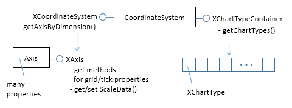

Figure 11. The CoordinateSystem Service.


I'll describe the Axis service when I look at methods for adjusting axis properties. It
contains a lot of properties, which are documented online. The easiest way to access
the page is with `loDoc chart2 axis service`. The extra lodoc arguments help to
narrow the search since the word "axis" is used in multiple places in the chart2 and
chart modules.


### 3.3.  Accessing the Chart Type

Figure 11 shows that the chart types in a coordinate system are reached through
XChartTypeContainer.getChartTypes(). Chart2.getChartType() assumes the
programmer only wants the first chart type in the array:

```java
// in the Chart2 class
public static XChartType getChartType(XChartDocument chartDoc)
{
  XChartType[] chartTypes = getChartTypes(chartDoc);
  return chartTypes[0];  // get first
}


public static XChartType[] getChartTypes(XChartDocument chartDoc)
{
  XCoordinateSystem coordSys = getCoordSystem(chartDoc);
  XChartTypeContainer ctCon =
      Lo.qi(XChartTypeContainer.class, coordSys);
  return ctCon.getChartTypes();
}  // end of getChartTypes()
```

Figure 12 shows the main components of the ChartType service.


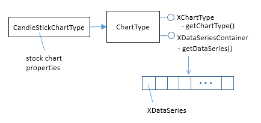

Figure 12. The ChartType Service.


Somewhat surprisingly, the ChartType service isn't the home for chart type related
properties; instead XChartType contains methods for examining chart type "roles",
which I'll describe later. One useful features of XChartType is getChartType() which
returns the type as a string.

The CandleStickChartType service inherits ChartType, and contains properties related
to stock charts.

Use `loDoc chart2 charttype` to view the online documentation for ChartType.


### 3.4.  Accessing the Data Series

Figure 12 shows that the data series for  a chart type is accessed via
XDataSeriesContainer.getDataSeries(). This is implemented by
Chart2.getDataSeries():

```java
// in the Chart2 class
public static XDataSeries[] getDataSeries(XChartDocument chartDoc)
{
  XChartType xChartType = getChartType(chartDoc);
  XDataSeriesContainer dsCon =
                   Lo.qi(XDataSeriesContainer.class, xChartType);
  return dsCon.getDataSeries();
}  //end of getDataSeries()
```

The DataSeries service is one of the more complex parts of the Chart2 module
because of its support for several important interfaces. I won't explain all of them just
yet; Figure 13 focuses on the XDataSeries interface.


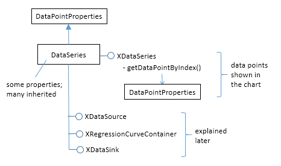

Figure 13. The DataSeries Service and XDataSeries Interface.


A DataSeries represents a series of data points in the chart. Changes to the look of
these data points (e.g. adding numbers next to the points, or changing their shape and
color) can be done in two ways. A data series as a whole maintains a set of properties,
most of which are inherited from the DataPointProperties class. Typical
DataPointProperies values are "Color", "Shape", "LineWidth". The online
documentation can be accessed by calling `lodoc DataPointProperties`.

It's also possible to adjust point properties on an individual basis by accessing a
particular data point by calling XDataSeries.getDataPointByIndex(). As the method
name suggests, this requires an index value for the point, which can be a little tricky
to determine.

I can now explain the second of the two chart changing methods called at the end of
Chart2.insertChart(): Chart2.setDataPointLabels(), which switches on the displaying
of the y-axis data points as numbers. The call is:

```java
// part of Chart2.insertChart()...
setDataPointLabels(chartDoc, Chart2.DP_NUMBER);
```

Chart2.setDataPointLabels() uses Chart2.getDataSeries() described above, which
returns an array of all the data series used in the chart. setDataPointLabels() iterates
through the array and manipulates the "Label" property for each series. In other
words, it modifies each data series property without accessing each point. The code
for Chart2.setDataPointLabels():

```java
// in the Chart2 class
// data point label types
public static final int DP_NUMBER = 0;
public static final int DP_PERCENT = 1;
public static final int DP_CATEGORY = 2;
public static final int DP_SYMBOL = 3;
public static final int DP_NONE = 4;


public static void setDataPointLabels(XChartDocument chartDoc,
                                            int labelType)
// change label type for all data series
{
  XDataSeries[] dataSeriesArr = getDataSeries(chartDoc);
  for (XDataSeries dataSeries : dataSeriesArr) {
    // visit every data series
    DataPointLabel dpLabel =
         (DataPointLabel) Props.getProperty(dataSeries, "Label");
    dpLabel.ShowNumber = false;        // reset show types
    dpLabel.ShowCategoryName = false;
    dpLabel.ShowLegendSymbol = false;

    if (labelType == DP_NUMBER)
      dpLabel.ShowNumber = true;
    else if (labelType == DP_PERCENT) {
      dpLabel.ShowNumber = true;
      dpLabel.ShowNumberInPercent = true;
    }
    else if (labelType == DP_CATEGORY)
      dpLabel.ShowCategoryName = true;
    else if (labelType == DP_SYMBOL)
      dpLabel.ShowLegendSymbol = true;
    else if (labelType == DP_NONE) {}  // do nothing
    else
      System.out.println("Unrecognized label type");
    Props.setProperty(dataSeries, "Label", dataPointLabel);
  }
}  // end of setDataPointLabels()
```

The "Label" DataSeries property is inherited from DataPointProperties (see
`lodoc DataPointProperties`). "Label" is of type DataPointLabel which maintains four
'show' booleans for displaying the number and other kinds of information next to the
data point. Depending on the labelType value passed to Chart2.setDataPointLabels(),
one or more of these booleans are set and the "Label" property updated.