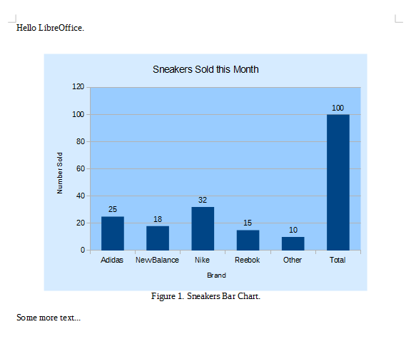
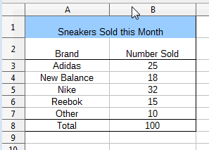

# Chapter 33. Using Charts in Other Documents

!!! note "Topics"
    Copy-and-Paste
    Dispatches; Adding a
    Chart to a Text
    Document; Adding a
    Chart to a Slide
    Document; Saving the
    Chart as an Image

    Example folders:
    "Chart2 Tests" and
    "Utils"


This chapter describes two examples, TextChart.java and
SlideChart.java, which illustrate a copy-and-paste
approach to adding charts to text and slide documents.

SlideChart.java also shows how to save a chart as an
image file.

There are three tricky aspects to coding with the clipboard.

1.  Clipboard manipulation requires the use of UNO dispatch commands (namely
".uno:Copy" and ".uno:Paste"). The function that sends out a dispatch command
returns immediately, but Office may take a few milliseconds to process the request.
This often introduces a timing issue because the next step in the program should be
delayed in order to give the dispatch time to be processed.
2.  Another timing problem is that dispatch commands assume that the Office
application window is visible and active. Office can be made the focus of the OS, but
the few milliseconds between achieving this and sending the dispatch may be enough
for another OS process to pull the focus away from Office. The dispatch will then
arrive at the wrong process, with unpredictable results.
3.  Clipboard programming usually involves two documents. In this case, the
spreadsheet that generates the chart, and the text or slide document that receives the
image. One of the limitations of my support classes is that many methods assume only
one document is open at a time. To be safe, the program should close the spreadsheet
before the text or slide document is opened or created.

Bearing all these issues in mind, is there a better approach for placing a chart in a non-
spreadsheet document? The answer should be OLE (Object Linking and Embedding),
which is Windows' solution to this very problem. Unfortunately, I was unable to get
this mechanism to work via the API; the best I achieved was the creation of an empty
chart in a text document, without any data. Looking back through old forum posts, it
appears that OLE didn't work in the old chart module either.

I'll look again at clipboard programming in Chapter 43, when I consider using Java's
copy-and-paste API, and describe more general examples using Writer, Calc, Impress,
and Base documents.


## 1.  Adding a Chart to a Text Document

TextChart.java generates a column chart using the "Sneakers Sold this Month" table
from chartsData.ods, copies it to the clipboard, and closes the spreadsheet. Then a text
document is created, and the chart image is pasted into it, resulting in the page shown
in Figure 1.




Figure 1. Text Document with a Chart Image.


TextChart.java relies on my Write support class from Part 2. The "Hello LibreOffice."
paragraph is written into a new document, then the chart is pasted in from the
clipboard, a paragraph ("Figure 1. Sneakers Bar Chart") added as a figure legend, and
another paragraph ("Some more text…") added at the end for good measure. The
document is saved to "hello.odt" and the program ends.

main() is:

```java
// in TextChart.java
public static void main(String[] args)
{
  XComponentLoader loader = Lo.loadOffice();
  boolean hasChart = makeColChart(loader, "chartsData.ods");

  XTextDocument doc = Write.createDoc(loader);
  if (doc == null) {
    System.out.println("Writer doc creation failed");
    Lo.closeOffice();
    return;
  }
  GUI.setVisible(doc, true);  // to make the doc visible

  XTextCursor cursor = Write.getCursor(doc);
  cursor.gotoEnd(false);
                // make sure at end of doc before appending
  Write.appendPara(cursor, "Hello LibreOffice.\n");

  if (hasChart) {
    Lo.delay(1000);
    Lo.dispatchCmd("Paste");
  }

  // add chart legend
  Write.appendPara(cursor, "Figure 1. Sneakers Column Chart.\n");
  Write.stylePrevParagraph(cursor, "ParaAdjust",
                       com.sun.star.style.ParagraphAdjust.CENTER);

  Write.appendPara(cursor, "Some more text...\n");
  Lo.saveDoc(doc, "hello.odt");

  Lo.waitEnter();
  Lo.closeDoc(doc);
  Lo.closeOffice();
} // end of main()
```

It's important that the text document is visible and in focus, so GUI.setVisible() is
called after the document's creation. There's also a call to Lo.delay() before the paste
(`Lo.dispatchCmd("Paste")`) to ensure that earlier text writes have time to finish.


### 1.1.  Making the Chart

TextChart.java uses makeColChart() to generate a chart from a spreadsheet:

```java
// in TextChart.java
private static boolean makeColChart(XComponentLoader loader,
                                    String fnm)
// draw a column chart; uses "Sneakers Sold this Month" table
// this method appears in TextChart.java and SlideChart.java
{
  XSpreadsheetDocument ssdoc = Calc.openDoc(fnm, loader);
  if (ssdoc == null) {
    System.out.println("Could not open " + fnm);
    return false;
  }
  GUI.setVisible(ssdoc, true);  // or selection not copied
  XSpreadsheet sheet = Calc.getSheet(ssdoc, 0);
  CellRangeAddress rangeAddr = Calc.getAddress(sheet, "A2:B8");
  XChartDocument chartDoc =
        Chart2.insertChart(sheet, rangeAddr, "C3",15,11,"Column");

  Chart2.setTitle(chartDoc, Calc.getString(sheet, "A1"));
  Chart2.setXAxisTitle(chartDoc, Calc.getString(sheet, "A2"));
  Chart2.setYAxisTitle(chartDoc, Calc.getString(sheet, "B2"));
  Chart2.rotateYAxisTitle(chartDoc, 90);

  Lo.delay(1000);
  Chart2.copyChart(ssdoc, sheet);
  Lo.closeDoc(ssdoc);
  return true;
}  // end of makeColChart()
```

makeColChart() uses the table from chartsData.ods shown in Figure 2 to generate the
chart in Figure 1.




Figure 2. The "Sneakers Sold this Month" Table.


The only new feature in makeColChart() is the call to Chart2.copyChart() which
copies the chart to the clipboard.

Two easy to overlook parts of makeColChart() are the call to GUI.setVisible(), which
makes the spreadsheet and chart visible and active, and the call to Lo.delay() before
Chart2.copyChart(). This ensures that there's enough time for the graph to be drawn
before the ".uno:Copy" dispatch.

Also note that the spreadsheet is closed before makeColChart() returns. This stops the
subsequent creation of the text document back in main() from being possibly affected
by an open spreadsheet

### 1.2.  Copying a Chart

Chart2.copyChart() obtains a reference to the chart as an XShape, which makes it
possible to select it with an XSelectionSupplier. This selection is used automatically
as the data for  the ".uno:Copy" dispatch. copyChart() is:

```java
// in the Chart2 class
public static void copyChart(XSpreadsheetDocument ssdoc,
                                       XSpreadsheet sheet)
{ XShape chartShape = getChartShape(sheet);
  XComponent doc = Lo.qi(XComponent.class, ssdoc);
  XSelectionSupplier supplier = GUI.getSelectionSupplier(doc);
  supplier.select((Object)chartShape);
  Lo.dispatchCmd("Copy");
}  // end of copyChart()
```

Every spreadsheet is also a draw page, so the Spreadsheet service has an
XDrawPageSupplier interface, and its getDrawPage() method returns an XDrawPage
reference. For example:

```java
// part of Chart2.getChartShape(); see below...
XDrawPageSupplier pageSupplier =
                         Lo.qi(XDrawPageSupplier.class, sheet);
XDrawPage drawPage = pageSupplier.getDrawPage();
```

The shapes in a draw page can be accessed by index. Also each shape has a "CLSID"
property which can be used to identify 'special' shapes representing math formulae or
charts. The search for a chart shape is coded as:

```java
// part of Chart2.getChartShape(); see below...
XShape shape = null;
String classID;
int numShapes = drawPage.getCount();
for (int i=0; i < numShapes; i++) {  // loop through shapes
  try {
    shape = Lo.qi(XShape.class, drawPage.getByIndex(i));
    classID = (String) Props.getProperty(shape, "CLSID");
    if (classID.toLowerCase().equals(Lo.CHART_CLSID))
      // check if shape's class ID is for a chart
      break;
  }
  catch(Exception e) {}
}
```

These two pieces of code are combined in Chart2.getChartShape():

```java
// in the Chart2 class
public static XShape getChartShape(XSpreadsheet sheet)
{
  XDrawPageSupplier pageSupplier =
                        Lo.qi(XDrawPageSupplier.class, sheet);
  XDrawPage drawPage = pageSupplier.getDrawPage();
  XShape shape = null;
  String classID;
  int numShapes = drawPage.getCount();
  for (int i=0; i < numShapes; i++) {
    try {
      shape = Lo.qi(XShape.class, drawPage.getByIndex(i));
      classID = (String) Props.getProperty(shape, "CLSID");
      if (classID.toLowerCase().equals(Lo.CHART_CLSID))
        break;
    }
    catch(Exception e) {}
  }
  return shape;
}  // end of getChartShape()
```


## 2.  Adding a Chart to a Slide Document

SlideChart.java generates the same column chart as TableChart.java, using almost the
same version of makeColChart(). After the chart has been copied to the clipboard and
the spreadsheet closed, a slide document is created and the chart pasted onto the first
slide. The chart appears in the center of the slide by default, but is moved down to
make room for some text. The end result is shown in Figure 3.


Figure 3. Slide Document with a Chart Shape.


The main() function of SlideChart.java is:

```java
// in SlideChart.java
public static void main (String args[])
{
  XComponentLoader loader = Lo.loadOffice();

  boolean hasChart = makeColChart(loader, "chartsData.ods");

  XComponent doc = Draw.createImpressDoc(loader);
  if (doc == null) {
    System.out.println("Draw doc creation failed");
    Lo.closeOffice();
    return;
  }
  GUI.setVisible(doc, true);

  XDrawPage currSlide = Draw.getSlide(doc, 0);
  XText body = Draw.bulletsSlide(currSlide,
                          "Sneakers Are Selling!");
  Draw.addBullet(body, 0, "Sneaker profits have increased");

  if (hasChart) {
    Lo.delay(1000);
    Lo.dispatchCmd("Paste");
  }

  // find and move picture
  XShape oleShape =
         Draw.findShapeByType(currSlide,
                       "com.sun.star.drawing.OLE2Shape");
  if (oleShape != null) {
    Size slideSize = Draw.getSlideSize(currSlide);
    Size shapeSize = Draw.getSize(oleShape);
    Point shapePos = Draw.getPosition(oleShape);
    int y = slideSize.Height - shapeSize.Height - 20;
    Draw.setPosition(oleShape, shapePos.X, y);    // move pic down
  }

  Lo.saveDoc(doc, "makeslide.odp");
  Lo.waitEnter();
  Lo.closeDoc(doc);
  Lo.closeOffice();
} // end of main()
```

The chart is pasted into the slide as an OLE2Shape object, which allows it to be found
by Draw.findShapeByType(). The shape is moved down the slide by calculating a
new (x, y) coordinate for its top-left corner, and calling Draw.setPosition().


## 3.  Saving the Chart as an Image

The only change to makeColChart() in SlideChart.java is the addition of the line:

```java
// in makeColChart() in SlideChart.java
Images.saveImage( Chart2.getChartImage(sheet), "chartImage.png");
```

This saves the chart as a PNG image, which can be loaded by other applications.

Images.saveImage() accepts a BufferedImage argument and filename:

```java
// in Images class
public static void saveImage(BufferedImage im, String fnm)
{
  try {
    System.out.println("Saving image to " + fnm);
    ImageIO.write(im, "png", new File(fnm));
  }
  catch (java.io.IOException e) {
    System.out.println("Could not save image to " + fnm +": "+ e);
  }
}  // end of saveImage()
```

Chart2.getChartImage() finds the chart in the spreadsheet and returns it as a
BufferedImage object.

```java
// in the Chart2 class
public static BufferedImage getChartImage(XSpreadsheet sheet)
{
  XShape chartShape = Chart2.getChartShape(sheet);
  if (chartShape == null) {
    System.out.println("Could not find a chart");
    return null;
  }
  XGraphic graphic = Lo.qi( XGraphic.class,
                   Props.getProperty(chartShape, "Graphic") );
  if (graphic == null) {
    System.out.println("No chart graphic found");
    return null;
  }

  String tempFnm = FileIO.createTempFile("png");
  if (tempFnm == null) {
    System.out.println("Could not create a temp file for graphic");
    return null;
  }

  Images.saveGraphic(graphic, tempFnm, "png");
  BufferedImage im = Images.loadImage(tempFnm);
  FileIO.deleteFile(tempFnm);
  return im;
}  // end of getChartImage()
```

Chart2.getChartImage() finds the chart in the sheet by using Chart2.getChartShape()
described earlier. The shape is cast to an Office graphics object, of type XGraphic.

getChartImage() then creates a temporary file to store the XGraphic image, which is
immediately re-loaded as a BufferedImage. This is a bit nasty, but the only way I've
found to convert XGraphic to BufferedImage.