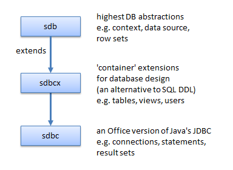
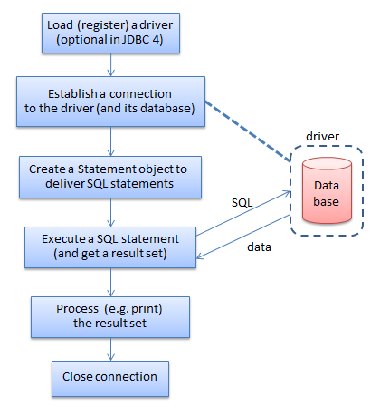
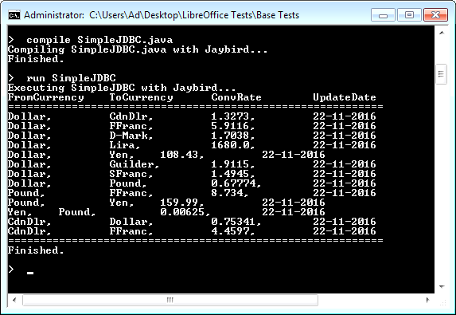
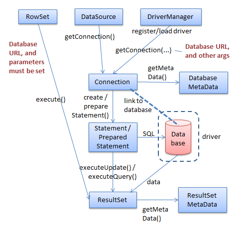
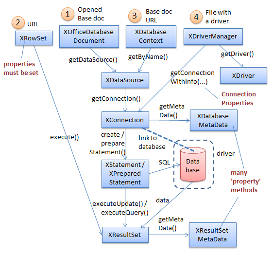

# Chapter 34. From JDBC to the Base API

!!! note "Topics"
    Three Database
    Modules: sdbc, sdbcx,
    sdb; A Little JDBC;
    From JDBC to sdbc

    Example folders: "Base
    Tests" and "Utils"


Base offers a graphical interface for the building and
manipulation of relational databases, including tools for
the creation of forms and reports based on the tabular data.
These features are explained at length in the Base
Handbook, available at https://www.libreoffice.org/get-help/documentation/.

Base can access many types of SQL databases, including Microsoft Access, MySQL,
Oracle, and PostgreSQL, and is able to create its own HSQLDB databases embedded
inside Office ODB documents.

HSQLDB (also known as HyperSQL) is coded in Java (http://hsqldb.org/), a
dependency that caused the LibreOffice development team to look for a replacement
database engine in 2013. They decided on Firebird (http://www.firebirdsql.org/)
which was coded in C until version 2.5, then moved to C++. A detailed rationale for
the change is available as a series of links at http://en.libreofficeforum.org/node/6062.

Currently (in LibreOffice 5.3), the default embedded database for ODB documents is
still HSQLDB, with Firebird available as an 'experimental feature', turned on via
Office's Tools, Options, Advanced menu dialog. This adds a "Firebird
Embedded" option so either kind of database can be created by Base. The Firebird
feature is labeled as 'unsafe', but seems perfectly reliable on Windows, although some
HSQLDB functionality isn't available yet in embedded Firebird databases. This Part
contains examples using both HSQLDB and Firebird.

Base's API is explained in chapter 12 of the Developer's Guide  available at
https://wiki.openoffice.org/w/images/d/d9/DevelopersGuide_OOo3.1.0.pdf.
Alternatively, you can read the chapter online, starting at
https://wiki.openoffice.org/wiki/Documentation/DevGuide/Database/Database_Acces
s (use `loGuide "Database Access"`). The guide's database examples are at
http://api.libreoffice.org/examples/DevelopersGuide/examples.html#Database.


## 1.  Three Database Modules

The API is spread across three modules: sdbc, sdbcx, and sdb, whose structure is
summarized in Figure 1.




Figure 1. The Database Modules in LibreOffice.


Office's core database functionality is in the sdbc module, which can be thought of as
an Office version of Java's JDBC (Java Database Connectivity) API. This means that
JDBC classes such as Connection, Statement, and ResultSet appear in the sdbc
module, but are generally split in two to become Office service and interface classes.
For example, sdbc contains services called Connection, Statement, and ResultSet, and
interfaces called XConnection, XStatement, and XResultSet.

The sdbcx module holds classes related to the schema (metadata) associated with
databases, catalogs, tables, views, groups, users, columns, indexes, and keys. Much of
this kind of data can also be manipulated at the SQL level, via DDL (Data Definition
Language) statements such as CREATE and ALTER, or via the MetaDatabase classes
borrowed from JDBC in the sdbc module.

The sdb module offers higher-level abstractions, allowing the manipulation of other
kinds of tabular data aside from databases. It makes it easy to manipulate databases
embedded inside ODB documents, and also supports features such as row sets,
persistent queries, and database authentication.

One drawback of this hierarchy is the appearance of same-named services across
modules. For instance, there are three ResultSet services, one each in the sdbc, sdbcx,
and sdb modules. Fortunately, the interactive inheritance diagrams used in the
LibreOffice documentation (e.g. at
http://api.libreoffice.org/docs/idl/ref/servicecom_1_1sun_1_1star_1_1sdbc_1_1Result
Set.html) makes it quite easy to jump between the services (e.g. see
`lodoc ResultSet`).


## 2.  A Little JDBC

The easiest way to understand the sdbc module is to have a reasonable knowledge of
Java's JDBC, which is simpler and contains similar functionality. This short section
on JDBC is only meant to be a refresher; if you haven’t encountered the API before,
you should refer to longer explanations found in beginner/intermediate Java texts.

Three that I like are:

* Introduction to Java Programming, Comprehensive Version
Y. Daniel Liang, Pearson, 2014, 10th Edition
http://www.cs.armstrong.edu/liang/
(Chapters 32 and 35 relate to JDBC; chapter 35 is online, behind a
login/password. However the material was printed in earlier versions, up to the 6th
edition in 2007.)
* Java How To Program (Early Objects)
Paul Deitel, Harvey Deitel, Pearson, 2014, 10th Edition
http://www.deitel.com/Books/Java/JavaHowtoProgram10eEarlyObjects/tabid/3656/Default.aspx
(Chapter 24 is about JDBC)
* Core Java, Volume II – Advanced Features
Cay S. Horstmann, Gary Cornell, Prentice Hall, 2016, 10th Edition
http://www.informit.com/store/core-java-volume-ii-advanced-features-9780137081608
(Chapter 4 is about JDBC. It covers more topics than the Liang and Deitel
chapters.)

All these chapters introduce SQL, but it's worthwhile studying it separately since it
utilizes a very different programming model from Java, based on relational algebra
and tuples. One book I've used recently is:

* Sams Teach Yourself SQL in 10 Minutes
Ben Forta,  Sams, 2012, 4th edition
http://forta.com/books/0672336073/

I'll be using a small subset of SQL: CREATE TABLE and INSERT to build tables,
and simple SELECT statements to query them.


### 2.1.  Using JDBC

Figure 2 shows the main stages in how JDBC is used to access a database.




Figure 2. Using JDBC.


The first step involves loading the database driver, which registers it with JDBC's
DriveManager. JDBC 4 introduced the ability to automatic detect and load a driver if
its JAR file includes configuration information. This capability isn't part of sdbc
though, perhaps because Base was developed in 2003-2005, and JDBC 4 was released
at the end of 2006.

Class.forName() is used to load the driver, as in:

```java
Class.forName("org.firebirdsql.jdbc.FBDriver");
```

A communications link through the driver to a database is represented by a
Connection object, which is created by calling DriverManager.getConnection() with a
the database's URL. For instance:

```java
Connection conn = DriverManager.getConnection(
                     "jdbc:firebirdsql:embedded:crossrate.fdb");
```

The URL's format varies from one driver to the next, but always starts with "jdbc:"
followed by the driver protocol name. The address may include a machine hostname
and port number if the database is located across the network. The example above
specifies the crossrate.fdb Firebird database in the same directory as the Java
program. If a database requires a login and password, they can be included as extra
arguments in the getConnection() call.

A SQL statement is sent across the link via a Statement object, which is created by
Connection.createStatement():

```java
Statement statement = conn.createStatement();
```

The SQL statement is written as a string, and sent to the database using one of
Statement's execute methods. For example:

```java
ResultSet rs = statement.executeQuery("SELECT * FROM Crossrate");
```

The results are returned as a ResultSet object, which can be thought of as a table of
answers with a cursor pointing to a particular row in that table. The cursor is initially
assigned to just before the first row, and can be moved down a row with
ResultSet.next(). Typical code for iterating through all the rows  is:

```java
while (rs.next()) {
   // look at a row of the result set
}
```

A particular cell on a row is accessed using the table's corresponding column name, or
the column index (which starts at 1). For example:

```java
while(rs.next())
  System.out.println( rs.getString("FromCurrency"));
```

This loop prints all the data in the "FromCurrency" column of the result set.

The ResultSet class offers a large collection of getXXX() methods that return SQL
data as Java types.


### 2.2.  A Simple JDBC Program

All the preceding code snippets come together in SimpleJDBC.java:

```java
// SimpleJDBC.java
public static void main(String[] args)
{
  try {
    Class.forName("org.firebirdsql.jdbc.FBDriver");
                            // requires Jaybird and Firebird

    // connect to the database
    Connection conn = DriverManager.getConnection(
               "jdbc:firebirdsql:embedded:crossrate.fdb",
               "sysdba", "masterkeys");  // login, password

    Statement statement = conn.createStatement();

    // Execute a SQL query
    ResultSet rs = statement.executeQuery(
                               "SELECT * FROM Crossrate");

    // Print the result set
    SimpleDateFormat sdf = new SimpleDateFormat("dd-MM-yyyy");
    System.out.println("FromCurrency \tToCurrency \t
                                         ConvRate \tUpdateDate");
    System.out.println("=============================");

    while(rs.next())
      System.out.println( rs.getString("FromCurrency") + ",   \t" +
                          rs.getString("ToCurrency") + ",   \t" +
                          rs.getFloat("ConvRate") + ",   \t" +
                     sdf.format( rs.getTimestamp("UpdateDate")) );
                        // 4th column returns java.sql.Timestamp

    System.out.println("=============================");

    // Close down (should really be in a finally block)
    rs.close();
    statement.close();
    conn.close();
  }
  catch (ClassNotFoundException e)   // for Class.forName()
  {  System.out.println("Failed to load driver: \n  " + e); }
  catch (SQLException e)
  {  for (Throwable t : e)
       System.out.println(t); // to handle a 'chain' of SQLExceptions
  }
} // end of main()
```

Figure 3 shows the command window output of this program.




Figure 3. Compiling and Running SimpleJDBC.java.


One of the harder parts of using JDBC is including the driver in the compilation and
execution steps for a program. I've done it by writing two Windows batch scripts,
called compile.bat and run.bat, which can be seen in action in Figure 3. These scripts
hide the arguments of the javac.exe and java.exe commands which tell Java where to
look for the driver's JAR. compile.bat is:

```java
javac -cp "D:\jaybird\jaybird-full-2.2.5.jar;." %*
```

run.bat is:

```java
java -cp "D:\jaybird\jaybird-full-2.2.5.jar;."
     -Djava.library.path="D:\jaybird" %*
```

Jaybird is the JDBC driver for Firebird (available from
http://www.firebirdsql.org/en/jdbc-driver/).

The java.library.path argument in the call to java.exe locates the directory holding
Jaybird's DLL.

Fortunately, this driver location issue won't concern us when using sdbc, since the
Office API already includes the necessary drivers.


### 2.3.  A More Detailed Execution Diagram

Now that I've introduced the classes and methods used in a simple JDBC program, its
possible to draw a more technical version of Figure 2, as Figure 4.




Figure 4. The Classes and Methods used in Typical JDBC Programs.


Figure 4's blue boxes represent JDBC classes, and the arrows are labeled with the
methods used to create objects. SimpleJDBC.java uses the DriveManager,
Connection, Statement, and ResultSet classes shown in the figure, but there are a few
other useful ones.

DataSource allows the low-level details used to address a database in
DriveManager.getConection() to be hidden behind a JNDI logical name. DataSource
also hides how a connection is created, or perhaps reused if there are a pool of
connections.

RowSet abstracts away from manipulating databases to allowing access to more
general tabular data, covering such things as CSV text files and spreadsheets. RowSet
combines the functionality of DriveManager, Connection, and Statement, and is a
subclass of ResultSet.

The two metadata classes in Figure 4 hold schema data for database and result sets.
ResultSetMetaData is particularly useful when instantiating a Swing JTable
component to display results graphically.

PreparedStatement lets SQL statements include Java-level parameters (denoted by
'?'s). A PreparedStatement can be compiled and perhaps cached for speed, but is still
open to changes so different queries can be sent to the database.


## 3.  From JDBC to sdbc

There's a mostly direct mapping from Figure 4's JDBC Class/method diagram to sdbc
interface classes, which is depicted in Figure 5.




Figure 5. The Interfaces and Methods used in Typical sdbc Programs.


Figure 5's blue boxes are interfaces in the sdbc module which, following the Office
style, all start with "X". Not shown are the corresponding services which hold the
data/properties associated with the interface methods.  The service names are almost
always the same as the interfaces but without the "X". For instance, the services for
XConnection, XStatement, and XResultSet are Connection, Statement, and ResultSet.

Figure 5 uses interface names rather than services since the interfaces contain the
methods, and so it’s their documentation that should be searched for method details.
Recall that this can be done with my "lodoc" batch utility. For example,
`lodoc XConnection` loads the LibreOffice documentation webpage for XConnection.

Another drawback of service names is that many aren't unique. For example, there are
two Connection services – one in sdbc and another in the sdb module.

I'm going to spend several chapters explaining Figure 5. The examples will access
databases using XOfficeDatabaseDocument, XRowSet, XDatabaseContext, and
XDriverManager, in the order denoted by the numbers along the top of Figure 5.
XOfficeDatabase documents are covered first, in Chapter 35, XRowSet and
XDatabaseContext in Chapter 36, and XDriverManager in Chapter 37.

In Chapter 38,  I'll describe a fifth technique, based on the fact that an ODB file is a
zipped folder. It's possible to employ zip-related classes (located in the java.util.zip
package) to extract the folder's database files, and use HSQLDB or Firebird to access
them through JDBC.  This approach side-steps Office's API but requires JDBC
drivers for HyperSQL and Firebird.