# Chapter 35. Examining Base Documents 

!!! note "Topics"
    Querying an 
    Embedded HSQLDB 
    Database; Using 
    Metadata when 
    Querying; Debugging 
    Database Code; Creating 
    a Base Document; 
    Processing Multiple 
    SQL Commands; 
    Displaying Table 
    Relationships; Prepared 
    Statements; Scrollable 
    and Updatable Result 
    Sets; Converting a 
    Database to Text 

    Example folders: "Base 
    Tests" and "Utils" 
 
 
This chapter looks at programming with Base documents 
using the XOfficeDatabaseDocument interface, which was 
labelled with a (1) in Figure 5 of the previous chapter. 

Figure 1 repeats that figure but without the alternative 
query approaches (labels (2), (3), and (4)). 

 

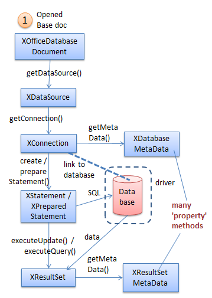

Figure 1.  Querying a Base Document. 

 
XOfficeDatabaseDocument accesses a database via the ODB document that's 
connected to the database. The connection can take two forms – the database can be 
embedded inside the ODB file, or the connection can be a URL which links to an 
external database. Most of my examples will utilize ODB files that contain embedded 
databases. 

 
 
  
## 1.  Querying an Embedded HSQLDB Database  

The following SimpleQuery.java example shows how to query a HSQLDB database 
embedded inside an ODB file called liangTables.odb. It has three tables, called 
Course, Enrollment, and Student. Figure 2 shows the data in the Course table, 
displayed by Base. The filename reflects the fact that the database is based on one in 
Y. Daniel Liang's "Introduction to Java Programming" textbook. 

 
 

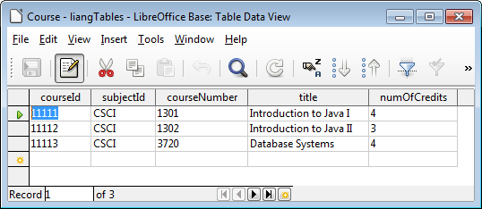

Figure 2. The Course Table in liangTables.odb. 

 
Although SimpleQuery.java only queries liangTables.odb, the support methods it 
utilizes are capable of accessing other kinds of ODB document, including ones 
containing embedded Firebird databases, and database URLs.  

The main() method for SimpleQuery.java is given below: 
 
private static final String FNM = "liangTables.odb"; 
 
 
// in SimpleQuery.java 
public static void main(String[] args) 
{ 
  XComponentLoader loader = Lo.loadOffice(); 
  XOfficeDatabaseDocument dbDoc = Base.openBaseDoc(FNM, loader); 
  if (dbDoc == null) { 
    System.out.println("Could not open database " + FNM); 
    Lo.closeOffice(); 
    return; 
  } 
 
  XConnection conn = null; 
  try { 
    XDataSource dataSource = dbDoc.getDataSource(); 
    conn = dataSource.getConnection("", "");  // no login/password 
    XStatement statement = conn.createStatement(); 
 
    // first query 
    XResultSet rs =  
          statement.executeQuery("SELECT * FROM \"Course\""); 
 
    XRow xRow = Lo.qi(XRow.class, rs); 
 
    System.out.println("CourseID \tSubjectID \tCourseNumber  
                                 \tTitle  \tNumOfCredits"); 
    System.out.println("========================="); 
    while(rs.next()) 
      System.out.println( xRow.getString(1) + ",   \t" +  
                          xRow.getString(2) + ",   \t" + 
                          xRow.getInt(3) + ",   \t" +  
                          xRow.getString(4) + ",   " + 
                          xRow.getInt(5) ); 
    System.out.println("========================="); 
 
    // second query 
    rs = statement.executeQuery( 
           "SELECT \"courseNumber\", \"title\" FROM \"Course\""); 
    xRow = Lo.qi(XRow.class, rs); 
    XColumnLocate xLoc = Lo.qi( XColumnLocate.class, rs); 
 
    System.out.println("CourseNumber \tTitle"); 
    System.out.println("===================================="); 
    while(rs.next()) 
      System.out.println(  
            xRow.getString( xLoc.findColumn("courseNumber")) +  
            ",   \t" +  
            xRow.getString( xLoc.findColumn("title")) ); 
    System.out.println("===================================="); 
  } 
  catch(SQLException e) { 
    System.out.println(e); 
  } 
 
  Base.closeConnection(conn); 
  Base.closeBaseDoc(dbDoc); 
  Lo.closeOffice(); 
}  // end of main() 
 
The code is similar to the JDBC program described in the previous chapter, but uses 
the sdbc interface, starting with XOfficeDatabaseDocument.  

Base.openBaseDoc() loads the document as an instance of XComponent, then casts it 
to XOfficeDatabaseDocument. The relationship between XOfficeDatabaseDocument  
and XComponent is shown in Figure 5. 

 
 

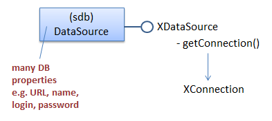

Figure 5. Obtaining an OfficeDataBaseDocument Instance. 

 
The Base.openBaseDoc() method: 
 
// in the Base class 
public static XOfficeDatabaseDocument openBaseDoc( 
                        String fnm, XComponentLoader loader) 
{ 
  XComponent doc = Lo.openDoc(fnm, loader); 
  if (doc == null) { 
    System.out.println("Document is null"); 
    return null; 
  } 
 
  if (Info.reportDocType(doc) != Lo.BASE) { 
    System.out.println("Not a database doc; closing " + fnm); 
    Lo.closeDoc(doc); 
    return null; 
  } 
 
  // cast XComponent to XOfficeDatabaseDocument 
  XOfficeDatabaseDocument dbDoc =  
             Lo.qi(XOfficeDatabaseDocument.class, doc); 
  if (dbDoc == null) { 
    System.out.println("Not a database doc; closing " + fnm); 
    Lo.closeDoc(doc); 
    return null; 
  } 
  return dbDoc; 
}  // end of openDoc() 
 
Database details, such as whether it's embedded inside or linked to the ODB file, and 
its type (e.g. HSQLDB, Firebird), are stored in the DataSource service, which is 
accessed by XOfficeDatabaseDocument.getDataSource(): 
// in SimpleQuery.java... 

XDataSource dataSource = dbDoc.getDataSource(); 
The simplest way of using the data source is to connect to the database by calling 
getConnection(): 
XConnection conn = dataSource.getConnection("", "");   
                                     // no login/password 
XConnection.createStatement() returns an XStatement reference, which can be used 
to send SQL queries to the database. A query's result set is stored in an XResultSet 
instance: 
 
// in SimpleQuery.java... 

XStatement statement = conn.createStatement(); 
XResultSet rs = statement.executeQuery("SELECT * FROM \"Course\""); 
 
Sdbc differs a little from JDBC in how the rows of a result set are examined. A row is 
represented by a XRow instance which is a cast of XResultSet. However, the set's 
cursor is still moved through the rows using XResultSet.next(): 
 
// in SimpleQuery.java... 

XRow xRow = Lo.qi(XRow.class, rs); 
while(rs.next()) 
  System.out.println( xRow.getString(1) + ",   \t" +  
                      xRow.getString(2) + ",   \t" + 
                      xRow.getInt(3)    + ",   \t" +  
                      xRow.getString(4) + ",   " + 
                      xRow.getInt(5) ); 
 
Access to data through XRow.getXXX() methods is only possible with column 
indices. Column names can be used indirectly via XColumnLocate.findColumn() 
which maps names to indices: 
 
// in SimpleQuery.java... 

rs = statement.executeQuery( 
       "SELECT \"courseNumber\", \"title\" FROM \"Course\""); 
 
xRow = Lo.qi(XRow.class, rs); 
XColumnLocate xLoc = Lo.qi( XColumnLocate.class, rs); 
 
System.out.println("CourseNumber \tTitle"); 
System.out.println("===================================="); 
while(rs.next()) 
  System.out.println(  
         xRow.getString( xLoc.findColumn("courseNumber")) +  
         ",   \t" +  
         xRow.getString( xLoc.findColumn("title")) ); 
System.out.println("===================================="); 
 
The output from SimpleQuery.java is shown in Figure 6. 

 
 

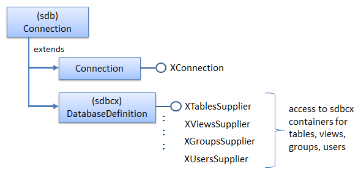

Figure 6. SimpleQuery.java Output. 

  
The program ends by closing the connection to the database (with 
Base.closeConnection()) and the ODB file (with Base.closeBaseDoc()). Both methods 
cast their arguments to XCloseable, and then call XCloseable.close(). 

 
 
## 2.  Using Metadata when Querying a Base Document 

Metadata is information about a database, such as a table's schema, and driver and 
database engine details. There are four sources of such information in the Base API: 
 the DataSource service; 
 the DatabaseDefinition services; 
 the sdbc metadata services, DatabaseMetaData and ResultSetMetaData. 

SimpleQuery.java is hardwired to query the Course table in the liangTables.odb 
database, and prints rather ugly looking output (see Figure 6). Both these issues can 
be addressed by utilizing database metadata information, as in DBQuery.java 
described next. I'll use the program to illustrate how the four metadata services can be 
employed. 

 
### 2.1.  The DataSource Service 

The DataSource service is depicted in Figure 7. 

 
 

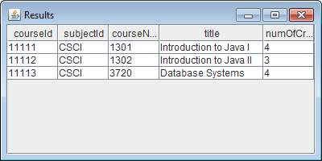

Figure 7. The DataSource Service and Interface. 

 
A simple way to access a data source's properties is with my Props.java utility class. 

For example, the following code prints all of its properties: 
 
// part of DBQuery.java... 

XOfficeDatabaseDocument dbDoc =  ... // reference to a Base doc; 
XDataSource dataSource = dbDoc.getDataSource(); 
Props.showObjProps("Data Source", dataSource); 
 
This information includes the data source type (e.g. whether it is an embedded 
HSQLDB or Firebird database), whether a password is required to access the tables, 
and whether the database is read-only. My Base utility class includes several methods 
that access this information individually. For example: 
 
// part of DBQuery.java... 

System.out.println("Database type: " +  
                     Base.getDataSourceType(dbDoc)); 
System.out.println("Is embedded? " + Base.isEmbedded(dbDoc)); 
 
XDataSource dataSource = dbDoc.getDataSource(); 
Base.printDataSourceInfo(dataSource); 
 
System.out.println("Is password required: " +  
                     Base.isPasswordRequired(dataSource)); 
System.out.println("Is read-only: " + Base.isReadOnly(dataSource)); 
 
For the liangTables.odb file, the listed details are: 
 
Database type: sdbc:embedded:hsqldb 
Is embedded? true 
 
Data Source Properties 
  Info == [Lcom.sun.star.beans.PropertyValue;@cf768c 
  IsPasswordRequired == false 
  IsReadOnly == false 
  // ... many more lines 
  // : 
 
Is password required: false 
Is read-only: false 
 
 
### 2.2.  The DatabaseDefinition Services 

After a database connection is established, metadata about the structure of the 
database, its tables, columns, user and group permissions, becomes available. It's 
accessible through services in the sdbcx module, starting from DatabaseDefinition 
shown in Figure 8. 

 
 

Figure 8. Accessing Database MetaData via a Connection. 

 
For example, Base.getTablesNames() casts an XConnection reference to a 
XTablesSupplier, which gives access to information about the database's tables: 
 
// in the Base class 
public static ArrayList<String> getTablesNames(XConnection conn) 
{ 
  XTablesSupplier tblsSupplier =  
                    Lo.qi(XTablesSupplier.class, conn); 
  XNameAccess tables = tblsSupplier.getTables(); 
  String[] tableNms = tables.getElementNames(); 
  return new ArrayList<String>(Arrays.asList(tableNms)); 
}  // end of getTablesNames() 
 
Base.getTablesNames() is called in DBQuery.java like so: 
 
// part of DBQuery.java... 

XConnection conn =  
        dataSource.getConnection("", ""); // no login/password 
 
ArrayList<String> tableNames = Base.getTablesNames(conn); 
System.out.println("No. of tables: " + tableNames.size()); 
System.out.println( Arrays.toString(tableNames.toArray())); 
 
The names of the three tables in liangTables.odb are reported as: 
 
No. of tables: 3 
[Course, Enrollment, Student] 
 
Just as XTablesSupplier is for supplying table information, there are similarly named 
'Supplier' interfaces for retrieving details about the database's views, groups, and user 
accounts. Base.displayTablesInfo() prints all of this information, but the output can be 
very large if there are more than one or two tables in the database. 

 
### 2.3.  The DatabaseMetaData Service 

Another way to obtain metadata is to utilize the JDBC-inspired XDatabaseMetaData 
interface by calling XConnection.getMetaData(): 
 
XConnection conn =  ... // a connection to the database; 
XDatabaseMetaData md = conn.getMetaData(); 
 
The metadata includes database engine and driver details, as reported by 
Base.reportDBInfo(): 
 
// in the Base class 
public static void reportDBInfo(XConnection conn) 
{ 
  try { 
    XDatabaseMetaData md = conn.getMetaData(); 
 
    String productName = md.getDatabaseProductName(); 
    String productVersion = md.getDatabaseProductVersion(); 
    if ((productName == null) || productName.equals("")) 
      System.out.println("No database info found"); 
    else 
      System.out.println("DB:  " + productName +  
                              " v." + productVersion); 
 
    String driverName = md.getDriverName(); 
    String driverVersion = md.getDriverVersion(); 
    if ((driverName == null) || driverName.equals("")) 
      System.out.println("No driver info found"); 
    else 
      System.out.println("SDBC driver:  " + driverName +  
                                 " v." + driverVersion); 
  }  
  catch (SQLException e)  
  {  System.out.println(e);  } 
}  // end of reportDBInfo() 
 
The output for liangTables.odb shows that it utilizes HSQLDB: 
 
DB:  HSQL Database Engine v.1.8.0 
SDBC driver:  HSQL Database Engine Driver v.1.8.0 
 
Unfortunately the XDatabaseMetaData methods don't return anything useful for 
embedded Firebird databases. The output is: 
 
No database info found 
No driver info found 
 
However, data source metadata is available for Firebird via 
Base.getDataSourceType(): 
 
System.out.println("Database type: " +  
                     Base.getDataSourceType(dbDoc)); 
For the same Firebird database, it reports: 
Database type: sdbc:embedded:firebird 
This illustrates that the functionalities of the HSQLDB and Firebird engines aren't 
identical, and that the DataSource (section 2.1) and DataDefinition services (section 
2.2) may produce more information than the sdbc metadata approach (this section).  

Base.reportSQLTypes() and Base.reportFunctionSupport() utilize 
XDatabaseMetaData. The former returns a list of SQL types, and the latter a list of 
functions supported by the database engine; their use is illustrated in DBQuery.java. 

 
### 2.4.  The ResultSetMetaData Service 

XResultSetMetaData data allows a result set to be better formatted. It's used in 
Base.printResultSet() to print results sets and in Base.displayResultSet() to fill a 
scrollable JTable displayed inside a JFrame. 

The following query prints a result set to standard output: 
 
// part of DBQuery.java... 

ArrayList<String> tableNames = Base.getTablesNames(conn); 
XResultSet rs = Base.executeQuery("SELECT * FROM \"" +  
                            tableNames.get(0) + "\"", conn); 
Base.printResultSet(rs); 
 
The query employs the first string from the tableNames list as the SELECT's table. 

The output for liangTables.odb is: 
 
  courseId,  subjectId, courseNumber,      title, numOfCredits 
-------------------------------------------------------------- 
     11111,       CSCI,       1301, Introduction to Java I,          4 
     11112,       CSCI,       1302, Introduction to Java II,          3 
     11113,       CSCI,       3720, Database Systems,          4 
 
The formatting isn't perfect since its quite tricky to determine the maximum width 
required for a column. Base.printResultSet() uses XResultSetMetaData to determine 
the number of columns and their names: 
 
// in the Base class 
public static void printResultSet(XResultSet rs) 
{ 
  if (rs == null) { 
    System.out.println("No results set to print"); 
    return; 
  } 
 
  try { 
    XResultSetMetaDataSupplier rsMetaSupp =  
             Lo.qi(XResultSetMetaDataSupplier.class, rs); 
    XResultSetMetaData rsmd = rsMetaSupp.getMetaData(); 
 
    int tableWidth = 0; 
    int numCols = rsmd.getColumnCount(); 
 
    String colName; 
    for (int i = 0; i < numCols; i++) { 
      if (i > 0) { 
        System.out.print(", "); 
        tableWidth += 2; 
      } 
      colName = rsmd.getColumnName(i+1); 
      System.out.printf("%10s", colName); 
      tableWidth += Math.max(colName.length(), 10); 
    } 
    System.out.println(); 
 
    for (int i=0; i < tableWidth; i++) 
      System.out.print("-"); 
    System.out.println(); 
 
    XRow xRow = Lo.qi(XRow.class, rs); 
    while (rs.next()) { 
      for (int i = 0; i < numCols; i++) { 
        if (i > 0)  
          System.out.print(", "); 
        System.out.printf("%10s", xRow.getString(i+1) ); 
      } 
      System.out.println();   
    } 
    System.out.println();   
  } 
  catch(SQLException e) { 
    System.out.println(e); 
  } 
}  // end of printResultSet() 
 
Fortunately, the hard work of writing a good ASCII-based table printer has already 
been done by Hami Galip Torun with his DBTablePrinter class, available from 
https://github.com/htorun/dbtableprinter. It offers printTable() and printResultSet() for 
printing a JDBC table and result set in beautiful ASCII.  

I made a few small changes to his class to allow it to handle sdbc tables and result 
sets, which consisted mainly of changing the Connection, Statement, and ResultSet 
names to XConnection, XStatement, and XResultSet. I've also renamed the class as 
BaseTablePrinter so I could keep using Torun's original DBTablePrinter for printing 
JDBC results. 

The result set shown above is printed by: 
// part of DBQuery.java... 

BaseTablePrinter.printResultSet(rs);   
The output: 
 
Printing 3 rows from table Course 
+----------+-----------+--------------+-------------------------+--------------+ 
| courseId | subjectId | courseNumber |          title          | numOfCredits | 
+----------+-----------+--------------+-------------------------+--------------+ 
| 11111    | CSCI      |         1301 | Introduction to Java I  |            4 | 
+----------+-----------+--------------+-------------------------+--------------+ 
| 11112    | CSCI      |         1302 | Introduction to Java II |            3 | 
+----------+-----------+--------------+-------------------------+--------------+ 
| 11113    | CSCI      |         3720 | Database Systems        |            4 | 
+----------+-----------+--------------+-------------------------+--------------+ 
 
A graphical display is implemented by my Base.displayResultSet(), which uses the 
result set to fill a JTable GUI component inside a JFrame. This result set from above 
is displayed by: 
// part of DBQuery.java... 

Base.displayResultSet(rs); 
Figure 9 shows the JFrame. 

 

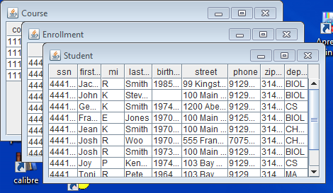

Figure 9. The Result Set Displayed in a Window. 

 
There are some problems with the layout: too much vertical space below the table, 
and column formatting which shows all the data, but not all the headings. However, 
the user can resize the window and columns, so these drawbacks aren't serious. 

displayResultSet() is coded as: 
 
// in the Base class 
public static void displayResultSet(XResultSet rs) 
{  displayResultSet(rs, "Result set", 0);  } 
 
 
public static void displayResultSet(XResultSet rs,  
                                  String title, int offset) 
{ if (rs == null) { 
    System.out.println("No results set to display"); 
    return; 
  } 
 
  try { 
    XResultSetMetaDataSupplier rsMetaSupp =  
             Lo.qi(XResultSetMetaDataSupplier.class, rs); 
    XResultSetMetaData rsmd = rsMetaSupp.getMetaData(); 
 
    // names of columns 
    int numCols = rsmd.getColumnCount(); 
    String[] headers = new String[numCols]; 
    for (int i=0; i < numCols; i++) { 
      headers[i] = rsmd.getColumnName(i+1); 
    } 
    // create table with column heads 
    DefaultTableModel tableModel = new DefaultTableModel(headers, 0); 
    JTable table = new JTable(tableModel); 
 
    // fill table with XResultSet contents, one row at a time 
    XRow xRow = Lo.qi(XRow.class, rs); 
    while (rs.next()) 
      tableModel.addRow( getRow(xRow, numCols));  
 
    // resize columns so data is visible 
    table.setAutoResizeMode(JTable.AUTO_RESIZE_ALL_COLUMNS); 
    resizeColumnWidth(table); 
     
    SwingUtilities.invokeLater( new Runnable() { 
      public void run()  
      {  JFrame frame = new JFrame(); 
         frame.setBounds(offset, offset, 400, 200); 
         frame.setTitle(title); 
         frame.setDefaultCloseOperation(JFrame.DISPOSE_ON_CLOSE);   
                 // so JFrame closure doesn't kill the main prog 
         frame.add(new JScrollPane(table), BorderLayout.CENTER); 
         frame.setVisible(true);  
      } 
    }); 
  } 
  catch(SQLException e) { 
    System.out.println(e); 
  } 
}  // end of displayResultSet() 
 
This sdbc display code is different from the JDBC version in only two ways. The first 
is the use of XResultSetMetaDataSupplier to access the result set's metadata: 
 
// part of Base.displayResultSet()... 

XResultSetMetaDataSupplier rsMetaSupp =  
                 Lo.qi(XResultSetMetaDataSupplier.class, rs); 
XResultSetMetaData rsmd = rsMetaSupp.getMetaData(); 
 
The second is the utilization of an XRow instance to refer to each row in the result 
set: 
 
// part of Base.displayResultSet()... 

XRow xRow = Lo.qi(XRow.class, rs); 
while (rs.next()) 
  tableModel.addRow( getRow(xRow, numCols));  
 
 
## 3.  Debugging Database Code 

A useful way to debug larger programs is to display the database tables they're 
manipulating. The simplest way of doing this is to open the tables inside Base. 

A call to GUI.setVisible() makes Base and the loaded file visible. However, Base's 
default behavior is to display its Forms view rather than the Tables view. Even after 
changing to the Tables view, only the names of the tables are listed not their contents. 

Base.showTables() deals with these issues, so that the following call: 
 
// part of DBQuery.java... 

Base.showTables(dbDoc);     
Lo.waitEnter(); 
  
produces the windows shown in Figure 10 when liangTables.odb is being processed. 

 
 

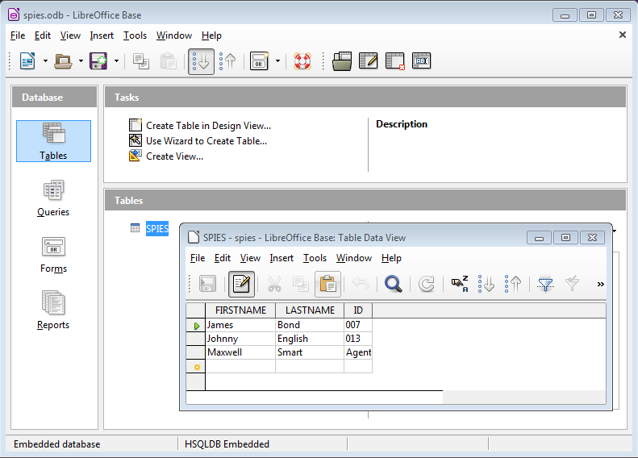

Figure 10. The liangTables.odb Tables in Base. 

 
The call to Lo.waitEnter() gives the user a chance to examine the tables before the 
program continues. 

A drawback of this approach is that having open table windows at the end of the 
program often causes Office to crash after Lo.closeOffice() is called.  

Base.showTables() utilizes a series of dispatch commands to make the GUI visible, 
show the Tables view, and open the tables in separate windows: 
 
// in the Base class 
public static void showTables(XOfficeDatabaseDocument dbDoc) 
// open windows for all the tables in the doc 
{ 
  showTablesView(dbDoc); 
  Lo.delay(500);  // wait for Tables View to appear 
  Lo.dispatchCmd("SelectAll"); 
  Lo.dispatchCmd("DBTableOpen");  // open all tables 
}  // end of showTables() 
 
 
public static void showTablesView(XOfficeDatabaseDocument dbDoc) 
// make Base visible, and switch to its Table view 
{ 
  XComponent doc = Lo.qi(XComponent.class, dbDoc); 
  GUI.setVisible(doc, true); 
  Lo.delay(500);  // wait for GUI to appear 
  Lo.dispatchCmd("DBViewTables"); 
}  // end of showTablesView() 
 
As usual, using dispatches makes the code very fragile. For example, consider the 
"SelectAll" dispatch which causes Office to select all the table names in the Tables 
View. To be more precise, "SelectAll" selects everything in the active window, which 
should be the Tables view, but could easily be something else if the user clicked on 
another window at the wrong time. 

My Base class offers two alternatives to showTables(): Base.printDatabase() and 
Base.displayDatabase(); the first builds upon Hami Galip Torun's class to generate 
textual output of every table in the database, while the second uses my 
Base.displayResultSet() to render each table in its own JFrame. They are called like 
so: 
// part of DBQuery.java... 

Base.printDatabase(conn); 
 
Base.displayDatabase(conn); 
 
Base.displayDatabase() is a better choice for displaying large databases since each 
JFrame can be resized and is scrollable, as in Figure 11. 

 
 

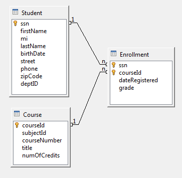

Figure 11.  The liangTables.odb Tables shown in JFrames. 

 
 
## 4.  Creating a Base Document 

The DBCreate.java example creates a new document called spies.odb which holds a 
single table of "top-secret" information on spies. Figure 12 shows the table inside 
Base. 

 
 

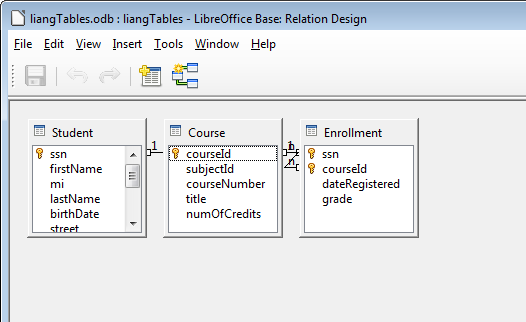

Figure 12. The SPIES Table inside spies.odb. 

 
The example employs Base.createBaseDoc() to create an embedded database (which 
can be either HSQLDB or Firebird). 

The main() function for DBCreate.java is: 
 
private static final String FNM = "spies.odb"; 
 
 
// in DBCreate.java 
public static void main(String[] args) 
{ 
  XComponentLoader loader = Lo.loadOffice(); 
  XOfficeDatabaseDocument dbDoc = Base.createBaseDoc(FNM, 
                                        Base.HSQLDB, loader); 
                                     // Base.FIREBIRD, loader); 
  if (dbDoc == null) { 
    Lo.closeOffice(); 
    return; 
  } 
 
  XConnection conn = null; 
  try { 
    XDataSource dataSource = dbDoc.getDataSource(); 
    conn = dataSource.getConnection("", "");  
 
    // create a table in the database 
    Base.exec("CREATE TABLE SPIES " + 
         "( FIRSTNAME VARCHAR(50), LASTNAME VARCHAR(50),  
            ID VARCHAR(50), PRIMARY KEY (ID) )", conn); 
 
    Base.exec("INSERT INTO SPIES VALUES(  
                         'James', 'Bond', '007')", conn); 
    Base.exec("INSERT INTO SPIES VALUES(  
                         'Johnny', 'English', '013')", conn); 
    Base.exec("INSERT INTO SPIES VALUES(  
                         'Maxwell', 'Smart', 'Agent 86')", conn); 
 
    XFlushable flusher = Lo.qi(XFlushable.class, dataSource); 
    flusher.flush();    
      // needed or data not saved to file; can only be called once 
 
    // test the database with a query 
    System.out.println(); 
    XResultSet rs = Base.executeQuery("SELECT * FROM SPIES", conn); 
    BaseTablePrinter.printResultSet(rs); 
  } 
  catch(SQLException e) { 
    System.out.println(e); 
  } 
 
  Base.closeConnection(conn); 
  Base.closeBaseDoc(dbDoc); 
  Lo.closeOffice(); 
}  // end of main() 
 
There's something missing from main() – there's no call to a 'save' function to save the 
new spies.odb file before the program exits. There's no need because of how the 
spies.odb file and database are created in two phases.  

First, Base.createBaseDoc() creates an ODB file with an empty embedded database. 

The file is saved by createBaseDoc(), then reloaded, and a reference returned by the 
method. This unusual behavior is necessary or no link (an XConnection) can be 
opened to the new database. 

The second phase employs SQL DDL and DML commands to create and populate a 
table inside the file. The unusual part of this phase is the need to finish off with a call 
to XFlushable.flush(). This ensures that the table is written out to the embedded 
database in the file. 

The final part of the try-catch block is a test to see if the SPIES table can be 
successfully queried. The BaseTablePrinter.printResultSet() output is: 
 
Printing 3 rows from table SPIES 
+-----------+----------+----------+ 
| FIRSTNAME | LASTNAME |    ID    | 
+-----------+----------+----------+ 
| James     | Bond     | 007      | 
+-----------+----------+----------+ 
| Johnny    | English  | 013      | 
+-----------+----------+----------+ 
| Maxwell   | Smart    | Agent 86 | 
+-----------+----------+----------+ 
 
Base.createBaseDoc() is defined as: 
 
// in the Base class 
// globals  
public static final int UNKNOWN = 0; 
public static final int HSQLDB = 1; 
public static final int FIREBIRD = 2; 
 
public static final String HSQL_EMBEDDED = "sdbc:embedded:hsqldb"; 
public static final String FIREBIRD_EMBEDDED =  
                                         "sdbc:embedded:firebird"; 
 
 
public static XOfficeDatabaseDocument createBaseDoc( 
               String fnm, int dbType, XComponentLoader loader) 
{   
  if ((dbType != HSQLDB) && (dbType != FIREBIRD)) { 
    System.out.println("Unknown db type; using HSQLDB"); 
    dbType = HSQLDB; 
  } 
 
  XComponent doc = Lo.createDoc("sdatabase", loader); 
  if (doc == null) { 
    System.out.println("Document creation failed"); 
    return null; 
  } 
 
  XOfficeDatabaseDocument dbDoc =  
          Lo.qi(XOfficeDatabaseDocument.class, doc); 
  XDataSource dataSource = dbDoc.getDataSource(); 
 
  String sourceStr = (dbType == FIREBIRD) ? FIREBIRD_EMBEDDED :  
                                            HSQL_EMBEDDED; 
  Props.setProperty(dataSource, "URL", sourceStr); 
 
  System.out.println("Created a \"" + sourceStr +  
                         "\" Base document in " + fnm); 
     
  // save, close, reopen,   
  // or no subsequent connection can be made to database 
  Base.saveBaseDoc(dbDoc, fnm); 
  Base.closeBaseDoc(dbDoc); 
  return openBaseDoc(fnm, loader); 
}  // end of createBaseDoc() 
 
 
public static void saveBaseDoc(XOfficeDatabaseDocument dbDoc,  
                               String fnm) 
{  XComponent doc = Lo.qi(XComponent.class, dbDoc); 
   Lo.saveDoc(doc, fnm); 
} 
 
Base.createBaseDoc() utilizes Lo.createDoc() to create an empty ODB document, and 
then sets its data source to be an embedded HSQLDB or Firebird database. The URL 
property in the DataSource service is assigned "sdbc:embedded:hsqldb" or 
"sdbc:embedded:firebird". 

 
Viewing Database Creation 
It's sometimes useful to observe the stages in a database's creation, and that's most 
easily achieved by making Base's GUI visible during DBCreate.java's execution.  

GUI.setVisible() is called at the start of the program: 
// part of DBCreate.java... 

GUI.setVisible(dbDoc, true); 
Of course, Base's tables view will not show anything initially since the database  is 
empty. More surprisingly, the view remains empty after the SQL commands have 
finished and XFlushable.flush() has been called. The table view must be 'refreshed' in 
order for the new tables to be listed, which is done by Base.refreshTables(): 
 
// part of DBCreate.java... 

Base.refreshTables(conn);   
      // place after the call to XFlushable.flush() 
Base.showTablesView(dbDoc); 
 
Base.refreshTables() is implemented as: 
 
// in the Base class 
public static void refreshTables(XConnection conn) 
{ 
  XTablesSupplier suppTables = Lo.qi(XTablesSupplier.class, conn); 
  XRefreshable refresh =  
           Lo.qi(XRefreshable.class, suppTables.getTables()); 
  refresh.refresh(); 
}  // end of refreshTables() 
 
 
## 5.  Processing Multiple SQL Commands 

The simplest way to build databases with more tables and data is by storing the 
necessary DDL and DML commands in a text file. This can be loaded by 
Base.readCmds(), as in the DBCmdsQuery.java example. 

main() creates an ODB document with an empty embedded HSQLDB database, 
builds its tables by executing the commands loaded by Base.readCmds(), and displays 
the tables inside Base: 
 
// in DBCmdsCreate.java 
public static void main(String[] args) 
{ 
  if (args.length != 1) { 
    System.out.println("Usage: java DBCmdsCreate <cmds fnm>"); 
    return; 
  } 
  String fnm = Info.getName(args[0]) + ".odb"; 
 
  XComponentLoader loader = Lo.loadOffice(); 
  XOfficeDatabaseDocument dbDoc = Base.createBaseDoc(fnm,  
                                   Base.HSQLDB, loader); 
                                // Base.FIREBIRD, loader); 
  if (dbDoc == null) { 
    Lo.closeOffice(); 
    return; 
  } 
 
  ArrayList<String> cmds = Base.readCmds(args[0]); 
  if (cmds == null) { 
    System.out.println("No commands to process"); 
    Lo.closeOffice(); 
    return; 
  } 
  System.out.println("Read in " + cmds.size() + " commands"); 
 
  XConnection conn = null; 
  try { 
    XDataSource dataSource = dbDoc.getDataSource(); 
    conn = dataSource.getConnection("", "");  // no login/password 
    processCmds(cmds, conn); 
 
    XFlushable flusher = Lo.qi(XFlushable.class, dataSource); 
    flusher.flush();   // needed or data not saved to file 
 
    // must refresh the connection or the tables  
    // will not be visible inside Base 
    Base.refreshTables(conn); 
    Base.showTables(dbDoc);   
          // Office may not close cleanly while showing tables 
    Lo.waitEnter(); 
  } 
  catch(SQLException e) { 
    System.out.println(e); 
  } 
 
  Base.closeConnection(conn); 
  Base.closeBaseDoc(dbDoc); 
  Lo.closeOffice(); 
}  // end of main() 
 
 
 
private static void processCmds(ArrayList<String> cmds,  
                                XConnection conn) 
// filter out SELECTs since only creating in this example 
{ for(String cmd : cmds) { 
    if (cmd.startsWith("SELECT")) 
      System.out.println("Ignoring: \"" + cmd + "\""); 
    else 
      Base.exec(cmd, conn); 
  } 
}  // end of processCmds() 
 
Base.readCmds() is a standard piece of Java for reading lines from a file, returning 
them in a list. Each line is assumed to start with "CREATE", "INSERT", "UPDATE", 
"DELETE", or SELECT". processCmds() in DBCmdsCreate.java skips over 
"SELECT" queries. 

Base.exec() hides the details of creating an Statement object, and deciding whether to 
call XStatement.execute() for "CREATE" commands, XStatement.executeUpdate() 
for "INSERT", "UPDATE", and DELETE", or XStatement.executeQuery() for 
"SELECT". 

After the commands have been processed, it's necessary to flush the newly created 
tables to the file and refresh Base's Table view. 

The call:  
run DBCmdsCreate liangTables.txt  
creates liangTables.odb and populates it with three tables called Course, Enrollment, 
and Student, which can be seen in Figure 10. 

The DBCmdsQuery.java example uses the same Base.readCmds() to read in queries 
applied to a database. The only difference from DBCmdsCreate.java is that a database 
is opened with Base.openBaseDoc() rather than created from scratch. 

 
 
## 6.  Displaying Table Relationships 

A  good way to understand the relationships between multiple tables in a database is 
with a relation design diagram, which is generated by the Tools >> Relationships 
menu item in Base. For example, the diagram for the three tables in liangTables.odb is 
shown in Figure 13. 

 
 

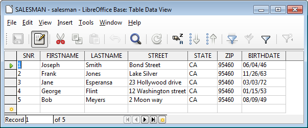

Figure 13. The Relation Design Diagram for liangTables.odb. 

 
Unfortunately, there's no way to generate relation design diagrams programmatically 
except via dispatch commands. Another problem is that there's no API or Base menu 
item for saving a diagram as an image. My solution uses Java's Robot class to send 
the <alt> <print screen> keys to Windows to trigger a screenshot of the currently 
active window. My code reads the image from the clipboard and saves it to a file.  

This programming mishmash is demoed by DBRels.java: 
 
// in DBRels.java 
public static void main(String[] args) 
{ 
  if (args.length != 1) { 
    System.out.println("Usage: run DBRels <fnm>"); 
    return; 
  } 
 
  XComponentLoader loader = Lo.loadOffice(); 
  XOfficeDatabaseDocument dbDoc =  
                   Base.openBaseDoc(args[0], loader); 
  if (dbDoc == null) { 
    System.out.println("Could not open database " + args[0]); 
    Lo.closeOffice(); 
    return; 
  } 
 
  if (Base.isFirebirdEmbedded(dbDoc)) 
    System.out.println("Embedded Firebird does not  
                                  support relation design"); 
  else { 
    GUI.setVisible(dbDoc, true); 
    Lo.delay(500);  // wait for GUI to appear 
 
    Lo.dispatchCmd("DBRelationDesign"); 
        // open the relation design diagram window in Base 
    Lo.delay(1000); 
 
    JNAUtils.shootWindow();   
        // take a screenshot of the currently active window 
    Lo.delay(1000); 
 
    // read an image from the clipboard, and save it 
    BufferedImage im = Clip.readImage(); 
    if (im != null) 
      Images.saveImage(im, "relations.png"); 
     
    Lo.dispatchCmd("CloseWin");  // close relation design window 
    Lo.delay(500); 
  } 
 
  Base.closeBaseDoc(dbDoc); 
  Lo.closeOffice(); 
}  // end of main() 
 
JNAUtils.shootWindow() doesn't utilize the JNA library, but its use of OS-level 
functionality means it doesn't really belong in any of my other Office support classes. 

The code: 
 
// in the JNA class 
public static void shootWindow() 
// take a screenshot of the window in focus 
{ 
  EventQueue.invokeLater(new Runnable() { 
    public void run() { 
      try { 
        Robot r = new Robot(); 
        r.keyPress(KeyEvent.VK_ALT); // press <alt> <print screen> 
        r.keyPress(KeyEvent.VK_PRINTSCREEN); 
        r.keyRelease(KeyEvent.VK_ALT); 
        System.out.println("Screenshot of window completed"); 
      } 
      catch(AWTException e) 
      {  System.out.println("Unable to do screenshot: " + e); } 
    } 
  }); 
}  // end of shootWindow() 
 
Of course, there's a danger that the user (or OS) will move the window focus away 
from the relation design window, causing the wrong window to be screenshot and 
stored on the clipboard. 

Clip.readImage() converts the first Bitmap it finds on the system clipboard into a 
BufferedImage. I'll talk about my Clipboard support class in Chapter 43. 

The image is saved to relations.png, which is shown in Figure 14. 

 
 

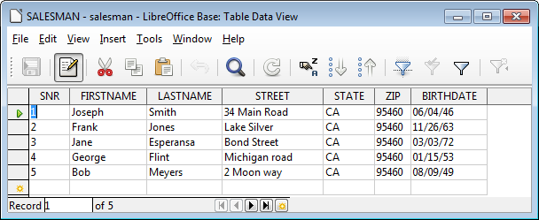

Figure 14. Part of the relations.png Image. 

 
Figure 14 isn't the same as Figure 13 because I rearranged and resized the boxes 
before snapping the image. Figure 14 shows the original layout produced by Base. 

Another issue with Base's relation design tool is that it's currently not implemented for 
embedded Firebird databases. This explains the call to Base.isFirebirdEmbedded() in 
DBRels.java which lets the diagram creation be skipped. 

isFirebirdEmbedded() examines the document's DataSource "URL" property to see if 
it contains the string "sdbc:embedded:firebird": 
 
// in the Base class 
// globals  
public static final String HSQL_EMBEDDED = "sdbc:embedded:hsqldb"; 
public static final String FIREBIRD_EMBEDDED =  
                                         "sdbc:embedded:firebird"; 
 
 
public static boolean isFirebirdEmbedded( 
                           XOfficeDatabaseDocument dbDoc) 
{ String embedFnm = getDataSourceType(dbDoc); 
  if (embedFnm == null) 
    return false; 
  return (embedFnm.equals(FIREBIRD_EMBEDDED));   
} 
 
 
public static boolean isHSQLEmbedded( 
                          XOfficeDatabaseDocument dbDoc) 
{ String embedFnm = getDataSourceType(dbDoc); 
  if (embedFnm == null) 
    return false; 
  return (embedFnm.equals(HSQL_EMBEDDED)); 
} 
 
 
public static String getDataSourceType(XOfficeDatabaseDocument dbDoc) 
{ 
  if (dbDoc == null) { 
    System.out.println("Database is null"); 
    return null; 
  } 
 
  XDataSource dataSource = dbDoc.getDataSource(); 
  if (dataSource == null) { 
    System.out.println("DataSource is null"); 
    return null; 
  } 
  else 
    return (String) Props.getProperty(dataSource, "URL"); 
}  // end of getDataSourceType() 
 
There's also an isHSQLEmbedded() method for checking if the document contains an 
embedded HSQLDB database. 

 
 
## 7.  Prepared Statements 

Sdbc supports prepared statements, which are SQL commands with Java-level 
parameters (denoted by '?'s). The PreparedStatement service stores properties related 
to how the result set is created, and XPreparedStatement contains the methods. 

PreparedSales.java shows how prepared statements are created and used. It starts by 
creating a salesman.odb file containing a SALESMAN table with 5 rows of data. 

Figure 15 shows the table inside Base. 

 
 

Figure 15. The Initial SALESMAN Table in salesman.odb. 

 
At this point, PreparedSales.java calls updatePs(): 
 
// in PreparedSales.java 
private static void updatePs(XConnection conn) throws SQLException 
// update the table with a prepared statement; 4 changes made 
{ 
  XPreparedStatement preStmt = conn.prepareStatement( 
                "UPDATE SALESMAN SET STREET = ? WHERE SNR = ?"); 
 
  // change STREET for Joseph (SNR == 1) to 34 Main Road 
  XParameters ps = Lo.qi(XParameters.class, preStmt); 
  ps.setString(1, "34 Main Road"); 
  ps.setInt(2, 1); 
  preStmt.executeUpdate(); 
 
  // change STREET for George (SNR == 4) to Marryland 
  ps.setString(1, "Marryland"); 
  ps.setInt(2, 4); 
  preStmt.executeUpdate(); 
 
  // 2nd change of STREET of George to Michigan road  
  // (since SNR is still == 4) 
  ps.setString(1, "Michigan road"); 
  preStmt.executeUpdate(); 
 
  // change STREET for Jane (SNR == 3) to Bond Street 
  ps.setString(1, "Bond Street"); 
  ps.setInt(2, 3); 
  int numRowsChanged = preStmt.executeUpdate(); 
  System.out.println("No. of rows changed by executeUpdate(): " +  
                               numRowsChanged);  // == 1 
  }  // end of updatePs() 
 
The prepared statement is an UPDATE command which can change the STREET 
entry for a given SNR value, but the street and SNR values are specified as "?"s. 

updatePs() changes rows 1, 4, and 2 of SNR a total of four times (row 4 is changed 
twice). The final result is shown in Figure 16. 

 
 
 Figure 16. The Updated SALESMAN Table in salesman.odb. 

 
Office's XPreparedStatement methods are similar to those in JDBC's 
PreparedStatement, except that the set() methods for the "?"s are in the XParameters 
interface. 

 
 
## 8.  Scrollable and Updatable Result Sets 

Sdbc's scrollable and updatable result set features are borrowed from JDBC. 

Scrollability lets the result set's cursor move backwards and jump to a particular row. 

It can be combined with sensitivity, which allows the set to be automatically updated 
when the database is modified. 

An updatable result set means that changes made to the result set's data will trigger 
updates to the database. 

Before you become too excited, there's some bad news. Result sets in the current 
version of Base's HSQLDB (v.1.8) support scrollability, but not sensitivity or 
updatability. The situation is worse for the current version of Base's Firebird (v. 2.5.2) 
which doesn't support any of these features; only forward movement of the cursor 
through the result set is possible.  

The engine's capabilities are likely to improve in the future, so it's a good idea to 
check their status when you want to use them. Base.reportResultSetSupport() prints 
relevant information by examining the XDatabaseMetaData interface: 
 
// in the Base class 
public static void reportResultSetSupport(XConnection conn) 
{ 
  try { 
    XDatabaseMetaData md = conn.getMetaData(); 
    System.out.println("Resultset Capabilities:"); 
    printTypeConcurrency(md, ResultSetType.FORWARD_ONLY,  
                             "forward only"); 
    printTypeConcurrency(md, ResultSetType.SCROLL_INSENSITIVE,  
                             "scrollable; db insensitive"); 
    printTypeConcurrency(md, ResultSetType.SCROLL_SENSITIVE,  
                             "scrollable; db sensitive"); 
  } 
  catch(SQLException e) { 
    System.out.println(e); 
  } 
}  // end of reportResultSetSupport() 
 
 
private static void printTypeConcurrency(XDatabaseMetaData md,  
                 int type, String typeStr) throws SQLException 
/*  
  Possible ResultSet Type Values:  
     FORWARD_ONLY: The result set is not scrollable (default) 
     SCROLL_INSENSITIVE: The result set is scrollable but not  
                         sensitive to database changes.  

     SCROLL_SENSITIVE: The result set is scrollable and sensitive to  
                       database changes.  

 
   Possible 'Concurrency' Values:  
      READ_ONLY: The result set cannot be used to update  
                 the database (default) 
      UPDATABLE: The result set can be used to update the database.  

*/ 
{ 
  if (md.supportsResultSetType(type)) { 
    System.out.print("  Supports " + typeStr); 
    if (md.supportsResultSetConcurrency(type,  
                               ResultSetConcurrency.READ_ONLY)) 
      System.out.print(" + read-only"); 
 
    if (md.supportsResultSetConcurrency(type,  
                               ResultSetConcurrency.UPDATABLE)) 
      System.out.print(" + updatable"); 
    System.out.println(); 
  } 
}  // end of printTypeConcurrency() 
 
FancyRS.java contains an example call: 
// part of FancyRS.java... 

Base.reportResultSetSupport(conn); 
The output for an embedded HSQLDB database is: 
 
Supports forward only + read only 
Supports scrollable; db insensitive + read-only 
 
The following is printed for an embedded Firebird database: 
Supports forward only + read-only 
 
FancyRS.java shows how scrollable and updatable result sets might be utilized if they 
were available. The program begins by creating a sales.odb document which can 
either hold an embedded HSQLDB or Firebird database with a small SALES table. 

The table printed in ASCII is: 
 
+--------+--------+-----+--------+------------+---------+ 
| SALENR | COS_NR | SNR |  NAME  |  SALEDATE  |  PRICE  | 
+--------+--------+-----+--------+------------+---------+ 
|      1 |    100 |   1 | Linux  | 2016-02-12 |  15.000 | 
+--------+--------+-----+--------+------------+---------+ 
|      2 |    101 |   2 | Beef   | 2016-10-18 |  15.780 | 
+--------+--------+-----+--------+------------+---------+ 
|      3 |    104 |   4 | Juice  | 2016-08-09 |   1.500 | 
+--------+--------+-----+--------+------------+---------+ 
 
The database and table are constructed in main(): 
 
// global 
private static final String FNM = "sales.odb"; 
 
 
// in FancyRS.java 
public static void main(String[] args) 
{ 
  XComponentLoader loader = Lo.loadOffice(); 
  XOfficeDatabaseDocument dbDoc = Base.createBaseDoc(FNM,  
                                       Base.HSQLDB, loader); 
                                    // Base.FIREBIRD, loader); 
                                    // date bug with Firebird 
  if (dbDoc == null) { 
    Lo.closeOffice(); 
    return; 
  } 
 
  XConnection conn = null; 
  try { 
    XDataSource dataSource = dbDoc.getDataSource(); 
    conn = dataSource.getConnection("", ""); 
   
    Base.exec("CREATE TABLE SALES " + 
        "(SALENR INTEGER NOT NULL, " + 
        " COS_NR INTEGER,  SNR INTEGER, NAME VARCHAR(50)," + 
        " SALEDATE DATE, PRICE FLOAT(10), PRIMARY KEY(SALENR) )",  
             conn); 
 
    Base.exec("INSERT INTO SALES " + 
        "VALUES (1, '100', '1','Linux','2016-02-12',15)", conn); 
    Base.exec("INSERT INTO SALES " + 
        "VALUES (2, '101', '2','Beef','2016-10-18',15.78)", conn); 
    Base.exec("INSERT INTO SALES " + 
        "VALUES (3, '104', '4','Juice','2016-08-09',1.5)", conn); 
     
    XFlushable flusher = Lo.qi(XFlushable.class, dataSource); 
    flusher.flush();  
    System.out.println(); 
 
    System.out.println("DataSource type: " +  
                     Base.getDataSourceType(dbDoc)); 
    Base.reportDBInfo(conn); 
    Base.reportResultSetSupport(conn); 
    System.out.println(); 
 
    XResultSet rs = Base.executeQuery("SELECT * FROM SALES", conn); 
    BaseTablePrinter.printResultSet(rs);   
     
    useScrollable(conn); 
    useUpdatable(conn); 
  } 
  catch(SQLException e) { 
    System.out.println(e); 
  } 
   
 Base.closeConnection(conn); 
 Base.closeBaseDoc(dbDoc); 
 Lo.closeOffice(); 
}  // end of main() 
 
### 8.1.  A Firebird Date Bug 

FancyRS.java creates the correct embedded HSQLDB database printed above, but if 
the database type is changed to embedded Firebird (i.e. by changing the second 
argument of Base.createBaseDoc()), then a well-known LibreOffice/Firebird bug 
reveals itself. The SALESDATE column of the table will contain the wrong year and 
month, as shown below: 
 
+--------+--------+-----+--------+------------+---------+ 
| SALENR | COS_NR | SNR |  NAME  |  SALEDATE  |  PRICE  | 
+--------+--------+-----+--------+------------+---------+ 
|      1 |    100 |   1 | Linux  | 0116-01-12 |  15.000 | 
+--------+--------+-----+--------+------------+---------+ 
|      2 |    101 |   2 | Beef   | 0116-09-18 |  15.780 | 
+--------+--------+-----+--------+------------+---------+ 
|      3 |    104 |   4 | Juice  | 0116-07-09 |   1.500 | 
+--------+--------+-----+--------+------------+---------+ 
 
The century is set to 01, and each month is decremented by one. 

This bug is discussed at http://libreoffice-
bugs.freedesktop.narkive.com/fPfsZXpa/bug-91324-new-embedded-firebird-current-
date-gives-wrong-date-back. 

 
### 8.2.  Using a Scrollable Result Set 

useScrollable() in FancyRS.java creates a scrollable result set which is neither 
sensitive to database changes nor can update the underlying database. In other words, 
its result set type is assigned ResultSetType.SCROLL_INSENSITIVE and its 
concurrency is ResultSetConcurrency.READ_ONLY. (For JDBC programmers, these 
are equivalent to the JDBC constants TYPE_SCROLL_INSENSITIVE and 
CONCUR_READ_ONLY.) 
useScrollable() obtains a result set for the NAME and PRICE columns of the SALES 
table, and prints them in reverse by moving backwards through the result set. The 
output for the embedded HSQLDB version of the database is: 
 
Report name and price backwards: 
  Juice: 1.5 
  Beef: 15.78 
  Linux: 15.0 
 
The output when the database is embedded Firebird: 
 
Report name and price backwards: 
useScrollable(): The driver does not support the function 'afterLast 
not supported in firebird'. 

 
The useScrollable() function: 
 
// in FancyRS.java 
private static void useScrollable(XConnection conn) 
{ 
  try { 
    XStatement stmt = conn.createStatement(); 
    Props.setProperty(stmt, "ResultSetType",  
                    ResultSetType.SCROLL_INSENSITIVE); 
          // does not update if there are changes to the database 
 
    Props.setProperty(stmt, "ResultSetConcurrency",  
                    ResultSetConcurrency.READ_ONLY); 
          // does not update the database 
     
    XResultSet srs = stmt.executeQuery( 
                      "SELECT NAME, PRICE FROM SALES"); 
    System.out.println("\nReport name and price backwards:"); 
 
    // report in reverse order (works for HSQLDB, but  
    // not supported by Firebird) 
    XRow row = Lo.qi(XRow.class, srs); 
    srs.afterLast();  
    while (srs.previous())   // name: price printed 
      System.out.println("  " + row.getString(1) +  
                         ": " + row.getFloat(2)); 
    System.out.println(); 
  } 
  catch(SQLException e) { 
    System.out.println("useScrollable(): " +  
                              e.getMessage() + "\n"); 
  } 
}  // end of useScrollable() 
 
### 8.3.  Using an Updatable Result Set 

useUpdatable() in FancyRS.java tries to create a result set that is insensitive to 
database changes but can write its own changes to the database.  In other words, its 
result set type is assigned ResultSetType.SCROLL_INSENSITIVE and its 
concurrency is ResultSetConcurrency.UPDATABLE. (For JDBC programmers, these 
are equivalent to TYPE_SCROLL_INSENSITIVE and CONCUR_UPDATABLE.) 
Since neither of the embedded databases support updating result sets, the code will 
raise an exception when the XResultSetUpdate methods are called. 

The code for useUpdatable(): 
 
// in FancyRS.java 
private static void useUpdatable(XConnection conn) 
{ 
  try { 
    XStatement stmt = conn.createStatement(); 
    Props.setProperty(stmt, "ResultSetType",  
                        ResultSetType.SCROLL_INSENSITIVE); 
         // does not update if there are changes to the database 
 
    Props.setProperty(stmt, "ResultSetConcurrency",  
                        ResultSetConcurrency.UPDATABLE); 
         // tries to update the database 
           
    XResultSet srs = stmt.executeQuery( 
                             "SELECT NAME, PRICE FROM SALES"); 
    srs.next(); 
    XRowUpdate updateRow = Lo.qi(XRowUpdate.class,srs); 
    updateRow.updateFloat(2, 25); 
      // not possible since UPDATABLE downgraded to read-only;  
      // an exception occurs 
 
    XResultSetUpdate updateRs = Lo.qi(XResultSetUpdate.class, srs); 
    updateRs.updateRow();       
      // this call tries to update the data in DBMS;  
      // an exception would occur if execution reached here 
 
    XResultSet rs = Base.executeQuery("SELECT * FROM SALES", conn); 
    BaseTablePrinter.printResultSet(rs);   
  } 
  catch(SQLException e) { 
    System.out.println("useUpdatable(): " + e.getMessage() + "\n"); 
  } 
}  // end of useUpdatable() 
 
The database is updated in two steps: first a row in the result set is updated, by casting 
the current row to XRowUpdate, and calling one of its update() methods. Then the 
modified row is written back to the database by casting the row to XResultSetUpdate 
and calling updateRow().  

An exception is raised when XRowUpdate.updateXXX() is called since sdbc (and 
JDBC) react to the non-support of updating result sets by downgrading the 
concurrency setting to ResultSetConcurrency.READ_ONLY. 

 
 
## 9.  Converting a Database to Text 

Base doesn't have an export feature for saving a database as text. One solution is to 
utilize the "INTO TEXT" form of the SELECT command, as in: 
SELECT * INTO TEXT FOO FROM SALES 
This will store the SALES table as comma-separated rows in the FOO.csv file. 

Unfortunately, although "INTO TEXT" is in HSQLDB (e.g. see 
http://hsqldb.org/doc/guide/ch06.html), it isn't currently part of the embedded Firebird 
engine. 

A more general approach is to obtain the result set for SELECT * FROM SALES, 
then use Java to write each row into a text file in CSV format. This is implemented by 
Base.saveDatabase() and Base.saveTable(): 
 
// in the Base class 
public static void saveDatabase(XConnection conn) 
{ 
  if (conn == null) { 
    System.out.println("Connection is null"); 
    return; 
  } 
 
  ArrayList<String> tableNames = getTablesNames(conn); 
  if (tableNames == null) 
    System.out.println("No tables found in database"); 
  else { 
    for(String tableName : tableNames) 
      saveTable(tableName, conn); 
  } 
}  // end of saveDatabase() 
 
 
public static void saveTable(String tableName, XConnection conn) 
{ 
  try {  
    XStatement statement = conn.createStatement(); 
    XResultSet rs = statement.executeQuery( 
                       "SELECT * FROM " + tableName); 
    System.out.println("Saving table: " + tableName); 
    saveResultSet(rs, tableName + ".csv"); 
  } 
  catch(com.sun.star.uno.Exception e) { 
    System.out.println("Unable to save table: " + tableName); 
    System.out.println(e); 
  } 
}  // end of saveTable() 
 
Base.saveDatabase() uses Base.getTablesNames() to get a list of table names, and 
saveTable() is called for each one. saveTable() creates a CSV file for its table by 
calling saveResultSet(), which writes the column headers and each row of the table 
data to the file: 
 
// in the Base class 
public static void saveResultSet(XResultSet rs, String fnm) 
{ 
  System.out.println("  Writing result set to " + fnm); 
  try { 
    BufferedWriter bw = new BufferedWriter( new FileWriter(fnm)); 
 
    XResultSetMetaDataSupplier rsMetaSupp =  
             Lo.qi(XResultSetMetaDataSupplier.class, rs); 
    XResultSetMetaData rsmd = rsMetaSupp.getMetaData(); 
    int numCols = rsmd.getColumnCount(); 
 
    // include the headers row  
    StringBuilder sb = new StringBuilder(); 
    for (int i = 0; i < numCols; i++) { 
      if (i > 0)  
        sb.append(","); 
      sb.append( rsmd.getColumnName(i+1) ); 
    } 
    bw.write(sb.toString()); 
    bw.newLine(); 
 
    // add data rows 
    XRow xRow = Lo.qi(XRow.class, rs); 
    while (rs.next()) { 
      sb = new StringBuilder(); 
      for (int i = 0; i < numCols; i++) { 
        if (i > 0)  
          sb.append(","); 
        sb.append(xRow.getString(i+1)); 
      } 
      bw.write(sb.toString()); 
      bw.newLine(); 
    }     
    bw.close(); 
  }  
  catch (java.lang.Exception e) { 
    System.out.println("Unable to store result set to " + fnm); 
    System.out.println(e); 
  } 
}  // end of saveResultSet(); 
 
SaveToCSV.java shows how to call Base.saveDatabase(): 
 
// in SaveToCSV.java 
XOfficeDatabaseDocument dbDoc = Base.openBaseDoc(args[0], loader); 
XDataSource dataSource = dbDoc.getDataSource(); 
XConnection  conn = dataSource.getConnection("", ""); 
Base.saveDatabase(conn); 
 
There are third-party libraries for reading and writing CSV files. For example, 
OpenCSV (http://opencsv.sourceforge.net/) includes a CSVWriter.writeAll() method 
for storing a JDBC result set. I can't utilize it (without changes) since the sdbc result 
set is a different type. 

