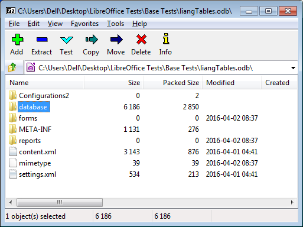
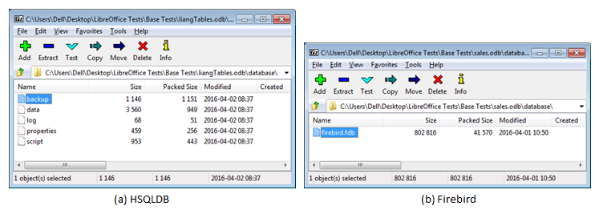
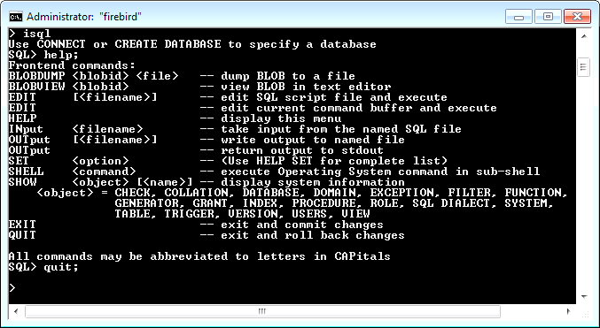

# Chapter 38. Treating an ODB File as a Zipped Folder

!!! note "Topics"
    Extracting a
    Database from an ODB
    File; Querying an
    Extracted HSQLDB
    Database; Querying an
    Extracted Firebird
    Database

    Example folders: "Base
    Tests" and "Utils"


An ODB document can be manipulated as a zipped folder,
using tools such as 7-zip (https://7-zip.org/). This
means that it's possible to use Java zip classes (in the
java.util.zip package) to extract a database from the ODB
file. The advantage of this technique is that the resulting
HSQLDB or Firebird database can be accessed through Java's JDBC without using
the sdbc, sdbcx, or sdb modules in the Office API.

The Office download includes a copy of the HSQLDB database engine (stored in
<OFFICE DIR>\program\classes\hsqldb.jar) so there's no need to download any
software for manipulating HyperSQL databases through JDBC. However, Firebird
programming requires Firebird's embedded engine and its JDBC driver, called
Jaybird.

I'll discuss the details of how to run HSQLDB and Firebird databases after explaining
how to extract them from ODB documents.

EmbeddedQuery.java shows all the top-level stages:

=== "java"
    ```java
    // in EmbeddedQuery.java
    public static void main(String[] args)
    {
      if (args.length != 1) {
        System.out.println("Usage: run EmbeddedQuery <fnm>");
        return;
      }
    
      ArrayList<String> dbFnms = Base.extractEmbedded(args[0]);
      if (dbFnms == null)
        return;
    
      System.out.println("Is this a Firebird embedded database? " +
                              Jdbc.isFirebirdEmbedded(dbFnms));
      System.out.println("Is this an HSQLDB embedded database? " +
                              Jdbc.isHSQLEmbedded(dbFnms));
    
      Connection conn = null;
      try {
        conn = Jdbc.connectToDB(dbFnms);
        if (conn == null)
          return;
    
        ArrayList<String> tableNames = Jdbc.getTablesNames(conn);
        System.out.println("No. of tables: " + tableNames.size());
        System.out.println( Arrays.toString(tableNames.toArray()));
    
        ResultSet rs = Jdbc.executeQuery("SELECT * FROM \"" +
                             tableNames.get(0) + "\"", conn);
    
        DBTablePrinter.printResultSet(rs);
        conn.close();
      }
      catch(SQLException e) {
        System.out.println(e);
       }
      // FileIO.deleteFiles(dbFnms);
    }  // end of main()
    ```


## 1.  Extracting a Database from an ODB File

Base.extractEmbedded() first determines if the ODB file contains an embedded
HSQLDB or Firebird database since the unzipping steps are slightly different for each
one.


=== "java"
    ```java
    // in the Base class
    // globals
    public static final int HSQLDB = 1;
    public static final int FIREBIRD = 2;
    public static final String HSQL_EMBEDDED = "sdbc:embedded:hsqldb";
    public static final String FIREBIRD_EMBEDDED =
                                             "sdbc:embedded:firebird";
    
    
    public static ArrayList<String> extractEmbedded(String fnm)
    {
      String embedFnm = getEmbeddedFnm(fnm);
      if (embedFnm == null) {
        System.out.println(fnm + " is not an embedded
                                          HSQL/Firebird database");
        return null;
      }
      else if (embedFnm.equals(HSQL_EMBEDDED)) {
        System.out.println(fnm + " is an embedded HSQL database");
        return unzipFiles(fnm, HSQLDB);
      }
      else if (embedFnm.equals(FIREBIRD_EMBEDDED)) {
        System.out.println(fnm + " is an embedded Firebird database");
        return unzipFiles(fnm, FIREBIRD);
      }
      else {
        System.out.println(fnm + " holds an unknown embedded db: " +
                                                           embedFnm);
        return null;
      }
    }  // end of extractEmbedded()
    ```

In earlier chapters I retrieved the database type by examining the connection
properties of the driver, but I don't want to use that technique here since it requires the
Office API. One alternative is to look for information inside the ODB document.

If an ODB file is opened as a zipped folder, the top-level always contains a
content.xml file and a database/ folder, as in Figure 1.




Figure 1. Inside an ODB Document.


content.xml stores information about the database type inside its <db.connection-
resource> element. The "xlink:href" attribute is assigned "sdbc:embedded.hsqldb" for
an embedded HSQLDB database, and "sdbc:embedded:firebird" for embedded
Firebird.

The "xlink:href" attribute inside content.xml for the liangTable.odb document is
shown in Figure 2, which indicates that it's an embedded HSQLDB database.


Figure 2. Part of content.xml for liangTables.odb.


Incidentally, I used a Notepad++ plugin called XMLTools to format the XML in
Figure 2, which makes it much easier to read.

Base.getEmbeddedFnm() unzips content.xml so the "xlink:href" attribute of the
<db.connection-resource> element can be extracted:

=== "java"
    ```java
    // in the Base class
    // globals
    public static final String TEMP_DIR = "baseTmp/";
    
    public static String getEmbeddedFnm(String fnm)
    {
      FileIO.makeDirectory(TEMP_DIR);
      String contentFnm = TEMP_DIR + "content.xml";
      if (unzipContent(fnm, contentFnm)) {
        String embedRes = getEmbeddedResource(contentFnm);
        FileIO.deleteFile(contentFnm);
        return embedRes;
      }
      else {
        System.out.println("Could not find content.xml inside " + fnm);
        return null;
      }
    }  // end of getEmbeddedFnm()
    ```

Base.unzipContent() extracts content.xml, storing it temporarily in the baseTmp/
subdirectory. Base.getEmbeddedResource() accesses the <db.connection-resource>
element inside the file, returning the string assigned to its "xlink:href" attribute. This
value may be null if the attribute isn't present, or it may contain the URL string of an
external database.

Back in Base.extractEmbedded(), if the document contains an embedded database
then the next step is to copy the database files from the zipped file into the baseTemp/
folder.

The extraction details are similar but not quite the same for embedded HSQLDB and
Firebird databases, as can be seen by looking inside the database/ folders for the two
kinds of database. Figure 3 shows the contents of an HSQLDB database/ folder on the
left and a Firebird database/ folder on the right.




Figure 3. Contents of a HSQLDB database/ folder (a)
and a Firebird database/ folder (b).


A HSQLDB database consists of several files (called backup, data, log, properties,
and script) while the Firebird database is just one file (firebird.fdb).

The HSQLDB "script" file contains table definitions, and the data for non-cached
tables, while the "data" file contains the data for cached tables. The "backup" file is a
compressed backup of the last known consistent state of the data file. The "log" file
contains recent changes to the database, and the "properties" file stores database
settings.

Base.unzipFiles() unzips all of the files it finds inside database/, but changes the
names of the HSQLDB files so they are all called "hsqlDatabase" but with different
extensions based on their zip names. The new names are hsqlDatabase.backup,
hsqlDatabase.data, hsqlDatabase.log, hsqlDatabase.properties, and
hsqlDatabase.script, which makes them easy for JDBC to load at run time. No change
is made to the name of the extracted firebird.fdb file.

Base.extractEmbedded() returns a list of the files it has extracted from the ODB file.
Back in EmbeddedQuery.java, Jdbc.isFirebirdEmbedded() and
Jdbc.isHSQLEmbedded() examine this list to determine what kind of database was
retrieved.


## 2.  Querying an Extracted HSQLDB Database

There's no need to use Base inside EmbeddedQuery.java; all database manipulations
can be done with JDBC, along with the help of my Jdbc.java support class.

The relevant lines in EmbeddedQuery.java are:

=== "java"
    ```java
    // part of EmbeddedQuery.java...
    Connection conn = null;
    try {
      conn = Jdbc.connectToDB(dbFnms);
      if (conn == null)
        return;
    
      ArrayList<String> tableNames = Jdbc.getTablesNames(conn);
      System.out.println("No. of tables: " + tableNames.size());
      System.out.println( Arrays.toString(tableNames.toArray()));
    
      ResultSet rs = Jdbc.executeQuery("SELECT * FROM \"" +
                               tableNames.get(0) + "\"", conn);
    
      // Jdbc.printResultSet(rs);
      DBTablePrinter.printResultSet(rs);
      // Jdbc.displayResultSet(rs);
    
      conn.close();
    }
    ```

I won’t bother describing most of my Jdbc.java support methods (e.g.
getTablesNames(), executeQuery(), printResultSet(), and displayResultSet()) since
they're virtually identical to the same-named Base.java methods. The main difference
is that they use JDBC's Connection, Statement, and ResultSet classes instead of sdbc's
XConnection, XStatement, and XResultSet interfaces. I'm also using Hami Galip
Torun's original DBTablePrinter class rather than my modified BaseTablePrinter
version.

Jdbc.connectToDB() uses Jdbc.isHSQLEmbedded() and Jdbc.isFirebirdEmbedded()
to decide which connect methods are used for HSQLDB and Firebird.

=== "java"
    ```java
    // in the Jdbc class
    public static Connection connectToDB(ArrayList<String> fnms)
    {
      if (isHSQLEmbedded(fnms))
        return connectToHSQL(Base.TEMP_DIR + Base.HSQL_FNM);
      else if (isFirebirdEmbedded(fnms))
        return connectToFB(Base.TEMP_DIR + Base.FB_FNM + ".fdb");
      else {
        System.out.println("Unrecognized embedded database");
        return null;
      }
    }  // end of connectToDB()
    ```

I'll explain the details of connectToHSQL() here, and connectToFB() in the next
section.

The HSQLDB website (https://hsqldb.org/) contains a lot of documentation on how to
utilize JDBC, but one thing to remember is that Office's hsqldb.jar is version 1.8 of
the engine. The most prominent documentation at the HSQLDB website is for the
current version (v.2.3 as I write this). Fortunately, the older 1.8. documentation is still
around, beginning at https://hsqldb.org/doc/1.8/guide/, and a short JDBC
example is in Appendix B at https://hsqldb.org/doc/1.8/guide/apb.html.
Jdbc.connectToHSQL() is based on that example:

=== "java"
    ```java
    // in the Jdbc class
    public static Connection connectToHSQL(String filePath)
    {
     Connection conn = null;
      try {
        Class.forName("org.hsqldb.jdbcDriver");
        conn = DriverManager.getConnection("jdbc:hsqldb:file:" +
                                filePath +
                                ";shutdown=true",  "SA", "");
               // force db closure (shutdown) at connection close
               // otherwise data, log and lock will not be deleted
      }
      catch (ClassNotFoundException e) {
        System.out.println("Failed to load JDBC-HSQLDB driver");
      }
      catch(SQLException e) {
        System.out.println(e);
      }
      return conn;
    }  // end of connectToHSQL()
    ```

#### Using HSQLDB Interactively: SqlTool

It's useful to be able to examine a database without having to write Java code first;
HSQLDB includes SqlTool for that purpose.

SqlTool is explained at length in chapter 8 of the user guide for HSQLDB 1.8 at
https://hsqldb.org/doc/1.8/guide/ch08.html. It's also possible to get help at
runtime by calling hsqldb.jar with the "--help" argument:

=== "java"
    ```java
    java -jar <OFFICE>\program\classes\hsqldb.jar --help
    ```

Figure 4 shows the help generated when the JAR file is called inside the
<OFFICE>\program\classes folder.


Figure 4. Using SqlTool inside hsqldb.jar.


## 3.  Querying an Extracted Firebird Database

Accessing a Firebird database without passing through the Office API is a bit more
work than for HSQLDB since there's no JAR file inside Office containing the
necessary JDBC driver.

The easiest thing is to download the embedded version of Firebird from
https://firebirdsql.org/en/downloads/, making sure to grab either the 32-bit or 64-
bit version for your OS. This should be unzipped to a convenient location (e.g.
d:\firebird), and the path added to Window's PATH environment variable.


!!! Bug

    When I added Firebird 2.5.5 to PATH this caused a problem
    whenever I subsequently opened embedded Firebird databases in Base! Office
    issued a Runtime error r6034, related to the Microsoft Visual C++ runtime
    library. This is triggered by the presence of a mscvcr80.dll file in the
    downloaded firebird/ directory which duplicates one in Windows.
    
    One solution is to move Microsoft.VC80.CRT.manifest, msvcp80.dll, and
    msvcr80.dll (i.e. three files) from the firebird/ directory to some other location
    (e.g. into an UNUSED/ directory in firebird/).


The JDBC driver, called Jaybird, is a separate download from
https://firebirdsql.org/en/jdbc-driver/. This should be unzipped to a convenient
location (e.g. d:\jaybird).

There's no need to add Jaybird to the classpath of the javac.exe compiler, but calls to
java.exe must include the location of its JAR and associated DLL. For example,
run.bat in the Base Tests/ folder calls java.exe like so:

=== "java"
    ```java
    java  -cp "%LO%\program\classes\*;%LO%\URE\java\*;
               ..\Utils;D:\jna\jna-4.1.0.jar;
               D:\jna\jna-platform-4.1.0.jar;
               D:\jaybird\jaybird-full-2.2.10.jar;."
          -Djava.library.path="D:\jaybird" %*
    ```

The information in bold allows Jdbc.connectToFB() to find the JDBC driver at run
rime:

=== "java"
    ```java
    // in the Jdbc class
    public static Connection connectToFB(String filePath)
    {
      Connection conn = null;
      try {
        Class.forName("org.firebirdsql.jdbc.FBDriver");
        conn = DriverManager.getConnection(
                 "jdbc:firebirdsql:embedded:" + filePath,
                                          "sysdba", "masterkey");
      }
      catch (ClassNotFoundException e) {
        System.out.println("Failed to load JDBC-Firebird driver");
      }
      catch(SQLException e) {
        System.out.println(e);
      }
      return conn;
    }  // end of connectToFB()
    ```

Note that the DriverManager.getConnection() call requires the system admin's default
login and password, "sysdba" and "masterkey".


#### Using Firebird Interactively: isql

It's useful to be able to examine a database without writing Java code. Firebird offers
isql.exe for that purpose, but it's not included in the embedded Firebird download.
The 'simplest' way of adding it is to download the zipped version of the full firebird
system (called "Classic, Superclassic & Superserver"), and unzip only isql.exe which
is in the bin/ directory. Copy isql.exe to the embedded firebird directory on your
machine (e.g. into d:\firebird), and make a copy of the fbembed.dll file in that folder,
renaming it to fbclient.dll.

The isql manual is online at https://firebirdsql.org/manual/isql.html. isql also has
built-in help, as shown in Figure 5.




Figure 5. Using help inside isql.exe.