# Chapter 39. Forms API Overview

!!! note "Topics"
    An Overview of
    the Forms API;
    Examining a Text-based
    Form; Attaching
    Listeners to a View

    Example folders: "Forms
    Tests" and "Utils"


Forms are usually found in Writer documents, or as data
entry interfaces for Base, although they can also be
employed in Draw, Impress, and Calc. Although Base
forms are typically employed as front-ends to databases,
the same capability is available in Writer and the other
Office applications.

The LibreOffice "Getting Started Guide" (available at https://th.libreoffice.org/get-help/documentation)
describes the form features of Writer and Base in chapters 4 and
8.  Longer examples can be found in the "Writer Guide" and "Base Handbook"
documents.

Chapter 15 of the "Writer Guide" explains how to create a form using the "Form
Controls " and "Form Design" toolbars; it's essentially a matter of dragging check
boxes, buttons, text fields, pull-down lists, and other controls, onto a form canvas.
Properties associated with a control, such as its name, text label, and position, are set
by right clicking to access a properties dialog window.

An important use of Writer forms is to create editable PDF forms. This doesn't
involve anything more than remembering to save the form-filled document as a PDF
file when it's finished. There are several online tutorials that explain the details, such
as "Create PDF Forms with OpenOffice" at
https://foersom.com/org/HowTo/OoCreatePdfForm.html; although it's written for
OpenOffice, it can be applied to LibreOffice without change.

Chapter 4 of the "Base Handbook" explains how to create a data input form for a
library loans database, and much of the GUI interface of control toolbars, form
canvas, and property dialogs is identical to that found in Writer. Even if you're only
creating a text-based form, it's well worth reading the Base chapter because it goes
into detail about the General, Data, and Events tab in the properties dialog.

A somewhat simpler example, which is purely text-based without data sources, can be
found at https://openoffice.blogs.com/forms_fromscratch.pdf. I used this article (which
is titled "Creating Forms from Scratch") to create the scratchExample.odt file used
here.


## 1.  Why Bother Programming Forms?

It's very easy to build a form using Office's "Form Controls " and "Form Design"
toolbars. The GUI provides immediate feedback on how things will look by switching
design mode on (where you're building the form) and off (to see how the form will
look to a user).

Nevertheless, manipulating a form from code can be useful. This chapter starts with
an overview of the forms API, and then looks at how data input into an existing form
can be processed using listeners. This isn't the standard way of adding behavior to
forms; that capability is typically handled by macros coded in Office Basic (for
example, see chapter 13 of "Getting Started with LibreOffice" and chapter 9 of the
"Base Handbook"). I'll be looking at how to code form macros in Chapters 48 and 49.

The next chapter, Chapter 40, will look at how a form can be constructed at run time
by programmatically adding controls to a new text document. The form is linked to a
local database, and table and list box controls access its tables in different ways. In
addition, a variety of listeners are attached to the controls.


## 2.  An Overview of the Forms API

A key principle behind the forms API is the Model-View-Controller (MVC) pattern
(e.g. see
https://en.wikipedia.org/wiki/Model%E2%80%93view%E2%80%93controller) which
divides each form control in two: a model (or component) representing the control's
data, and a view for its GUI. Figure 1 shows the forms MVC model in detail.


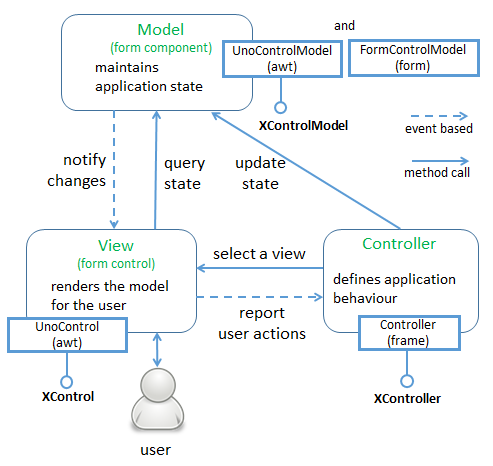

Figure 1. The Form API's MVC Model.


The third part of MVC, the controller, links the model and view inside an application.
There might be multiple views attached to a model (i.e. different renderings of the
same data), and the controller mediates between a view and the model when the user
tries to change its state (for instance by typing data into a text field).

The thick-edged boxes next to the Model, View and Controller rounded rectangles in
Figure 1 represent the main Office services and interfaces that implement the model,
view and controller.


### 2.1.  Control Confusion

The two uses of the word "control" in the API can be confusing. When the
documentation refers to a control by name, such as a "button control" or "text field
control", then it typically means the data and rendering parts taken as a whole. For
example, "button control" includes the button's on-screen appearance and its state.
However, when the API only talks about a "control" then this usually means the
services and interfaces related to its appearance. If the API refers to a control's
"model" then it means its state.

Another problem with understanding the forms API is that its functionality is spread
across several modules and submodules. The form module contains many services,
interfaces, and seven submodules, which are listed in Table 1.


|Form Submodule|Purpose                                                |
|--------------|-------------------------------------------------------|
|binding       |collects functionality for binding form controls to    |
|              |external data sources                                  |
|component     |collects form control model descriptions               |
|control       |collects form control descriptions                     |
|inspection    |collects services for inspecting form/components       |
|runtime       |collects functionality needed during a form's runtime  |
|submission    |collects functionality for submitting forms to external|
|              |data sinks                                             |
|validation    |collects functionality to validate form components by  |
|              |help of external validator instances                   |

Table 1. Submodules of the Form Module.


To simplify matters, I'm only going to describe two of the submodules:
form.component which holds the model-related services, and form.control for the
view-related services.

But there's more modules to browse! Figure 2 shows the main services and interfaces
used to define a button.


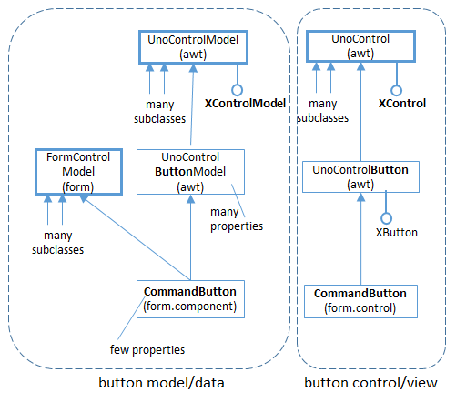

Figure 2. Form Services and Interfaces for a Button.


Four modules are mentioned in Figure 2, written in brackets inside the service
rectangles. There's a CommandButton service in form.component and a second
CommandButton in form.control. An examination of these services (and most other
services in form.component and form.control) reveal them to be basically empty. The
real 'action' is elsewhere, up in the form module's FormControlModel service, and
over in Office's very large awt module, which implements its version of Java's AWT.

The names of the services start to become a little unclear at this point since the words
"Control" and "Model" often appear together (e.g. in FormControlModel,
UnoControlButtonModel, and UnoControlModel). My advice is to remember that
"Model beats Control" . If a class name includes the word "Model", then it's
probably for the model/data part of the control. If the name contains only "Control"
then it's most likely for the rendering/appearance or listener part of the control.

For example, UnoControlButtonModel is where the button's data is defined, as a
lengthy collection of properties. You can quickly view its documentation with
`lodoc UnoControlButtonModel`. UnoControlButton is for the button's GUI (see
`lodoc UnoControlButton`). Most of the functionality for a button is accessed through its
XButton interface, which allows a listener to be attached to the button.

Every model (e.g. CommandButton in form.component) inherits the
FormControlModel service in the form module. This links the control into the
surrounding form.


### 2.2.  More Information on the API

The principal documentation on the forms API is chapter 13 of the Developer's Guide
available as
https://wiki.openoffice.org/w/images/d/d9/DevelopersGuide_OOo3.1.0.pdf.
Alternatively, you can read the chapter online, starting at
https://wiki.openoffice.org/wiki/Documentation/DevGuide/Forms/Forms (or use
`loGuide Forms`). The guide's form examples are at
https://api.libreoffice.org/examples/DevelopersGuide/examples.html#Forms.


## 3.  Examining a Text-based Form

ExamineForm.java opens a text document containing a form, and attaches button and
text field listeners to every button and text field control.

Figure 3 shows most of the important data structures used by a form.


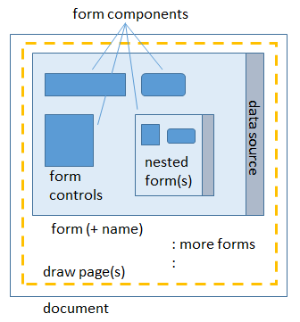

Figure 3. The Form Data Structures.


A form is stored in a draw page associated with the document. A draw page can
manage multiple forms, which can be accessed by index or by name (the default form
is called "Form"). In some types of Office documents, it's possible to have multiple
draw pages.

A form contains controls, such as buttons, text fields, and tables, and also nested
forms. Collectively, controls and nested forms are known as form components, and
are organized into a tree hierarchy in the draw page. At the lowest level, each basic
form control is represented by a control shape, a specialized kind of DrawPage shape.

A data source, such as a database, may be attached to a form, which its controls can
access using SQL queries.

Figure 4 gives a high-level view of how ExamineForm.java "digs down" into a
document to access each control's model and view.


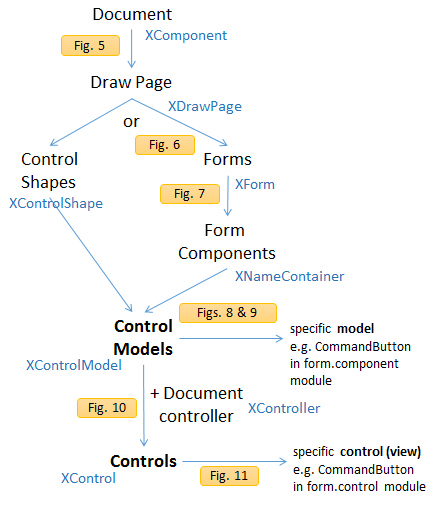

Figure 4. From Document to Control Model and View.


The words connected by the arrows correspond (in most cases) to services in the
forms API; the names in blue are the interfaces associated with those services. The
"Fig. X" rounded rectangles refer to figures later in this chapter which give more
detail about how the API links from one service to the next.

Figure 4 starts with the document, and ends with references to a control's model and
view services. For example, the services for a button are the CommandButton classes
in the form.component and form.control modules.

Figure 4 has a branch point at the DrawPage service (it's labeled with the word "or")
since there are two ways of using the API to get from a draw page to control models.
The branch on the left examines the control shapes in the DrawPage, while the branch
on the right examines the form components.

I've decided not to explain the the left branch, although it's documented in my
Forms.java utility class. The left branch corresponds to code in the
Forms.getModels2() method.

Most of  Figure 4 is implemented as static methods in the Forms class, which means
that ExamineForm.java is fairly short:

```java
// in ExamineForm.java
public static void main(String args[])
{
  if (args.length != 1) {
    System.out.println("Usage: run ExamineForm <ODT file>");
    return;
  }
  XComponentLoader loader = Lo.loadOffice();
  XComponent doc = Lo.openDoc(args[0], loader);
  if (doc == null) {
    System.out.println("Could not open " + args[0]);
    Lo.closeOffice();
    return;
  }

  ArrayList<XControlModel> models = Forms.getModels(doc);
  System.out.println("No. of control models in form: " +
                                             models.size());
  // examine each model
  for(XControlModel model : models) {
    System.out.println("  " + Forms.getName(model) + ": " +
                              Forms.getTypeStr(model));

    // look at the control for each model
    XControl ctrl = Forms.getControl(doc, model);
    if (ctrl == null)
      System.out.println("   No control found");
    else {   // attach listener if the control is
             // a button or text field
      if (Forms.isButton(model))
        attachButtonListener(ctrl, model);
      else if (Forms.isTextField(model))
        attachTextFieldListeners(ctrl);
    }
  }
  System.out.println();
  GUI.setVisible(doc, true);
  Lo.waitEnter();

  Lo.closeDoc(doc);
  Lo.closeOffice();
}  // end of main()
```

Forms.getModels() and Forms.getControl() will be used in most forms-based
programs. Forms.getModels() returns a list of all the control models in the document.
In terms of Figure 4, it moves from the Document service at the top of the figure to
ControlModel near the bottom. Forms.getControl() completes the descent by
retrieving the control (view) associated with a given model.

If a control is a button or text field than attachButtonListener() or
attachTextFieldListeners() are called. These methods are implemented in
ExamineForm.java, but I'll delay explaining them until I've covered
Forms.getModels() and Forms.getControl().


### 3.1.  From Document to DrawPages

Every Office document supports the OfficeDocument service, and the XModel and
XComponent interfaces. Using XComponent as a starting interface, it's possible to
change the type to XDrawPagesSupplier (or XDrawPageSupplier), which gives access
to the DrawPages (or single DrawPage) inside the document. The cast works because
all Office documents support the GenericDrawingDocument service, as illustrated in
Figure 5.


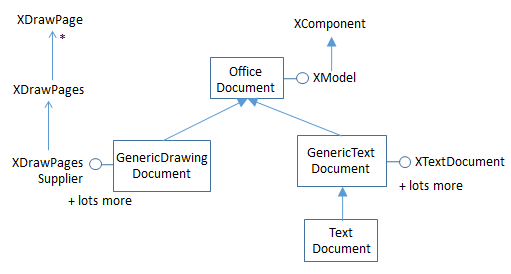

Figure 5. Part of the GenericDrawingDocument Service Hierarchy

The code that implements the cast:

```java
// in the Forms class
public static XNameContainer getForms(XComponent doc)
{
  XDrawPage drawPage = getDrawPage(doc);
  if (drawPage != null)
    return getForms(drawPage);
  else
    return null;
}  // end of getForms()


public static XDrawPage getDrawPage(XComponent doc)
// return the first draw page even if there are many
{
  XDrawPageSupplier xSuppPage =
                Lo.qi(XDrawPageSupplier.class, doc);
  if (xSuppPage != null)
    // this works if doc supports a single DrawPage
    return xSuppPage.getDrawPage();
  else {
    // this means that the doc supports multiple DrawPages
    XDrawPagesSupplier xSuppPages =
                Lo.qi(XDrawPagesSupplier.class, doc);

    XDrawPages xPages = xSuppPages.getDrawPages();
    try {
      System.out.println("Returning first draw page");
      return Lo.qi(XDrawPage.class, xPages.getByIndex(0));
    }
    catch(Exception e) {
      System.out.println(e);
      return null;
    }
  }
}  // end of getDrawPage()
```

Forms.getDrawPage() only returns the first draw page in a document, even if many
pages are available.


### 3.2.  From DrawPage to Form

The XDrawPage interface can be cast to XFormsSupplier which makes the page's
forms accessible. This cast works because of the service hierarchy shown in Figure 6
which links the DrawPage service to GenericDrawPage.


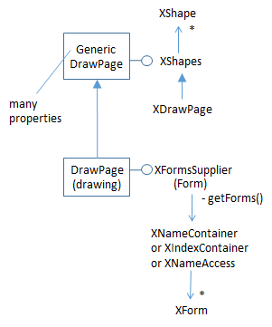

Figure 6. Part of the DrawPage Service Hierarchy.


XFormsSupplier can supply forms as an indexed sequence (an XIndexContainer) or
as an associative array using the form names as keys, returned by Forms.getForms():

```java
// in the Forms class
public static XNameContainer getForms(XDrawPage drawPage)
// get all the forms in the page as a named container
{
  XFormsSupplier formsSupp = Lo.qi(XFormsSupplier.class, drawPage);
  return formsSupp.getForms();
} // end of getForms()

The default form in a draw page is called "Form", and can be extracted by calling
Forms.getForm(doc,"Form"):

// in the Forms class
public static XForm getForm(XComponent doc, String formName)
// get the form called formName
{
   XNameContainer namedForms = getForms(doc);  // see above
   XNameContainer con = getFormByName(formName, namedForms);
   return Lo.qi(XForm.class, con);
}


public static XNameContainer getFormByName(String formName,
                                   XNameContainer namedForms)
// get the form called formName
{ try {
    return Lo.qi(XNameContainer.class,
                       namedForms.getByName(formName));
  }
  catch (Exception e) {
    System.out.println("Could not find form " + formName + ": " + e);
    return null;
  }
}  // end of getFormByName()
```


### 3.3.  From Form to FormComponents

A form is a FormComponents instance, which holds FormComponent instances (i.e.
basic controls) and nested FormComponents (i.e. nested forms). Figure 7 shows a
simplified service hierarchy for Form, FormComponents, and FormComponent.


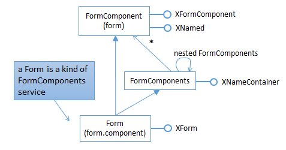

Figure 7. Part of the Form Service Hierarchy.

Forms.getModels() collects all the FormComponent instances as a list by recursively
searching from the top level form (or forms) through all the nested forms :

```java
// in the Forms class
public static ArrayList<XControlModel> getModels(XComponent doc)
{ XNameContainer formNamesCon = getForms(doc);  // see above
  return getModels(formNamesCon);
}


public static ArrayList<XControlModel> getModels(
                                         XNameAccess formNamesCon)
{
  ArrayList<XControlModel> models = new ArrayList<XControlModel>();
  String nms[] = formNamesCon.getElementNames();
  for (int i=0; i < nms.length; i++) {
    try {
      XServiceInfo servInfo = Lo.qi(XServiceInfo.class,
                                  formNamesCon.getByName(nms[i]));
      if (servInfo.supportsService(
                             "com.sun.star.form.FormComponents")) {
        // this means that a nested form has been found
        XNameAccess childCon = Lo.qi(XNameAccess.class, servInfo);
        models.addAll( getModels(childCon) );//recursively search it
      }
      else if (servInfo.supportsService(
                             "com.sun.star.form.FormComponent")) {
        XControlModel model = Lo.qi(XControlModel.class, servInfo);
        models.add(model);
      }
    }
    catch(Exception e)
    {  System.out.println("Could not access " + nms[i]);  }
  }
  return models;
}  // end of getModels()
```

The first Forms.getModels() method extracts the top-level form (or forms) from the
document as a named container, then passes it to the recursive getModels() which
iterates through the container. If an element is a FormComponents instance then it's a
nested form, and getModels() is called recursively to collect its controls. If the
element is of type FormComponent then it's an ordinary control.


### 3.4.  From FormComponent to Control Model

A FormComponent instance can be cast to XControlModel:

```java
XControlModel model = Lo.qi(XControlModel.class, servInfo);
```

XControlModel first appeared at the top of Figure 2 on the left – it’s the interface
inherited by all models.

The casting is possible because every control model service (e.g. CommandButton in
the form.component module) inherits both FormComponent and UnoControlModel,
as depicted by Figure 8.


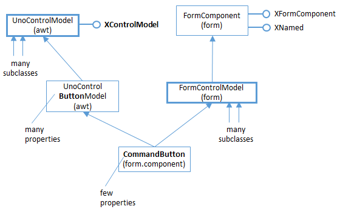

Figure 8. Part of the Service Hierarchy for the CommandButton Model.


Every model has a hierarchy similar to CommandButton's in Figure 8. For example,
the text field control model hierarchy appears in Figure 9.


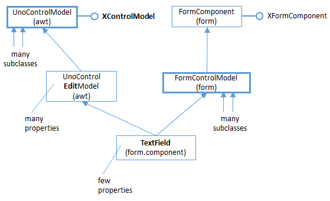

Figure 9. Part of the Service Hierarchy for the TextField Model.


Figures 8 and 9 depict two important coding features. One is that it's possible to cast
between a form component and a control model, as demonstrated by
Forms.getModel() shown above. The other is that a model's data is stored in its
properties, and most of those are NOT in the model's service (i.e. not in
CommandButton and TextField). Most model properties are in superclasses (i.e.

UnoControlButtonModel in Figure 8 and UnoControlEditModel in Figure 9), which
are located in the awt module.


### 3.5.  Using a Control Model

Returning to ExamineForm.java, the relevant bit of code is:

```java
// part of ExamineForm.java...

ArrayList<XControlModel> models = Forms.getModels(doc); // see above
System.out.println("No. of control models in form: " +
                                           models.size());
// examine each model
for(XControlModel model : models) {
  System.out.println("  " + Forms.getName(model) + ": " +
                            Forms.getTypeStr(model));
  :
}
```

An XControlModel reference can be utilized in various ways, but two of the main
ones are examining its subclass service type and accessing its properties. As Figures 8
and 9 indicate, most of a control's properties are in the UnoControlXXXModel
service, but may come from other services which can be hard to locate. For example,
"Name" is from UnoControlDialogElement, a superclass of UnoControlModel (which
I didn't include in Figures 8 and 9). "ClassId" comes from FormControlModel, which
is on the "forms branch" of the service hierarchies in the figures.

The easiest thing is to print all the model's properties, by calling
Props.showObjProps():

```java
Props.showObjProps("Model", model);
```

Info.showInterfaces() and Info.showServices() are similarly useful, listing all the
interfaces and services for a model:

```java
Info.showInterfaces("Model", model);
Info.showServices("Model", model);
```

The Forms.getName() and Forms.getTypeStr() methods called in the code fragment
above are defined as:

```java
// in the Forms class
public static String getName(XControlModel cModel)
// returns the name of the given form component
{  return (String) Props.getProperty(cModel, "Name");  }


public static String getTypeStr(XControlModel cModel)
{
  int id = getID(cModel);
  if (id == -1)
    return null;

  XServiceInfo servInfo = Lo.qi(XServiceInfo.class, cModel);
  switch (id) {
    case FormComponentType.COMMANDBUTTON:
      return "Command button";
    case FormComponentType.RADIOBUTTON:
      return "Radio button";
    case FormComponentType.IMAGEBUTTON:
      return "Image button";
    case FormComponentType.CHECKBOX:
      return "Check Box";
    case FormComponentType.LISTBOX:
      return "List Box";
    case FormComponentType.COMBOBOX:
      return "Combo Box";
    case FormComponentType.GROUPBOX:
      return "Group Box";
    case FormComponentType.FIXEDTEXT:
      return "Fixed Text";
    case FormComponentType.GRIDCONTROL:
      return "Grid Control";
    case FormComponentType.FILECONTROL:
      return "File Control";
    case FormComponentType.HIDDENCONTROL:
      return "Hidden Control";
    case FormComponentType.IMAGECONTROL:
      return "Image Control";
    case FormComponentType.DATEFIELD:
      return "Date Field";
    case FormComponentType.TIMEFIELD:
      return "Time Field";
    case FormComponentType.NUMERICFIELD:
      return "Numeric Field";
    case FormComponentType.CURRENCYFIELD:
      return "Currency Field";
    case FormComponentType.PATTERNFIELD:
      return "Pattern Field";
    case FormComponentType.TEXTFIELD:
      // two services with this class id:
      // text field and formatted field
      if ((servInfo != null) && servInfo.supportsService(
                     "com.sun.star.form.component.FormattedField"))
        return "Formatted Field";
      else
        return "Text Field";
    default:
      System.out.println("Unknown class ID: " + id);
      return null;
  }
}  // end of getTypeStr()


public static int getID(XControlModel cModel)
{
  // get the ClassId property
  Short classId = (Short) Props.getProperty(cModel, "ClassId");
  if (classId == null) {
    System.out.println("No class ID found for form component");
    return -1;
  }
  return classId.intValue();
}  // end of getID()
```

Forms.getID returns the "ClassId" integer, which is checked by getTypeStr() against
values in the FormComponentType enumeration, and mapped to more informative
strings.

Forms.getID() is utilized in a similar manner in a series of boolean isXXX() methods,
such as isButton() and isTextField():

```java
// in the Forms class
public static boolean isButton(XControlModel cModel)
{
  int id = getID(cModel);
  if (id == -1)
    return false;
  else
    return ((id == FormComponentType.COMMANDBUTTON) ||
            (id == FormComponentType.IMAGEBUTTON));
}  // end of isButton()


public static boolean isTextField(XControlModel cModel)
{
  int id = getID(cModel);
  if (id == -1)
    return false;
    else
    return ((id == FormComponentType.DATEFIELD) ||
            (id == FormComponentType.TIMEFIELD) ||
            (id == FormComponentType.NUMERICFIELD) ||
            (id == FormComponentType.CURRENCYFIELD) ||
            (id == FormComponentType.PATTERNFIELD) ||
            (id == FormComponentType.TEXTFIELD));
}  // end of isTextField()
```


### 3.6.  From Control Model to View

Having obtained a form's model, it's view becomes accessible, but following the
MVC pattern, this requires the use of Office's controller (see Figure 1). One way to
reach the controller is through a document reference (XComponent) and
XModel.getCurrentController(). The resulting XController interface can be cast to
XControlAccess, due to the service hierarchy shown in Figure 10.


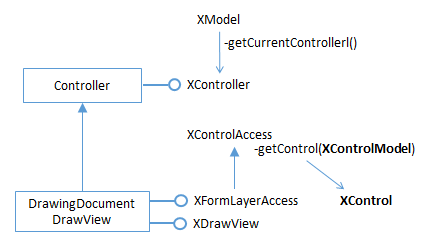

Figure 10. Part of the DrawingDocumentDrawView Service Hierarchy.


These steps are implemented by GUI.getControlAccess():

```java
// in the GUI class
public static XControlAccess getControlAccess(XComponent doc)
{ return Lo.qi(XControlAccess.class, getCurrentController(doc)); }


public static XController getCurrentController(XComponent doc)
{
  XModel model = Lo.qi(XModel.class, doc);
  if (model == null) {
    System.out.println("Document has no data model");
    return null;
  }
  return model.getCurrentController();
}

Forms.getControl() employs XControlAccess.getControl() to return the model's view
when supplied with a model:

// in the Forms class
public static XControl getControl(XComponent doc,
                                       XControlModel cModel)
{ XControlAccess controlAccess = GUI.getControlAccess(doc);
                                 // see above
  if (controlAccess == null) {
    System.out.println("Could not obtain controls access");
    return null;
  }
  try {
    return controlAccess.getControl(cModel);
  }
  catch (Exception e) {
    System.out.println("Could not access control: " + e);
    return null;
  }
}  // end of getControl()
```


## 4.  Attaching Listeners to a View

XControl is an interface of the UnoControl service, which represents an abstract
control. This class must be cast to a service for a real control, such as
UnoControlButton or UnoControlEdit in order to call listener methods in XButton or
XTextComponent. This hierarchy is illustrated by Figure 11.


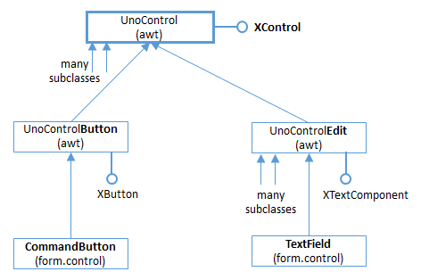

Figure 11. Part of the Service Hierarchy Below UnoControl.


Back in ExamineForm.java, every button or text field has listeners attached to it:

```java
// part of ExamineForms.java...

    :
// look at the control for each model
XControl ctrl = Forms.getControl(doc, model);
if (ctrl == null)
  System.out.println("   No control found");
else {   // attach listener if the control is a button or text field
    if (Forms.isButton(model))
      attachButtonListener(ctrl, model);
    else if (Forms.isTextField(model))
      attachTextFieldListeners(ctrl);
}
    :
```

attachButtonListener() and attachTextFieldListener() implement the casting shown in
Figure 11, starting with an XControl interface. For instance, attachButtonListener()
connects an anonymous XActionListener object to a button, and sets its action
command to be the button's label:

```java
// in ExamineForms.java
private static void attachButtonListener(XControl ctrl,
                                       XControlModel cModel)
{ XButton xButton = Lo.qi(XButton.class, ctrl);
  // XControlModel cModel = ctrl.getModel();
  xButton.setActionCommand( Forms.getLabel(cModel));

  xButton.addActionListener( new XActionListener() {
    public void disposing(com.sun.star.lang.EventObject ev) {}

    public void actionPerformed(ActionEvent ev)
    {  System.out.println("Pressed \"" + ev.ActionCommand + "\""); }
  });
}  // end of attachButtonListener()
```

Although XActionListener and Java's ActionListener are similar, they're not the same.
For one thing, its necessary to define two methods in XActionListener,
actionPerformed() and disposing().

Office supports over 120 kinds of listeners! The best place to browse through them is
on the documentation webpage for their common superclass, XEventListener.
`lodoc XEventListener` should take you to XEventListener in the document module, but
you want its superclass, XEventListener in the lang module. The first part of its long
webpage is shown in Figure 12.


Figure 12. The First Part of the XEventListener Documentation Page
in the lang Module.


Although the clickable images on the LibreOffice webpages make moving around the
service and interface hierarchies very easy, they're not searchable. When the hierarchy
is very large (as for XEventListener), and not sorted in alphabetical order, it can be
time-consuming to find a particular subclass.

I solved the problem by creating a text file, called XEventListenerSubclasses.txt,
which lists the subclasses of XEventListener in order, and is searchable of course.
You can find it in the Forms Tests/ folder for this chapter.

Alternatively, almost all the listeners for controls are defined in the awt module, so
you can search that module's documentation page (accessible using `lodoc awt module`).

attachTextFieldListeners() attaches two listeners to a text field control because
XTextListener isn't triggered when the user types <ENTER>. My solution is to
connect an XFocusListener which treats <ENTER> as a "lost focus" event when the
cursor leaves the text field. The code for attachTextFieldListeners():

```java
// in ExamineForms.java
private static void attachTextFieldListeners(XControl ctrl)
// listen for text changes and focus changes in the control
{
  XTextComponent tc = Lo.qi(XTextComponent.class, ctrl);
  tc.addTextListener( new XTextListener() {
    public void textChanged(TextEvent ev)
    {
      XControlModel cModel = Forms.getEventControlModel(ev);
      System.out.println( Forms.getName(cModel) +
                 " text: " + Props.getProperty(cModel, "Text"));
    }  // end of textChanged()

    public void disposing(EventObject ev) {}

  });

  XWindow tfWindow = Lo.qi(XWindow.class, ctrl);
  tfWindow.addFocusListener( new XFocusListener() {

    public void focusLost(FocusEvent ev)
    { XControlModel model = Forms.getEventControlModel(ev);
      System.out.println("Leaving text: " +
                          Props.getProperty(model, "Text"));
    }

    public void disposing(EventObject ev) {}  // unused
    public void focusGained(FocusEvent ev) {}
  });

}  // end of attachTextFieldListeners()
```


#### Obtaining the Model

attachButtonListener() and attachTextFieldListeners() demonstrate two ways of
obtaining the control's model when an event triggers a view listener.

In attachButtonListener(), an XControl reference is available, which means that
XControl.getModel() could be called:

```java
XControlModel cModel = ctrl.getModel();
```

In fact that coding isn't used, since the model reference is available already.

attachTextFieldListeners() shows another approach, which is to examine the event
object that arrives at the listener's method (e.g. the FocusEvent object received by
focusLost()). Forms.getEventControlModel() is defined as:

```java
// in the Forms class
public static XControlModel getEventControlModel(EventObject ev)
{
  XControl xControl = Lo.qi(XControl.class, ev.Source);
  return xControl.getModel();
}  // end of getEventControlModel()
```


## 5.  Using ExamineForm.java

ExamineForm.java can be called with any form-based ODT file. The simplest one in
the examples is form1.odt, which consists of only a text field and a button, as shown
in Figure 13.


Figure 13. The form1.odt Form.


When the user types "abc" and <ENTER> into the text field, followed by two clicks
of the "Enter" button, the following is printed:

```
Text Box 1 text: a
Text Box 1 text: ab
Text Box 1 text: abc
Leaving text: abc
Leaving text: abc
Pressed "Enter"
Pressed "Enter"
```

The focus lost event is reported twice because of the <ENTER> key press and the
movement of the mouse by the user from the text field to the button.