# Chapter 44. Office as a GUI Component

!!! note "Topics"
    OOoBean;
    Wrapping OOoBean in a
    JPanel; Using the
    OBeanPanel; Using an
    Undecorated Office
    Window; Augmenting
    the User Interface: a
    New Toolbar Item;
    Augmenting the User
    Interface: a New Menu
    Item

    Example folders: "GUI
    Tests" and "Utils"


This chapter looks at two ways to use Office as a GUI
component for displaying documents in a program.

The first employs Office's OOoBean class: I'll wrap it in a
JPanel to utilize it as part of a Swing application.

The second approach invokes Office in a separate window
from the program, a technique I've used many times in
earlier chapters. The difference this time is that I'll hide
Office's GUI (i.e. its toolbars, menu, and sidebars), leaving
only the document visible. I'll also explore two variations
of this 'blank look': adding a item to a toolbar, and creating
a new menu. These GUI entities aren't permanently added to Office, and are
controlled and monitored by the program.


## 1.  OOoBean

The OOoBean class and its com.sun.star.comp.beans package aren't documented in
LibreOffice, but there's an entire chapter about them in the Developer's Guide
(chapter 16, "JavaBean for Office Components"), at
https://wiki.openoffice.org/w/images/d/d9/DevelopersGuide_OOo3.1.0.pdf, and
https://wiki.openoffice.org/wiki/Documentation/DevGuide/JavaBean/JavaBean_for_Office_Components
(or use `loGuide JavaBean`). The chapter's example,
OOoBeanViewer, wraps OOoBean in an old-style Applet (not a JApplet), and can be
downloaded from
https://api.libreoffice.org/examples/DevelopersGuide/examples.html#OfficeBean.

Another source of information is the OOoBean code at
https://github.com/LibreOffice/core/blob/master/bean/com/sun/star/comp/beans/OOoBean.java.
It's also possible to decompile OOoBean 's JAR file, which you'll find in
<Office>\program\classes\officebean.jar.

As you browse the documentation and source code, you may get the feeling that
OOoBean has been abandoned. It's true that some functionality have been deprecated,
but OOoBean still mostly works. Setting it up is tricky, requiring an undocumented
UNO_PATH environment variable to be set when Office is invoked. Also, integrating
OOoBean with Swing and my LibreOffice support classes required some work.

OOoBean utilizes many parts of the Office API, since it starts Office, loads a
document, and displays it on a Java Canvas. Some of that can be seen in Figure 1
which gives a simplified view of its classes and interfaces.


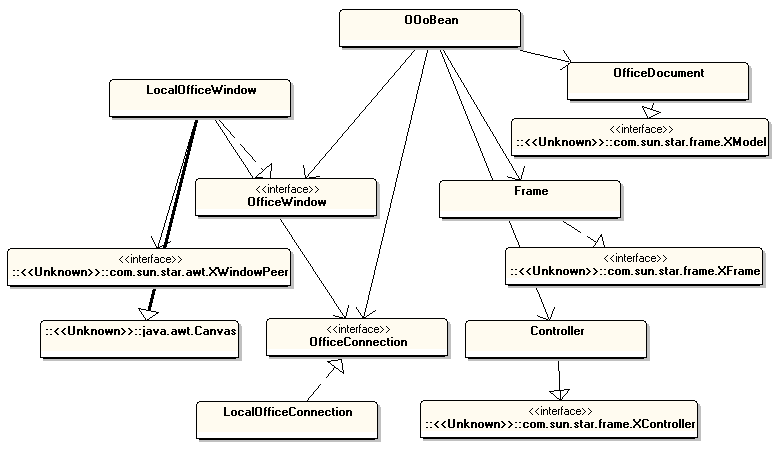

Figure 1. Some of the OOoBean Classes and Interfaces.


The classes without package prefixes are from com.sun.star.comp.beans. For
example, LocalOfficeConnection invokes and connects to Office, while
LocalOfficeWindow renders Office and the loaded document. LocalOfficeWindow's
use of java.awt.Canvas means that the view is a heavyweight, native peer, which
doesn't work well with lightweight Swing components such as drop-down menus, text
fields, and buttons. One solution is to wrap the heavyweight component (i.e. the
Canvas) in a JPanel, which I've done in my OOBeanPanel class described in the next
section.

Frame, Controller, and OfficeDocument are wrappers around com.sun.star.frame's
XFrame, XController, and  XModel, the three elements of Office's Frame-Controller-
Model (FCM) relationship (described in Chapter 1, section 5).

Figure 2 shows OOoBean's public methods, with the deprecated ones highlighted in
light orange and blue.


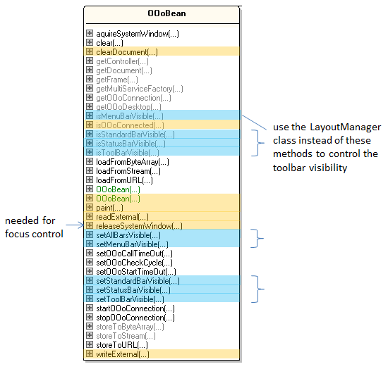

Figure 2. The Public Methods of OOoBean.


Nearly half the methods are deprecated, but only one of them
(releaseSystemWindow()) is required in my code, to deal with a focus switching bug.

The methods marked in light blue all relate to toolbar visibility, and can be handled
better by the LayoutManager service explained later.

There's a table of one-line descriptions of OOoBean's methods in chapter 16 of the
Developer's Guide, and online at
https://wiki.openoffice.org/wiki/Documentation/DevGuide/JavaBean/API_Overview
(or use `loGuide JavaBean "API Overview"`). I'll only explain the methods used in
my OBeanPanel class.


## 2.  Wrapping OOoBean in a JPanel

OBeanPanel wraps an OOoBean instance inside a JPanel so its heavyweight canvas
doesn't affect the rendering of lightweight components in the surrounding application.

The class diagram for OBeanPanel in Figure 3 shows that it's a JPanel subclass, and
implements Office mouse and keyboard listeners.


Figure 3. The OBeanPanel Class Diagram.


The key handling is necessary for coding around a keyboard focus bug. The mouse
handler is included to show how to monitor mouse presses and releases in the
document.

OBeanPanel 's constructor sets up some JPanel attributes (its background color,
dimensions, and start-up  message), calls the OOoBean constructor, and adds the bean
to the panel:

=== "java"
    ```java
    // in the OBeanPanel class
    private int pWidth, pHeight;    // of panel
    private OOoBean oob = null;
    
    private Font msgFont;
    private FontMetrics fontMetric;
    private String message;
    
    
    public OBeanPanel(int w, int h)
    {
      pWidth = w;
      pHeight = h;
    
      setBackground(Color.WHITE);
      setPreferredSize(new Dimension(w, h));
      setLayout(new BorderLayout());
    
      // start-up and finishing message used by panel
      msgFont = new Font("SansSerif", Font.BOLD, 36);
      fontMetric = getFontMetrics(msgFont);
      message = "Waiting for Office...";
    
      oob = new OOoBean();   // doesn't connect to Office;
                             // actually an empty method
      add(oob, BorderLayout.CENTER);
    } // end of OBeanPanel()
    ```

The surprising thing about the OOoBean() method is that its body is empty. In other
words, at this stage, the bean is not connected to Office.

paintComponent() draws the start-up message assigned in OBeanPanel(), which
remains visible until the document is loaded and drawn over that area:

=== "java"
    ```java
    // in the OBeanPanel class
    public void paintComponent(Graphics g)
    // display a message while OOoBean is loaded/unloaded
    {
      super.paintComponent(g);
      Graphics2D g2 = (Graphics2D) g;
      g2.setRenderingHint(RenderingHints.KEY_ANTIALIASING,
                          RenderingHints.VALUE_ANTIALIAS_ON);
    
      int x = (pWidth - fontMetric.stringWidth(message)) / 2;
      int y = (pHeight - fontMetric.getHeight()) / 2;
    
      g2.setColor(Color.BLUE);
      g2.setFont(msgFont);
      g2.drawString(message, x, y);
    }  // end of paintComponent()
    ```

Figure 4 shows the message before a document is loaded.


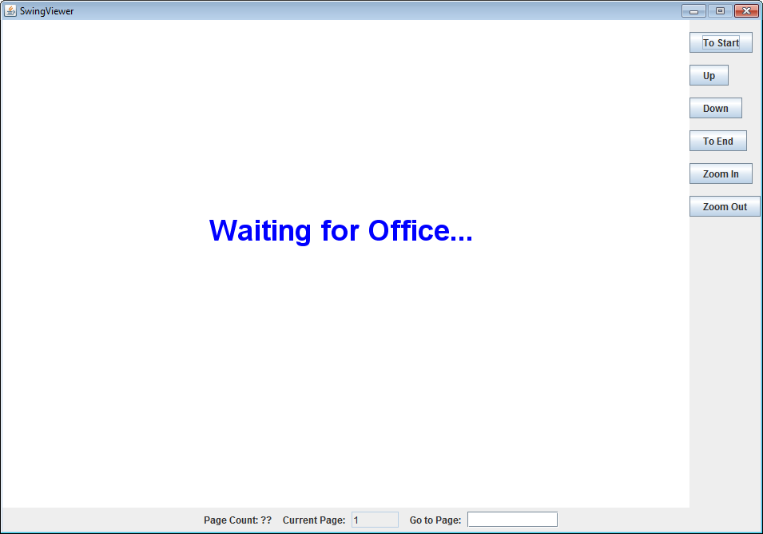

Figure 4. The OBeanPanel without a Document.


The buttons along the right-hand side of Figure 4 and the fields at the bottom are part
of the SwingViewer.java application described later. OBeanPanel manages the large
white rectangle with the "Waiting for Office…" text.

OBeanPanel.loadDoc() calls OOoBean.loadFromURL() to start Office and load and
display the document:

=== "java"
    ```java
    // in the OBeanPanel class
    //globals
    private XComponent doc = null;
    
    
    public XComponent loadDoc(String fnm)
    {
      PropertyValue[] props = Props.makeProps("ReadOnly", true);
      try  {
        String fileURL = FileIO.fnmToURL(fnm);
        oob.loadFromURL(fileURL, props);  // real work done here!
    
        Lo.setOOoBean(oob);   // initialize Lo class so
                              // support classes are useable
        doc = getDoc();
        int docType = Info.reportDocType(doc);
    
        if (docType == Lo.BASE)
          Lo.dispatchCmd(getFrame(), "DBViewTables", null);
                                  // switch to tables view in Base docs
    
        XLayoutManager lm = GUI.getLayoutManager(doc);
        lm.setVisible(false);  // hide all toolbars
    
        // add mouse click & key handlers to the doc
        XUserInputInterception uii = GUI.getUII(doc);
        uii.addMouseClickHandler(this);
        uii.addKeyHandler(this);
    
        revalidate();   // needs a refresh to appear
        Lo.delay(1000);
      }
      catch(java.lang.Exception e)
      {  System.out.println(e);  }
    
      return doc;
    }   // end of loadDoc()
    ```

OOoBean.loadFromURL()'s two arguments are the document's URL and a
"ReadOnly" property since the bean is being used as a viewer.

I want to keep using my support classes, which require the setting of four global
variables in the Lo class. They are normally initialized by Lo.loadOffice() and
Lo.openDoc(), but are copied from OOoBean by Lo.setOOoBean() in this case.


=== "java"
    ```java
    // in the Lo class
    //globals
    // remote component context
    private static XComponentContext xcc = null;
    
    // remote desktop UNO service
    private static XDesktop xDesktop = null;
    
    // remote service managers
    private static XMultiComponentFactory mcFactory = null;
    private static XMultiServiceFactory msFactory = null;
    
    
    @SuppressWarnings("deprecation")
    public static void setOOoBean(OOoBean oob)
    {
      try {
        OfficeConnection conn = oob.getOOoConnection();
                   // the OfficeConnection class is deprecated
        if (conn == null)
          System.out.println("No office connection found in OOoBean");
        else {
          xcc = conn.getComponentContext();
          if (xcc == null)
            System.out.println("No component context in OOoBean");
          else
            mcFactory = xcc.getServiceManager();
    
          xDesktop = oob.getOOoDesktop();
          msFactory = oob.getMultiServiceFactory();
        }
      }
      catch (java.lang.Exception e) {
        System.out.println("Couldn't init LO using OOoBean: " + e);
      }
    }  // end of setOOoBean()
    ```

The suppressed warning annotation stops the Java compiler complaining about
OOoBean's deprecated OfficeConnection class.

Back in OBeanPanel.loadDoc(), a reference to the loaded document is retrieved by
calling OBeanPanel.getDoc():

=== "java"
    ```java
    // in the OBeanPanel class
    public XComponent getDoc()
    {
      XComponent doc = null;
      try {
        XModel xModel = (XModel)oob.getDocument();
        doc = Lo.qi( XComponent.class, xModel);
      }
      catch(java.lang.Exception e)
      { System.out.println("OOBean document could not be accessed");  }
      return doc;
    }  // end of getDoc()
    ```

OOoBean contains many deprecated methods that affect the visibility of Office's
menu bar, standard bar, tools bar, and status bar. The preferred, and more powerful,
approach is to use the LayoutManager service, which is accessed with
GUI.getLayoutManager():

=== "java"
    ```java
    // in the GUI class
    public static XLayoutManager getLayoutManager(XComponent doc)
    {
      XLayoutManager lm = null;
      try {
        XPropertySet propSet =
                 Lo.qi(XPropertySet.class, getFrame(doc));
        lm =  Lo.qi( XLayoutManager.class,
                    propSet.getPropertyValue("LayoutManager"));
      }
      catch (Exception e)
      {   System.out.println("Could not access layout manager");  }
      return lm;
    }  // end of getLayoutManager()
    ```

The XLayoutManager reference is stored in the "LayoutManager" property of the
document's frame. All the toolbars known to the layout manager can be hidden with a
call to XLayoutManager.setVisible():

=== "java"
    ```java
    // part of loadDoc()...
    XLayoutManager lm = GUI.getLayoutManager(doc);
    lm.setVisible(false);  // hide all toolbars
    ```

loadDoc() also assigns the monitoring of the keyboard and mouse to OBeanPanel:

=== "java"
    ```java
    // part of loadDoc()...
    XUserInputInterception uii = GUI.getUII(doc);
    uii.addMouseClickHandler(this);
    uii.addKeyHandler(this);
    ```

The mouse methods don't do much:

=== "java"
    ```java
    // in the OBeanPanel class
    public boolean mousePressed(com.sun.star.awt.MouseEvent e)
    { System.out.println("Mouse pressed (" + e.X + ", " + e.Y + ")");
      return false;    // send event on, or use true not to send
    }
    
    
    public boolean mouseReleased(com.sun.star.awt.MouseEvent e)
    { System.out.println("Mouse released (" + e.X + ", " + e.Y + ")");
      return false;
    }
    ```

Unlike Java listeners, these Office handlers return a boolean to indicate whether the
event should be passed on to other listeners; false means the event should be sent on,
true causes it to be consumed.

The key release handler is similarly short, but the key press handler deals with a
keyboard focus bug:

=== "java"
    ```java
    // in the OBeanPanel class
    public boolean keyReleased(com.sun.star.awt.KeyEvent e)
    { return false; }
    
    
    @SuppressWarnings("deprecation")
    public boolean keyPressed(com.sun.star.awt.KeyEvent e)
    {
      if (oob == null)
        return false;
      try {
        oob.releaseSystemWindow();
               // force focus away from bean;
               // must suppress deprecation warning
        oob.aquireSystemWindow();
    
        // Impress redisplays toolbars; remove them again
        XLayoutManager lm = GUI.getLayoutManager(doc);
        lm.setVisible(false);
    
        Lo.dispatchCmd("LeftPaneImpress",
                    Props.makeProps("LeftPaneImpress", false) );
                    // hide slides pane
      }
      catch(java.lang.Exception ex) {}
      return false;
    }  // end of keyPressed()
    ```

keyPressed() calls OOoBean.releaseSystemWindow() and then
OOoBean.aquireSystemWindow() to force the bean to release the keyboard focus;
this allows the user to select and type text into other text fields, such as the page jump
field in the SwingViewer.java example described below. I found this trick in a forum
post by Martin Illguth at
https://forum.openoffice.org/en/forum/viewtopic.php?f=20&t=63008.

keyPressed() also deals with a side-effect of displaying Impress slides – clicking on a
slide inside the bean causes hidden toolbars and the slides pane to be made visible.
Another call to the layout manager deals with the toolbars, but the slides pane, which
isn't a toolbar, is hidden with a ".uno:LeftPaneImpress" dispatch.


## 3.  Using the OBeanPanel

Figure 4 shows SwingViewer.java at start-up; the buttons on the right are for quickly
moving through a multi-page (or multi-slide) document, and for zooming in and out
on a document. The controls at the bottom show the number of pages (or slides) in the
document, and allow the user to jump to a specified page/slide number. Figure 5
shows the controls in close-up.


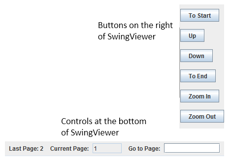

Figure 5. The Buttons and Page Controls in SwingViewer.


Aside from text documents and slide decks, SwingViewer can load Draw, Calc, and
Base files; Figure 6 shows a sample.


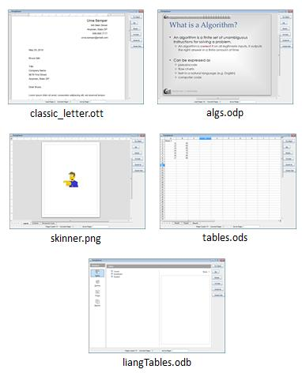

Figure 6. Different Documents Displayed by SwingViewer.


The SwingViewer constructor is passed the document's filename, creates an
OBeanPanel in a JFrame with buttons and other controls, and loads the document:

=== "java"
    ```java
    // globals
    private OBeanPanel officePanel;
    private XComponent doc = null;
    private int docType = Lo.UNKNOWN;
    
    
    public SwingViewer(String fnm)
    {
      super("SwingViewer");
      Container c = getContentPane();
    
      officePanel = new OBeanPanel(850, 600);
                       // OOoBean inside a JPanel
      c.add(officePanel, BorderLayout.CENTER);
      if (officePanel.getBean() == null) {
        System.out.println("OOoBean not created");
        System.exit(1);
      }
    
      c.add(makeButtons(), BorderLayout.EAST);
      c.add(makePageControls(), BorderLayout.SOUTH);
    
      addWindowListener(new WindowAdapter() {
        public void windowClosing(WindowEvent e){
          officePanel.closeDown();
          System.exit(0);
        }
      });
    
      pack();
      setLocationRelativeTo(null);  // center the window
      setResizable(false);
      setVisible(true);
      Lo.delay(200);    // give time for the OOBean to appear
    
      doc = officePanel.loadDoc(fnm);
    
      docType = Info.reportDocType(doc);
      if (doc == null) {
        officePanel.closeDown();
        System.exit(0);
      }
    
     // initialize loaded document
      if (docType == Lo.WRITER)
        initTextDoc();
      else if (docType == Lo.IMPRESS)
        initDrawDoc();
    }  // end of SwingViewer()
    ```

OOoBean termination is done by OBeanPanel.closeDown() in a window listener. It
calls OOoBean.stopOOoConnection(), but this sometimes hangs, so it also invokes
Lo.killOffice():

=== "java"
    ```java
    // in the OBeanPanel class
    public void closeDown()
    {
      if (oob != null) {
        System.out.println("Closing connection to office");
        oob.stopOOoConnection();
      }
      Lo.delay(1000);   // wait for close down to finish
      Lo.killOffice();  // make sure office processes are gone
    }  // end of closeDown()
    ```

The loading of a Writer or Impress document causes several globals to be initialized
by initTextDoc() or initDrawDoc(). initTextDoc() stores the page count and creates a
visible text cursor for moving through the document's pages:

=== "java"
    ```java
    // in the SwingViewer class
    // globals
    private int pageCount = -1;
    private XTextViewCursor tvCursor = null;   // for text docs
    
    
    private void initTextDoc()
    {
      // report the number of pages in the doc
      XTextDocument textDoc = Lo.qi(XTextDocument.class, doc);
      pageCount = Write.getPageCount(textDoc);
      setLastPage(pageCount);
    
      try {  // get the document's visible cursor
        XController xc = officePanel.getController();
        XTextViewCursorSupplier tvcSupplier =
                      Lo.qi(XTextViewCursorSupplier.class, xc);
        tvCursor = tvcSupplier.getViewCursor();
      }
      catch(java.lang.Exception e) {
        System.out.println("Could not access document cursor");
      }
    }  // end of initTextDoc()
    ```

initTextDoc() calls setLastPage() to write the pageCount value into the "Last Page"
field shown in Figure 5.

initDrawDoc() also initializes the global pageCount variable, but with the number of
slides in the document. However, instead of a text cursor, it create XDrawPages and
XDrawView instances for moving through the slides on-screen.


=== "java"
    ```java
    // globals
    private int pageCount = -1;
    private XDrawView xDrawView = null;     // for slide docs
    private XDrawPages xDrawPages = null;
    
    
    private void initDrawDoc()
    {
      try {
        // report the number of slides in the doc
        xDrawPages = Draw.getSlides(doc);
        pageCount = Draw.getSlidesCount(doc);
        setLastPage(pageCount);
    
        // get a slide view
        xDrawView = Lo.qi(XDrawView.class, officePanel.getController());
      }
      catch(java.lang.Exception e)
      {  System.out.println("Could not access document pages");  }
    }  // end of initDrawDoc()
    ```

The globals are utilized when the user presses one of SwingViewer's button. For
example, clicking on the "Up" and "Down" buttons triggers calls to pageChange():

=== "java"
    ```java
    // part of SwingViewer.makeButtons()
       :
    JButton upButton = new JButton("Up");
    upButton.addActionListener(new ActionListener() {
      public void actionPerformed(ActionEvent ev)
      {  pageChange(false);  }   // isDown is false, i.e. move up
    });
    
    JButton downButton = new JButton("Down");
    downButton.addActionListener(new ActionListener() {
      public void actionPerformed(ActionEvent ev)
      {  pageChange(true);  }   // isDown is true, i.e. move down
    });
       :
    ```

pageChange() uses the document's type to decide whether to change pages or slides:

=== "java"
    ```java
    public void pageChange(boolean isDown)
    {
      if (docType == Lo.WRITER)
        textChange(isDown);
      else if (docType == Lo.IMPRESS)
        slideChange(isDown);
    }  // end of pageChange()
    ```

textChange() utilizes the visible text cursor, while slideChange() uses the
XDrawPages and XDrawView variables. If the document isn't textual or a slide deck,
then pageChange() returns without doing anything.


## 4.  Using an Undecorated Office Window

As I mentioned at the start, there are two ways of employing Office as a GUI
component: one is to use OOoBean inside a JPanel, as just explained. The other is to
have the program make Office visible on-screen, which I've done many times in
earlier examples. The main difference in my OffViewer.java example is that most of
Office's GUI is hidden, so the document appears in an undecorated window.

Figure 7 shows the five documents from Figure 6, this time loaded by OffViewer:


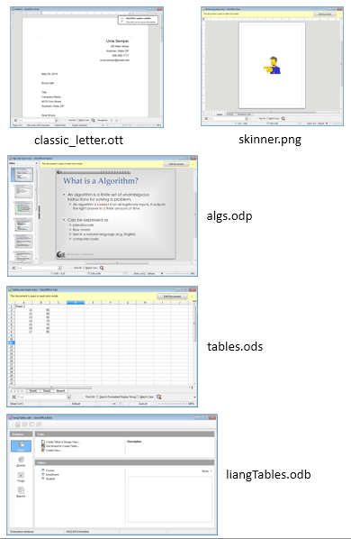

Figure 7. Different Documents Displayed by OffViewer.


There are a few differences between SwingViewer's display and OffViewer. For
instance, OffViewer uses some of Office's toolbars and tool panes, depending on the
document type. The "Find" bar is visible underneath the Writer, Draw, and Impress
documents, and the slide pane is present to the left of the current slide. The Draw,
Impress, and Calc documents also include a yellow pane along their tops containing a
button for enabling editing of the read-only document. I've not been able to find a way
to hide that pane.

The OffViewer constructor loads Office, loads the document, attaches listeners, and
displays some toolbars and panes depending on the document's type:

=== "java"
    ```java
    // global
    private XComponent doc = null;
    
    
    public OffViewer(String fnm)
    {
      XComponentLoader loader = Lo.loadOffice();
      doc = Lo.openReadOnlyDoc(fnm, loader);
      if (doc == null) {
        System.out.println("Could not open " + fnm);
        Lo.closeOffice();
        return;
      }
    
      // attach listeners
      doc.addEventListener(this);
    
      XWindow win = GUI.getWindow(doc);
      win.addWindowListener(this);
      win.setVisible(true);
      Lo.delay(500);   // give window time to appear
    
      XUserInputInterception uii = GUI.getUII(doc);
      uii.addMouseClickHandler(this);
      uii.addKeyHandler(this);
    
      // modify UI visibility
      ArrayList<String> showElems = new ArrayList<String>();
      showElems.add(GUI.FIND_BAR);
      showElems.add(GUI.STATUS_BAR);
      GUI.showOnly(doc, showElems);
    
      // call dispatches *after* the window is visible
      Lo.dispatchCmd("Sidebar",
              Props.makeProps("Sidebar", false));      // hide sidebar
    
      // modify UI based on the document type
      int docType = Info.reportDocType(doc);
      if (docType == Lo.DRAW)
        Lo.dispatchCmd("LeftPaneDraw",
           Props.makeProps("LeftPaneDraw", false) );  // hide Pages pane
    
      if (docType == Lo.IMPRESS)
        Lo.dispatchCmd("LeftPaneImpress",
           Props.makeProps("LeftPaneImpress", true) );// show Slides pane
    
      if (docType == Lo.CALC)
        Lo.dispatchCmd("InputLineVisible",
           Props.makeProps("InputLineVisible", false) );
                                                     // hide formula bar
      if (docType == Lo.BASE)
        Lo.dispatchCmd("DBViewTables");    // switch to tables view
    }  // end of OffViewer()
    ```

Several common toolbar resource names are defined as constants in the GUI class:

=== "java"
    ```java
    // in the GUI class
    public static final String MENU_BAR =
                          "private:resource/menubar/menubar";
    public static final String STATUS_BAR =
                          "private:resource/statusbar/statusbar";
    public static final String FIND_BAR =
                          "private:resource/toolbar/findbar";
    public static final String STANDARD_BAR =
                          "private:resource/toolbar/standardbar";
    public static final String TOOL_BAR =
                          "private:resource/toolbar/toolbar";
    ```

A lengthy list of all the toolbars in LibreOffice is stored in TOOLBAR_NMS[] in
GUI.java, and can be accessed by calling GUI.getToobarResource() with a partial
string; the first matching toolbar resource name is returned. For example:
GUI.getToobarResource("zoom");
returns the string "private:resource/toolbar/zoombar".

The visibility of Office's toolbars is managed by the LayoutManager service as
before, but in a somewhat more complex way because OffViewer can both hide and
show toolbars.

GUI.showOnly() hides all the toolbars accessible to the layout manager, except for
those in its showElems argument. The difficulty is that some of these visible toolbars
may not currently exist, and so need to be created and then made visible.

GUI.showOnly() is:

=== "java"
    ```java
    // in the GUI class
    public static void showOnly(XComponent doc,
                                       ArrayList<String> showElems)
    // leave only the toolbars in showElems visible
    {
      XLayoutManager lm = getLayoutManager(doc);
      if (lm == null)
        System.out.println("No layout manager found");
      else {
        XUIElement[] uiElems = lm.getElements();
        hideExcept(lm, uiElems, showElems);
        for(String elemName : showElems) { // these elems are not in lm
          lm.createElement(elemName);  // so need to be created & shown
          lm.showElement(elemName);
          System.out.println(elemName + " made visible");
        }
      }
    }  // end of showOnly()
    
    
    public static void hideExcept(XLayoutManager lm,
               XUIElement[] uiElems, ArrayList<String> showElems)
    // hide all of uiElems toolbars, except ones in showElems;
    // delete any showElems toolbar strings that match
    {
      for(XUIElement uiElem : uiElems) {
        String elemName = uiElem.getResourceURL();
        boolean toHide = true;
        for (int i = 0;  i < showElems.size(); i++){
          if (showElems.get(i).equals(elemName)) {
            showElems.remove(i);
                         // this elem is in lm so remove from showElems
            toHide = false;       // since the toolbar is already shown
            break;
          }
        }
        if (toHide) {
          lm.hideElement(elemName);
          System.out.println(elemName + " hidden");
        }
      }
    }  // end of hideExcept()
    ```

GUI.showOnly() hides toolbars by calling hideExcept(), which calls
XLayoutManager.hideElement() on all the layout manager's toolbars except ones in
the showElems list, which are meant to stay visible. If a showElems toolbar is left
unhidden then its name is deleted from the list because it's not needed in the next step
back in GUI.showOnly()

When hideExcept() returns, showOnly() iterates through the remaining toolbars in
showElems which are there because they were  unknown to the layout manager.Each
of these toolbars must be created (with XLayoutManager.createElement()) before
being made visible by XLayoutManager.showElement().

In OffViewer, several tool panes, such as the slides pane in Impress, have to be
enabled or disabled, but they're not accessible through the layout manager. Instead, I
use dispatch commands which only work if the Office window is visible and active.

I couldn't find any documentation about dispatch commands for UI panes, but it
appears that a pane can be made visible or invisible by including its name as a
property with the value true or false. For example:

=== "java"
    ```java
    Lo.dispatchCmd("LeftPaneImpress",
          Props.makeProps("LeftPaneImpress", true) ); // show Slides pane
    ```

This call sends a ".uno:LeftPanelImpress" dispatch to Office to make the slides pane
visible.

The easiest way to find dispatch names is to browse through the long list at
https://wiki.documentfoundation.org/Development/DispatchCommands. It's divided
into application and tool subcategories, which narrows the search a little. Also, each
entry includes a "Label value" field which for UI elements (i.e. toolbars, panes, and
menus) corresponds to its name in Office's GUI.

Another approach is to search Office's source code – dispatches are defined inside
".xcu" files, and the UI related files are mostly in the subdirectory
<OFFICE>\officecfg\registry\schema\org\openoffice\Office\UI.


#### Listening to User Input and the Window

OffViewer implements four listeners for mouse presses, keyboard handling, window
changes, and document events:

=== "java"
    ```java
    public class OffViewer implements
                   XMouseClickHandler, XKeyHandler, XWindowListener,
                   com.sun.star.document.XEventListener
    { ... }
    ```

The listeners are attached in the constructor for OffViewer, which implements all the
methods itself:

=== "java"
    ```java
    // part of OffViewer()...
    doc.addEventListener(this);
    
    XWindow win = GUI.getWindow(doc);
    win.addWindowListener(this);
    win.setVisible(true);
    Lo.delay(500);
    
    XUserInputInterception uii = GUI.getUII(doc);
    uii.addMouseClickHandler(this);
    uii.addKeyHandler(this);
    ```

The event listener's disposing() method is triggered as the document is closed, and
uses Lo.killOffice() to terminate Office. As with SwingViewer.java, only calling
Lo.closeOffice() is insufficient, causing Office to hang.


=== "java"
    ```java
    // in the OffViewer class
    
    public void disposing(com.sun.star.lang.EventObject e)
    { System.out.println("Document is closing");
      if (doc != null)
        Lo.closeDoc(doc);
      // Lo.closeOffice();   // Office hangs, so kill it instead
      Lo.killOffice();
      System.exit(0);
    }
    ```

The window, mouse, and keyboard handlers print simple information:

=== "java"
    ```java
    // XWindow listener methods
    public void windowShown(com.sun.star.lang.EventObject e)
    {  System.out.println("Doc window has become visible");  }
    
    public void windowHidden(com.sun.star.lang.EventObject e)
    {  System.out.println("Doc window has been hidden");  }
    
    public void windowResized(WindowEvent e)
    {  System.out.println("Resized to " +e.Width +" x " +e.Height); }
    
    public void windowMoved(WindowEvent e)
    {  System.out.println("Moved to (" + e.X + ", " + e.Y + ")");  }
    
    
    // XMouseClickHandler methods
    public boolean mousePressed(MouseEvent e)
    { System.out.println("Mouse pressed (" + e.X + ", " + e.Y + ")");
      return false;    // send event on, or use true not to send
    }
    
    public boolean mouseReleased(MouseEvent e)
    { System.out.println("Mouse released (" + e.X + ", " + e.Y + ")");
      return false;
    }
    
    
    // XKeyHandler methods
    public boolean keyPressed(KeyEvent e)
    { System.out.println("Key pressed: " + e.KeyCode + "/" + e.KeyChar);
      return true;
    }
    
    public boolean keyReleased(KeyEvent e)
    { System.out.println("Key released: " + e.KeyCode +"/" + e.KeyChar);
      return true;
    }
    ```

The mouse handlers allow their events to be used by other handlers (i.e. they return
false), but the keyboard handlers consume their inputs.


## 5.  Augmenting the User Interface: a New Toolbar Item

TBViewer.java is a variant of OffViewer which adds a toolbar item called "Hello" to
the "Find" toolbar, as shown in Figure 8 on the left.


Figure 8. The "Find" Toolbar with the "Hello" Item.


When the user clicks on "Hello", ToolbarItemListener is woken up, and its clicked()
method called. clicked() displays a message box (see Figure 9).


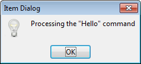

Figure 9. The Message Box that Appears when "Hello" is Clicked.


This toolbar extension technique is similar to Office's Add-ons, which I'll be
discussing in Chapter 46. However, the item isn't permanently added to the toolbar,
existing only while TBViewer is executing.

The TBViewer constructor:

=== "java"
    ```java
    // global
    private XComponent doc = null;
    
    
    public TBViewer(String fnm)
    {
      XComponentLoader loader = Lo.loadOffice();
      doc = Lo.openReadOnlyDoc(fnm, loader);
      if (doc == null) {
        System.out.println("Could not open " + fnm);
        Lo.closeOffice();
        return;
      }
    
      XWindow win = GUI.getWindow(doc);
      win.addWindowListener(this);
      win.setVisible(true);
      Lo.delay(500);   // give window time to appear
    
      GUI.showOne(doc, GUI.FIND_BAR);
    
      Lo.dispatchCmd("Sidebar",
              Props.makeProps("Sidebar", false));    // hide sidebar
    
      GUI.addItemToToolbar(doc, GUI.FIND_BAR, "Hello", "h.png");
    
      // add an dispatch interceptor for the "Hello" item
      XDispatchProviderInterception dpi = GUI.getDPI(doc);
      if (dpi != null)
        dpi.registerDispatchProviderInterceptor(
                             new ItemInterceptor(this, "Hello"));
    }  // end of TBViewer()
    
    GUI.showOne() utilizes GUI.showOnly() to leave only the "Find" toolbar visible:
    
    // in the GUI class
    public static void showOne(XComponent doc, String showElem)
    {
      ArrayList<String> showElems = new ArrayList<String>();
      showElems.add(showElem);
      showOnly(doc, showElems);
    }  // end of showOne()
    ```

GUI.addItemToToolbar() creates the toolbar item:
GUI.addItemToToolbar(doc, GUI.FIND_BAR, "Hello", "h.png");
Its arguments are the document, the toolbar's resource name, the item name, and the
filename of an image icon.

A dispatch interceptor (an ItemInterceptor object) is registered to catch clicks
(dispatches) on the "Hello" item, and redirect them to TBViewer:

=== "java"
    ```java
    XDispatchProviderInterception dpi = GUI.getDPI(doc);
    if (dpi != null)
      dpi.registerDispatchProviderInterceptor(
                           new ItemInterceptor(this, "Hello"));
    ```

ItemInterceptor processes each click by calling ToolbarItemListener.clicked() which
is implemented by TBViewer as:

=== "java"
    ```java
    // in the TBViewer class
    public void clicked(String itemName, URL cmdURL,
                                         PropertyValue[] props)
    { GUI.showMessageBox("Item Dialog", "Processing the \"" +
                                            itemName + "\" command");
    }  // end of clicked()
    ```


### 5.1.  Intercepting Dispatches

ItemInterceptor implements XDispatchProviderInterceptor and XDispatch so it can
both intercept dispatches and process them:

=== "java"
    ```java
    public class ItemInterceptor implements
                         XDispatchProviderInterceptor, XDispatch
    {
      private XDispatchProvider slaveDP, masterDP;
            // pointers to next and previous dispatch providers in list
    
      private ToolbarItemListener viewer;   // object sent dispatch info
      private String itemName;  // toolbar item name
      private String cmd;       // toolbar item's dispatch command
    
    
      public ItemInterceptor(ToolbarItemListener v, String itemName)
      {  viewer = v;
         this.itemName = itemName;
         cmd = Lo.makeUnoCmd(itemName);
      }
    
      // : more XDispatchProviderInterceptor and XDispatch methods;
      // : see below
    
    }  // end of ItemInterceptor class
    ```

The ItemInterceptor() arguments are a reference to ToolbarItemListener (which
implements clicked()), and the toolbar item name ("Hello") which is converted into a
UNO command string by Lo.makeUnoCmd():

=== "java"
    ```java
    // in the Lo class
    public static String makeUnoCmd(String itemName)
    // use a dummy Java class name, Foo
    {  return "vnd.sun.star.script:Foo/Foo." + itemName +
                             "?language=Java&location=share";  }
    ```

The returned command string is mostly make-believe – there's no
vnd.sun.star.script:Foo/Foo class, but that doesn't matter so long as the string is
unique, and matches the command string in the toolbar item (which is set up by
GUI.addItemToToolbar(), as shown below).

Office adds the ItemInterceptor object to an interceptors list, which is doubly-linked
so that each node points to the previous (master) and next (slave) list element. These
are accessible through get/set master/slave methods:

=== "java"
    ```java
    // in ItemInterceptor class
    public void setMasterDispatchProvider(XDispatchProvider dp)
    {  masterDP = dp;  }
    
    public void setSlaveDispatchProvider(XDispatchProvider dp)
    {  slaveDP = dp;  }
    
    public XDispatchProvider getMasterDispatchProvider()
    {  return masterDP;  }
    
    public XDispatchProvider getSlaveDispatchProvider()
    {  return slaveDP;  }
    ```

XDispatchProviderInterceptor also requires implementations for queryDispatches()
and queryDispatch(). queryDispatches() iterates through the array of dispatch
descriptors passed to it, and calls queryDispatch() on each one:

=== "java"
    ```java
    // in ItemInterceptor class
    public XDispatch[] queryDispatches(DispatchDescriptor[] descrs)
    {
      int count = descrs.length;
      XDispatch[] xDispatch = new XDispatch[count];
      for (int i = 0; i < count; i++)
        xDispatch[i] = queryDispatch(descrs[i].FeatureURL,
                                     descrs[i].FrameName,
                                     descrs[i].SearchFlags);
      return xDispatch;
    }  // end of queryDispatches()
    ```

If the dispatch passed to queryDispatch() is recognized by this interceptor then an
XDispatch object is returned; otherwise the dispatch is sent to the next interceptor in
the list:

=== "java"
    ```java
    // in ItemInterceptor class
    public XDispatch queryDispatch(URL cmdURL, String target,
                                   int srchFlags)
    { if (cmdURL.Complete.equalsIgnoreCase(cmd))  {
        System.out.println(itemName + " seen");
        return this;   // this will cause dispatch() to be called
      }
    
      if (slaveDP != null)
        return slaveDP.queryDispatch(cmdURL, target, srchFlags);
          // pass command to next interceptor in list
      else
        return null;
    }  // end of queryDispatch()
    ```

Office processes the returned XDispatch object by calling its dispatch() method,
which is implemented by ItemInterceptor:

=== "java"
    ```java
    // in ItemInterceptor class
    // global
    private ToolbarItemListener viewer;   // object sent dispatch info
    
    public void dispatch(URL cmdURL, PropertyValue[] props)
    {  viewer.clicked(itemName, cmdURL, props);  }
    ```

Control is passed to the listener's clicked() method, which is in TBViewer.

For more information on dispatch interception, see chapter 6 of the Developer's
Guide, which is also online at
https://wiki.openoffice.org/wiki/Documentation/DevGuide/OfficeDev/Dispatch_Interception
(or use `loGuide "Dispatch Interception"`).


### 5.2.  Displaying a Message Box

TBViewer's clicked() creates an Office message dialog (see Figure 10) by calling
GUI.showMessageBox(). This dialog requires some complicated coding, and you may
wonder why I didn't just use Java's dialogs. For example, as in
GUI.showJMessageBox():

=== "java"
    ```java
    // in the GUI class
    public static void showJMessageBox(String title, String message)
    {  JOptionPane.showMessageDialog(null, message, title,
                              JOptionPane.INFORMATION_MESSAGE);
    }
    ```

I did try this, and it works fine most of the time, but sometimes the dialog appears
behind Office's window, and so is hidden from the user. The problem lies with the
null first argument of JOptionPane.showMessageDialog() which leaves the dialog's
parent window unspecified.

An Office message dialog is created in two main steps, as shown in
GUI.showMessageBox():

=== "java"
    ```java
    // in the GUI class
    public static void showMessageBox(String title, String message)
    {
      XToolkit xToolkit = Lo.createInstanceMCF(XToolkit.class,
                                      "com.sun.star.awt.Toolkit");
      XWindow xWindow = getWindow();
      if ((xToolkit == null) || (xWindow == null))
        return;
    
      XWindowPeer xPeer = Lo.qi(XWindowPeer.class, xWindow);
    
      // initialize window description
      WindowDescriptor desc = new WindowDescriptor();
      desc.Type = WindowClass.MODALTOP;
      desc.WindowServiceName = new String("infobox");
      desc.ParentIndex = -1;
      desc.Parent = xPeer;
      desc.Bounds = new Rectangle(0, 0, 300, 200);
      desc.WindowAttributes = WindowAttribute.BORDER |
                              WindowAttribute.MOVEABLE |
                              WindowAttribute.CLOSEABLE;
    
      // create message box using the description
      XWindowPeer descPeer = xToolkit.createWindow(desc);
      if (descPeer != null) {
        XMessageBox msgBox = Lo.qi(XMessageBox.class, descPeer);
        if (msgBox != null) {
          msgBox.setCaptionText(title);
          msgBox.setMessageText(message);
          msgBox.execute();   // show the box
        }
      }
    }  // end of showMessageBox()
    ```

A WindowDescriptor object is initialized to specify the type of window that will be
created, including its parent (the Office window). The descriptor is used to create a
XWindowPeer object, which is converted into an XMessageBox.


### 5.3.  Adding "Hello" to the Toolbar

GUI.addItemToToolbar() adds the "Hello" item to the "Find" toolbar:

=== "java"
    ```java
    GUI.addItemToToolbar(doc, GUI.FIND_BAR, "Hello", "h.png");
    ```

The code:

=== "java"
    ```java
    // in the GUI class
    public static void addItemToToolbar(XComponent doc,
                              String toolbarName,
                              String itemName, String imFnm)
    {
      String cmd = Lo.makeUnoCmd(itemName);
      XUIConfigurationManager confMan = GUI.getUIConfigManagerDoc(doc);
      if (confMan == null) {
        System.out.println("Cannot create configuration manager");
        return;
      }
    
      try {
        // add icon for the command
        XImageManager imageMan =  Lo.qi(XImageManager.class,
                                       confMan.getImageManager());
        String[] cmds = {cmd};
        XGraphic[] pics = new XGraphic[1];
        pics[0] = Images.loadGraphicFile(imFnm);
        imageMan.insertImages((short)0, cmds, pics);
    
        // add item to toolbar
        XIndexAccess settings = confMan.getSettings(toolbarName, true);
        XIndexContainer conSettings =
                                Lo.qi(XIndexContainer.class, settings);
        PropertyValue[] itemProps = Props.makeBarItem(cmd, itemName);
        conSettings.insertByIndex(0, itemProps);
                               // place first in the toolbar
        confMan.replaceSettings(toolbarName, conSettings);
      }
      catch (java.lang.Exception e)
      {  System.out.println(e);  }
    }  // end of addItemToToolbar()
    ```

It accesses the toolbar with XUIConfigurationManager. A toolbar item is created (as
an array of properties), and added to the bar at the specified index position.

The icon that should be drawn next to "Hello" on the toolbar is loaded by
XImageManager. As Figure 8 shows, this image doesn't appear, although it has been
loaded since it's listed in the "Visible Buttons" window in Figure 10.


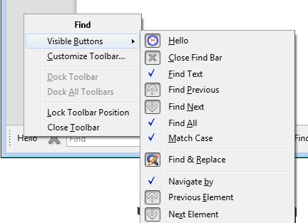

Figure 10. The "Visible Buttons" Window for the Toolbar.


## 6.  Augmenting the User Interface: a New Menu Item

MenuViewer.java is a variant of OffViewer which either adds a menu at the end of
Office's menubar (see Figure 11a), or creates a new menubar for the menu (see Figure
11b).


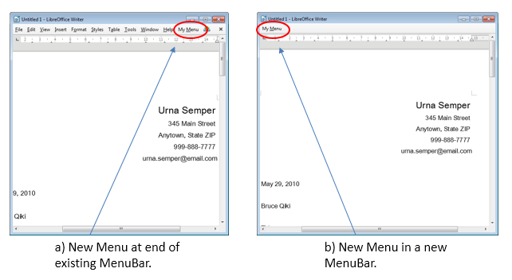

Figure 11.  Adding an Item to a Menubar.


The same menu is created in both cases, and is shown in pop-down form in Figure 12.


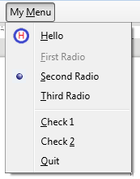

Figure 12. The "My_menu" Menu.


The menu includes a "Hello" item with an icon, "Quit" for quitting Office, and some
radio button and checkbox items that do nothing. When "Hello" is clicked, the same
Office message box appears as in Figure 10.

The MenuViewer constructor creates a new menubar (see Figure 11b), but contains
commented out code for adding the menu to Office's menubar (as in Figure 11a):

=== "java"
    ```java
    // in MenuViewer.java
    // globals
    private XComponent doc = null;
    private short id = 0;   // used for menu IDs
    
    
    public MenuViewer(String fnm)
    {
      XComponentLoader loader = Lo.loadOffice();
      doc = Lo.openReadOnlyDoc(fnm, loader);
      if (doc == null) {
        System.out.println("Could not open " + fnm);
        Lo.closeOffice();
        return;
      }
    
      XWindow win = GUI.getWindow(doc);
      win.addWindowListener(this);
      win.setVisible(true);
      Lo.delay(500);   // wait for window to appear
    
    
      // create new menubar
      GUI.showNone(doc);  // hide all toolbars
      makeMenubar(win);
    
    /*
      // or modify the existing menubar
      GUI.showOne(doc, GUI.MENU_BAR);
                 // hide all toolbars except the menubar
      setMenubar(doc);
    */
    }  // end of MenuViewer()
    ```

This MenuViewer example is based on one in the "Creating Menus" section at the end
of chapter 19, "Graphical user Interfaces", in the Developer's Guide; it can be found
online at
https://wiki.openoffice.org/wiki/Documentation/DevGuide/GUI/Creating_Menus (or
use `loGuide "Creating Menus"`). The corresponding code is at
https://api.libreoffice.org/examples/DevelopersGuide/examples.html#GraphicalUserInterfaces,
and includes the use of a context menu, which I don't consider here.


### 6.1.  Creating a New Menubar

makeMenubar() attaches an XMenubar instance to the Office window using
XTopWindow.setMenuBar():

=== "java"
    ```java
    // in MenuViewer.java
    private void makeMenubar(XWindow win)
    {
      XTopWindow topWin = Lo.qi(XTopWindow.class, win);
      XMenuBar menubar = Lo.createInstanceMCF(XMenuBar.class,
                                           "com.sun.star.awt.MenuBar");
      if (menubar == null)
        System.out.println("Could not create a menu bar");
      else {
        addMenu(menubar, (short)0);
        topWin.setMenuBar(menubar);
      }
    }  // end of makeMenubar()
    ```

addMenu() labels the menu, which is generated by makePopupMenu():

=== "java"
    ```java
    // in MenuViewer.java
    // globals
    private short id = 0;   // used for menu IDs
    
    
    private void addMenu(XMenuBar bar, short mPos)
    {
      short menuID = id;
      bar.insertItem(menuID, "My ~Menu",
                             MenuItemStyle.AUTOCHECK, mPos);
      id++;
      bar.setPopupMenu(menuID, makePopupMenu());
                              // add menu to menubar
    }  // end of addMenu()
    ```

The three important menu interfaces are shown in Figure 13.


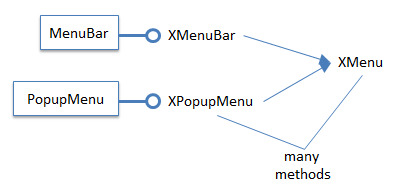

Figure 13. The Menu Services and Interfaces.


Although addMenu() initializes an XMenuBar instance, the interface doesn't contain
any methods, inheriting its functionality from XMenu, as indicated in Figure 13.

The menu methods, such as XMenu.insertItem() used by addMenu(), can be a little
confusing because of their use of shorts in different ways. Every menu and menu item
is assigned an ID, which is useful in listener code for identifying which item was
clicked. In my code, each menu ID is initialized using a global id variable, which is
incremented after each use.

Every menu and item also uses a position short value which determines where the
menu appears in the bar, and where an item appears in the menu. For example,
addMenu() is called by makeMenubar() with a position value set to 0, which will
place the menu first on the bar.

The third use of short is as MenuItemStyle constants, which specify behavior for
menu items acting as check and radio boxes.


#### Creating the Menu

The menu in Figure 12 is created by makePopupMenu():

=== "java"
    ```java
    // in MenuViewer.java
    // globals
    private static final String CMD_HELLO = "Cmd_Hello";
    private static final String CMD_QUIT = "Cmd_Quit";
    
    private short id = 0;   // used for menu IDs
    
    
    public XPopupMenu makePopupMenu()
    /* Popup menu consists of:
                * Hello + image
                * three radio buttons (only one on)
                * a separator
                * two check boxes
                * Quit
    */
    { XPopupMenu pum = Lo.createInstanceMCF(XPopupMenu.class,
                                     "com.sun.star.awt.PopupMenu");
      if (pum == null) {
        System.out.println("Could not create a menu");
        return null;
      }
    
      short mPos = 0;
      pum.insertItem(id, "Hello", (short)0, mPos++);
          // first short is an ID for the new menu item;
          // the second is the style for the item, 0 means none/ordinary;
          // the third is the items' position on the menu
    
      pum.setItemImage(id, Images.loadGraphicFile("H.png"), false);
      pum.setCommand(id++, CMD_HELLO);
    
      pum.insertItem(id, "First Radio",
                 (short) (MenuItemStyle.RADIOCHECK +
                          MenuItemStyle.AUTOCHECK), mPos++);
      pum.enableItem(id++, false);   // grayed out
    
      pum.insertItem(id, "Second Radio",
                 (short) (MenuItemStyle.RADIOCHECK +
                          MenuItemStyle.AUTOCHECK), mPos++);
      pum.checkItem(id++, true);  // selected
    
      pum.insertItem(id++, "Third Radio",
                 (short) (MenuItemStyle.RADIOCHECK +
                          MenuItemStyle.AUTOCHECK), mPos++);
    
      pum.insertSeparator(mPos++);
    
      pum.insertItem(id++, "Check 1",
                 (short) (MenuItemStyle.CHECKABLE +
                          MenuItemStyle.AUTOCHECK), mPos++);
    
      pum.insertItem(id++, "Check 2",
                 (short) (MenuItemStyle.CHECKABLE +
                          MenuItemStyle.AUTOCHECK), mPos++);
    
      pum.insertItem(id, "Quit", (short)0, mPos++);
      pum.setCommand(id++, CMD_QUIT);
    
      pum.addMenuListener(this);
      return pum;
    }  // end of makePopupMenu()
    ```

Ordinary menu items (in my case, "Hello" and "Quit") are assigned a style value of 0.

Menu items activation by the user are detected by attaching a listener to the menu.
When an item is pressed, an event containing its ID is sent to the listener. Optionally
items can be assigned command strings (as for the "Hello" and "Quit" items) to better
distinguish them.

MenuViewer.java implements XMenuListener, which requires four methods –
itemSelected(), itemHighlighted(), itemActivated(), and itemDeactivated(). Only
itemSelected() does anything of note:

=== "java"
    ```java
    // in MenuViewer.java
    
    public void itemSelected(MenuEvent menuEvent)
    {
      short id = menuEvent.MenuId;
      XPopupMenu pum = Lo.qi(XPopupMenu.class, menuEvent.Source);
      if (pum == null)
        System.out.println("Menu item " + id +
                                " selected; popupmenu is null");
      else {
        String itemName = pum.getItemText(id);
        String cmd = pum.getCommand(id);
        System.out.println("Menu item \"" + pum.getItemText(id) +
                                      "\" selected");
        System.out.println("  is checked? " + pum.isItemChecked(id));
        processCmd(cmd);
      }
    }  // end of itemSelected()
    
    
    public void itemHighlighted(MenuEvent menuEvent)
    { // System.out.println(menuEvent.MenuId + " highlighted");
    }
    
    public void itemDeactivated(MenuEvent menuEvent)
    { // System.out.println(menuEvent.MenuId + " deactivated");
    }
    
    public void itemActivated(MenuEvent menuEvent)
    { // System.out.println(menuEvent.MenuId + " activated");
    }
    
    Each MenuEvent object includes the menu item's ID and a reference to its menu,
    which are accessed at the start of itemSelected():
    
    short id = menuEvent.MenuId;
    XPopupMenu pum = Lo.qi(XPopupMenu.class, menuEvent.Source);
    
    itemSelected() uses the ID and menu to access details, including the menu item's label
    and command string. Item processing is handled by processCmd():
    
    public void processCmd(String cmd)
    {
      if ((cmd == null) || cmd.equals("")) {
        System.out.println("  No command");
        return;
      }
    
      if (cmd.equals(CMD_HELLO))
        GUI.showMessageBox("Item Dialog",
                           "Processing the \"Hello\" command");
      else if (cmd.equals(CMD_QUIT)) {
        System.out.println("  Quiting the Application");
        if (doc != null)
          Lo.closeDoc(doc);   // will trigger a call to disposing()
      }
      else
        System.out.println("  Got command: " + cmd);
    }  // end of processCmd()
    ```

Clicking on "Hello" results in a call to GUI.showMessageBox() which was used
earlier in ItemViewer. Clicking on "Quit" causes the document to be closed by
Lo.closeDoc() which in turn triggers a call to XWindowListener.disposing() which
MenuViewer.java also implements:

=== "java"
    ```java
    // in MenuViewer.java
    public void disposing(com.sun.star.lang.EventObject e)
    {
       System.out.println("Doc window is closing");
       if (doc != null)
          Lo.closeDoc(doc);
       // Lo.closeOffice();  // Office hangs, so kill it instead
       Lo.killOffice();
       System.exit(0);
    }
    ```


### 6.2.  Adding to the Existing Menubar

MenuViewer.java can be edited to add the menu to Office's menubar rather than
create a new one. The end of the constructor becomes:

=== "java"
    ```java
    // end of MenuViewer()...
    /*
      // create new menu bar
      GUI.showNone(doc);
      makeMenubar(win);
    */
      // or modify the existing menubar
      GUI.showOne(doc, GUI.MENU_BAR);
      setMenubar(doc);
    ```

setMenuBar() uses the layout manager to obtain a reference to Office's menubar, and
calculates a unique ID for the new menu and its position on the bar:

=== "java"
    ```java
    // in MenuViewer.java
    // globals
    private short id = 0;   // used for menu IDs
    
    
    private void setMenubar(XComponent doc)
    {
      XLayoutManager lm = GUI.getLayoutManager(doc);
      XMenuBar menubar = GUI.getMenubar(lm);
      if (menubar == null)
        System.out.println("Menubar not found");
      else {
        short menuCount = menubar.getItemCount();
                // count along the menu bar to get no. of menus
        short maxID = GUI.getMenuMaxID(menubar);
                // find the largest menu item ID
        id = (short)(maxID + (short)100);    // hacky
          /* add a big number to account for the IDs used by
             menu items in the menu  */
    
        addMenu(menubar, menuCount);
      }
    }  // end of setMenubar()
    ```

The XMenuBar reference is retrieved from a property in the XUIElement for the bar:

=== "java"
    ```java
    // in the GUI class
    //globals
    public static final String MENU_BAR =
                             "private:resource/menubar/menubar";
    
    
    public static XMenuBar getMenubar(XLayoutManager lm)
    {
      if (lm == null) {
        System.out.println("No layout manager available");
        return null;
      }
    
      XMenuBar bar = null;
      try {
        XUIElement oMenuBar = lm.getElement(GUI.MENU_BAR);
        XPropertySet props = Lo.qi(XPropertySet.class, oMenuBar);
        bar = Lo.qi(XMenuBar.class,
                                props.getPropertyValue("XMenuBar"));
        if (bar == null)
          System.out.println("Menubar reference not found");
      }
      catch (Exception e)
      {  System.out.println("Could not access menubar");  }
      return bar;
    }  // end of getMenubar()
    ```

Back in setMenubar(), XMenuBar.getItemCount() returns the number of menus
already on the bar, which can be used as the position of the new menu.

Deciding on a unique menu ID is a little difficult since the IDs of all the items on the
existing menus, including submenus, should be examined. A simpler, and faster,
solution is implemented by GUI.getMenuMaxID(), which only finds the largest ID of
the menus (items in the menus aren't considered):

=== "java"
    ```java
    // in the GUI class
    public static short getMenuMaxID(XMenuBar bar)
    {
      if (bar == null)
        return -1;
      short itemCount = bar.getItemCount();
      System.out.println("No items in menu bar: " + itemCount);
      short maxID = -1;
      for (short i=0; i < itemCount; i++) {
        short id =  bar.getItemId(i);
        if (id > maxID)
          maxID = id;
      }
      return maxID;
    }  // end of getMenuMaxID()
    ```

The drawback is that the menu with the largest ID will probably contain some items
with larger IDs. setMenubar() deals with this by adding 100 to the ID returned by
getMenuMaxID(), in the hope that this exceeds the largest item ID.

setMenubar() finished with a call to addMenu(), the same function used by
makeMenubar() from earlier; it creates the menu and adds it to the bar.