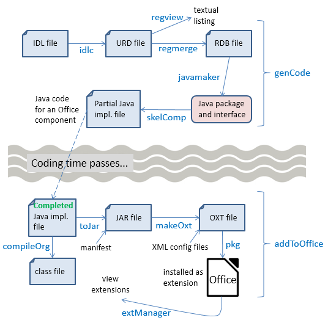
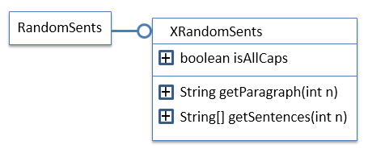
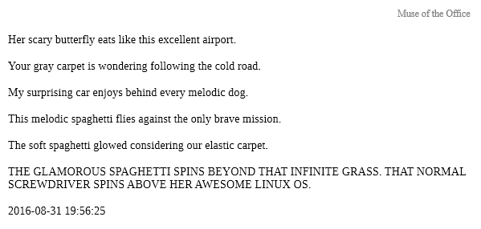
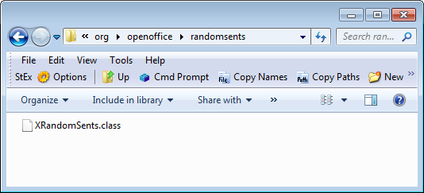
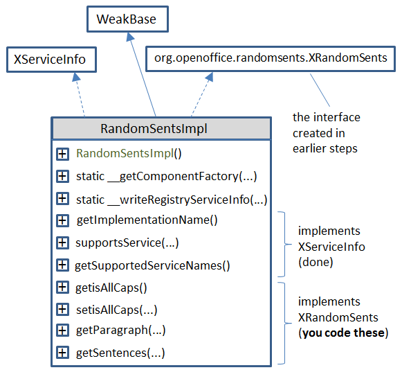
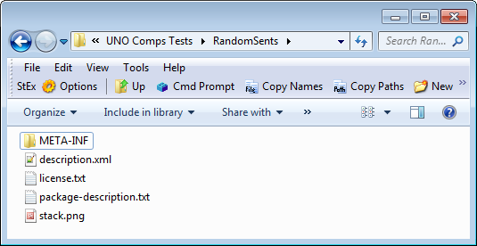
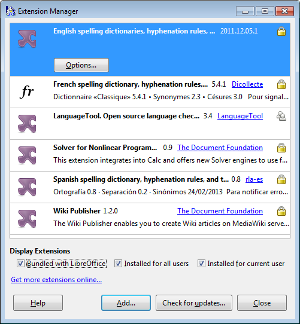
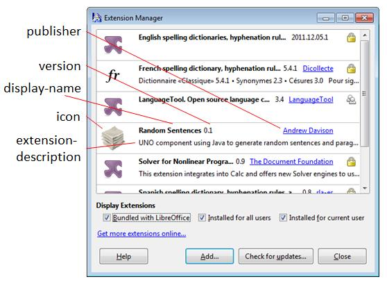

# Chapter 45. Coding UNO Components

!!! note "Topics"
    Using the
    RandomSents
    Component; Writing
    IDL Definitions; Using
    idlc.bat; Merging Type
    Data into a Registry
    Database; Generating
    the Java Package and
    Interface; Creating a
    Skeleton Component;
    Compiling the
    Completed
    Implementation;
    Packaging the
    Component; Installing
    the Extension; Using a
    New Component in a
    Program

    Example folders: "UNO
    Comps Tests" and
    "Utils"


In its simplest form, an UNO component consists of a new
service and interface that's added to Office as an
extension. Subsequently, the service and interface can be
used in the same way as other classes in the Office API.

This chapter's UNO component example implements a
RandomSents service, which generates random sentences
and paragraphs, optionally in all-caps. After RandomSents
has been added to Office as an extension, my
PoemCreator.java employs Office and RandomSents to
write poetry into a Word document.

UNO components extend the API, but aren't accessible to
Office users via its GUI. However, in the next two
chapters, I'll look at how to write extended components
called add-ons and Calc add-ins. An add-on is accessible
through the Office GUI, typically as a new toolbar or
menu item. Calc add-ins appear as new functions for cell
calculations.

Other uses of components include the creation of new Chart types (Chart add-ins),
Calc data pilots, database drivers, and filters for the input/output of new kinds of
documents. I won’t be looking at those kinds of components.

Office's SDK has command line tools for creating a 'skeleton' component containing a
service and interface with most of the necessary boilerplate API code. Other tools
mostly automate the creation of the component's extension file and its installation into
Office.

How this set of tools works together to form a code generation  compilation 
installation toolchain is somewhat confusing. Another problem is that some of the
tools require changes to Window's PATH environment variable, and files and folders
to be in specific locations. My solution to these issues is twelve (12!) batch files,
whose names label the arrows in Figure 1.




Figure 1. Toolchain for Creating a Component.


Figure 1 shows a two-part toolchain, separated by the need for the programmer to
finish off the skeleton code for the component's service and interface.

The chain begins with the creation of an IDL file which holds a description of the
component's types, data attributes, and method signatures. The IDL document is
converted into registry database information (an URD file), then merged with other
URD files and converted to RDB format (a binary tree data structure). The javamaker
tool converts the RDB data into a Java package (i.e. a nested set of folders) containing
a ".class" file for the interface. The class is converted into Java code by the skelComp
tool, which also adds boilerplate methods and data needed for the installation and
calling of the component's service and interface. The domain-specific methods are left
empty, which is where the programmer takes over.

The Office SDK also includes a cppmaker tool, a version of the skeleton generator for
C++ programmers. It's also possible to code components in Python and Office Basic.

Five tools are utilized in the first part of the toolchain: idlc.bat, regmerge.bat,
regview.bat, javamaker.bat, and skelComp.bat. The genCode.bat script shown in
Figure 1 calls these tools in order.

After the programmer has filled in the component's domain-specific methods, the
code is compiled with compileOrg.bat, and converted to a JAR file with toJar.bat. An
Office extension is stored as an OXT file, which is created by makeOXT.bat, and then
installed by pkg.bat. extManager.bat lists Office's installed extensions.

The rest of this chapter visits each of these batch scripts as I develop the
RandomSents component.


#### Information on Tools, Components, and Extensions

Most of my batch files call Office SDK tools. For instance, idlc.bat, regmerge.bat,
regview.bat, javamaker.bat, and skelComp.bat utilize Office's idlc.exe, regmerge.exe,
regview.exe, javamaker.exe, and uno-skeletonmaker.exe. The best source of
information on these SDK tools is at https://api.libreoffice.org/docs/tools.html, which
gives a short but useful description of each one.

The creation and installation of components is explained at length early in the
Developer's Guide, in chapters 3 ("Writing UNO Components") and 4 ("Extensions").
The guide is available from
https://wiki.openoffice.org/w/images/d/d9/DevelopersGuide_OOo3.1.0.pdf, or the
chapters are online starting at
https://wiki.openoffice.org/wiki/Documentation/DevGuide/WritingUNO/Writing_UNO_Components and
https://wiki.openoffice.org/wiki/Documentation/DevGuide/Extensions/Extensions (or
use `loGuide "Writing UNO Components"` and `loGuide Extensions`).

The drawback with the guide (both PDF and online) is that the tools available in the
current version of Office have changed slightly from when the guide was written in
2009.

Two other documents worth studying are "How to Install Extensions" (available at
https://libreoffice.org/get-help/documentation), and "Publishing Extensions for
LibreOffice"
(https://wiki.documentfoundation.org/images/1/14/Publishing_extensions.pdf) which
explains how to add an extension to LibreOffice's 'shop window' at
https://extensions.libreoffice.org.

The LibreOffice site concerned with how to code extensions is
https://wiki.documentfoundation.org/Development/Extension_Development, which
points to a large OpenOffice site (https://wiki.openoffice.org/wiki/Extensions), called
the OOo Extension Project. It includes a useful list of pointers to tutorials and articles
about building extensions, at
https://wiki.openoffice.org/wiki/Extensions_development.

These websites can be a little overwhelming since an extension can be so many
different things: UNO components, add-ons, Calc add-ins, file filters, etc., and be
implemented in so many different languages (C++, Java, Python). Since this chapter
is only about components, here's a list of component examples I've found useful:

* The examples from chapter 3 of the Developer's Guide
(https://api.libreoffice.org/examples/DevelopersGuide/examples.html#Component
s), including an image reducer component called Thumbs;
* The "MinimalComponent" Java example in the "UNO Components Examples"
section of https://api.libreoffice.org/examples/examples.html#Java_examples;
* The Python love letter writer (https://github.com/kunaldeo/Py-LibreOffice-Love-
Letter-Writer).

For those of you less fond of command line tools, there's an Eclipse plugin called
LOEclipse for creating Office extensions
(https://marketplace.eclipse.org/content/loeclipse/), and an add-on example at
https://github.com/smehrbrodt/libreoffice-starter-extension/


## 1.  Using the RandomSents Component

The RandomSents UNO component consists of a single service and interface. The
service is employed only to access the XRandomSents interface, which has  two
methods and an attribute, as depicted in Figure 2.




Figure 2. The RandomSents Component's Service and Interface.


getParagraph() returns a single string consisting of a specified number of sentences,
while getSentences() returns the sentences in an array. The isAllCaps boolean
indicates whether the text should be in all-caps.

PoemCreator.java uses Office and the RandomSents component (after it's been added
to Office) to write a poem into a Word file:

```java
// in PoemCreator.java
import com.sun.star.uno.*;
  // other imports...


import org.openoffice.randomsents.XRandomSents;


public class PoemCreator
{
  public static void main(String args[])
  {
    XComponentLoader loader = Lo.loadOffice();
    XTextDocument doc = Write.createDoc(loader);
    if (doc == null) {
      System.out.println("Writer doc creation failed");
      Lo.closeOffice();
      return;
    }
    Info.listExtensions();

    GUI.setVisible(doc, true);

    Write.setHeader(doc, "Muse of the Office");
    Write.setA4PageFormat(doc);
    Write.setPageNumbers(doc);

    XRandomSents rs = Lo.createInstanceMCF(XRandomSents.class,
                          "org.openoffice.randomsents.RandomSents");
    String[] sents = rs.getSentences(5);

    XTextCursor cursor = Write.getCursor(doc);
    for(String sent : sents)
       Write.appendPara(cursor, sent+"\n");

    rs.setisAllCaps(true);
    Write.appendPara(cursor, rs.getParagraph(2)+"\n");

    Write.appendPara(cursor, Lo.getTimeStamp());

    Lo.waitEnter();
    Lo.saveDoc(doc, "poem.doc");

    Lo.closeDoc(doc);
    Lo.closeOffice();
  } // end of main()

}  // end of PoemCreator class
```

The program begins and ends in a familiar way: a Writer document is created and the
generated text is saved to "poem.doc".

The RandomSents service and its interface are created using Lo.createInstanceMCF():

```java
XRandomSents rs = Lo.createInstanceMCF(XRandomSents.class,
                     "org.openoffice.randomsents.RandomSents");
```

This requires that the RandomSents component's interface be imported:

```java
import org.openoffice.randomsents.XRandomSents;
```

PoemCreator writes five paragraphs into the document, each one a sentence from the
array returned by XRandomSents.getSentences(). After switching to all-caps (using
XRandomSents.setisAllCaps()), the last paragraph is made up of two sentences by
calling XRandomSents.getParagraph(). Typical output looks like Figure 3.




Figure 3. A Generated Poem in poem.doc.


Note that the XRandomSents isAllCaps boolean is not accessed directly, but via
get/set methods, setisAllCaps() and getisAllCaps().


## 2.  Writing IDL Definitions

The UNO IDL (Interface Definition Language) is used to specify the types, attributes,
and methods in the service and interface of the RandomSents component. The
RandomSents.idl file contains two definitions:

```
#ifndef _org_openoffice_randomsents_RandomSents_
#define _org_openoffice_randomsents_RandomSents_

#include <com/sun/star/uno/XInterface.idl>


module org { module openoffice { module randomsents
{
  interface XRandomSents {
    [attribute] boolean isAllCaps;

    string getParagraph([in] long numSents);

    sequence<string> getSentences([in] long numSents);
  };
}; }; };


module org { module openoffice { module randomsents
{
  service RandomSents : XRandomSents;
}; }; };


#endif
```

Both definitions start with the org.openoffice.randomsents module path. The first is
for the XRandomSents interface, the second for the RandomSents service.

The IDL lets a module path be almost anything, but my batch scripts assume that it
begins with "org.openoffice", and the module name (i.e. "randomsents") is a
lowercase version of the service name ("RandomSents").

The tools assume that "org.openoffice" corresponds to an existing "org/" folder in the
current directory, containing an "openoffice/" folder. However, the directory for the
module (i.e. "randomsents/") will be created.

The IDL borrows many syntactic features from the COBRA IDL (which gives a fair
indication of its age). For example:

* data fields are distinguished with the phrase "[attribute]";
* an array is represented as a "sequence";
* there is no int type, "long" is the IDL equivalent;
* method arguments can be both input ("[in]") and output ("[out]") or both
("[inout]"). The guide warns Java programmers to avoid "[out]" and "[inout]",
which I've done.

Much of chapter 3 in the Developer's Guide is concerned with explaining IDL
features. An important subsection is "Using UNOIDL to Specify New Components",
which explains how to define a service and interface; it's online at
https://wiki.openoffice.org/wiki/Documentation/DevGuide/WritingUNO/Using_UNOIDL_to_Specify_New_Components,
or use `loGuide "Using UNOIDL"`.

Details on how IDL types are mapped to Java can be found in chapter 2 of the guide,
starting at the "Type Mapping" subsection; online at
https://wiki.openoffice.org/wiki/Documentation/DevGuide/ProUNO/Java/Type_Mappings,
or use `loGuide "Type Mappings"`.


## 3.  Using idlc.bat

My idlc.bat batch file utilizes idlc.exe, one of Office's SDK tools in
<OFFICE>\sdk\bin\. Its main purpose is to generate type data, storing it in an URD
file. A little more information can be found at
https://api.libreoffice.org/docs/tools.html#idlc.

Unfortunately,  idlc.exe can only process an IDL file if it's located in
<OFFICE>\sdk\bin\, probably because its "-I" option can't find necessary support files
when searching in other folders.  Also, the path to <OFFICE>\program\ must be
added to Window's PATH environment variable so idlc.exe can employ DLLs stored
there.

The URD file is written to <OFFICE>\sdk\bin\, which is inconvenient, so idlc.bat
moves the IDL and URD files back to the original directory.

A typical call to idlc.bat uses the component's service name to identify the IDL file:

```
> idlc.bat RandomSents
```

Output looks something like:

```
Found "C:\Program Files\LibreOffice 5"
Copying RandomSents.idl to "C:\Program Files\LibreOffice 5"\sdk\bin
        1 file(s) copied.

Compiling RandomSents with idlc...

idlc: compiling 1 source files ...

Compiling: RandomSents.idl
idlc: returned successful idlc Version 1.1
Copying RandomSents.urd to "C:\Users\Dell\Desktop\LibreOffice
Tests\Component Tests\"
        1 file(s) copied.
```

The end result is the creation of a RandomSents.urd file.

idlc.bat may fail because of its need to copy files into a folder beneath C:\Program
Files\, which requires administrative privileges. The easiest workaround is to
download the elevate.exe utility from https://code.kliu.org/misc/elevate/, which starts
an administrative console so the necessary privileges are granted. The call to idlc.bat
becomes:

```
> elevate.exe -k -w idlc.bat RandomSents
```


## 4.  Merging Type Data into a Registry Database

regmerge.exe has two main roles: the merging of type data from multiple URD files,
and the conversion of the URD format into RDB, a binary tree data structure using
keys; RDB stands for "Registry Database".

The regmerge call must include an "UCR" argument which is used to label the type
descriptions in RDB (UCR stands for "Uno Core Reflection").

The resulting RDB file can be printed using regview.exe.

My regmerge.bat and regview.bat scripts call the corresponding UNO tools in
<OFFICE>\program, and use the component's service name to identify the URD and
RDB files. For example:

```
>  regmerge.bat RandomSents
merging registry "RandomSents.urd" under key "UCR" in registry
"RandomSents.rdb".


>  regview.bat RandomSents
Registry "file:///C:/RandomSents.urd":

/
 / org
   / openoffice
     / randomsents
       / RandomSents
         Value: Type = RegValueType::BINARY
                Size = 158
                Data = version: 1
                       documentation: ""
                       file name: ""
                       type class: service
                       type name:
                           "org/openoffice/randomsents/RandomSents"

  // many more lines ...
```


The outcome of the regview.bat call is a RandomSents.rdb file, which is displayed by
regview.bat.

The RDB format was changed in LibreOffice 4.1, but most tools that use RDB can
understand both the old and new formats. Unfortunately, regmerge.exe only generates
old-style RDB, and regview cannot print the new format. That's means regview is
useless for examining important registry databases in <OFFICE>\program, such as
types.rdb and services.rdb which use the new format.

The API includes a com.sun.star.registry module with an XSimpleRegistry interface
for examining registry databases (i.e. RDB files). Unfortunately, it only understands
the old RDB format, as illustrated by the inability of my test program,
ViewRegistry.java, to display types.rdb or services.rdb (but RandomSents.rdb is
readable).


## 5.  Generating the Java Package and Interface

javamaker.exe (and cppumaker.exe) map IDL types to Java (and C++) using data
from RDB files. RandomSents.rdb cannot be mapped on its own because it refers to
types, such as XInterface, which it doesn't define. javamaker also needs Office's
types.rdb, located in <OFFICE>\program.

javamaker generates two things – a Java package representing the IDL module
structure, and a Java ".class" file corresponding to the IDL interface.

For example, the module structure in RandomSents.idl is:

```
module org { module openoffice { module randomsents
```

javamaker converts this into a Java package made up of three nested folders, as shown
in Figure 4.




Figure 4. The Java Package for the randomsents Module.


Figure 4 shows an XRandomSents.class in the randomsents folder, which holds the
compiled Java ".class" code for the XRandomSents interface.

The simplest way to examine this class is to run it through javap:

```
>  javap XRandomSents.class
```

```
public interface org.openoffice.randomsents.XRandomSents extends
com.sun.star.uno.XInterface {
  public static final
        com.sun.star.lib.uno.typeinfo.TypeInfo[] UNOTYPEINFO;
  public abstract boolean getisAllCaps();
  public abstract void setisAllCaps(boolean);
  public abstract java.lang.String getParagraph(int);
  public abstract java.lang.String[] getSentences(int);
}
```

I decided to improve on this by using the CFR decompiler library
(https://benf.org/other/cfr/) to generate the class' full source code. javamaker.bat
calls CFR to generate XRandomSents.java, which is written into the randomsents
folder:

```java
package org.openoffice.randomsents;

import com.sun.star.lib.uno.typeinfo.AttributeTypeInfo;
import com.sun.star.lib.uno.typeinfo.MethodTypeInfo;
import com.sun.star.lib.uno.typeinfo.TypeInfo;
import com.sun.star.uno.XInterface;

public interface XRandomSents extends XInterface {
    public static final TypeInfo[] UNOTYPEINFO = new TypeInfo[]{
           new AttributeTypeInfo("isAllCaps", 0, 0),
           new MethodTypeInfo("getParagraph", 2, 0),
           new MethodTypeInfo("getSentences", 3, 0)};

    public boolean getisAllCaps();

    public void setisAllCaps(boolean var1);

    public String getParagraph(int var1);

    public String[] getSentences(int var1);
}
```

The XRandomSents interface has four methods that need implementing. Note that the
isAllCaps IDL attribute has become a get and a set method.

javamaker.bat is called in a similar way to the other batch scripts, by supplying the
component's service name:

```
> javamaker.bat RandomSents
```

javamaker.bat passes javamaker.exe the package name (org.openoffice.randomsents),
RandomSents.rdb, and Office's types.rdb. The script's construction of this package
name employs tr.exe, a Windows version of UNIX's tr, which I obtained from the
Gow UNIX tools site (https://github.com/bmatzelle/gow/wiki).


## 6.  Creating a Skeleton Component

The implementation of the XRandomSents interface, is greatly simplified by calling
uno-skeletonmaker.exe. It generates the boilerplate code relating to how a service and
interface are found and initialized at runtime. We'll meet uno-skeletonmaker.exe a
few more times in the next two chapters since it can also generate code for add-ons
and Calc add-ins.

uno-skeletonmaker.exe suffers from the same constraints as idlc.exe – all its input
data must be copied into its local directory (<OFFICE>\sdk\bin), and
"<OFFICE>\program" must be added to Window's PATH environment variable so
necessary DLLs can be located. As with idlc.exe, the copying of files into C:\Program
Files\ requires administrative privileges, which may mean calling the batch file with
"elevate.exe".

uno-skeletonmaker.exe requires a reference to the component's RDB file, Office's
types.rdb, and a fully qualified Java interface name (i.e.

org.openoffice.randonsents.XRandomSents).

The following shows skelComp.bat's output when passed the RandomSents service
name:

```
>  skelComp RandomSents
Copying RandomSents.rdb to "C:\Program Files\LibreOffice 5"\sdk\bin
        1 file(s) copied.

Copying Java classes in org/ to "C:\Program Files\LibreOffice
5"\sdk\bin
2 File(s) copied

Generating RandomSentsImpl.java

Copying RandomSentsImpl.java
        1 file(s) copied.

Deleting copied RDB, org package, and original RandomSentsImpl.java

**TIME** for you to complete RandomSentsImpl.java
```

The skeleton Java implementation is called RandomSentsImpl.java, and its class
structure is shown in Figure 5.




Figure 5. Class Diagram for RandomSentsImpl.java

RandomSentsImpl extends WeakBase, the base class for UNO components. It's part
of the com.sun.star.lib.uno package which is documented separately from Office
modules such as Writer, Calc, and Impress. Both documentation trees can be accessed
from the LibreOffice API documentation page at https://api.libreoffice.org.

The XServiceInfo interface contains three methods for retrieving the component's
implementation name (i.e. "RandomSentsImpl") and supported services (i.e.

"org.openoffice.randomsents.RandomSents"). These methods were generated by uno-
skeletonmaker, and added to RandomSentsImpl .java.

The __getComponentFactory() method in RandomSentsImpl is used by Office's
service manager to create a RandomSents service and interface.

__writeRegisryServiceInfo() is used by the service manager to register the component
in Office at runtime.

The remaining four methods in RandomSentsImpl are stubs for the functions defined
in XRandomSents; our job is to implement them:

```java
// part of RandomSentsImpl.java...


public boolean getisAllCaps()
{
  return false;
}

public void setisAllCaps(boolean the_value)
{
}

public java/lang/String getParagraph(int numSents)
{
  return new java/lang/String();
}

public java/lang/String[] getSentences(int numSents)
{
  return new java/lang/String[0];
}
```

Any Java classes employed in the stubs are fully qualified, and written using "/"s
rather than "."s. This can be seen in RandomSentsImpl 's getParagraph() and
getSentences().


## 7.  Compiling the Completed Implementation

The completed RandomSentsImpl class is based on a Processing example at
https://funprogramming.org/57-A-random-sentence-generator-writes-nonsense.html. I
used that program's grammar and arrays of articles, adjectives, nouns, prepositions,
and verbs.

The arrays are defined at the start of the completed RandomSentsImpl.java:

```java
// globals in RandomSentsImpl.java
private static final int MAX_SENTENCES = 100;

private static String[] articles = { "the", "my", "your", ... };
private static String[] adjs = { "happy", "rotating", "red", ... };
private static String[] nouns = { "forest", "tree", "flower", ... };
private static String[] preps = { "under", "in front of", ... };
private static String[] verbs = { "sings", "dances", ... };
```

There's a private variable to hold the current all-caps setting:

```java
private boolean isAllCaps = false;
```

This variable makes the all-caps get and set methods trivial:

```java
public boolean getisAllCaps()
{  return isAllCaps;  }

public void setisAllCaps(boolean b)
{  isAllCaps = b; }
```

getParagraph() calls getSentences() and then converts its sentences array into a single
string:

```java
public String getParagraph(int numSents)
{
  String[] sents = getSentences(numSents);
  StringBuilder sb = new StringBuilder();
  for (int i=0; i < sents.length; i++)
    sb.append( sents[i]);
  return sb.toString();
}  // end of getParagraph()
```

getSentences() implements the sentence grammar:

```java
  <article> <adjective> <noun> <verb>
               <preposition> <article> <adjective> <noun>
```

A sentence is generated by randomly selecting a word from each syntactic category,
represented by the word arrays at the top of the program. getSentences() uses a loop to
repeat this task until enough sentences have been created:

```java
public String[] getSentences(int numSents)
{
  if (numSents < 1)
    numSents = 1;
  else if (numSents > MAX_SENTENCES)
    numSents = MAX_SENTENCES;

  String[] sents = new String[numSents];
  StringBuilder sb = new StringBuilder();
  for (int i=0; i < numSents; i++) {
    sb.setLength(0);    // empty builder
    sb.append( capitalize(pickWord(articles)) + " ");
    sb.append( pickWord(adjs) + " ");
    sb.append( pickWord(nouns) + " ");

    sb.append( pickWord(verbs) + " ");
    sb.append( pickWord(preps) + " ");

    sb.append( pickWord(articles) + " ");
    sb.append( pickWord(adjs) + " ");
    sb.append( pickWord(nouns) + ". ");

    sents[i] = isAllCaps ? sb.toString().toUpperCase() :
                           sb.toString();
  }
  return sents;
}  // end of getSentences()


private String pickWord(String[] words)
{  return words[ (int)(Math.random()*words.length) ];  }


private String capitalize(String word)
{  return word.substring(0,1).toUpperCase() + word.substring(1);  }
```

The compilation of RandomSentsImpl.java requires that the Office SDK and the
org.openoffice.randomsents package be added to javac's classpath. This is managed
by compileOrg.bat which takes the service name and filename as inputs:

```
>  compileOrg.bat RandomSents RandomSentsImpl.java
```


## 8.  Packaging the Component

The Java code for the component is zipped twice, once to form a JAR, and then to
create an Office OXT (extension) file.

toJar.bat starts by compiling the Java code (using compileOrg.bat), then constructs the
JAR file from a manifest and the org.openoffice package.

The RandomSents manifest is a one-liner, stored in ManifestRandomSents.txt:
RegistrationClassName: RandomSentsImpl
toJar.bat is called using the component's service name:

```
>  toJar.bat RandomSents
Compiling RandomSentsImpl.java with LibreOffice SDK, JNA, Utils, and
RandomSents service...


Generating RandomSentsImpl.jar
added manifest
adding: RandomSentsImpl.class(in = 7092) (out= 3944)(deflated 44%)
adding: RandomSentsImpl.java(in = 6803) (out= 2484)(deflated 63%)
adding: org/(in = 0) (out= 0)(stored 0%)
adding: org/openoffice/(in = 0) (out= 0)(stored 0%)
adding: org/openoffice/randomsents/(in = 0) (out= 0)(stored 0%)
adding: org/openoffice/randomsents/XRandomSents.class(in = 745) (out=
450)(deflated 39%)
adding: org/openoffice/randomsents/XRandomSents.java(in = 901) (out=
353)(deflated 60%)
```

The resulting JAR is called RandomSentsImpl.jar.

An OXT extension file is a zipped folder which contains a manifest.xml file in a
META-INF\ folder, a description of the extension in description.xml, the component's
RDB file, and its code (a JAR file in my case).

makeOXT.bat looks for a pre-existing folder with the same name as the component's
service. It should already contain a manifest and description, but makeOXT.bat adds
the RDB and JAR files itself.

The required RandomSents folder is shown in Figure 6.




Figure 6. The RandomSents Folder used by makeOXT.bat.


The manifest.xml file inside META-INF\ consists of two attributes which give the
names for RandomSents' RDB and JAR files:

```
<manifest:manifest>

  <manifest:file-entry
       manifest:media-type=
         "application/vnd.sun.star.uno-typelibrary;type=RDB"
  manifest:full-path="RandomSents.rdb"  />

  <manifest:file-entry
      manifest:media-type=
         "application/vnd.sun.star.uno-component;type=Java"
 manifest:full-path="RandomSentsImpl.jar"  />

</manifest:manifest>
```

Only these names need to be changed when using this manifest for a different
extension.

description.xml can be fairly minimal or relatively fancy, as in my example:

```
<?xml version="1.0" encoding="UTF-8"?>
<description
xmlns="https://openoffice.org/extensions/description/2006"
xmlns:d="https://openoffice.org/extensions/description/2006"
xmlns:xlink="https://w3.org/1999/xlink">

  <identifier value="org.openoffice.randomsents"/>
  <version value="0.1"/>

  <display-name>
    <name lang="en">Random Sentences</name>
  </display-name>

  <publisher>
    <name xlink:href="https://fivedots.coe.psu.ac.th/~ad/jlop/"
          lang="en">Andrew Davison</name>
  </publisher>

  <registration>
    <simple-license accept-by="user" >
      <license-text xlink:href="license.txt" lang="en"/>
    </simple-license>
  </registration>

  <extension-description>
    <src lang="en" xlink:href="package-description.txt"/>
  </extension-description>

  <icon>
    <default xlink:href="stack.png" />
  </icon>

  <update-information>
    <src xlink:href="https://fivedots.coe.psu.ac.th/~ad/jlop/"/>
  </update-information>

  <dependencies>
   <OpenOffice.org-minimal-version value="3.4"
       d:name="OpenOffice.org 3.4"/>
  </dependencies>

  <platform value="all" />

</description>
```

There are ten fields inside the <description> tag:

* identifier: the fully qualified module name (this field is mandatory);
* version number (also mandatory);
* display-name: a short piece of text which will act as a title;
* publisher: this field can include a URL which can be clicked on inside the
Extension manager (see Figure 8 below);
* registration: license text which is displayed when the component is first installed,
and the user must accept or reject. Figure 6 shows the "license.txt" file (an MIT
license) in the OXT folder. If software licenses are a mystery to you (as they were
to me), a good site for helping you choose one is https://choosealicense.com/;
* extension-description: a one or two line description of the component, which may
be stored in a separate file, as I've done. Figure 6 shows the "package-
description.txt" file in the OXT folder;
* icon: the filename of a small image (42 x 42 pixels, PNG or JPG) which appears
next to the component information in the Extensions manager (see Figure 8
below). Figure 6 shows the "stack.png" file in the OXT folder;
* update-information: a URL link to an update page;
* dependencies: the minimal version of Office that supports the component. I've
referred to OpenOffice in this tag, which is also understood to mean LibreOffice.
OpenOffice 3.4 corresponds to versions of LibreOffice up to 4.1.3, and
OpenOffice 4.1 matches LibreOffice 4.2.4. Since LibreOffice 3.5, you can use the
tag name "LibreOffice-minimal-version";
* platform: a list of OSes that support the component; usually assigned "all" or left
out (which means the same thing). A more specific example is

```
<platform value = "windows_x86, linux_x86, linux_x86_64,
                   macosx_x86, macosx_x86_64, macosx_powerpc" />.
```

As far as I know there's no label for Windows 64 bit.

The best place for more information on these fields is chapter 4 of the Developer's
Guide  at
https://wiki.openoffice.org/wiki/Documentation/DevGuide/Extensions/Extensions, or
use `loGuide Extensions`. Chapter 4 talks about several configuration topics I won't
be covering, including update support, the options dialog, and help content.

The makeOXT.bat script is called using the component's service name:

```
>  makeOxt.bat RandomSents
Copying RandomSents.rdb to RandomSents\
        1 file(s) copied.

Copying RandomSentsImpl.jar to RandomSents\
        1 file(s) copied.


Zipping RandomSents\ as RandomSents.oxt
  adding: description.xml (152 bytes security) (deflated 58%)
  adding: license.txt (152 bytes security) (deflated 41%)
  adding: META-INF/ (152 bytes security) (stored 0%)
  adding: META-INF/manifest.xml (152 bytes security) (deflated 53%)
  adding: package-description.txt (152 bytes security) (deflated 4%)
  adding: RandomSents.rdb (152 bytes security) (deflated 90%)
  adding: RandomSentsImpl.jar (152 bytes security) (deflated 9%)
  adding: stack.png (152 bytes security) (stored 0%)
```

The previously created RDB and JAR files are copied into the RandomSents folder in
Figure 6, and the folder is zipped up as RandomSents.oxt. The zipping is carried out
by a Windows version of the UNIX zip tool downloaded from the Gow site
(https://github.com/bmatzelle/gow/wiki).


## 9.  Installing the Extension

The Extension Manager can be started independently of Office by calling the unopkg
tool in <OFFICE>\program with a "gui" argument; my extManager.bat script does
this for you, resulting in a window something like Figure 7.




Figure 7. Office's Extension Manager.


My pkg.bat script utilizes unopkg.exe to remove any currently installed version of the
extension before installing the one stored in the OXT file. The manager window is
displayed at the end, to visually confirm that the extension has been loaded.  A typical
call:

```
>  pkg.bat RandomSents

Attempting to remove old version of RandomSents.oxt with unopkg...


ERROR: There is no such extension deployed:
org.openoffice.randomsents

unopkg failed.

Installing RandomSents.oxt with unopkg...


Extension Software License Agreement of Random Sentences:

MIT License

Copyright (c) 2016 Andrew Davison

Permission is hereby granted, free of charge, to any person obtaining
a copy of this software and associated documentation files (the
"Software"), to deal in the Software without restriction, including
without limitation the rights to use, copy, modify, merge, publish,
distribute, sublicense, and/or sell copies of the Software, and to
permit persons to whom the Software is furnished to do so, subject to
the following conditions:

The above copyright notice and this permission notice shall be
included in all copies or substantial portions of the Software.

THE SOFTWARE IS PROVIDED "AS IS", WITHOUT WARRANTY OF ANY KIND,
EXPRESS OR IMPLIED, INCLUDING BUT NOT LIMITED TO THE WARRANTIES OF
MERCHANTABILITY, FITNESS FOR A PARTICULAR PURPOSE AND
NONINFRINGEMENT. IN NO EVENT SHALL THE AUTHORS OR COPYRIGHT HOLDERS
BE LIABLE FOR ANY CLAIM, DAMAGES OR OTHER LIABILITY, WHETHER IN AN
ACTION OF CONTRACT, TORT OR OTHERWISE, ARISING FROM, OUT OF OR IN
CONNECTION WITH THE SOFTWARE OR THE USE OR OTHER DEALINGS IN THE
SOFTWARE.


Read the complete License Agreement displayed above. Accept the
License Agreement by typing "yes" on the console then press the
Return key. Type "no" to decline and to abort the extension setup.


[Enter "yes" or "no"]:yes

unopkg done.
```

The installation prints the license text, followed by a prompt to enter "yes" or "no"; I
typed "yes" so the installation could progress.

Figure 8 shows the Extension Manager after a successful installation of RandomSents.

I've added labels to show which description.xml fields are used in the display.




Figure 8. The Extension Manager with RandomSents Installed.


## 10. Using a New Component in a Program

The PoemCreator.java example at the start of the chapter skipped over two important
problems: how the program is compiled against a new UNO Component (e.g.

RandomSent), and how the component is used at runtime.

Almost every one of my Java examples from previous chapters have been compiled
against the Office API located below the <Office> directory. My compile.bat script
contains something like:

```java
javac  -cp "%LO%\program\classes\*;."  %*
```

The LO variable  is assigned the path to Office by code earlier in the script, and then
javac looks in <Office>\program\classes for the JAR files that make up the API.

This approach will not work when looking for the JAR that implements a new UNO
component (e.g. RandomSentsImpl.jar in RandomSent.oxt). Extensions aren't stored
with the API JARs, but usually in a folder below
C:\Users\<USER_NAME>\AppData\Roaming\LibreOffice\. I say "usually" because
the location depends on the license details in the OXT description. The relevant field
for RandomSent is:

```
// part of description.xml
  :
<registration>
  <simple-license accept-by="user" >
    <license-text xlink:href="license.txt" lang="en"/>
  </simple-license>
</registration>
  :
```

The license will be accepted by a "user", which causes the extension to be installed in
that user's AppData\Roaming\LibreOffice\ folder. Another licensing possibility is
"admin", which makes the extension available to everyone using Office on this
machine. These are called shared mode extensions, and stored in
<OFFICE>\share\extensions\.

In short then, how can javac.exe (and java.exe) find the JAR file for a new component
when it comes time to compile (and run) a program such as PoemCreator.java?
The Office API offers a PackageInformationProvider service which can access
information about installed extensions. My Info.listExtensions() utilizes
PackageInformationProvider to print extension details. It's called at the start of
PoemCreator.java before the poetry is generated:

```java
// in PoemCreator.java
public static void main(String args[])
{

  XComponentLoader loader = Lo.loadOffice();
  XTextDocument doc = Write.createDoc(loader);
  if (doc == null) {
    System.out.println("Writer doc creation failed");
    Lo.closeOffice();
    return;
  }

  Info.listExtensions();

  GUI.setVisible(doc, true);

  Write.setHeader(doc, "Muse of the Office");
   :  // make poetry
}
```

The ID, version, and installation location are printed for each extension:

```
Extensions:
1.  ID: org.openoffice.en.hunspell.dictionaries
   Version: 2011.12.05.1
   Loc: file:///C:/Program%20Files/LibreOffice%205/program/../
                           share/extensions/dict-en

2.  ID: French.linguistic.resources.from.Dicollecte.by.OlivierR
   Version: 5.4.1
   Loc: file:///C:/Program%20Files/LibreOffice%205/program/../
                           share/extensions/dict-fr

3.  ID: org.openoffice.languagetool.oxt
   Version: 3.4
   Loc: file:///C:/Program%20Files/LibreOffice%205/program/../
                           share/uno_packages/cache/uno_packages/
                           lu4156ef34f.tmp_/LanguageTool-3.4.oxt

4.  ID: org.openoffice.randomsents
   Version: 0.1
   Loc: file:///C:/Users/Ad/AppData/Roaming/LibreOffice/4/user/
                     uno_packages/cache/uno_packages/
                     lu29529rfgd.tmp_/RandomSents.oxt

5.  ID: com.sun.star.comp.Calc.NLPSolver
   Version: 0.9
   Loc: file:///C:/Program%20Files/LibreOffice%205/program/../
                           share/extensions/nlpsolver

6.  ID: spanish.es_ANY.dicts.from.rla-es
   Version: 0.8
   Loc: file:///C:/Program%20Files/LibreOffice%205/program/../
                           share/extensions/dict-es

7.  ID: com.sun.wiki-publisher
   Version: 1.2.0
   Loc: file:///C:/Program%20Files/LibreOffice%205/program/../
                           share/extensions/wiki-publisher
```

The list shows that Office's dictionaries and Calc NLPSolver are shared extensions,
but RandomSents (no. 4) is for user "Ad" only.

Info.listExtensions() obtains an instance of the XPackageInformationProvider
interface, then calls XPackageInformationProvider.getExtensionList() to get IDs. An
extension's location is obtained by calling
XPackageInformationProvider.getPackageLocation() with its ID. The listExtensions()
code:

```java
// in the Info class
public static void listExtensions()
{
  XPackageInformationProvider pip = getPip();
  if (pip == null)
    System.out.println("No package info provider found");
  else {
    String[][] extsTable = pip.getExtensionList();
    System.out.println("\nExtensions:");
    String serviceName;
    for(int i=0; i < extsTable.length; i++) {
      System.out.println((i+1) + ". ID: " + extsTable[i][0]);
      System.out.println("   Version: " + extsTable[i][1]);
      System.out.println("   Loc: " +
            pip.getPackageLocation(extsTable[i][0]));
      System.out.println();
    }
  }
}  // end of listExtensions()


public static XPackageInformationProvider getPip()
{  return PackageInformationProvider.get(Lo.getContext());  }
```


### 10.1. Finding an Extension's JAR File

FindExtJar.java is passed an extension's fully qualified module name (e.g.
"org.openoffice.randomsents"), and uses it to find the extension's installation folder.
The folder is searched for a JAR filename, and the first match is stored in
"lofindTemp.txt".

The main() function of FindExtJar.java:

```java
public static void main(String args[])
{
  if (args.length != 1) {
    System.out.println("Usage: run FindExtJar <ID>");
    return;
  }

  Lo.loadOffice();

  FileIO.saveString("lofindTemp.txt", "\"xx\"");

  String extDir = Info.getExtensionLoc(args[0]);
  if ((extDir == null) || extDir.equals("")) {
    System.out.println("Could not find extension: " + args[0]);
    Lo.closeOffice();
    return;
  }

  // look in folder for JAR filename
  try {
    FilenameFilter filter = new FilenameFilter() {
         public boolean accept(File dir, String name)
         {  return name.endsWith(".jar"); }
    };
    File dir = new File(new URI(extDir));
    String[] fnms = dir.list(filter);

    if (fnms == null)
      System.out.println("No jars found");
    else {
      String extPath = dir.getAbsolutePath();
      String jarNm = "\"" + extPath + "/" + fnms[0] + "\"";
      FileIO.saveString("lofindTemp.txt", jarNm);
    }
  }
  catch(java.lang.Exception e)
  {  System.out.println(e);  }

  Lo.closeOffice();
} // end of main()
```

Info.getExtensionLoc() calls XPackageInformationProvider.getPackageLocation():

```java
// in the Info class
public static String getExtensionLoc(String id)
{
  XPackageInformationProvider pip = getPip();
  if (pip == null) {
    System.out.println("No package info provider found");
    return null;
  }
  else
    return pip.getPackageLocation(id);
}  // end of getExtensionLoc()
```

Back in the main() function, the directory is searched for a ".jar" file using a FileFilter
object.

Several things may go wrong (e.g. the module name may be wrong, or the extension
might not contain a JAR file), so "xx" is written to "lofindTemp.txt" initially, to act as
an error string.


### 10.2. Using  an Extension's JAR in Batch Scripts

With the help of FindExtJar.java, it's possible to write batch scripts that compile and
run a program using an extension's JAR.

Both compileExt.bat and runExt.bat are similar, so I'll only outline how
compileExt.bat works. The script is called with two arguments: the extension's service
name, and the Java file that needs compiling. For example:

```
>  compileExt.bat RandomSents PoemCreator.java
Found "C:\Program Files\LibreOffice 5"
Executing FindExtJar org.openoffice.randomsents
                        with LibreOffice SDK, JNA, and Utils...

Loading Office...

Saved string to file: lofindTemp.txt
Closing Office
Office terminated

Using RandomSents JAR:
C:\Users\Ad\AppData\Roaming\LibreOffice\4\user\uno_packages\cache\uno
_packages\lu29529rfgd.tmp_\RandomSents.oxt/RandomSentsImpl.jar

Compiling PoemCreator.java
           with LibreOffice SDK, JNA, Utils, and RandomSents...
```


The output shows that Office is invoked, which happens when FindExtJar is called.
The script reads in the contents of  "lofindTemp.txt", and adds the JAR's path to
javac.exe's classpath. The compileExt.bat script is:

```
@echo off
setlocal
IF [%1] == [] (
  echo No service name or Java file supplied
  EXIT /B
)

IF [%2] == [] (
  echo No service name or Java file supplied
  EXIT /B
)

call lofind.bat
set /p LOQ=<lofindTemp.txt
SET LO=%LOQ:"=%

echo %1| tr "[A-Z]" "[a-z]" > tempComp.txt
set /p PACK_NM=<tempComp.txt
del tempComp.txt

call run FindExtJar org.openoffice.%PACK_NM%
set /p JARQ=<lofindTemp.txt

IF %JARQ%=="xx" (
  echo No JAR found
  EXIT /B
)

SET JAR=%JARQ:"=%
echo.

echo Using %1 JAR: %JAR%
echo Compiling %2 with LibreOffice SDK, JNA, Utils, and %1...


javac  -cp "%LO%\program\classes\*;%LO%\URE\java\*;
            ..\Utils;D:\jna\jna-4.1.0.jar;
            D:\jna\jna-platform-4.1.0.jar;%JAR%;."  %2
```

The path to the extension's JAR file is stored in the JAR variable.

The main drawback of this approach is the need to fire up Office, albeit briefly. Office
can take a while to load, especially the first time, but is fast subsequently.