# Chapter 46. Add-ons 

!!! note "Topics"
   What is an Add-
    on?; Creating the 
    EzHighlight Add-on; 
    Creating a Partial Add-
    on Implementation; The 
    FreeMarker-generated 
    EzHighlightAddonImpl; 
    Creating the Dialog; 
    Configuring the Add-on; 
    Building and Installing 
    the OXT File 

    Example folders: 
    "AddOn Tests", "Utils" 
 
 
Add-ons build upon the UNO component techniques 
described in the last chapter to make a component 
accessible via an Office menu and/or toolbar item.  

I'll implement the EzHighlight add-on, which allows word 
occurrences to be highlighted in a Writer document. 

EzHighlight is installed in Office as an extension in the 
same way as an UNO component, and is listed by the 
Extension Manger in Figure 1. 

 
 

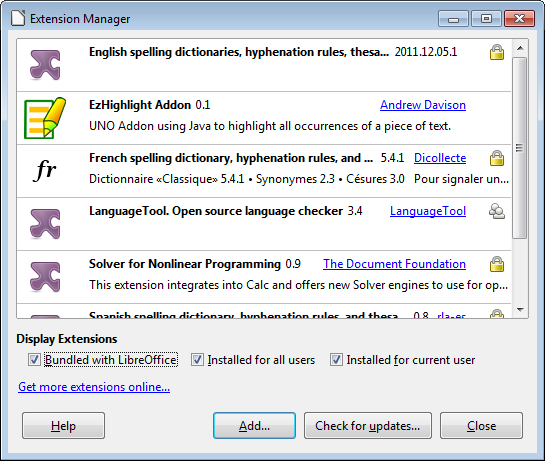

Figure 1. The EzHighlight Add-on Extension. 

 
When the Writer application is running, EzHighlight is accessible either through 
Office's Tools > Add-Ons menu item (see Figure 2) or as a toolbar created by View > 
Toolbars > Add-on 2 (see Figure 3). This 'floating' toolbar can be attached to an 
existing toolbar. 

 

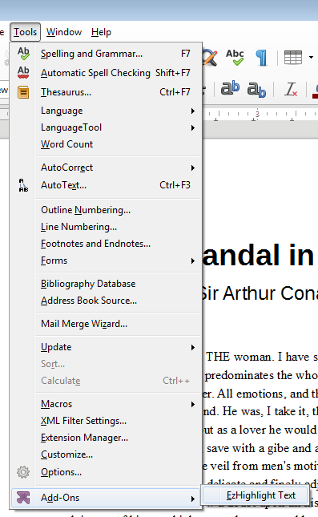

Figure 2. The EzHighlight Add-on on the Tools Menu. 

 
 

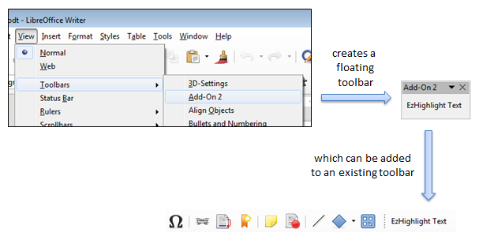

Figure 3. The EzHighlighter Add-on as a Toolbar. 

 
When the user clicks on "EzHighlight Text", either through the menu or toolbar, the 
dialog shown in Figure 4 appears. 

 
 

Figure 4. The EzHighlighter Dialog. 

 
The user enters a word, and either types <ENTER> or presses the "Highlight" button. 

Every matching word in the currently loaded Writer document is redrawn in red, and 
the number of changes reported in the "Count:" field.  

EzHighlight also has basic help support, accessible from Office's Help menu as the 
"About EzHighlight" item (see Figure 5). 

 
 

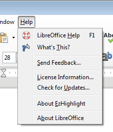

Figure 5. The EzHighlight Help Menu Item. 

 
Clicking on the help item causes a simple message box to appear, as in Figure 6. 

 
 

Figure 6. The EzHighlight Help Message Box. 

 
 
## 1.  What is an Add-on? 

Office supports two kinds of add-on: job add-ons and ProtocolHandler add-ons.  

A job add-on is a component triggered by events inside Office, such as when the 
application is first opened or about to terminate, or when a document is loaded, 
printed, or closed.  

 
This chapter is about Protocol handler add-ons, which link menu and/or toolbar items 
to a component using Office's dispatch framework. Every GUI element is assigned a 
'command URL', a unique name made of two or three parts:  
<protocol string>:<command string>[?<command string argument>+ ] 
A protocol string can be almost anything, and I'll be using the extension's ID 
("org.openoffice.ezhighlightAddon").   

There is a different command string for each GUI-triggered action, and I'll utilize two: 
"EzHighlight" and "help". "EzHighlight" is associated with the EzHighlight menu and 
toolbar items (Figures 2 and 3), and makes the dialog in Figure 4 appear. "help" is 
assigned to the "About EzHighlight" help menu item, and causes the message box in 
Figure 6 to be displayed. 

I won't be using command string arguments. 

When a user chooses an item in the user interface, its command URL is passed along 
a list of dispatch handlers until one accepts the command and processes it by creating 
a dispatch object. Fortunately, most of the dispatch handling behavior in an add-on 
can be generated automatically. 

The main source of information for job and ProtocolHandler add-ons is chapter 3 of 
the Developer's Guide (available at 
https://wiki.openoffice.org/w/images/d/d9/DevelopersGuide_OOo3.1.0.pdf), or  
online at 
https://wiki.openoffice.org/wiki/Documentation/DevGuide/WritingUNO/Integrating_
Components_into_OpenOffice.org and 
https://wiki.openoffice.org/wiki/Documentation/DevGuide/WritingUNO/AddOns/Ad
d-Ons (or use loGuide "Integrating Components" and loGuide add-ons). 

The Developer's Guide add-on example can be found at   
http://api.libreoffice.org/examples/DevelopersGuide/examples.html#Components 
 
 
## 2.  Creating the EzHighlight Add-on 

There's an overlap between the steps required to create an UNO component and an 
add-on. The main similarity is the need for an OXT file containing a JAR and a 
description.xml. However, there's no need for an IDL file or type database (a RDB 
file), but there are extra details concerning the GUI and dispatch handling.  

The main steps in creating an add-on are illustrated by Figure 7. 

 
 

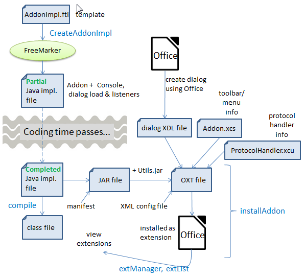

Figure 7. Toolchain for Creating an Add-on. 

 
The UNO component toolchain in the previous chapter used my skelComp.bat script 
to generate a partial Java implementation. The script utilizes Office's uno-
skeletonmaker which can also be employed to generate add-ons and Calc addins. 

Unfortunately, I was unable to get its add-on features to work.  

This was not a great loss since I'd already been thinking about replacing uno-
skeletonmaker with FreeMarker, a powerful template processing library 
(http://freemarker.org/). FreeMarker can easily duplicate all the features of  uno-
skeletonmaker, creating a Java class with the boilerplate code for creating a service 
and handling command URLs. Also, by switching to FreeMarker, I was able to add 
more automatic code generation, including code for a user input dialog and a 
debugging window.  

The OXT file requires three configuration files: a description of  the dialog in Figure 
4, Addon.xcs which defines the add-on's GUI (e.g. the menu and toolbar items in 
Figures 2 and 3), and ProtocolHandler.xcu which says which command URLs are 
processed by the add-on's dispatch handler. 

The toolchain in Figure 7 will be explained in more detail in the rest of this chapter. 

 
 
  
## 3.  Creating a Partial Add-on Implementation 

Figure 8 shows the main elements needed to use the FreeMarker template library: a 
FTL template file, and a program that instantiates the template by employing a 
collection of FreeMarker variables and their bindings.  

 
 

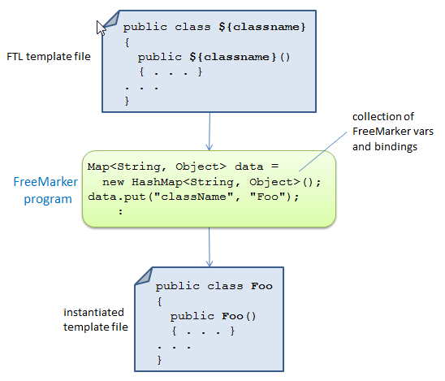

Figure 8. Using FreeMarker. 

 
The simplest FreeMarker program replaces all the FreeMarker variables in the 
template by their associated bindings, generating a new text file (a Java program in 
this case). However, FreeMarker contains additional programming features, including 
for-loops and if-statements, which can generate more complex blocks of text. 

The add-on template is stored in addonImpl.ftl, and is processed by 
CreateAddonImpl.java. It reads in the add-on's name, and initializes a HashMap of 
three FreeMarker variables called "className", "extensionID, and "cmdNames". 

For example, CreateAddonImpl can be called like so: 
> run CreateAddonImpl EzHighlight 
The three variables are assigned: 
 "className"   : "EzHighlightAddonImpl" 
 "extensionID  :  "org.openoffice.ezhighlightAddon" 
 "cmdNames"    : [ "EzHighlight", "help" ] 
"className" is assigned the name of the generated Java class. "extensionID" contains 
the protocol string used by the command URLs. "cmdNames" holds a list of 
command URL names: "EzHighlight" is linked to the add-on's menu and toolbar 
items, and "help" is attached to the add-on's help menu item. 

CreateAddonImpl outputs a class called EzHighlightAddonImpl, a fully functional 
add-on, which displays a dialog like the one in Figure 4 and the help message in 

Figure 6. However, after the user has typed <ENTER> in the dialog or pressed the 
"Ok" button, no processing is carried out on the Office document.  

First I'll give an overview of the features in the generated EzHighlightAddonImpl 
class, then explain the additional highlighting code in a later section. 

 
 
## 4.  The FreeMarker-generated EzHighlightAddonImpl  

The template in addonImpl.ftl represents a single Java class, which extends 
WeakBase and implements seven interfaces: 
 
public class ${className} extends WeakBase implements 
         XInitialization, XServiceInfo,  
         XDispatchProvider, XDispatch,   // for the add-on 
         XActionListener, XTopWindowListener,  
         XKeyListener                    // for the dialog 
{ 
 //  ... add-on code 
}  
 
WeakBase is the base class used by all components (which includes add-ons and Calc 
Addins). XServiceInfo and XInitialization handle the creation and initialization of the 
service at run time. 

The XDispatchProvider method, queryDispatch(), implements the dispatch handler 
for the add-on – it accepts the command URLs associated with the add-on: 
 
// in EzHighlightAddonInpl.java 
public XDispatch queryDispatch(URL commandURL,  
                      String targetFrameName, int searchFlags) 
{ 
  if (commandURL.Protocol.compareTo( 
                 "org.openoffice.ezhighlightAddon:") == 0) { 
    if (commandURL.Path.compareTo("EzHighlight") == 0) { 
      System.out.println("queryDispatch() for \"EzHighlight\""); 
      return this; 
    } 
    if (commandURL.Path.compareTo("help") == 0) { 
      System.out.println("queryDispatch() for \"help\""); 
      return this; 
    } 
  } 
  return null; 
}  // end of queryDispatch() 
 
The handler signals its acceptance of a command URL by returning a dispatch object 
which Office uses to process the command. EzHighlightAddonImpl also implements 
the XDispatch interface, so returns a reference to itself. This means that Office calls 
EzHighlightAddonImpl.dispatch(), passing it the command URL and other properties: 
 
// in EzHighlightAddonInpl.java 
public void dispatch(URL commandURL, PropertyValue[] props) 
{ 
  if (commandURL.Protocol.compareTo( 
               "org.openoffice.ezhighlightAddon:") == 0) { 
    if (commandURL.Path.compareTo("EzHighlight") == 0) 
      processCmd("EzHighlight");    
    if (commandURL.Path.compareTo("help") == 0) 
      processCmd("help");    
  } 
}  // end of dispatch() 
 
The template-generated code inside dispatch() distinguishes between the possible 
command names ("EzHighlight" and "help") by calling processCmd() with different 
arguments. 

If processCmd()'s input argument is "help", then GUI.showMessageBox() is called to 
display the window shown in Figure 6, while "EzHighlight" triggers the dialog in 

Figure 4. The processCmd() code is: 
 
// in EzHighlightAddonInpl.java... 

// globals 
private XDialog dialog = null; 
 
private Console console;    // for debugging output 
private int printCount = 1; 
 
 
private void processCmd(String cmd) 
{ 
  XComponent doc = Lo.addonInitialize(xcc);    
                   // so my utils can be used safely 
 
  System.out.println("Window title: " + GUI.getTitleBar()); 
  System.out.println(printCount++ +  
                 ". dispatch() called for \"" + cmd + "\""); 
 
  if (cmd.equals("help")) { 
    GUI.showMessageBox("Add-on Help",  
          "Type in the text, then press return or  
           click the Ok button."); 
    return; 
  } 
 
  // "EzHighlight" is processed by the following code... 

  console.setVisible(true); 
 
  dialog = Dialogs.loadAddonDialog( 
                    "org.openoffice.ezhighlightAddon", 
                    "dialogLibrary/" + cmd + ".xdl"); 
  if (dialog == null) { 
    System.out.println("Could not load " + cmd + " dialog"); 
    return; 
  } 
 
  XControl dialogControl = Dialogs.getDialogControl(dialog); 
  initDialog(dialogControl); 
  Dialogs.execute(dialogControl); 
 
  console.setVisible(false); 
}  // end of processCmd() 
 
Lo.addonInitialize() initializes the globals used by my Lo utility library and other 
support classes: 
 
// in the Lo class 
// globals 
private static XComponentContext xcc = null; 
private static XDesktop xDesktop = null; 
private static XMultiComponentFactory mcFactory = null;    
private static XMultiServiceFactory msFactory = null; 
 
 
public static XComponent addonInitialize( 
                             XComponentContext addonXcc) 
{ xcc = addonXcc; 
  if (xcc == null)  { 
    System.out.println("Could not access component context"); 
    return null; 
  } 
 
  mcFactory = xcc.getServiceManager(); 
  if (mcFactory == null) { 
    System.out.println("Office Service Manager is unavailable"); 
    return null; 
  } 
 
  try { 
    Object oDesktop = mcFactory.createInstanceWithContext( 
                         "com.sun.star.frame.Desktop", xcc); 
    xDesktop = Lo.qi(XDesktop.class, oDesktop); 
  } 
  catch (Exception e) { 
    System.out.println("Could not access desktop"); 
    return null; 
  } 
 
  XComponent doc = xDesktop.getCurrentComponent(); 
  if (doc == null)  { 
    System.out.println("Could not access document"); 
    return null; 
  } 
 
  msFactory =  Lo.qi(XMultiServiceFactory.class, doc); 
  return doc; 
}  // end of addonInitialize() 
 
addonInitialize() returns an instance of XComponent, which refers to the document 
currently loaded into Office. Later this will be used to highlight the document's text. 

processCmd() calls Console.setVisible() before and after the processing of the 
"EzHighlight" command. The first call makes a Console debugging window visible, 
and the call at the end hides it. These lines should be commented out of the completed 
add-on, so the window doesn't appear. 

The dialog is handled by methods from my Dialogs support class, and by listeners set 
up in initDialog().  

 
 
## 5.  Creating the Dialog 

There are two approaches for dialog creation: the easy way uses Office's dialog editor, 
and the hard way calls functions in my Dialogs support class to programmatically 
create the dialog's components. I'll use the editor in this chapter, and employ Dialogs 
methods in my macros in Chapter 48. 

The Developer's Guide has some information on the dialog editor in chapter 11, 
"OpenOffice.org Basic". The relevant sub-sections are online at 
https://wiki.openoffice.org/wiki/Documentation/DevGuide/Basic/Dialog_Editor and 
https://wiki.openoffice.org/wiki/Documentation/DevGuide/Basic/Creating_Dialogs 
(or use loGuide "Dialog Editor" and loGuide "Creating Dialogs").  

The editor utilizes drag-and-drop to place GUI elements in a dialog drawing area, 
with property windows for specializing each element. The editor is reached via 
Office's menu item Tools > Macros > Organize Dialogs (see Figure 9). 

 
 

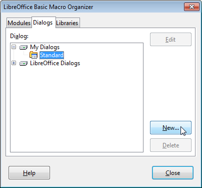

Figure 9. Creating a new Dialog. 

 
Figure 10 shows the dialog editor window after the creation of a new dialog called 
"Basic"; the GUI controls run along the bottom of the window. 

 
 

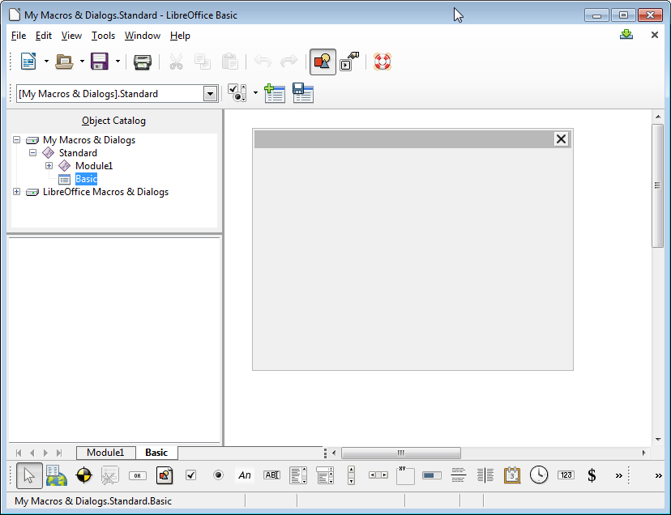

Figure 10. The Dialog Editor Window for a new Dialog. 

 
The simplest useful dialog is probably the version of the "Basic" dialog in Figure 11, 
consisting of a label, text field, and "Ok" button. 

 
 

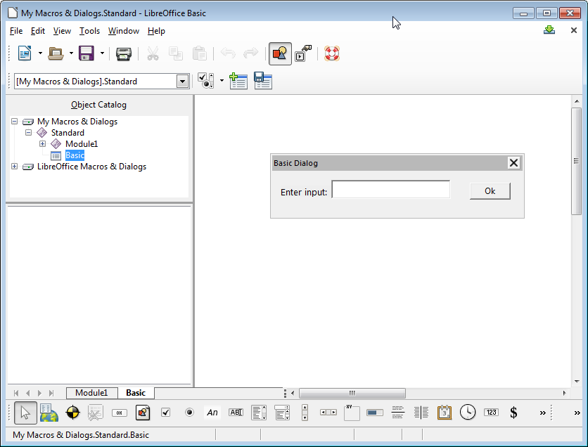

Figure 11. The "Basic" Dialog. 

 
A dialog can be exported as XML using the "Export Dialog" icon above the drawing 
area (the icon includes a floppy disk which will leave young programmers mystified).  

The resulting XDL file contains text something like: 
 
<?xml version="1.0" encoding="UTF-8"?> 
<!DOCTYPE dlg:window  
       PUBLIC "-//OpenOffice.org//DTD OfficeDocument 1.0//EN" 
       "dialog.dtd"> 
<dlg:window xmlns:dlg="http://openoffice.org/2000/dialog" 
            xmlns:script="http://openoffice.org/2000/script" 
         dlg:id="Basic" 
         dlg:left="52" dlg:top="44" dlg:width="173" dlg:height="34" 
         dlg:closeable="true" dlg:moveable="true" 
         dlg:title="Basic Dialog"> 
 
  <dlg:styles> 
    <dlg:style dlg:style-id="0" 
               dlg:background-color="0xeeeeee" 
               dlg:font-height="10"/> 
  </dlg:styles> 
 
  <dlg:bulletinboard> 
    <dlg:text dlg:style-id="0" dlg:id="Label1" 
          dlg:tab-index="0" 
          dlg:left="6" dlg:top="11" dlg:width="38" dlg:height="8" 
          dlg:value="Enter input:"/> 
 
    <dlg:textfield dlg:id="TextField1" 
          dlg:tab-index="1" 
          dlg:left="41" dlg:top="7" dlg:width="83" dlg:height="14"/> 
 
    <dlg:button dlg:id="CommandButton1" 
          dlg:tab-index="2" 
          dlg:left="137" dlg:top="9" dlg:width="28" dlg:height="12" 
          dlg:value="Ok"/> 
 
  </dlg:bulletinboard> 
</dlg:window> 
 
The code in EzHighlightAddonInpl assumes that the dialog contains a text field called 
"TextField1" and a button called "CommandButton1", which is true of the XDL 
shown above. Of course, it's possible to add more GUI components, as in the next 
section. 

 
### 5.1.  The EzHighlight Dialog 

The dialog editor has an import icon to the left of the export icon, which can be used 
to load an XDL file for modification.  

I copied the "Basic" XDL file, renaming it to "EzHighlight.xdl", and imported it; a 
few changes and additions later, it looked as shown in Figure 12. 

 
 

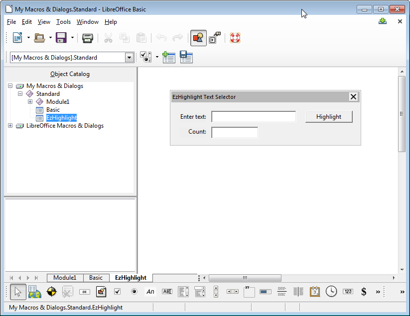

Figure 12. The EzHighlight.xdl Dialog. 

 
The exported XML is: 
 
<?xml version="1.0" encoding="UTF-8"?> 
<!DOCTYPE dlg:window  
               PUBLIC "-//OpenOffice.org//DTD OfficeDocument 1.0//EN" 
               "dialog.dtd"> 
<dlg:window xmlns:dlg="http://openoffice.org/2000/dialog" 
            xmlns:script="http://openoffice.org/2000/script" 
      dlg:id="EzHighlight" 
      dlg:left="109" dlg:top="73" dlg:width="184" dlg:height="44" 
      dlg:closeable="true" dlg:moveable="true" 
      dlg:title="EzHighlight Text Selector"> 
 
 <dlg:styles> 
  <dlg:style dlg:style-id="0" 
             dlg:background-color="0xeeeeee"/> 
 </dlg:styles> 
 
 <dlg:bulletinboard> 
  <dlg:text dlg:style-id="0" dlg:id="Label1" 
          dlg:tab-index="0" 
          dlg:left="8" dlg:top="11" dlg:width="26" dlg:height="10" 
          dlg:value="Enter text:" 
          dlg:align="right"/> 
 
  <dlg:textfield dlg:id="TextField1" 
          dlg:tab-index="1" 
          dlg:left="39" dlg:top="9" dlg:width="83" dlg:height="12"/> 
 
  <dlg:textfield dlg:id="TextField2" 
          dlg:tab-index="2" 
          dlg:left="39" dlg:top="26" dlg:width="46" dlg:height="12" 
          dlg:readonly="true"/> 
 
  <dlg:text dlg:style-id="0" dlg:id="Label2" 
          dlg:tab-index="3" 
          dlg:left="8" dlg:top="27" dlg:width="26" dlg:height="10" 
          dlg:value="Count:" 
          dlg:align="right"/> 
 
  <dlg:button dlg:id="CommandButton1" 
          dlg:tab-index="4" 
          dlg:left="131" dlg:top="9" dlg:width="46" dlg:height="12" 
          dlg:value="Highlight"/> 
 
 </dlg:bulletinboard> 
</dlg:window> 
 
The dialog loading code in EzHighlightAddonInpl.java assumes that the dialog's 
filename is the same as the command URL name, as can be seen in processCmd(): 
 
// part of processCmd() in EzHighlightAddonInpl.java... 

dialog = Dialogs.loadAddonDialog("org.openoffice.ezhighlightAddon", 
                            "dialogLibrary/" + cmd + ".xdl"); 
 
processCmd() also assumes that the XDL file is in a dialogLibrary/ sub-directory. I'll 
explain how this is part of the add-on's OXT file in a later section. 

Dialogs.loadAddonDialog() is defined as: 
 
// in the Dialogs class 
public static XDialog loadAddonDialog(String extensionID,  
                                      String dialogFnm) 
{ XDialogProvider dp =  
           Lo.createInstanceMCF(XDialogProvider.class,  
                         "com.sun.star.awt.DialogProvider"); 
  if (dp == null) { 
    System.out.println("Could not access the Dialog Provider"); 
    return null; 
  } 
  try { 
    return dp.createDialog("vnd.sun.star.extension://" +  
                                extensionID + "/" + dialogFnm); 
  } 
  catch (java.lang.Exception e) { 
    System.out.println("Could not load the dialog: \"" +  
                                   dialogFnm + "\": " + e); 
    return null; 
  } 
}  // end of loadAddonDialog() 
 
The crucial line is the call to XDialogProvider.createDialog(), which constructs the 
dialog name: 
vnd.sun.star.extension://org.openoffice.ezhighlightAddon/ 
                                       dialogLibrary/EzHighlight 
The dialog is loaded from the ezhighlightAddon extension. 

 
### 5.2.  Listening to the Dialog 

Back in processCmd(), listeners are attached to the loaded dialog, and the dialog is 
made visible on-screen: 
 
// in processCmd() in EzHighlightAddonInpl.java... 

XControl dialogControl = Dialogs.getDialogControl(dialog); 
initDialog(dialogControl); 
Dialogs.execute(dialogControl); 
 
Dialogs.getDialogControl() casts the XDialog into an XControl: 
 
// in the Dialogs class 
public static XControl getDialogControl(XDialog dialog) 
{  return Lo.qi(XControl.class, dialog);  }   
 
The initDialog() method inside EzHighlightAddonInpl.java attaches three listeners to 
the dialog: a window listener, an action listener for the "CommandButton1" button, 
and a key listener for the "TextField1" text field: 
 
// in the EzHighlightAddonInpl class 
// globals 
private XTextComponent textBox;    
             // the text in the dialog's text field 
 
 
private void initDialog(XControl dialogControl) 
{ 
  // listen to the dialog window 
  XTopWindow topWin = Dialogs.getDialogWindow(dialogControl); 
  topWin.addTopWindowListener(this); 
 
  // Dialogs.showControlInfo(dialogControl); 
 
  // set listener for Ok button 
  XButton button = Lo.qi(XButton.class, 
      Dialogs.findControl(dialogControl, "CommandButton1")); 
  button.addActionListener(this); 
 
  // set listener for text box 
  textBox = Lo.qi(XTextComponent.class,  
      Dialogs.findControl(dialogControl, "TextField1")); 
  XWindow xTFWindow = (XWindow) Lo.qi(XWindow.class, textBox); 
  xTFWindow.addKeyListener(this); 
  xTFWindow.setFocus(); 
}  // end of initDialog() 
 
These controls and listeners are all from Office's com.sun.star.awt module. The dialog 
and listeners will be invoked by Office at run time, and so should use its API, not 
Java's Swing. 

The call to Dialogs.showControlInfo() is commented out in initDialog(), but is a 
useful way to double-check the dialog's internal construction, and particularly the IDs 
of its components. showControlInfo() prints to standard output which will be 
displayed in the Console window. Figure 13 reports the structure of the 
EzHighlight.xdl dialog from Figure 12. 

 
 

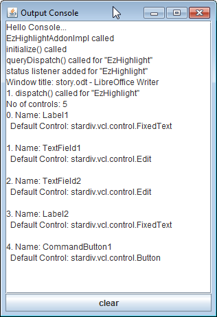

Figure 13. The Console Window Showing Dialog Details. 

 
The dialog contains five components: two labels, two text fields, and a button. 

Dialogs.findControl() uses a control's name to find it inside a dialog: 
 
// in Dialogs class 
public static XControl findControl(XControl dialogCtrl,  
                                  String name) 
{ XControlContainer ctrlCon =  
                  Lo.qi(XControlContainer.class, dialogCtrl); 
  return ctrlCon.getControl(name); 
}  
 
initDialog() converts the returned "CommandButton1" control into an XButton, and 
the "TextField1" control into an XTextComponent so that listeners can be attached to 
them. 

EzHighlightAddonInpl implements all of the listener interfaces used by the dialog: 
XActionListener, XTopWindowListener, and XKeyListener.  

XActionListener.actionPerformed() deals with button presses, 
XTopWindowListener.windowClosing() listens for the closing of the dialog, and 
XKeyListener.keyPressed() captures the user typing <ENTER> into the text field: 
 
// in the EzHighlightAddonInpl class 
// globals 
private XDialog dialog = null; 
private XTextComponent textBox; 
 
 
public void actionPerformed(ActionEvent e) 
{ 
  String info = textBox.getText(); 
  if (info.equals("")) 
    return; 
  System.out.println("Info: \"" + info +"\""); 
  textBox.setText(""); 
  // ADD code here 
}  // end of actionPerformed() 
 
 
public void windowClosing(EventObject event) 
{  dialog.endExecute();   } 
 
 
public void keyPressed(KeyEvent event) 
{   
  if (event.KeyCode == Key.RETURN) {  
    String info = textBox.getText(); 
    if (info.equals("")) 
      return; 
    System.out.println("Info: \"" + info +"\""); 
    textBox.setText(""); 
    // ADD code here 
  } 
}  // end of keyPressed() 
 
The template generated code for actionPerformed() and keyPressed() only print 
information to the Console window. Add-on specific functionality is added next. 

 
 
## 6.  Completing the Implementation of EzHighlightAddonInpl  

The completion of EzHighlightAddonInpl.java takes the form of new code in 
processCmd(), initDialog(), actionPerformed(), and keyPressed(), and a few new 
global variables. 

processCmd() converts the XComponent document returned by Lo.addonInitialize() 
into an XTextDocument, assuming that the currently loaded document is text-based. 

If it isn't then there's no point continuing: 
 
// in the EzHighlightAddonInpl class 
// globals 
private XTextDocument textDoc; 
 
 
// in processCmd() 
    : 
XComponent doc = Lo.addonInitialize(xcc);  
// added 
textDoc = Write.getTextDoc(doc); 
if (textDoc == null) 
  return; 
    : 
 
initDialog() is extended to access the word count text field. It's only used to report the 
number of changes, so doesn't need a listener: 
 
// in the EzHighlightAddonInpl class 
// globals 
private XTextComponent countTextBox; 
 
 
// in initDialog() 
    : 
// get a reference to the count text field; added 
countTextBox = Lo.qi(XTextComponent.class,  
          Dialogs.findControl(dialogControl, "TextField2")); 
    : 
 
actionPerformed() and keyPressed() must trigger the highlighting code, which is 
implemented in applyEzHighlighting(): 
 
// added to actionPerformed() 
    : 
int count = applyEzHighlighting(info); 
countTextBox.setText(""+count); 
 
 
// added to keyPressed() 
    : 
int count = applyEzHighlighting(info); 
countTextBox.setText(""+count); 
 
applyEzHighlighting() is passed the text entered by the user through the dialog. It uses 
the XReplaceable and XReplaceDescriptor interfaces to perform a search and replace 
through the document. This technique, and very similar code, was explained in 
Chapter 9. applyEzHighlighting() is: 
 
// in the EzHighlightAddonInpl class 
// globals 
private XTextDocument textDoc; 
 
 
private int applyEzHighlighting(String searchKey) 
/* Matches whole words and is case sensitive.  

   Highlights in bold and red;  */ 
{ 
  System.out.println("applyEzHighlighting(): " + searchKey); 
 
  XReplaceable repl = Lo.qi(XReplaceable.class, textDoc); 
  XReplaceDescriptor desc = repl.createReplaceDescriptor(); 
 
  /* Get a XPropertyReplace object for altering the properties 
     of the replaced text */ 
  XPropertyReplace propReplace = Lo.qi(XPropertyReplace.class, desc); 
 
  // Set the replaced text to bold and red 
  PropertyValue wv = new PropertyValue("CharWeight", -1,  
              FontWeight.BOLD, PropertyState.DIRECT_VALUE); 
  PropertyValue cv = new PropertyValue("CharColor", -1,  
          Color.RED.getRGB(), PropertyState.DIRECT_VALUE); 
  PropertyValue[] props = new PropertyValue[] {cv, wv}; 
 
  try { 
    propReplace.setReplaceAttributes(props); 
 
    // Only match whole words and be case sensitive 
    desc.setPropertyValue("SearchCaseSensitive", true); 
    desc.setPropertyValue("SearchWords", true); 
  } 
  catch (com.sun.star.uno.Exception ex) { 
    System.out.println("Error setting up search properties"); 
    return -1; 
  } 
 
  /* Replaces all instances of searchKey with new Text properties 
     and gets the number of changed instances */ 
  desc.setSearchString(searchKey); 
  desc.setReplaceString(searchKey); 
  return repl.replaceAll(desc); 
}  // end of applyEzHighlighting() 
 
 
## 7.  Configuring the Add-on 

An add-on OXT file requires two configuration files not used by an UNO component: 
ProtocolHandler.xcu and Addon.xcs. 

 
### 7.1.  ProtocolHandler.xcu 

ProtocolHandler.xcu specifies which command URLs will be handled by the 
component. The contents of the file for EzHighlight are: 
 
<?xml version='1.0' encoding='UTF-8'?> 
 
<oor:component-data oor:name="ProtocolHandler"  
                    oor:package="org.openoffice.Office"  
      xmlns:oor="http://openoffice.org/2001/registry"  
      xmlns:xs="http://www.w3.org/2001/XMLSchema"  
      xmlns:xsi="http://www.w3.org/2001/XMLSchema-instance"> 
  <node oor:name="HandlerSet"> 
 
    <node oor:name="EzHighlightAddonImpl" oor:op="replace"> 
      <prop oor:name="Protocols" oor:type="oor:string-list"> 
        <value>org.openoffice.ezhighlightAddon:*</value> 
      </prop> 
    </node> 
 
  </node> 
</oor:component-data> 
 
The "EzHighlightAddonImpl" component will handle all command URLs that begin 
with the "org.openoffice.ezhighlightAddon" extension ID. The "all" is specified using 
the * wildcard. The component name is the name of the generated Java class. 

 
### 7.2.  Addon.xcs 

Addon.xcs defines the add-on's GUI elements, such as its menu and toolbar items (i.e. 

as seen in Figures 2, 3, and 5). Figure 14 illustrates how the file may set up to five 
attributes: 
 

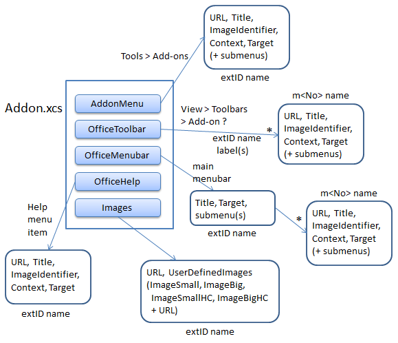

Figure 14. The Addon.xcs GUI Elements. 

 
The "AddonMenu" attribute defines the look of the menu item that appears at the end 
of Office's Tool > Add-ons menu, as in Figure 2.  

The "OfficeToolbar" attribute specifies the appearance of the floating toolbar reached 
via View > Toolbars > Add-on <number>, as in Figure 3. 

The "OfficeMenubar" attribute is used to add a menu item to Office's main menu bar, 
which seems a rather poor GUI design choice, so I've chosen not to use it. 

The OfficeHelp" attribute creates the add-on's help menu item on Office's Help menu, 
as in Figure 5. 

The "Images" attribute defines the icons that appear next to the text in the menu and 
toolbar items. If you look back at Figures 2 and 3, you'll see that no icons appear, but 
this isn't for want of me trying. This feature seems to be broken, but I'll still explain 
how to set it up. 

Aside from "Images", the attributes have a similar structure: a menu or toolbar item 
with five sub-attributes: URL, Title, ImageIdentifier, Context, and Target; I'll not be 
using sub-menu attributes. 

The best explanation of Addon.xcs' structure is "How to distribute your macros with 
an Addon" by Bernard Marcelly at 
http://www.openoffice.org/documentation/HOW_TO/various_topics/Addons1_1en.pd
f, which dates from 2003. 

 
The "AddonMenu" Attribute 
The "AddonMenu" attribute used by the EzHighlight add-on is: 
 
<node oor:name="AddonMenu"> 
  <node oor:name="org.openoffice.ezhighlightAddon"  
        oor:op="replace"> 
 
    <prop oor:name="URL" oor:type="xs:string"> 
      <value>org.openoffice.ezhighlightAddon:EzHighlight</value> 
    </prop> 
 
    <prop oor:name="Title" oor:type="xs:string"> 
      <value>EzHighlight Text</value> 
    </prop> 
 
    <prop oor:name="ImageIdentifier" oor:type="xs:string"> 
        <value/> 
    </prop> 
 
    <prop oor:name="Context" oor:type="xs:string"> 
      <value>com.sun.star.text.TextDocument</value> 
    </prop> 
 
    <prop oor:name="Target" oor:type="xs:string"> 
      <value>_self</value> 
    </prop> 
  </node> 
</node> 
 
The "URL" attribute holds the command URL which is dispatched by Office when 
the menu item is clicked.  

The "Title" attribute contains the menu item's text, and "ImageIdentifier" can be 
assigned the path to a PNG or BMP file for the text's icon. "ImageIdentifier" is left 
empty here since all the images are defined in the "Images" attribute, explained 
below.  

The "Context" attribute is assigned the document service for the Office application 
utilizing the add-on. EzHighlight is accessible only from Writer, so "Context"'s value 
is "com.sun.star.text.TextDocument". Other application/service mappings are shown 
in Table 1. 

 
Office Application Document Service 
Writer  com.sun.star.text.TextDocument 
Calc  com.sun.star.sheet.SpreadsheetDocument 
Impress      com.sun.star.presentation.PresentationDocument 
Draw         com.sun.star.drawing.DrawingDocument 
Formula      com.sun.star.formula.FormulaProperties 
Chart   com.sun.star.chart.ChartDocument 
Bibliography   com.sun.star.frame.Bibliography 
Table 1. Office Application/Service Mappings Used by "Context" 
 
If the "Context" field isn't assigned a value, then the add-on will be available in all of 
Office's applications. 

The "Target" field can be assigned four values: "_top", "_parent", "_blank", and 
"_self", but I've never seen any other value used but "_self". 

 
The "OfficeToolbar" Attribute 
Figure 2 (EzHighlight's menu item) and Figure 3 (its toolbar item) look the same, and 
respond in the same way when clicked, so it's no great surprise that the 
"OfficeToolbar" attribute in Addon.xcs is almost exactly the same as "AddonMenu": 
 
<node oor:name="OfficeToolBar"> 
  <node oor:name="org.openoffice.ezhighlightAddon"  
        oor:op="replace"> 
    <node oor:name="m1" oor:op="replace"> 
 
      <prop oor:name="URL" oor:type="xs:string"> 
        <value>org.openoffice.ezhighlightAddon:EzHighlight</value> 
      </prop> 
 
      <prop oor:name="Title" oor:type="xs:string"> 
        <value>EzHighlight Text</value> 
      </prop> 
 
      <prop oor:name="ImageIdentifier" oor:type="xs:string"> 
         <value/> 
      </prop> 
 
      <prop oor:name="Context" oor:type="xs:string"> 
        <value>com.sun.star.text.TextDocument</value> 
      </prop> 
 
      <prop oor:name="Target" oor:type="xs:string"> 
        <value>_self</value> 
      </prop> 
    </node> 
  </node> 
</node> 
 
The difference is an extra <node> attribute which allows a toolbar to hold several 
items. In the description above, there's one item labeled as "m1". The labels can be 
any unique string, but "m" followed by a number is used in most examples. 

 
The "OfficeHelp" Attribute 
The "OfficeHelp" attribute is similar to "OfficeToolbar" and "AddonMenu", but 
dispatches a different command URL ("org.openoffice.ezhighlightAddon:help") and 
its menu item uses a different title ("About EzHighlight"). 

 
<node oor:name="OfficeHelp"> 
  <node oor:name="org.openoffice.ezhighlightAddon"  
        oor:op="replace"> 
 
     <prop oor:name="URL" oor:type="xs:string"> 
        <value>org.openoffice.ezhighlightAddon:help</value> 
     </prop> 
 
     <prop oor:name="Title" oor:type="xs:string"> 
        <value xml:lang="en-US">About EzHighlight</value> 
     </prop> 
 
     <prop oor:name="ImageIdentifier" oor:type="xs:string"> 
        <value/> 
     </prop> 
 
      <prop oor:name="Context" oor:type="xs:string"> 
        <value>com.sun.star.text.TextDocument</value> 
      </prop> 
 
     <prop oor:name="Target" oor:type="xs:string"> 
        <value>_self</value> 
     </prop> 
   </node> 
</node> 
 
The "Images" Attribute 
The "Images" attribute specifies the icons used by the GUI elements. An image can be 
either big or small (26x26 or 16x16 pixels), high contrast or normal, and loaded from 
a file or coded as hexadecimal text. These different combinations mean there are eight 
variants to choose from, each with a different property name, which are listed in Table 
2. 

 
Size in 
Pixels 
Contrast 
Property Name 
Hexadecimal text File name 
16x16 normal ImageSmall ImageSmallURL 
16x16 high ImageSmallHC ImageSmallHCURL 
26x26 normal ImageBig ImageBigURL 
26x26 high ImageBigHC ImageBigHCURL 
Table 2. Image Property Names. 

 
The "Images" attribute for EzHighlight is: 
 
<node oor:name="Images"> 
  <node oor:name="org.openoffice.ezhighlightAddon"  
        oor:op="replace"> 
 
    <prop oor:name="URL" oor:type="xs:string"> 
      <value>org.openoffice.ezhighlightAddon:EzHighlight</value> 
    </prop> 
 
    <node oor:name="UserDefinedImages"> 
      <prop oor:name="ImageSmallURL"> 
        <value>%origin%/images/ezhighlight16.png</value> 
      </prop> 
      <prop oor:name="ImageBigURL"> 
        <value>%origin%/images/ezhighlight26.png</value> 
      </prop> 
    </node> 
 
  </node> 
</node> 
 
The "UserDefinedImages" sub-attribute specifies two sizes of normal contrast image, 
supplied as filenames. %origin% stands for the OXT file, so the two icons are stored 
in the images/ subdirectory inside that zipped file. 

The images will be used for the menu and toolbar items associated with the 
"org.openoffice.ezhighlightAddon:EzHighlight" command URL. Unfortunately, the 
images don't appear, as shown in Figures 2 and 3. 

The hexadecimal text definition of a small image would be something like: 
 
  <prop oor:name="ImageSmall"> 
    <value>89504E470D0A1A0A0000000D494844520000001000000 
           01008060000001FF3FF610000024F494 ... // more numbers 
    </value> 
  </prop> 
 
One way to obtain an image's hexadecimal text is to call my ImageHex.java program 
which prints it to stdout. Unfortunately, the icon still doesn't appear, even when 
specified in this form. 

 
 
## 8.  Building and Installing the OXT File 

Figure 7 shows the stages in building and installing the add-on as an extension. These 
steps are carried out by my installAddon.bat script, which assumes that the various 
configuration files have already been created and are in certain locations. 

The completed EzHighlightAddonImpl.java file is compiled, then added to 
EzHighlight.jar with a manifest that refers to Utils.jar: 
 
RegistrationClassName: EzHighlightAddonImpl 
Class-Path: Utils.jar 
 
Utils.jar contains my support classes, which may be required by the add-on at run-
time. installAddon.bat will add it to the OXT file along with EzHighlight.jar. 

installAddon.bat assumes that the add-on configuration files are in a sub-directory 
with the same name as the add-on. For example, when it's processing the EzHighlight 
add-on, it looks for a EzHighlight/ folder with the following structure: 
 
EzHighlight 
    |   Addons.xcu 
    |   description.xml 
    |   license.txt 
    |   package-description.txt 
    |   ProtocolHandler.xcu 
    |   Utils.jar 
    |    
    +---dialogLibrary 
    |       EzHighlight.xdl 
    |        
    +---images 
    |       ezhighlight.png 
    |       ezhighlight16.png 
    |       ezhighlight26.png 
    |        
    \---META-INF 
            manifest.xml 
 
EzHighlight.jar is moved into EzHighlight/, and the folder is zipped into 
EzHighlight.oxt. The extension is installed into Office using the unopkg tool, in the 
same way as the UNO component of the last chapter. 

EzHighlight/ contains three configuration files: ProtocolHandler.xcu, Addons.xcu, 
and description.xml. description.xml plays the same role as the same-named file for 
UNO components. Its contents use the same XML attributes: 
 
<?xml version="1.0" encoding="UTF-8"?> 
<description 
xmlns="http://openoffice.org/extensions/description/2006"  
xmlns:d="http://openoffice.org/extensions/description/2006"  
xmlns:xlink="http://www.w3.org/1999/xlink"> 
 
  <identifier value="org.openoffice.ezhighlightAddon"/> 
  <version value="0.1"/> 
 
  <display-name> 
    <name lang="en">EzHighlight Addon</name> 
  </display-name> 
 
  <publisher> 
    <name xlink:href="http://fivedots.coe.psu.ac.th/~ad/jlop/"  
          lang="en">Andrew Davison</name> 
  </publisher> 
 
  <registration> 
    <simple-license accept-by="user" > 
      <license-text xlink:href="license.txt" lang="en"/> 
    </simple-license> 
  </registration> 
 
  <extension-description> 
    <src lang="en-US" xlink:href="package-description.txt"/> 
  </extension-description> 
 
  <icon> 
    <default xlink:href="images/ezhighlight.png" /> 
  </icon> 
 
  <update-information> 
    <src xlink:href="http://fivedots.coe.psu.ac.th/~ad/jlop/"/> 
  </update-information> 
 
  <dependencies>  
   <OpenOffice.org-minimal-version value="3.4"  
                      d:name="OpenOffice.org 3.4"/>  
  </dependencies>  
 
  <platform value="all" /> 
</description> 
 
The biggest difference is that the extension icon is located in the images/ subdirectory 
inside EzHighlight/. license.txt and package-description.txt are referenced in the 
description, which explains why those files are in EzHighlight/. 

The dialog description (EzHighlight.xdl) is stored in its own subdirectory, 
dialogLibrary/, to match the dialog loading code in EzHighlightAddonInpl.java: 
 
// in processCmd() 
dialog = Dialogs.loadAddonDialog("org.openoffice.ezhighlightAddon", 
                            "dialogLibrary/" + cmd + ".xdl"); 
 
The images/ subdirectory contains the extension manager icon (ezhighlight.png) and 
two sizes of GUI icons (ezhighlight16.png and ezhighlight26.png). The GUI icons 
must be inside images/ to match the locations specified in the "Images" attribute in 
Addon.xcs. 

 
