# Chapter 48. Event Macros

!!! note "Topics"
    Macro Locations;
    Naming Macro
    Functions; Calling
    Existing Macros; The
    LibreLogo Macro;
    Writing a Simple Event
    Macro; Automating the
    Assigning of Event
    Macros

    Example folders:
    "EvMacro Tests" and
    "Utils"


Event macros are functions triggered by the occurrence of
events, either within Office or in Office documents. I'll be
using event macros with forms, by attaching them to controls
such as buttons and textfields.

A key difference between event macros and Java listeners is
that macros are attached to Office or to documents rather
than being part of an external Java program. In practical
terms this means that the macro code becomes part of the
Office installation or is embedded inside a document's ODF file.

I'll spend two chapters discussing event macros: this chapter focuses on how to use
existing Office macros, and how to write a simple event macro that's installed by
copying it to a specific Office directory. This approach is obviously not ideal, and so
the next chapter looks at installing macros as extensions, and by attaching them to
documents.

The Developer's Guide discusses macros in chapter 18, "Scripting Framework", but
macro programming has changed since the guide was produced (e.g. macros can now
be written in Python), so it's better to read the more current OpenOffice wiki, starting
at
https://wiki.openoffice.org/wiki/Documentation/DevGuide/Scripting/Scripting_Framework/
(or use `loGuide "Scripting Framework"`).

Most macro programming resources employ Office Basic, and Java rarely gets
mentioned, as in chapter 13, "Getting Started with Macros", of the "Getting Started
Guide" (available at https://libreoffice.org/get-help/documentation/). That
chapter ends with a useful list of online resources, and printed and eBook materials.

Probably the best source for Office Basic macro coding is Andrew Pitonyak's website
at https://pitonyak.org/oo.php; I recommend starting with his book,
"OpenOffice.org Macros Explained" (OOME), which is free to download. There's
also a separate book of collected macros, called AndrewMacros.pdf.

Another excellent introduction to Office Basic Macros (written in French) is:

* Programmation OpenOffice.org et LibreOffice: Macros OOoBasic et API
Bernard Marcelly and Laurent Godard
Eyrolles, 2011
https://editions-eyrolles.com/Livre/9782212132472/programmation-openoffice-org-et-libreoffice/

Two textbooks that focus on Office Basic macros in a particular Office application:

* Learn OpenOffice.org Spreadsheet Macro Programming: OOoBasic and Calc
Automation
Mark Alexander Bain
Packt Publishing, 2006
https://packtpub.com/hardware-and-creative/learn-openofficeorg-spreadsheet-macro-programming-ooobasic-and-calc-automation/
* Database Programming with OpenOffice.org Base and Basic
Roberto Benitez
Lulu.com, 2011
https://lulu.com/shop/roberto-benitez/database-programming-with-openofficeorg-base-basic/paperback/product-3568728.html


## 1.  Fantastic Macros and Where to Find Them

There are four categories of macros:
* user: user macros are available only to the user who added them to Office;
* share: share macros can be called by all users of that copy of Office;
* extension: extension macros are added to office as an extension, and may be
available only to the user or be shared (these are discussed in the next chapter);
* document: these macros are added to a document rather than to Office, and so are
useable only in that document (see the next chapter).

These categories are reflected in how the Office GUI displays installed macros in the
Macro Selector dialog of Figure 1 (accessible via the Tools > Macros > "Run Macros"
menu item).


Figure 1. The "Tools > Macros > Run Macros" Dialog.


The top-level folders in Figure 1 are library containers: "My Macros" and
"LibreOffice Macros" are always present, and store user and share macros
respectively. If the currently loaded document contains document macros then there
will be a third container with the same name as the file (e.g. "build.odt" in Figure 1).
Extension macros are grouped under the name of the extension file (e.g.
"FormMacros.oxt"), and may occur in either "My Macros" or "LibreOffice Macros"
depending on if the extension contains user or share macros.

Each library container (e.g. "My Macros") can hold multiple libraries; each library
can contain multiple modules; each module can store multiple macros. For example,
Figure 1 shows that the "My Macros" container holds three libraries called
"FormMacros.oxt", "Standard", and "WikiEditor". The "FormMacros.oxt" library
(which holds extension macros) consists of a single "Utils" module with two macros
called "GetNumber.get" and "GetText.show". I'll be explaining how to create and
install this extension in the next chapter.

In addition, the Tools > Macros > "Organize Macros" menu gives access to macros
according to some of the programming languages supported by Office, but Java isn't
included (see Figure 2). As a consequence, I'll use the Macro Selector dialog of
Figure 1 from now on.


Figure 2. The Tools > Macros > "Organize Macros" Menu.


## 2.  Where are Macros Stored?

Aside from accessing macros through the Office GUI, it's useful to know where
they're located in the directory structure. This is especially true for user and share
macros since the easiest way to install them is to copy them into Office's designated
folders. However, extension macros are installed using the extension manager, and
document macros are added to their document using unzipping and zipping.

Finding Office's macro folders can be a bit tricky, since their location varies
depending on if the macros are user or share, coded in Office Basic or another
language, and on the version of Office and OS.

The folders for share macros are probably the easiest to find – they're located inside
<OFFICE>\share\ (e.g. C:\Program Files\LibreOffice 5\share\ on my machine). Basic
macros are in share\basic\ while macros in other languages, such as Java, are in
subfolders of share\Scripts\ (e.g. see Figure 3).


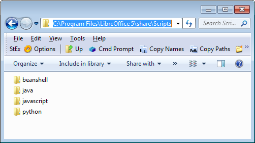

Figure 3. The Non-Basic share\Scripts\ Macros Folders.


In other words, Java share macros will be in:

```
C:\Program Files\LibreOffice 5\share\Scripts\java
```

User macros are stored in an 'application data' subfolder for LibreOffice. On
Windows, application data starts at the location stored in the APPDATA environment
variable, which you can print out:

```
echo %APPDATA%
```

On my work test machine this prints "C:\Users\Ad\AppData\Roaming". You need to
locate the LibreOffice subdirectory in the Roaming\ folder and then its user\
subdirectory, which will be inside LibreOffice\5\ or perhaps LibreOffice\4\. For
instance, on one of my test machines the user\ folder is:

```
C:\Users\Ad\AppData\Roaming\LibreOffice\4\user
```

If you haven't previously downloaded or created Java user macros, then you'll have to
create a Scripts\ folder inside user\, and a java\ folder inside Scripts\. In other words,
the Java user macros will be in:

```
C:\Users\Ad\AppData\Roaming\LibreOffice\4\user\Scripts\java
```


## 3.  Naming Macro Functions

The "Macro Selector dialog displays a list of macros in its right hand window (e.g.

"GetNumber.get" and "GetText.show" in Figure 1), but more detailed function names
are required when calling macros from code.

A function name is specified as a URI of the form:

```
vnd.sun.star.script:MACROPARAM?language=LANGPARAM
                              &location=LOCPARAM
```

LANGPARAM identifies the macro's programming language, which may be "Basic",
"BeanShell", "Java", "JavaScript", or "Python".

LOCPARAM is the macro category, which for Java macros can be "user", "share", or
"document". Extension macros use the label "user:uno_packages/" or
"share:uno_packages/" followed by the name of the extension file (e.g.
"user:uno_packages/FormMacros.oxt").

MACROPARAM takes the form:

```
FOLDER.[PACKAGE_NAME.]CLASS_NAME.FUNCTION_NAME
```

FOLDER is the subdirectory holding the compiled Java code in the user or share java\
folder, and the package name is optional. The class and function names are displayed
by the Macro Selector dialog (see Figure 1). For example, "GetNumber.get" refers to
the static function get() in the GetNumber class.

Information about the URI formats for other languages is given on the "Scripting
Framework URI Specification" page at
https://wiki.openoffice.org/wiki/Documentation/DevGuide/Scripting/Scripting_Framework_URI_Specification/
(or use `loGuide "Scripting Framework URI Specification"`).

#### Listing and Finding Macro Names

Knowing a macro's full name is essential, so I've added some helper functions to the
Macros.java utilities class. The ListMacros.java and FindMacros.java examples show
how to use them.

ListMacros.java calls Macros.getLangScripts() to print the names of the macros
written in a given language:

```java
// in ListMacros.java
public static void main(String[] args)
{
  String lang = "Java";
  if (args.length != 1) {
    System.out.println("Usage: run ListMacros [Java | Python |
                BeanShell | Basic | JavaScript]");
    System.out.println("Using \"Java\"");
  }
  else
    lang = args[0];

  XComponentLoader loader = Lo.loadOffice();

  ArrayList<String> scriptURIs = Macros.getLangScripts(lang);
  System.out.println(lang + " Macros in Office: (" +
                           scriptURIs.size() + ")");
  for(String scriptURI : scriptURIs)
    System.out.println("  " + scriptURI);

  Lo.closeOffice();
} // end of main()

Macros.getLangScripts() obtains a list of all the macro names by calling
Macros.getScripts(), then filters out names based on a "language=LANGPARAM&"
substring:

// in the Macros class
public static ArrayList<String> getLangScripts(String lang)
{
  if (!isMacroLanguage(lang)) {
    System.out.println("Not a Macro language; try \"Java\"");
    return null;
  }
  ArrayList<String> fScripts = new ArrayList<>();
  ArrayList<String> scriptURIs = getScripts();
  for(String scriptURI : scriptURIs)
    if (scriptURI.contains("language=" + lang + "&"))
      fScripts.add(scriptURI);
  return fScripts;
} // end of getLangScripts()
```

Macros.getScripts() utilizes services and interfaces in the com.sun.star.script.browse
module to examine a scripts tree structure consisting of CONTAINER and SCRIPT
nodes – the CONTAINER nodes are the internal branches of the tree representing
libraries and modules, while SCRIPT nodes are the leaves holding macro information.

Macros.getScripts() accesses the root of the MACROORGANIZER tree, and collects
script names by having getLibScripts() recursively traverse the tree, adding names to
a scripts ArrayList:

```java
// in the Macros class
public static ArrayList<String> getScripts()
{
  ArrayList<String> scripts = new ArrayList<>();

  XComponentContext xcc = Lo.getContext();
  XBrowseNodeFactory bnf = Lo.qi(XBrowseNodeFactory.class,
           xcc.getValueByName(
              "/singletons/com.sun.star.script.

                   browse.theBrowseNodeFactory"));

  XBrowseNode rootNode = Lo.qi(XBrowseNode.class,
     bnf.createView( BrowseNodeFactoryViewTypes.MACROORGANIZER) );
                     // for scripts

  XBrowseNode[] typeNodes = rootNode.getChildNodes();
  for(int i=0; i < typeNodes.length; i++) {
    XBrowseNode typeNode = typeNodes[i];
    XBrowseNode[] libraryNodes = typeNode.getChildNodes();
    for(int j=0; j < libraryNodes.length; j++)
      getLibScripts(libraryNodes[j], 0,
                            typeNode.getName(), scripts);
  }
  System.out.println();
  return scripts;
} // end of getScripts()


public static void getLibScripts(XBrowseNode browseNode, int level,
                        String path, ArrayList<String> scripts)
{
  XBrowseNode[] scriptNodes = browseNode.getChildNodes();
  if ((scriptNodes.length == 0) && (level > 1))
    // not a top-level library
    System.out.println("No scripts in " + path);
  for(int i=0; i < scriptNodes.length; i++) {
    XBrowseNode scriptNode = scriptNodes[i];
    if (scriptNode.getType() == BrowseNodeTypes.SCRIPT) {
      XPropertySet props = Lo.qi(XPropertySet.class, scriptNode);
      if (props != null) {
        try {
          scripts.add((String)props.getPropertyValue("URI"));
        }
        catch(com.sun.star.uno.Exception e)
        { System.out.println(e); }
      }
      else
        System.out.println("No props for " + scriptNode.getName());
    }
    else if (scriptNode.getType() == BrowseNodeTypes.CONTAINER)
      getLibScripts(scriptNode, level+1, path + ">" +
                                scriptNode.getName(), scripts);
    else
      System.out.println("Unknown node type");
  }
}  // end of getLibScripts()
```

All the Java macros can be listed by calling:
run ListMacros Java
It will print something like:

```
Java Macros in Office: (6)

vnd.sun.star.script:Utils.GetNumber.get?language=Java&
                       location=user:uno_packages/FormMacros.oxt

vnd.sun.star.script:Utils.GetText.show?language=Java&
                       location=user:uno_packages/FormMacros.oxt

vnd.sun.star.script:HelloWorld.org.libreoffice.example.java_scripts.

       HelloWorld.printHW?language=Java&location=share

vnd.sun.star.script:Highlight.org.libreoffice.example.java_scripts.

       HighlightText.showForm?language=Java&location=share

vnd.sun.star.script:MemoryUsage.org.libreoffice.example.java_scripts.

       MemoryUsage.updateMemoryUsage?language=Java&location=share

vnd.sun.star.script:ShowEvent.ShowEvent.show?language=Java&
                       location=share
```

Six Java macros were found: two are user macros from the FormMacros.oxt
extension, and four are share macros. The first three share macros
(HelloWorld.printHW, HighlightText.showForm, and
MemoryUsage.updateMemoryUsage) are LibreOffice examples; I'll explain the first
one:

```java
vnd.sun.star.script:HelloWorld.org.libreoffice.example.java_scripts.
      HelloWorld.printHW?language=Java&location=share
```

The macro's location parameter is "location=share", which means that it appears in the
"LibreOffice Macros" section of the Macro Selector dialog in Figure 4.


Figure 4. The HelloWorld.printHW Macro.


The four components of
"HelloWorld.org.libreoffice.example.java_scripts.HelloWorld.printHW" are:

* folder: HelloWorld
* package: org.libreoffice.example.java_scripts
* class name: HelloWorld
* function name: printHW

The HelloWorld\ folder is inside C:\Program Files\LibreOffice 5\share\Scripts\java\,
as confirmed by Figure 5.


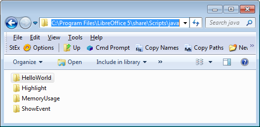

Figure 5. The HelloWorld Folder in share\Scripts\java.


Figure 5 also shows Highlight\, MemoryUsage\ and ShowEvent\ folders which hold
the other three share macros listed by ListMacros.java.

The HelloWorld\ folder contains the compiled HelloWorld class in a JAR file, and a
parcel-descriptor.xml configuration file, which I'll explain later. It also has the source
code for HelloWorld, which isn’t required by Office, but included as an example for
developers. Figure 6 shows the contents of HelloWorld\.


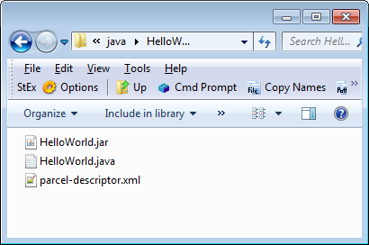

Figure 6. The Contents of the HelloWorld\ Folder.


The format of the HelloWorld class in the JAR file is:

package org.libreoffice.example.java_scripts;


```java
public class HelloWorld
{
  public static void printHW(XScriptContext xSc)
  {  /* code not shown */  }
}
```

HelloWorld implements a single printHW() function.

My FindMacros.java example calls Macros.findScripts() with a substring, and all the
macro names containing that string are printed. For example, a search for "hello"
returns five matches:

```
Matching Macros in Office: (5)

vnd.sun.star.script:Utils.HelloWorld.hello?
             language=Java&location=user:uno_packages/FormMacros.oxt

vnd.sun.star.script:HelloWorld.helloworld.bsh?
             language=BeanShell&location=share

vnd.sun.star.script:HelloWorld.org.libreoffice.example.java_scripts.

             HelloWorld.printHW?language=Java&location=share

vnd.sun.star.script:HelloWorld.helloworld.js?
             language=JavaScript&location=share

vnd.sun.star.script:HelloWorld.py$HelloWorldPython?
             language=Python&location=share
```

Four of the hello-related scripts are share macros written in BeanShell, Java,
JavaScript, and Python.


## 4.  Calling the "hello" Macros

The TextMacros.java example creates a text document, and calls the four "hello"
share macros listed above by FindMacros.java. They each add a short piece of text to
the document, as displayed on lines 2-5 in Figure 7.


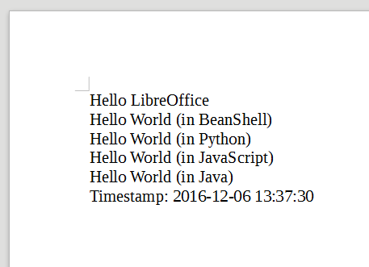

Figure 7. A Document with "hello" Macros Text.


TextMacros.java utilizes Macros.execute() to call the macros:

```java
// in TextMacros.java
public static void main(String[] args)
{
  XComponentLoader loader = Lo.loadOffice();
  XTextDocument doc = Write.createDoc(loader);
  if (doc == null) {
    System.out.println("Writer doc creation failed");
    Lo.closeOffice();
    return;
  }

  if (Macros.getSecurity() == Macros.LOW)
    Macros.setSecurity(Macros.MEDIUM);

  XTextCursor cursor = Write.getCursor(doc);
  GUI.setVisible(doc, true);
  Lo.wait(1000);   // make sure the document is visible
                   // before sending it dispatches

  Write.appendPara(cursor, "Hello LibreOffice");

  Macros.execute("HelloWorld.helloworld.bsh",
                                     "BeanShell", "share");
  Write.endParagraph(cursor);

  Macros.execute("HelloWorld.py$HelloWorldPython",
                                     "Python", "share");
  Write.endParagraph(cursor);

  Macros.execute("HelloWorld.helloworld.js",
                                     "JavaScript", "share");
  Write.endParagraph(cursor);

  Macros.execute("HelloWorld.org.libreoffice.example.

                                java_scripts.HelloWorld.printHW",
                                       "Java", "share");
  Write.endParagraph(cursor);
  Write.appendPara(cursor, "Timestamp: " + Lo.getTimeStamp());

  Lo.waitEnter();
  Lo.closeDoc(doc);
  Lo.closeOffice();
} // end of main()
```

The arguments of Macros.execute() are the MACROPARAM, LANGPARAM, and
LOCPARAM parts of the macro's URI; they're separated out to make the macro's
name a little easier to read.

Macros.execute() uses the theMasterScriptProviderFactory service to obtain a
XScriptProviderFactory It creates a XScriptProvider which can load the named macro
as an XScript object; the script is executed by XScript.invoke():

```java
// in the Macros class
public static Object execute(String macroName, String language,
                                                  String location)
{  return execute(macroName, null, language, location);   }


public static Object execute(String macroName, Object[] params,
                                 String language, String location)
{
  if (!isMacroLanguage(language)) {
    System.out.println("\"" + language +
                   "\" is not a macro language name");
    return null;
  }

  try {
    /* deprecated approach
       XScriptProviderFactory spFactory =  Lo.createInstanceMCF(
                  XScriptProviderFactory.class,
        "com.sun.star.script.provider.MasterScriptProviderFactory");
    */
    XComponentContext xcc = Lo.getContext();
    XScriptProviderFactory spFactory =
        Lo.qi(XScriptProviderFactory.class,
            xcc.getValueByName(
                  "/singletons/com.sun.star.script.provider.

                   theMasterScriptProviderFactory"));

    XScriptProvider sp = spFactory.createScriptProvider("");
    XScript xScript = sp.getScript("vnd.sun.star.script:" +
             macroName + "?language=" + language +
                         "&location=" + location);

    // minimal inout/out parameters
    short[][] outParamIndex = { { 0 } };
    Object[][] outParam = { { null } };
    return xScript.invoke(params, outParamIndex, outParam);
  }
  catch (Exception e) {
    System.out.println("Could not execute macro " +
                 macroName + ": " + e);
    return null;
  }
}  // end of execute()
```

Input parameters can be passed to invoke(), but the three-argument version of
Macros.execute() sets them to null. It's also possible to have the script set output
parameters, but my call to XScript.invoke() doesn't use them either.

There's no need to pass Macros.execute() a reference to the document. An executing
script only requires Office's current context which is retrieved by Lo.getContext().


### 4.1.  Macro Security Levels

Prior to the macro calls in TextMacros.java, there's a call to Macros.getSecurity(). It
reports Office's macro execution setting, which is changed to Macros.MEDIUM if the
current value is Macros.LOW:

```java
// part of TextMacros.java...
if (Macros.getSecurity() == Macros.LOW)
  Macros.setSecurity(Macros.MEDIUM);
```

The Macros class defines four security constants: LOW, MEDIUM, HIGH,
VERY_HIGH, which correspond to the levels used in Office's "Macro Security"
dialog shown in Figure 8. It is reached via Tools, Options, Security, and the
"Macro Security" button.


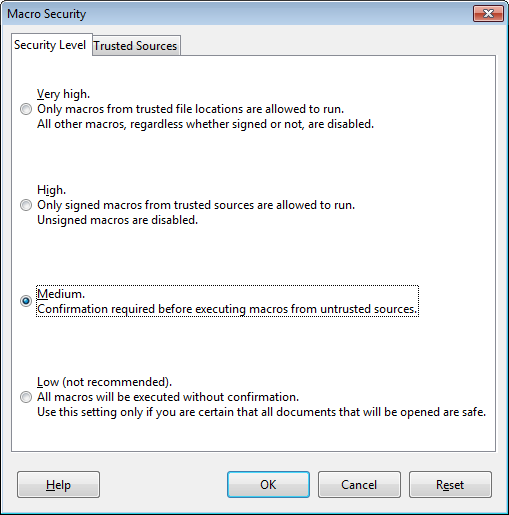

Figure 8. The Macro Security Dialog.


The Office API has a MacroExecMode class (see `lodoc MacroExecMode`) which
defines many more security levels, but the four levels in the GUI seem sufficient.

Macros.getSecurity() uses Info.getConfig() to access the
"/org.openoffice.Office.Common/Security/Scripting" configuration node, and look up
its "MacroSecurityLevel" property:

```java
// in the Macros class
public static int getSecurity()
{
  System.out.println("Macro security level:");
  Integer val = (Integer) Info.getConfig(
        "/org.openoffice.Office.Common/Security/Scripting",
        "MacroSecurityLevel");

  // various tests of val, before returning its int value
  // :
  return val.intValue();
}

Macros.setSecurity() manipulates the same configuration node but supplies a new
value for the "MacroSecurityLevel" property:

// in the Macros class
public static boolean setSecurity(int level)
{
  if ((level == Macros.LOW) || (level == Macros.MEDIUM) ||
      (level == Macros.HIGH) || (level == Macros.VERY_HIGH)) {
    System.out.println("Setting macro security level to " + level);
    return Info.setConfig(
                "/org.openoffice.Office.Common/Security/Scripting",
                "MacroSecurityLevel", Integer.valueOf(level));
  }
  else {
    System.out.println("Use Macros class constants:
                           LOW, MEDIUM, HIGH, or VERY_HIGH");
    return false;
  }
}  // end of setSecurity()
```

### 4.2.  Implementing the HelloWorld Java Macro

The four macros called by TextMacros.java add text to the document, but how
exactly? The Java macro is called using:

```java
// part of TextMacros.java...
Macros.execute("HelloWorld.org.libreoffice.example.
                                java_scripts.HelloWorld.printHW",
                                       "Java", "share");
```

This invokes the printHW() static method in the HelloWorld class in the
org.libreoffice.example.java_scripts package shown back in Figure 4. The complete
code for the class (minus some comments) is:

```java
// the HelloWorld class
package org.libreoffice.example.java_scripts;

import com.sun.star.script.provider.XScriptContext;
import com.sun.star.uno.*;
import com.sun.star.text.*;


public class HelloWorld
{
  public static void printHW(XScriptContext xSc)
  {
    XTextDocument xtextdocument =
        (XTextDocument) UnoRuntime.queryInterface(
                XTextDocument.class, xSc.getDocument());
    XText xText = xtextdocument.getText();
    XTextRange xTextRange = xText.getEnd();
    xTextRange.setString("Hello World (in Java)");
  } // end of printHW()

} // end of HelloWorld class
```

XScript.invoke() constructs a one-argument call to printHW(), passing it a
XScriptContext object. As we'll see later, a function can be called with different
arguments depending on what event triggers the macro.

The XScriptContext interface defines four methods which allow the current context,
the desktop, and document to be accessed (see lodoc XScriptContext). printHW()
utilizes XScriptContext.getDocument() to retrieve the document, and casts it to
XTextDocument. This allows the end of the text to be accessed with XTextRange, so
a string (""Hello World (in Java)") can be appended to it.


## 5.  The LibreLogo Macro

HelloWorld isn't the most exciting of macro examples. LibreLogo is a fun (and
educational) share macro for LibreOffice (see Figure 9), which has been a standard
Office add-on since version 4.0.


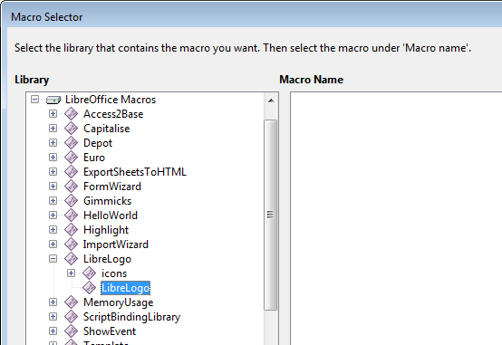

Figure 9. The LibreLogo Macro Module.


Normally LibreLogo is accessed through its own View, Toolbars, Logo toolbar,
which is just as well since the Macro selector doesn't list any macros in the LibreLogo
module (see the empty area on the right of Figure 9). I had to examine the module's
Python code in <OFFICE>\share\Scripts\python\LibreLogo\LibreLogo.py to work out
how to call it as a function.

My UseLogo.java example creates a text document, writes the logo program text onto
the page, followed by LibreLogo's rendering of that program, as in Figure 10.


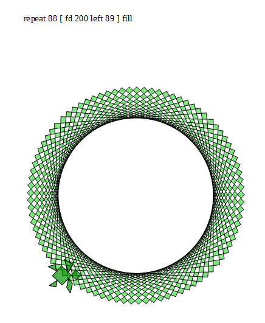

Figure 10. The Page Generated by UseLogo.java.


UseLogo.java is:

```java
public class UseLogo
{

  public static void main(String[] args)
  {
    XComponentLoader loader = Lo.loadOffice();
    XTextDocument doc = Write.createDoc(loader);

    if (doc == null) {
      System.out.println("Writer doc creation failed");
      Lo.closeOffice();
      return;
    }

    GUI.setVisible(doc, true);
    Lo.wait(1000);   // make sure doc is visible

    XTextCursor cursor = Write.getCursor(doc);

    String logoCmds = "repeat 88 [ fd 200 left 89 ] fill";
    Write.appendPara(cursor, logoCmds);
    Macros.executeLogoCmds(logoCmds);

    Lo.waitEnter();
    Lo.closeDoc(doc);
    Lo.closeOffice();
  } // end of main()

}  // end of UseLogo class
```

Macros.executeLogoCmds() is a small wrapper around Macros.execute() which calls
the commandline() function inside LibreLogo.py:

```java
// in the Macros class
public static Object executeLogoCmds(String cmdsStr)
{
  Object[] params = new String[2];
  params[0] = "";        // based on looking at commandline()
  params[1] = cmdsStr;   // in LibreLogo.py
  return execute("LibreLogo/LibreLogo.py$commandline",
                               params, "Python", "share");
}
```

The params[] array is treated as two arguments by XScript.invoke() and passed to
commandline().

The quick-start and resources pages at librelogo.org are the places to start learning
LibreLogo (https://librelogo.org/quick-start/ and https://librelogo.org/resources/).
There's also a help page of commands at
https://help.libreoffice.org/Writer/LibreLogo_Toolbar/.

A good source of examples, slides, and code is https://numbertext.org/logo/. The
best introductory talk at that site is "LibreLogo – Turtle vector graphics for
everybody" from 2012 (https://numbertext.org/logo/librelogo.pdf), and there are
more recent presentations which update the project. One of its aims was to create a
textbook for Hungarian primary and secondary schools (the project lead, László
Németh, is Hungarian), which is free to download from
https://szabadszoftver.kormany.hu/wp-content/uploads/librelogo_oktatasi_segedanyag_v4.pdf.


## 6.  Writing a Simple Event Macro

It's time to start coding our own macros. I'll start by writing a ShowEvent class which
reports when various events occur. It does this by implementing several versions of a
static show() method:

```java
// in ShowEvent.java
public class ShowEvent
{
  public static void show(XScriptContext sc, ActionEvent e)
  // triggered by a action event (usually a button press)
  {  display("action", getSource(e));  }


  public static void show(XScriptContext sc, TextEvent e)
  // called when text changes inside a text component
  {  display("text", getSource(e));  }


  public static void show(XScriptContext sc, FocusEvent e)
  // called when the focus changes
  {  display("focus");  }


  public static void show(XScriptContext sc, Short val)
  // called from a toolbar
  { display("toolbar (" + val + ")");  }


  public static void show(XScriptContext sc, KeyEvent e)
  // called because of a key
  {  display("key " + e.KeyChar, getSource(e)); }


  public static void show(XScriptContext sc, MouseEvent e)
  // called because of the mouse
  { display("mouse"); }


  public static void show(XScriptContext sc,
                        com.sun.star.document.DocumentEvent e)
  // triggered by a document event
  {  display("document", e.EventName);  }


  public static void show(XScriptContext sc, EventObject e)
  { if (e != null)
      display("object", getSource(e));
    else
      display("object ()");
  }


  public static void show(XScriptContext sc)
  // called from a menu or the "Run Macro..." menu
  {  display("menu/run");   }

  // support methods; explained shortly
  //   :

}  // end of ShowEvent class
```

A particular show() function is called depending on the event, and more versions of
show() could easily be added since Office supports a wide range of events. Probably
the best summary of them is in the online documentation for EventObject (see
`lodoc EventObject`); EventObject is the superclass for most event types.

When I first wrote ShowEvent, I mistakenly assumed that the show() function with
the EventObject argument (i.e. the second to last one in the code above) would be the
default method called when no other version of show() was suitable. That isn't the
case; instead, the single argument show() (i.e. the last function,
`show(XScriptContext sc)`) is executed.

The show() methods utilize display() and showDialog():

```java
// part of the ShowEvent class...

private static void display(String msg)
{
  showDialog(msg + " event");
  // JOptionPane.showMessageDialog(null, msg + " event");
}


private static void display(String msg, String info)
{
  showDialog(msg + " event: " + info);
  // JOptionPane.showMessageDialog(null, msg + " event: " + info);
}


private static void showDialog(String msg)
{
  JDialog dlg = new JDialog((java.awt.Frame)null, "Show Event");
  dlg.getContentPane().setLayout(new GridLayout(3,1));
  dlg.add(new JLabel(""));
  dlg.add(new JLabel(msg, SwingConstants.CENTER)); // centered text
  dlg.pack();

  Random r = new Random();
  dlg.setLocation(100 + r.nextInt(50), 100 + r.nextInt(50));

  dlg.setVisible(true);
  dlg.setResizable(false);
  dlg.setDefaultCloseOperation(WindowConstants.DISPOSE_ON_CLOSE);
}   // end of showDialog()
```

A modeless dialog is displayed using Java's JDialog rather than
JOptionPane.showMessageDialog(), which means that the dialog won't cause Office
to suspend until the user closes the window.

Each dialog is placed at a slightly random position, so that multiple dialogs created by
several events will all hopefully be visible. Another issue is that the dialog's parent is
null which means that the dialog may not appear in front of the Office window.

No use is made of my utility classes, such as Macros.java or GUI.java. Although this
makes the code longer, it also makes this example self-contained, and easier to install.

I'll use my support classes in the extension and document examples in the next
chapter.

Events which are usually triggered by GUI components, such as ActionEvent and
TextEvent, are passed to getSource() which attempts to find the name of the
component that sent the event:

```java
// part of the ShowEvent class...

private static String getSource(EventObject event)
{
  XControl control = UnoRuntime.queryInterface(
                             XControl.class, event.Source);
  XPropertySet xProps =  UnoRuntime.queryInterface(
                  XPropertySet.class, control.getModel());
  try {
    return (String)xProps.getPropertyValue("Name");
  }
  catch (com.sun.star.uno.Exception e) {
    return "Exception?";
  }
  catch (com.sun.star.uno.RuntimeException e) {
    return "RuntimeException?";
  }
} // end of getSource()
```


### 6.1.  Installing a Simple Event Macro

A Java macro is installed as a JAR file, so ShowEvent.class is packaged as
ShowEvent.jar after compilation:

```
compile ShowEvent.java
jar cvf ShowEvent.jar ShowEvent.class
```

The JAR is added to a new folder called ShowEvent\ beneath
<OFFICE>\share\Scripts\java\, thereby making it a share macro. It's also necessary to
include a parcel-descriptor.xml file:

```
<?xml version="1.0" encoding="UTF-8"?>
<parcel language="Java" xmlns:parcel="scripting.dtd">
    <script language="Java">

        <locale lang="en">
            <displayname value="ShowEvent.show"/>
            <description>
                Shows a dialog with basic event information.

            </description>
        </locale>

        <functionname value="ShowEvent.show"/>
        <logicalname value="ShowEvent.show"/>
        <languagedepprops>
            <prop name="classpath" value="ShowEvent.jar"/>
        </languagedepprops>
    </script>
</parcel>
```

Of the three 'name' attributes in the XML file, only <functionname> seems to be used
by Office. The <description> text appears in the Macro selector dialog (e.g. see
Figure 12 below) when the macro is selected, and <languagedepprops> adds the JAR
to Office's classpath.

The final contents of the ShowEvent\ folder are a JAR and XML file, as shown in
Figure 11.


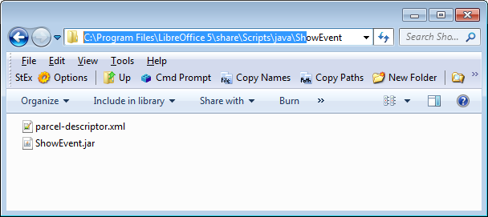

Figure 11. The ShowEvent Share Macro Folder.


It's a good idea to check that this new macro can be seen by Office. Office should be
restarted and the "LibreOffice Macros" subsection of the Macro Selector dialog
examined. Figure 12 shows the ShowEvent.show macro in the ShowEvent module.


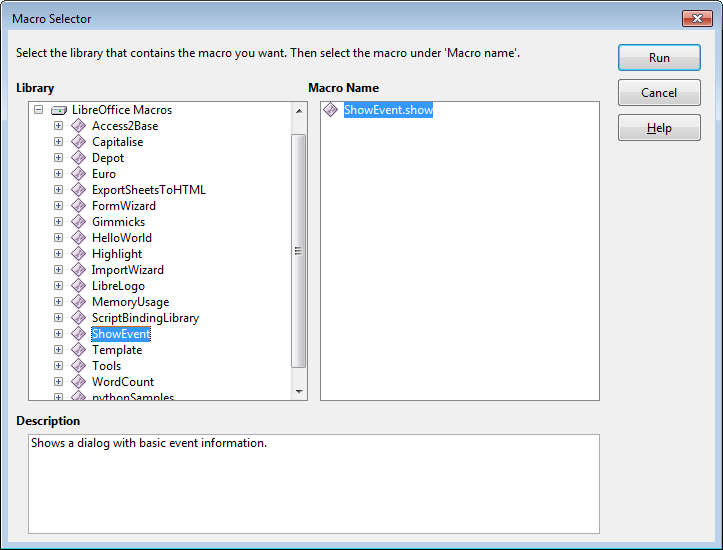

Figure 12. Checking for the Presence of ShowEvent.show.


### 6.2.  Using ShowEvent.show in a Form

build.odt is a simple form using textfields and buttons shown in Figure 13.


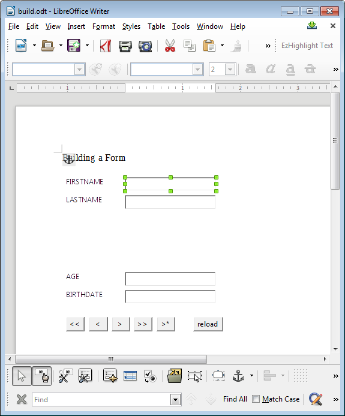

Figure 13. The "build.odt" Form.


The event handling properties of a control are accessed by changing to form design
mode (click the "OK hand" icon, second from the left in the toolbar at the bottom of
Figure 13). Subsequently, the mouse is right-clicked over a control, such as the
FIRSTNAME textfield selected in Figure 13. The resulting pop-up menu includes a
"Control" menu item which displays the control's Properties dialog (see Figure 14).


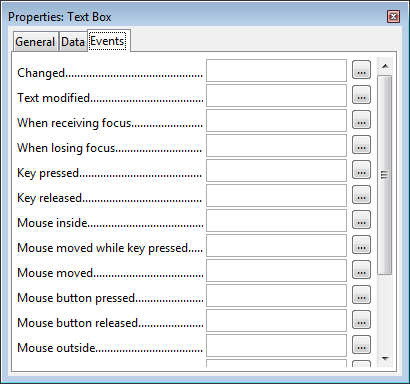

Figure 14. The Properties Dialog for the FIRSTNAME Textfield Control.


The Events tab (shown in Figure 14) lists all the events associated with the control,
and a macro is attached by pressing on the right-hand "…" button for an event. An
"Assign Action" dialog appears, like the one in Figure 15.


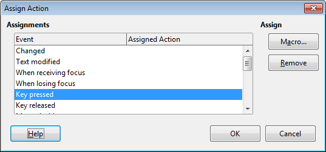

Figure 15. The "Assign Action" Dialog.


Figure 15 shows that the user has selected the "Key pressed" event.
Clicking on the "Macro…" button brings forth the Macro Selector dialog, and a macro
can be chosen. Upon returning to the "Assign Action" dialog, the event will list the
macro in the "Assigned Action" column. Clicking "Ok" again returns to the properties
dialog which now shows the macro name next to the "Key pressed" event, as in
Figure 16.


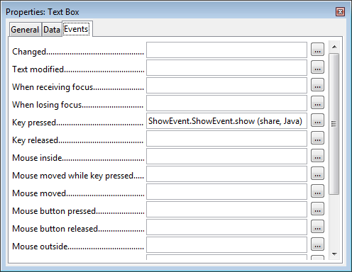

Figure 16. The Properties Dialog with an Assigned Macro.


The macro's arguments ("share" and "Java") are its category and implementation
language.

The event/macro link can be tested by returning to the default mode in the form by
clicking the "Ok hand" icon again. When the user types three letters into the
FIRSTNAME textfield (e.g. "and"), three dialogs appear, as in Figure 17.


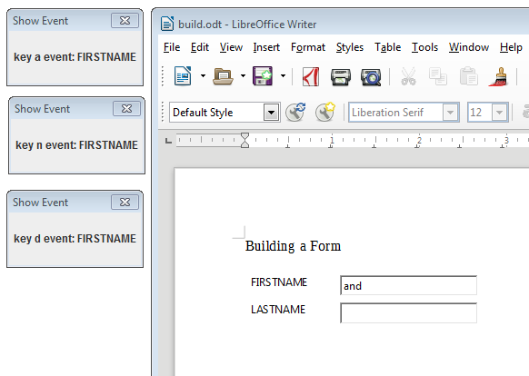

Figure 17. Reporting Key Events.


I've rearranged the three dialogs in Figure 17 so they're all visible. They're generated
by the KeyEvent version of ShowEvent.show:

```java
// part of the ShowEvent class...
public static void show(XScriptContext sc, KeyEvent e)
// Called from a key
{  display("key " + e.KeyChar, getSource(e)); }
```

As each letter ("a', 'n', and 'd') is typed, this version of show() is called.


## 7.  Automating the Assigning of Event Macros

The preceding section illustrates that the assignment of macros to events is
straightforward, but time-consuming, especially if you have many controls in your
form. Fortunately, macros can be assigned programmatically.

I first used the "build.odt" form of Figure 13 back in Chapter 40 on forms; it wasn't
created by hand but generated by BuildForm.java. That program is extended in this
section with calls to Forms.assignScript() which assigns a macro to an event in a
control.

I'll employ Forms.assignScript() so that the FIRSTNAME textfield calls
ShowEvent.show whenever its text changes, focus is lost, or a key is pressed. Also,
the six buttons at the bottom of the form (see Figure 13) will execute
ShowEvent.show when they're pressed.

The new code is highlighted in bold in createForm():

```java
// part of BuildForm.java...

private void createForm(XTextDocument doc)
{
  XPropertySet props =
       Forms.addLabelledControl(doc, "FIRSTNAME", "TextField", 11);
  textEvents(props);  // only the FIRSTNAME textfield has a listener

  Forms.addLabelledControl(doc, "LASTNAME", "TextField",  19);

  props = Forms.addLabelledControl(doc, "AGE", "NumericField", 43);
  Props.setProperty(props, "DecimalAccuracy", (short) 0);

  Forms.addLabelledControl(doc, "BIRTHDATE", "FormattedField", 51);


  // buttons, all with listeners
  props = Forms.addButton(doc, "first", "<<", 2, 63, 8);
  buttonEvent(props);

  props = Forms.addButton(doc, "prev", "<", 12, 63, 8);
  buttonEvent(props);

  props = Forms.addButton(doc, "next", ">", 22, 63, 8);
  buttonEvent(props);

  props = Forms.addButton(doc, "last", ">>", 32, 63, 8);
  buttonEvent(props);

  props = Forms.addButton(doc, "new", ">*", 42, 63, 8);
  buttonEvent(props);

  props = Forms.addButton(doc, "reload", "reload", 58, 63, 13);
  buttonEvent(props);
}  // end of createForm()
```

The property set for the FIRSTNAME textfield is passed to textEvents(), which calls
Forms.assignScript() three times:

```java
// part of BuildForm.java...

public void textEvents(XPropertySet props)
{
  // listen for text change
  Forms.assignScript(props, "XTextListener", "textChanged",
                       "ShowEvent.ShowEvent.show", "share");

  // listen for focus loss
  Forms.assignScript(props, "XFocusListener", "focusLost",
                       "ShowEvent.ShowEvent.show", "share");

  // listen for a key press
  Forms.assignScript(props, "XKeyListener", "keyPressed",
                       "ShowEvent.ShowEvent.show", "share");
}  // end of textEvents()

The buttonEvent() method is a (long) one-liner:

// part of BuildForm.java...

public void buttonEvent(XPropertySet props)
{
  Forms.assignScript(props, "XActionListener", "actionPerformed",
                      "ShowEvent.ShowEvent.show", "share");
}
```

It's surprisingly tricky to decide which class and method names should be passed to
Forms.assignScript() since the only information about control events are the labels in
the Properties dialog (e.g. "Key pressed" in Figure 16). It can be hard to map these
labels onto suitable class and method names, especially since Office supports so many
event types. The best source for suitable listener classes is the online documentation
for XEventListener (see lodoc XEventListener); XEventListener is the superclass
of most listeners.

After the generated form has been saved, it should be opened in Office so its controls'
properties can be inspected. For example, the FIRSTNAME textfield's event
properties are now as in Figure 18.


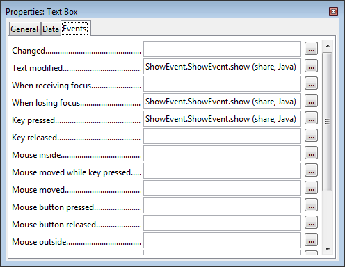

Figure 18. The Properties Dialog for the FIRSTNAME textfield.


Figure 18 confirms that the class/method names used in textEvents() are correct.

Forms.assignScript() utilizes the XEventAttacherManager interface which offers
multiple methods for attaching and removing scripts from events. The code for
Forms.assignScript():

```java
// in the Forms class
public static void assignScript(XPropertySet controlProps,
                    String interfaceName, String methodName,
                    String scriptName, String loc)
{
  try {
    XChild propsChild = Lo.qi(XChild.class, controlProps);
    XIndexContainer parentForm =
       Lo.qi(XIndexContainer.class, propsChild.getParent());
    int pos = -1;
    for (int i = 0; i < parentForm.getCount(); i++) {
      XPropertySet child = Lo.qi(XPropertySet.class,
                              parentForm.getByIndex(i) );
      if (UnoRuntime.areSame(child, controlProps)) {
        pos = i;
        break;
      }
    }

    if (pos == -1)
      System.out.println("Could not find contol's pos in form");
    else {
      XEventAttacherManager manager =
            Lo.qi(XEventAttacherManager.class, parentForm);
      manager.registerScriptEvent(pos,
           new ScriptEventDescriptor(interfaceName, methodName,
                   "", "Script",
                   "vnd.sun.star.script:"+scriptName +
                       "?language=Java&location=" + loc));
    }
  }
  catch( com.sun.star.uno.Exception e )
  { System.out.println(e);  }
}  // end of assignScript()
```

The first half of assignScript() calculates the control's index position inside the
parent's form. An index is used by most XEventAttacherManager methods to refer to
a control.

The last part of assignScript() uses XEventAttacherManager.registerScriptEvent() to
attach the script to the control's event. A ScriptEventDescriptor object is constructed
from five arguments: the listener's class name, the method to be called in the listener,
any extra data for the method (which is "" here), the script type (which can be "Script"
or "Basic"), and the macro's full name.

If you're unsure about the full name, then use my ListMacros.java or FindMacros.java
to display macro details. For example:

```
run FindMacros ShowEvent
```

produces:

```java
Matching Macros in Office: (1)
  vnd.sun.star.script:ShowEvent.ShowEvent.show?
                                language=Java&location=share
```

"ShowEvent.ShowEvent.show" and "share" are passed to Forms.assignScript() as its
last two arguments:

```java
// part of BuildForm.java...
Forms.assignScript(props, "XTextListener", "textChanged",
                       "ShowEvent.ShowEvent.show", "share");```
