# Chapter 50. Importing XML

!!! note "Topics"
    XSLT Filters;
    Using Filters with Java;
    Alternatives to XSLT
    Filters: DOM Parsing,
    Node and Attribute Data
    Extraction, JAXB
    Conversion

    Example folders: "Filter
    Tests" and "Utils"


This chapter is mostly about importing XML data into
Office. I start by looking at XSLT import (and export)
filters, which give the best results but require the
programmer to know a great deal about XML and the
ODF file format.

The second half of the chapter is about three simpler
techniques for importing XML which require less comprehensive XML skills and no
knowledge of ODF. The drawback is that the resulting document may be less
'beautiful', often requiring some manual post-processing to remove unnecessary white
space and data.

You'd be correct in thinking that Office can already import XML, but you may be
disappointed with the results: a simple XML file, such as pay.xml shown below, is
imported unchanged, as plain text:

```
<?xml version="1.0"?>
<payments>
  <payment>
    <purpose>CD</purpose>
    <amount>12.95</amount>
    <tax>19.1234</tax>
    <maturity>2008-03-01</maturity>
  </payment>
  <payment>
    <purpose>DVD</purpose>
    <amount>19.95</amount>
    <tax>19.4321</tax>
    <maturity>2008-03-02</maturity>
  </payment>
  <payment>
    <purpose>Clothes</purpose>
    <amount>99.95</amount>
    <tax>18.5678</tax>
    <maturity>2008-03-03</maturity>
  </payment>
  <payment>
    <purpose>Book</purpose>
    <amount>9.49</amount>
    <tax>18.9876</tax>
    <maturity>2008-03-04</maturity>
  </payment>
</payments>
```

Office offers many ways of loading XML through the "All files (*.*)" popdown list in
the Open dialog. Figure 1 shows my selection of "Flat XML ODF Spreadsheet":


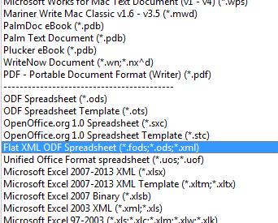

Figure 1. Selecting an XML Import Format.


Unfortunately, the result isn't a nice spreadsheet of the payments, but a Writer
document containing all the data and XML tags.

Flat XML is for encoding an OpenDocument format (ODF) document as a single text
file, which contrasts with how it's usually stored as a zipped folder of several files and
sub-folders. pay.xml isn't a Flat XML file, and so Office drops back to treating it as
plain text, and uses Writer to display it.

Incidentally, there are several Flat XML formats aimed at the different Office
applications, Writer, Calc, Draw, and Impress.


## 1.  Filters to the Rescue

pay.xml can be opened as a spreadsheet with the help of an input filter. There are a
few ways of writing these, as explained by Fridrich Strba in his blog post "Extending
the Swiss Army knife - an overview about writing of filters for LibreOffice"
(https://fridrich.blogspot.com/2013/08/extending-swiss-army-knife-overview.html).

The easiest way of implementing an XML input filter is with XSLT (eXtensible
Stylesheet Language: Transformations). The filter is utilized by the XSLT processor
inside Office to load and transform the XML, as illustrated in Figure 2.


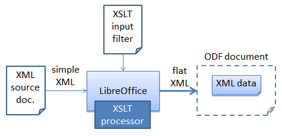

Figure 2. Using an XSLT filter.


XSLT is designed for transforming XML into other textual formats; in this case, it
will convert the simple XML used by pay.xml into the Flat XML used by Calc.

Office's  XSLT processor used to be Saxon (https://saxon.sourceforge.net/), a Java
API, but was replaced in 2012 by the libxslt C library (https://xmlsoft.org/libxslt/).
This implements XSLT 1.0 with some extensions, so it's best to avoid using features
from the newer XSLT 2.0.

One source for learning XLST in the context of ODF is:

OASIS OpenDocument Essentials
J. David Eisenberg, 2005
https://books.evc-cit.info/
The book includes a chapter on filters, and an appendix that overviews XSLT and
XPath (XPath is used for locating parts of the input document for processing).

Eisenberg's website has a free draft of the text, and all the examples and support code.
The site often seems to be offline, but the book can be found elsewhere, including at
Lulu: https://lulu.com/shop/j-david-eisenberg/oasis-opendocument-essentials/paperback/product-392512.html

If you feel the need for more information on XSLT, a good text by the developer of
Saxon is:

XSLT 2.0 and XPath 2.0 Programmer's Reference
Michael Kay
Wrox Pub., May 2008, 4th Ed.

There's a somewhat shorter XSLT tutorial at W3Schools:
https://w3schools.com/xml/xsl_intro.asp

A useful forum post, "Create XSLT filters for import and export"
(https://forum.openoffice.org/en/forum/viewtopic.php?t=3490), by user hol.sten
contains XSLT import and export filters for pay.xml (in fact, it's his example). The
filters are installed via Office's Tools > "XML Filter Settings" menu item. Clicking on
the "New" button of the filter settings window brings up a dialog containing two tabs
shown in Figure 3.


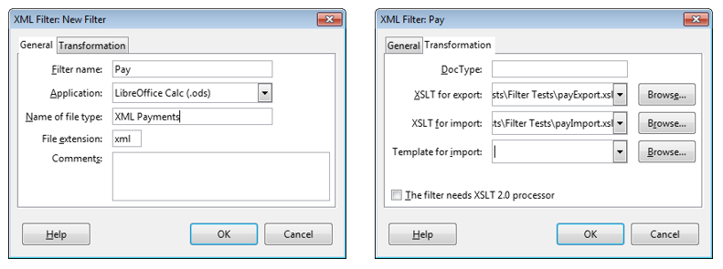

Figure 3.  The XML Filter Settings Dialog Tabs.


Figure 3 shows that I've created a "Pay" filter set containing hol.sten's import and
export filters stored in payImport.xsl and payExport.xsl. The import filter will convert
XML to Flat XML for Calc, as stated in the "Application" field of the General tab.

After clicking "Ok", the Pay filter set is added to the settings window in Figure 4.


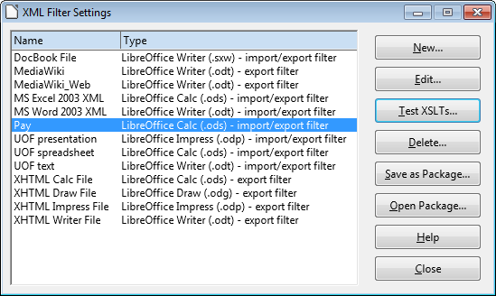

Figure 4. The Pay Filter in the Settings Window.


When pay.xml is opened, the Pay import filter appears in the Calc section of the "All
Files (*.*) popdown list, as seen in Figure 5.


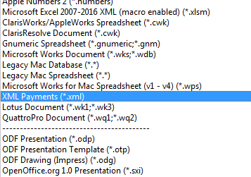

Figure 5. The Calc Pay Import Filter.


The "XML Payments" text in Figure 5 comes from the "Name of file type" textfield in
the General tab of the dialog in Figure 3.

The resulting Calc document is shown in Figure 6.


Figure 6. Pay.xml Imported as a Spreadsheet.


### 1.1.  The Clubs Example

There's another nice XSLT import and export filter set in chapter 9 of Eisenberg's
book. clubs.xml consists of a sequence of associations, each one made up of a
sequence of clubs. A typical club entry looks like:

```
<club id="Q21" charter="2002">
  <name>Castro Valley Wrestling Club</name>
  <contact>Ron Maes</contact>
  <location>Castro Valley</location>
  <phone>510-555-1491</phone>
  <email>cvwcron@example.com</email>
  <age-groups type="KCJOW"/>
  <info>Practices every Tuesday and Thursday at 5:00 P.M.

        at Castro Valley High School mat room.</info>
</club>
```

A helpful way of visualizing this information is with the XML editor at
https://xmlgrid.net/, which renders it as in Figure 7.


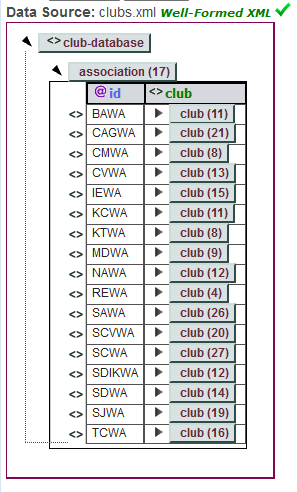

Figure 7. Visualization of clubs.xml.


There are 17 associations; the first is called "BAWA" and contains 11 clubs
Eisenberg's clubsImport.xsl and clubsExport.xsl filters are imported into Office using
the "XML Filter Settings" dialog in Figure 8.


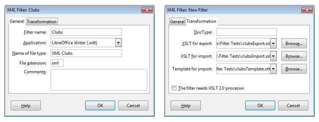

Figure 8. The XML Filter Settings Dialog Again.


I've called the filter set "Clubs", and it uses clubsImport.xsl to produce Flat XML for
Writer. There's also a Writer template called clubsTemplate.ott, which applies styles
to the imported data.

When clubs.xml is opened, the Clubs import filter appears in the Writer section of the
"All Files (*.*) popdown list, as in Figure 9.


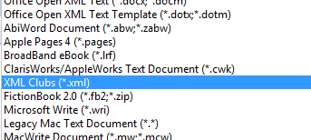

Figure 9. The Writer Clubs Import Filter.


The start of the resulting Writer document looks like Figure 10.


Figure 10. Clubs.xml as a Writer Document.


### 1.2.  Command Line Importing (and Exporting)

Import filter selection can be time-consuming because of the large number listed in
"Open"s popdown list. A quicker approach is to call Office from the command line,
supplying the filename and filter name as arguments.

Most of Office's command line arguments are listed at
https://help.libreoffice.org/Common/Starting_the_Software_With_Parameters/, and a
few others when office.exe is invoked with the -h option. The filter commands are --
infilter and --convert-to, which I've wrapped up in two batch scripts called infilter.bat
and convert.bat.

The hardest part of using these commands is the need to supply a filter name, which
corresponds to the "Filter name" textfield string in the General tab of the XML Filter
Settings dialog. The pay.xml import filter is "Pay", as shown in the left hand window
in Figure 3; the clubs.xml filter is "Clubs", as in Figure 8.

The infilter.bat script takes a filename and input filter name argument:

```
infilter pay.xml "Pay"
```

This causes Office to open pay.xml using the "Pay" import filter, creating the
spreadsheet shown in Figure 6.

The convert.bat script takes an Office filename and conversion string as arguments. In
the simple case, the string is the extension of the exported file. For example, the
following exports the Writer document as XML:

```
convert simpleText.odt xml
```

If there are several filters to choose from (as there are for XML), then the default one
is used; for this example the Flat XML exporter for Writer will be employed. If a
different export filter is required then its name must be appended to the conversion
string after a ":". For instance:

```
convert payment.ods "xml:Pay"
```

This exports the payments spreadsheet using the "Pay" filter, resulting in a file called
payment.xml which has the same format as the original example at the start of the
chapter.


### 1.3.  Finding a Filter Name

The calls to infilter.bat and convert.bat rely on the user knowing a filter's name (e.g.

"Pay" or "Clubs"). I knew these because I installed them, but what about the names of
other filters in Office?

A list of filters present in OpenOffice in 2007 can be found at
https://wiki.openoffice.org/wiki/Framework/Article/Filter/FilterList_OOo_3_0/.
However, a better approach is to call my FiltersInfo.java example which prints all the
filters currently installed in Office, and some extra details about the "AbiWord",
"Pay", and "Clubs" filters:

```java
// in FiltersInfo.java
public class FiltersInfo
{
  public static void main(String[] args)
  {
    XComponentLoader loader = Lo.loadOffice();

    // print the names of all the filters in Office
    String[] filterNms = Info.getFilterNames();
    System.out.println("Filter Names");
    Lo.printNames(filterNms, 3);

    // print some extra info on 3 filters
    PropertyValue[] props = Info.getFilterProps("AbiWord");
    Props.showProps("AbiWord Filter", props);

    props = Info.getFilterProps("Pay");
    Props.showProps("Pay Filter", props);

    props = Info.getFilterProps("Clubs");
    Props.showProps("Clubs Filter", props);
    int flags = (int) Props.getValue("Flags", props);

    System.out.println("Filter flags: " +
                           Integer.toHexString(flags));
    System.out.println(" Import: " + Info.isImport(flags));
    System.out.println(" Export: " + Info.isExport(flags));

    Lo.closeOffice();
  }   // end of main()

}  // end of FiltersInfo class
```

The output from FiltersInfo starts with a long list of  filter names:

```
Filter Names
No. of names: 235
  "AbiWord"  "Apple Keynote"  "Apple Numbers"
  "Apple Pages"  "BMP - MS Windows"  "BroadBand eBook"
  "Calc MS Excel 2007 Binary"  "Calc MS Excel 2007 VBA XML"
     :
  "ClarisWorks_Draw"  "ClarisWorks_Impress"  "Clubs"
     :
  "Palm_Text_Document"  "PalmDoc"  "Pay"
     :
     :
  "XHTML Draw File"  "XHTML Impress File"  "XHTML Writer File"
  "XPM"
```

In the above list, I've included the lines that include the "Pay" and "Clubs" filter
names.

The names are obtained by Info.getFilterNames(), which utilizes the FilterFactory
service:

```java
// in the Info class
public static String[] getFilterNames()
{
  XNameAccess na = Lo.createInstanceMCF(XNameAccess.class,
                        "com.sun.star.document.FilterFactory");
  if (na == null) {
    System.out.println("No Filter factory found");
    return null;
  }
  else
    return na.getElementNames();
}  // end of getFilterNames()
```

Sometimes it's useful to know more about a filter than just it's name, such as whether
it's for importing, exporting, or both. Additional information is available as an array
of properties, by calling Info.getFilterProps() with the filter's name:

```java
// in the Info class
public static PropertyValue[] getFilterProps(String filterNm)
{
  XNameAccess na = Lo.createInstanceMCF(XNameAccess.class,
                           "com.sun.star.document.FilterFactory");
  if (na == null) {
    System.out.println("No Filter factory found");
    return null;
  }
  else {
    try {
     return (PropertyValue[]) na.getByName(filterNm);
    }
    catch(Exception e) {
      System.out.println("Could not find filter for " + filterNm);
      return null;
    }
  }
}  // end of getFilterProps()
```

getFilterProps() is called three times in FiltersInfo.java to retrieve details about the
"AbiWord", "Pay", and "Clubs" filters. The output for "Clubs" is:

```
Properties for "Clubs Filter":
  UserData: [com.sun.star.documentconversion.XSLTFilter, false,
com.sun.star.comp.Writer.XMLOasisImporter,
com.sun.star.comp.Writer.XMLOasisExporter,
file:///C:/Users/Dell/Desktop/LibreOffice%20Tests/Filter%20Tests/club
sImport.xsl,
file:///C:/Users/Dell/Desktop/LibreOffice%20Tests/Filter%20Tests/club
sExport.xsl, , ]
  TemplateName:
file:///C:/Users/Dell/AppData/Roaming/LibreOffice/4/user/template/Clu
bs/clubsTemplate.ott
  Name: Clubs
  Type: Clubs
  UIComponent:
  FileFormatVersion: 0
  FilterService: com.sun.star.comp.Writer.XmlFilterAdaptor
  DocumentService: com.sun.star.text.TextDocument
  Flags: 524355
  UINames: [    en-US = XML Clubs  ]
  UIName: XML Clubs
  Finalized: false
  Mandatory: false
```

The UserData and TemplateName properties indicate that "Clubs" contains an import
and export filter for Writer's Flat XML, and also a template.

Filter properties are explained in the online documentation for the FilterFactory
service (use `lodoc FilterFactory` to access it), and also in the "Properties of a
Filter" subsection of the "Integrating Import and Export Filters" section of chapter 6
of the Developer's Guide (online at:
https://wiki.openoffice.org/wiki/Documentation/DevGuide/OfficeDev/Properties_of_a_Filter/,
or use `loGuide "Properties of a Filter"`).

The most cryptic of the properties is the filter flags integer (524355 in the example
above). It's actually a collection of bitwise OR'ed hexadecimals, and FiltersInfo.java
shows how they can be accessed:

```java
// part of FiltersInfo.java...

int flags = (int) Props.getValue("Flags", props);
System.out.println("Filter flags: " + Integer.toHexString(flags));
           // print as a hexadecimal string

System.out.println(" Import: " + Info.isImport(flags));
System.out.println(" Export: " + Info.isExport(flags));
```

The output is:

```
Filter flags: 80043
 Import: true
 Export: true
```

The hexadecimals that might appear in the flag are listed in the online "Properties of a
Filter" subsection
(https://wiki.openoffice.org/wiki/Documentation/DevGuide/OfficeDev/Properties_of_a_Filter/).
I've included a few isXXX() methods in the Info utilities class for testing for
their presence. The above example reports that the "Clubs" filter contains both an
import and export filter.


## 2.  Using Filters with Java

Java contains an assortment of XML processing capabilities, grouped under the JAXP
(Java API for XML Processing) heading. They include DOM and SAX parsing, XML
schema validation, and XSLT transformation. The JDK's XSLT processor is Xalan
(https://xml.apache.org/xalan-j/), which supports XSLT 1.0, and so is roughly
equivalent to Office's libxslt library. This means that I can use the "Pay" and "Clubs"
filters outside of Office by passing them to Java's Xalan processor.

There's a lot of information about JAXP online, including in Oracle's tutorial at
https://docs.oracle.com/javase/tutorial/jaxp/. Also "XSLT 2.0 and XPath 2.0
Programmer's Reference" by Michael Kay, which I mentioned earlier, includes an
appendix on JAXP.


### 2.1.  Importing XML with Java

My ApplyInFilter.java example converts an XML file into an Office document in two
steps. First it uses an XSLT import filter to generate Flat XML which it saves to a
temporary file. The program then loads that file into Office with one of its Flat XML
filters. The correct one is chosen by looking at the filename extension supplied for the
final document. For example:

```
run ApplyInFilter pay.xml payImport.xsl payment.ods
```

pay.xml is transformed into Flat XML with payImport.xsl. Office isn't used since
Java's XSLT processor is sufficient. However, at the next step the temporary file is
loaded using Office's "Flat XML for Spreadsheets" filter. This filter is selected by
noting the "ods" extension of payment.ods.

Another example:

```
run ApplyInFilter clubs.xml clubsImport.xsl clubs.odt
```

This converts clubs.xml into a Writer document stored in clubs.odt using the "Clubs"
import filter. ApplyInFilter.java doesn't support templates, so the data saved to
clubs.odt isn't nicely formatted like Figure 10.

The ApplyInFilter program:

```java
public class ApplyInFilter
{
  public static void main(String[] args)
  {
    if (args.length != 3) {
      System.out.println("Usage: java ApplyInFilter
                <XML fnm> <Flat XML import filter> <new ODF>");
      return;
    }

    // convert the data to Flat XML
    String xmlStr = XML.applyXSLT(args[0], args[1]);
    if (xmlStr == null) {
      System.out.println("Filtering failed");
      return;
    }

    // save flat XML data in a temp file
    String flatFnm = FileIO.createTempFile("xml");
    FileIO.saveString(flatFnm, xmlStr);

    XComponentLoader loader = Lo.loadOffice();

    // get the type of the output file
    String odfFnm = args[2];
    String docType = Lo.ext2DocType( Info.getExt(odfFnm));
    System.out.println("Doc type: " + docType);

    // open temp file using the correct Flat XML filter
    XComponent doc = Lo.openFlatDoc(flatFnm, docType, loader);
    if (doc == null)
      System.out.println("Document creation failed");
    else {
      GUI.setVisible(doc, true);
      Lo.waitEnter();
      Lo.saveDoc(doc, odfFnm);
      Lo.closeDoc(doc);
    }
    Lo.closeOffice();
  }   // end of main()

}  // end of ApplyInFilter class

Java's XSLT processor is called by XML.applyXSLT():

// in the XML class
public static String applyXSLT(String xmlFnm, String xslFnm)
{
  try {
    TransformerFactory tf = TransformerFactory.newInstance();
    Source xslt = new StreamSource(new File(xslFnm));
    Transformer t = tf.newTransformer(xslt);

    System.out.println("Applying filter " + xslFnm +
                                            " to " + xmlFnm);
    Source text = new StreamSource(new File(xmlFnm));
    StreamResult result = new StreamResult(new StringWriter());

    t.transform(text, result);
    return result.getWriter().toString();
  }
  catch(Exception e)
  {  System.out.println("Unable to transform " + xmlFnm +
                        " with " + xslFnm);
     System.out.println("  " + e);
     return null;
  }
}   // end of applyXSLT()
```

The resulting Flat XML is saved to a temporary file by ApplyInFilter.java, and then
the document type of the output file is obtained:

```java
// part of ApplyInFilter.java...
String docType = Lo.ext2DocType( Info.getExt(odfFnm));
```

The docType string is "scalc" when the ODT file is payment.ods, and "swriter" for
clubs.odt.

Lo.openFlatDoc() uses the document type to select the correct Flat XML filter, and
passes it to Lo.openDoc() as the "FilterName" property:

```java
// in the Lo class
public static XComponent openFlatDoc(String fnm, String docType,
                                       XComponentLoader loader)
{ String nm = XML.getFlatFilterName(docType);
  return openDoc(fnm, loader, Props.makeProps("FilterName", nm));
}
```

XML.getFlatFilterName() maps a document type to an appropriate Flat XML filter
name:

```java
// in the XML class
public static String getFlatFilterName(String docType)
{
  if (docType == Lo.WRITER_STR)
    return "OpenDocument Text Flat XML";
  else if (docType == Lo.CALC_STR)
    return "OpenDocument Spreadsheet Flat XML";
  else if (docType == Lo.DRAW_STR)
    return "OpenDocument Drawing Flat XML";
  else if (docType == Lo.IMPRESS_STR)
    return "OpenDocument Presentation Flat XML";
  else {
    System.out.println("No Flat XML filter for this
                        document type; using Flat text");
    return "OpenDocument Text Flat XML";
  }
}  // end of getFlatFilterName()
```


### 2.2.  Exporting XML with Java

My ApplyOutFilter.java example saves the specified document in Flat XML form to a
temporary file. Then it applies an XSLT output filter to transform it into simple XML,
which is saved in a new file. For example:

```
run ApplyOutFilter payment.ods payExport.xsl payEx.xml
```

payment.ods contains the spreadsheet shown in Figure 6, and the transformation fills
payEx.xml with text almost identical to that on the first page of the chapter.

Another example:

```
run ApplyOutFilter clubs.odt clubsExport.xsl clubsEx.xml
```

clubs.odt must contain data formatted by the clubs template (i.e. like the example in
Figure 10). This is necessary because clubsExport.xsl utilizes paragraph styles to
decide how to change the text.

I had to slightly modify the style names used in Eisenberg's export filter. He utilized
names containing spaces (e.g. "Club Name", "Club Code", "Age Groups", and "Club
Info"), but Office automatically changes spaces inside names to "_20_". So I had to
change the XSLT rules to refer to these names (i.e.  "Club_20_Name",
"Club_20_Code", "Age_20_Groups", and "Club_20_Info").

```java
The ApplyOutFilter program:

public class ApplyOutFilter
{
  public static void main(String[] args)
  {
    if (args.length != 3) {
     System.out.println("Usage: java ApplyOutFilter <XML file>
                        <Flat XML export filter> <new XML file>");
      return;
    }

    XComponentLoader loader = Lo.loadOffice();
    XComponent doc = Lo.openDoc(args[0], loader);
    if (doc == null) {
      System.out.println("Could not open document: " + args[0]);
      Lo.closeOffice();
      return;
    }

    // save flat XML data
    String flatFnm = FileIO.createTempFile("xml");
    Lo.saveDoc(doc, flatFnm);
    Lo.closeDoc(doc);

    // use XSLT to convert Flat XML into simple XML
    String filteredXML = XML.applyXSLT(flatFnm, args[1]);
    if (filteredXML == null)
      System.out.println("Filtering failed");
    else {
      // indent, print, and save
      String xmlStr = XML.indent2Str(filteredXML);
      System.out.println(xmlStr);
      FileIO.saveString(args[2], xmlStr);
    }

    Lo.closeOffice();
  }   // end of main()


}  // end of ApplyOutFilter class
```

At the end of ApplyOutFilter.java, the XML text in xmlStr is indented and printed.
The indention is carried out by XML.indent2Str() which calls XML.applyXSLT2str()
with an indenting transformation loaded from indent.xsl:

```java
// in the XML class
// global
private static final String INDENT_FNM = "indent.xsl";
  // for indenting XML tags, and adding newlines between tags


public static String indent2Str(String xmlStr)
{  return applyXSLT2str(xmlStr,
                    FileIO.getUtilsFolder()+INDENT_FNM);
}
```

applyXSLT2str() is a variant of XML.applyXSLT() which reads XML from a string
rather than a file.


## 3.  Alternatives to XSLT Filters

The obvious drawback of the XSLT filter approach is that filter writing requires the
programmer to be knowledgable about XSLT, XPath, and the details of the Flat XML
format.

Another way to write import and export filter is to utilize the ImportFilter and
ExportFilter services in the com.sun.star.document module, which are shown in
Figure 11.


Figure 11. The ImportFilter and ExportFilter Services.


These services allow the implementation of non-XML based transformations by
utilizing the ImportFilter and ExportFilter services rather than their XMLImportFilter
and XMLExportFilter subclasses. The subclasses employ SAX, an event-driven way
of parsing XML.

If you're interested in using ImportFilter and ExportFilter, the Developer's guide gives
some details in the "Integrating Import and Export Filters" section of chapter 6 on
"Office Development". The information is also online, starting at
https://wiki.openoffice.org/wiki/Documentation/DevGuide/OfficeDev/Integrating_Import_and_Export_Filters/,
or use `loGuide "Import and Export Filters"`.

But I'm not going to use these services due to their complexity, and I'm about to stop
using XSLT as well. Instead I'm going to look at three easier ways to import XML
into Office:

1. Data extraction by DOM parsing;
2. Node and attribute data extraction as labeled strings;
3. JAXB conversion of XML to Java objects.

The drawback of these simpler approaches is that the imported data will usually need
some post-processing to make it look as good as import filter results.


### 3.1.  Data Extraction by DOM Parsing

Document Object Model (DOM) parsing converts an XML document into a tree of
nodes; the three main types are:

* Elements;
* Attributes;
* The data/values held by the elements and attributes.

The DOM API is quite low-level, supporting functions such as getFirstChild() and
getNextSibling() in Java's Node class. This motivated the introduction of XPath, and
other tree models such as JDOM. Fortunately, I won't be needing those more
advanced features.

Nodes are found by searching for their name. When a possible match is discovered,
the node's children usually need to be examined to determine the node type. For
instance, node data has the type Node.TEXT_NODE, while an attribute has the type
Node.ATTRIBUTE.

There are many online tutorials on Java and DOM, such as Oracle's at
https://docs.oracle.com/javase/tutorial/jaxp/dom/. Two other good ones are mkyong's
starting at https://mkyong.com/tutorials/java-xml-tutorials/ and "Easy DOM
Parsing in Java" by Eric Bruno at https://drdobbs.com/jvm/easy-dom-parsing-in-java/231002580/.
I've 'borrowed' some of Bruno's DOM functions for my XML.java
support class, and his company.xml example.

A textbook on Java and XML:

Pro XML Development with Java Technology
Ajay and Deepak Vohra
Apress, 2006

The company.xml file contains details about three companies:

```
<?xml version="1.0" encoding="UTF-8" ?>
<Companies>
  <Company>
    <Name>ABC</Name>
    <Executive type="CEO">
        <LastName>Smith</LastName>
        <FirstName>Jim</FirstName>
        <street>123 Broad Street</street>
        <city>Manchester</city>
        <state>Cheshire</state>
        <zip>11234</zip>
    </Executive>
  </Company>

  <Company>
    <Name>NBC</Name>
    <Executive type="President">
        <LastName>Jones</LastName>
        <FirstName>Lucy</FirstName>
        <street>23 Bradford St</street>
        <city>Asbury</city>
        <state>Lincs</state>
        <zip>33451</zip>
    </Executive>
  </Company>

  <Company>
    <Name>BBC</Name>
    <Executive type="Boss">
        <LastName>Singh</LastName>
        <FirstName>Oxley</FirstName>
        <street>16d Towers</street>
        <city>Wimbledon</city>
        <state>London</state>
        <zip>77392</zip>
    </Executive>
  </Company>
</Companies>
```

When writing DOM code, it helps to visualize its structure. One way is to load the file
into the editor at https://xmlgrid.net/, which displays the tree-like structure in Figure
12.


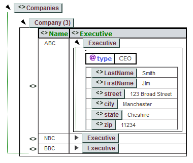

Figure 12. The Tree Structure of company.xml.


Clicking on the arrow heads expand or contract the tree view.

My ExamineCompany.java example loads this data as a DOM tree, and extracts
various information:

```java
// in ExamineCompany.java
public class ExamineCompany
{
  public static void main(String[] args) throws Exception
  {
    Document doc = XML.loadDoc("company.xml");
    NodeList root = doc.getChildNodes();  // get the document's root

    // move down the tree to the executive in the first company node
    Node comps = XML.getNode("Companies", root);
    Node comp = XML.getNode("Company", comps.getChildNodes());
    Node exec = XML.getNode("Executive", comp.getChildNodes());

    // print the executive's data
    String execType = XML.getNodeAttr("type", exec);
    NodeList exNodes = exec.getChildNodes();
    String lastName = XML.getNodeValue("LastName", exNodes);
    String firstName = XML.getNodeValue("FirstName", exNodes);
    String street = XML.getNodeValue("street", exNodes);
    String city = XML.getNodeValue("city", exNodes);
    String state = XML.getNodeValue("state", exNodes);
    String zip = XML.getNodeValue("zip", exNodes);

    System.out.println(execType);
    System.out.println(lastName + ", " + firstName);
    System.out.println(street);
    System.out.println(city + ", " + state + " " + zip);

    // get all the data in the tree for a given node/tag name
    NodeList lnNodes = doc.getElementsByTagName("LastName");
    ArrayList<String> lastnames = XML.getNodeValues(lnNodes);
    System.out.println("All lastnames:");
    for(String lastname: lastnames)
      System.out.println("  " + lastname);
  }  // end of main()
}  // end of ExamineCompany class
```

The program outputs details about the first company, and the lastnames of all the
company bosses:

```
CEO
Smith, Jim
123 Broad Street
Manchester, Cheshire 11234
All lastnames:
  Smith
  Jones
  Singh
```

XML.getNode() searches through a list of nodes, and returns the first with the
specified tag name:

```java
// in the XML class
public static Node getNode(String tagName, NodeList nodes)
{
  for (int i = 0; i < nodes.getLength(); i++) {
    Node node = nodes.item(i);
    if (node.getNodeName().equalsIgnoreCase(tagName))
      return node;
  }
  return null;
}  // end of getNode()
```

XML.getNodeValue() looks for a node in a list based on its tag name, and extracts the
data stored beneath that node.

```java
// in the XML class
public static String getNodeValue(String tagName, NodeList nodes)
{
  if (nodes == null)
    return "";
  for (int i = 0; i < nodes.getLength(); i++) {
    Node n = nodes.item(i);
    if (n.getNodeName().equalsIgnoreCase(tagName))
      return getNodeValue(n);
  }
  return "";
}  // end of getNodeValue()
```

The second version of XML.getNodeValue() retrieves the text from a node's
TEXT_NODE child (if there is one):

```java
// in the XML class
public static String getNodeValue(Node node)
{
  if (node == null)
    return "";
  NodeList childNodes = node.getChildNodes();
  for (int i = 0; i < childNodes.getLength(); i++) {
    Node n = childNodes.item(i);
    if (n.getNodeType() == Node.TEXT_NODE)
      return n.getNodeValue().trim();
  }
  return "";
}  // end of getNodeValue()
```

XML.getNodeValues() constructs a list of the data stored in all the supplied nodes:

```java
// in the XML class
public static ArrayList<String> getNodeValues(NodeList nodes)
{
  if (nodes == null)
    return null;
  ArrayList<String> vals = new ArrayList<String>();
  for (int i = 0; i < nodes.getLength(); i++) {
     String val = getNodeValue(nodes.item(i));
     if (val != null)
       vals.add(val);
  }
  return vals;
}  // end of getNodeValues()
```

XML.getNodeAttr() extracts data from a node's attribute:

```java
// in the XML class
public static String getNodeAttr(String attrName, Node node)
{
  if (node == null)
    return "";
  NamedNodeMap attrs = node.getAttributes();
  if (attrs == null)
    return "";
  for (int i = 0; i < attrs.getLength(); i++) {
    Node attr = attrs.item(i);
    if (attr.getNodeName().equalsIgnoreCase(attrName))
      return attr.getNodeValue().trim();
  }
  return "";
}  // end of getNodeAttr()
```

Converting XML to Spreadsheet Data
It's fairly easy to map XML data into a spreadsheet format of rows and columns.

Consider pay.xml from earlier:

```
<?xml version="1.0"?>
<payments>
  <payment>
    <purpose>CD</purpose>
    <amount>12.95</amount>
    <tax>19.1234</tax>
    <maturity>2008-03-01</maturity>
  </payment>

  <payment>
    <purpose>DVD</purpose>
    <amount>19.95</amount>
    <tax>19.4321</tax>
    <maturity>2008-03-02</maturity>
  </payment>

  <payment>
    <purpose>Clothes</purpose>
    <amount>99.95</amount>
    <tax>18.5678</tax>
    <maturity>2008-03-03</maturity>
  </payment>

  <payment>
    <purpose>Book</purpose>
    <amount>9.49</amount>
    <tax>18.9876</tax>
    <maturity>2008-03-04</maturity>
  </payment>
</payments>
```

It can be viewed as a sequence of payment objects, each containing four fields
(purpose, amount, tax, and maturity). Each  payment object can be mapped to a
spreadsheet row, and its fields to four columns in that row. This format can be
represented by a 2D array, which is easily constructed using the DOM API.

My CreatePay.java example utilizes XML.getAllNodeValues() to build a 2D array
from the pay.xml data, and calls Calc.setArray() to add the data to a new Calc
document:

```java
// in CreatePay.java
public class CreatePay
{
  public static void main(String args[])
  {
    Document xdoc = XML.loadDoc("pay.xml");
    NodeList pays = xdoc.getElementsByTagName("payment");
    if (pays == null)
      return;

    Object[][] data = XML.getAllNodeValues(pays,
             new String[]{"purpose", "amount", "tax", "maturity"});
    Lo.printTable("payments", data);

    XComponentLoader loader = Lo.loadOffice();
    XSpreadsheetDocument doc = Calc.createDoc(loader);
    if (doc == null) {
      System.out.println("Document creation failed");
      Lo.closeOffice();
      return;
    }
    GUI.setVisible(doc, true);
    XSpreadsheet sheet = Calc.getSheet(doc, 0);

    Calc.setArray(sheet, "A1", data);

    // Lo.saveDoc(doc, "payCreated.ods");
    Lo.waitEnter();
    Lo.closeDoc(doc);
    Lo.closeOffice();
  }  // end of main()

}  // end of CreatePay class
```

The list of payment nodes is obtained using:

```java
// part of CreatePay.java...

NodeList pays = xdoc.getElementsByTagName("payment");
The 2D array of payment data is constructed by:

// part of CreatePay.java...

Object[][] data = XML.getAllNodeValues(pays,
        new String[]{"purpose", "amount", "tax", "maturity"});
```

The first argument of getAllNodeValues() is the list of nodes to be scanned, and the
second parameter is an array of tag names. The named nodes are assumed to be
children of each  node in the list, and their data becomes one row in the 2D array. The
method's code:

```java
// in the XML class
public static Object[][] getAllNodeValues(NodeList rowNodes,
                                          String[] colIDs)
{ int numRows = rowNodes.getLength();
  int numCols = colIDs.length;
  Object[][] data = new Object[numRows+1][numCols];

  // put column names in first row of array
  for (int col = 0; col < numCols; col++)
    data[0][col] = Lo.capitalize( colIDs[col]);

  for (int i = 0; i < numRows; i++) {
    // extract column data for ith row
    NodeList colNodes = rowNodes.item(i).getChildNodes();
    for (int col = 0; col < numCols; col++)
       data[i+1][col] = getNodeValue(colIDs[col], colNodes);
  }
  return data;
}  // end of getAllNodeValues()
```

XML.getAllNodeValues() also adds a header row to the array made up of the tag
names.

The resulting table is printing by Lo.printTables():

```
-- payments ----------------
  Purpose  Amount  Tax  Maturity
  CD  12.95  19.1234  2008-03-01
  DVD  19.95  19.4321  2008-03-02
  Clothes  99.95  18.5678  2008-03-03
  Book  9.49  18.9876  2008-03-04
-----------------------------
```

Calc.setArray() adds the table to the spreadsheet, which ends up like Figure 13.


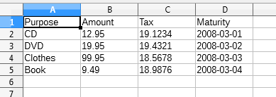

Figure 13. The Spreadsheet Generated by CreatePay.java.


XML.getAllNodeValues() doesn't always produce such good results, as illustrated by
the CreateAssoc.java example which converts part of clubs.xml into a spreadsheet.

As explained earlier, clubs.xml consists of a sequence of associations, with each one
made up of a sequence of clubs. The most natural spreadsheet mapping would be to
assign each association to its own sheet, and convert each club into a row on that
sheet.

A club consists of seven elements and two attributes, as seen in the following
example:

```
<club id="Q21" charter="2002">
  <name>Castro Valley Wrestling Club</name>
  <contact>Ron Maes</contact>
  <location>Castro Valley</location>
  <phone>510-555-1491</phone>
  <email>cvwcron@example.com</email>
  <age-groups type="KCJOW"/>
  <info>Practices every Tuesday and Thursday at 5:00 P.M.

        at Castro Valley High School mat room.</info>
</club>
```

Probably the best spreadsheet representation would be to use nine columns, so the
attributes could be listed. This approach is employed by the xmlgrid.net website as
shown in Figure 14.


Figure 14. Part of the Clubs Information.


Unfortunately, XML.getAllNodeValues() as currently coded doesn't extract attribute
information, so the id and charter data will be missed.

The CreateAssoc.java example loads clubs.xml, and selects the first association. Its
list of clubs is passed to XML.getAllNodeValues() for conversion into an array. The
complete program is:

```java
// in CreateAssoc.java
public class CreateAssoc
{
  public static void main(String args[])
  {
    Document xdoc = XML.loadDoc("clubs.xml");
    NodeList root = xdoc.getChildNodes();

    // get the first association
    Node cdb = XML.getNode("club-database", root);
    Node assoc1 = XML.getNode("association", cdb.getChildNodes());
    NodeList clubs = assoc1.getChildNodes();

    // convert clubs information into an array
    Object[][] data = XML.getAllNodeValues(clubs,
      new String[]{"name", "contact", "location", "phone", "email"});
    Lo.printTable("clubs", data);

    XComponentLoader loader = Lo.loadOffice();
    XSpreadsheetDocument doc = Calc.createDoc(loader);
    if (doc == null) {
      System.out.println("Document creation failed");
      Lo.closeOffice();
      return;
    }
    GUI.setVisible(doc, true);
    XSpreadsheet sheet = Calc.getSheet(doc, 0);
    Calc.setArray(sheet, "A1", data);

    // Lo.saveDoc(doc, "clubsCreated.ods");
    Lo.waitEnter();
    Lo.closeDoc(doc);
    Lo.closeOffice();
  }  // end of main()

}  // end of CreateAssoc class
```

XML.getAllNodeValues() only requests data for five of the seven elements ("name",
"contact", "location", "phone", "email") to reduce the information returned. The
resulting spreadsheet is shown in Figure 15.


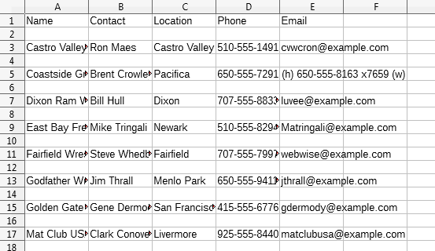

Figure 15. Part of the Spreadsheet Generated by CreateAssoc.java.


An obvious issue is the empty rows between the clubs data, caused by the simple
XML.getAllNodeValues() implementation. It assumes that every node supplies one
row of data because of its data element child. Howevere, each club also contains
attributes which adds an extra empty row to the output.


### 3.2.  Node and Attribute Data Extraction as Labeled Strings

Not all XML data can be so easily mapped to a 2D format, especially collections such
as weather.xml:

```
<?xml version="1.0" encoding="UTF-8"?><current>
    <city id="1610780" name="Hat Yai">
        <coord lat="7.01" lon="100.48"/>
        <country>TH</country>
        <sun rise="2017-01-01T23:30:31" set="2017-01-02T11:14:18"/>
    </city>
    <temperature max="25" min="25" unit="metric" value="25"/>
    <humidity unit="%" value="94"/>
    <pressure unit="hPa" value="1011"/>
    <wind>
        <speed name="Gentle Breeze" value="3.6"/>
        <gusts/>
        <direction code="NNE" name="North-northeast" value="30"/>
    </wind>
    <clouds name="broken clouds" value="75"/>
    <visibility value="5000"/>
    <precipitation mode="no"/>
    <weather icon="10n" number="501" value="moderate rain"/>
    <lastupdate value="2017-01-02T15:30:00"/>
</current>
```

This data was downloaded from OpenWeatherMap using the API at
https://api.openweathermap.org/. Unlike pay.xml or clubs.xml there's no sequence of
objects that would naturally become rows of a spreadsheet. In addition, the data is
mostly represented by attributes rather than text nodes.

In situations like this, a good general approach is to convert the XML to simpler text,
removing XML labels except for the element and attribute names. As a result, my
ExtractXMLInfo.java example produces the following output when applied to
weather.xml:

```
current
  city  id= "1610780"  name= "Hat Yai"
    coord  lat= "7.01"  lon= "100.48"
    country: "TH"
    sun  rise= "2017-01-01T23:30:31"  set= "2017-01-02T11:14:18"

  temperature  max= "25"  min= "25"  unit= "metric"  value= "25"
  humidity  unit= "%"  value= "94"
  pressure  unit= "hPa"  value= "1011"
  wind
    speed  name= "Gentle Breeze"  value= "3.6"
    gusts
    direction  code= "NNE"  name= "North-northeast"  value= "30"

  clouds  name= "broken clouds"  value= "75"
  visibility  value= "5000"
  precipitation  mode= "no"
  weather  icon= "10n"  number= "501"  value= "moderate rain"
  lastupdate  value= "2017-01-02T15:30:00"
```

Line indentation is retained, and is utilized when the data is loaded into Office.

As another example, consider pay.xml which ExtractXMLInfo.java converts into:

```
payments
  payment
    purpose: "CD"
    amount: "12.95"
    tax: "19.1234"
    maturity: "2008-03-01"

  payment
    purpose: "DVD"
    amount: "19.95"
    tax: "19.4321"
    maturity: "2008-03-02"

  payment
    purpose: "Clothes"
    amount: "99.95"
    tax: "18.5678"
    maturity: "2008-03-03"

  payment
    purpose: "Book"
    amount: "9.49"
    tax: "18.9876"
    maturity: "2008-03-04"
```

The elements and attributes with data are highlighted by adding  a ":" or "=" after
their names. Also, the data is always doubly quoted.

ExtractXMLInfo.java travels over the DOM tree, printing what it finds to a text file:

```java
// in ExtractXMLInfo.java
public static void main(String[] args) throws Exception
{
  if (args.length != 1) {
    System.out.println("Usage: run ExtractXMLInfo <XML file>");
    return;
  }
  Document doc = XML.loadDoc(args[0]);
  if (doc == null)
    return;

  String fname = Info.getName(args[0]);
  String outFnm = fname + "XML.txt";
  System.out.println("Writing XML data from " + args[0] +
                                           " to " + outFnm);
  PrintWriter pw = new PrintWriter(new FileWriter(outFnm));

  NodeList root = doc.getChildNodes();
  // there may be multiple trees; visit each one
  for (int i = 0; i < root.getLength(); i++) {
    visitNode(pw, root.item(i), "");
    pw.write("\n");
  }
  pw.close();
}  // end of main()
```

visitNode() prints the node's tag, any attribute data, any text child node data, and
recursively visits the rest of the node's children:

```java
// part of ExtractXMLInfo.java
private static void visitNode(PrintWriter pw, Node node, String ind)
{
  pw.write(ind + node.getNodeName());
  visitAttrs(pw, node);

  // examine all the child nodes
  NodeList nodeList = node.getChildNodes();
  for (int i = 0; i < nodeList.getLength(); i++) {
    Node child = nodeList.item(i);
    if (child.getNodeType() == Node.TEXT_NODE) {
      String trimmedVal = child.getNodeValue().trim();
      if (trimmedVal.length() == 0)
        pw.write("\n");
      else
        pw.write(": \"" + trimmedVal + "\"");
           // element names with values end with ':'
    }
    else if (child.getNodeType() == Node.ELEMENT_NODE)
      visitNode(pw, child, ind+"  ");
  }
} // end of visitNode()
```

visitAttrs() prints attribute names and data:

```java
// part of ExtractXMLInfo.java
private static void visitAttrs(PrintWriter pw, Node node)
{
  NamedNodeMap attrs = node.getAttributes();
  if (attrs != null) {
    for (int i = 0; i < attrs.getLength(); i++) {
      Node attr = attrs.item(i);
      pw.write("  " + attr.getNodeName() + "= \"" +
                             attr.getNodeValue() + "\"");
           // attribute names end with '='
    }
  }
}  // end of visitAttrs()
```

When ExtractXMLInfo.java has finished stripping the XML, the next stage is to call
BuildXMLSheet.java to load the text into Office as a Calc sheet. This is done by
converting it into a 2D array which is added to the spreadsheet by Calc.setArray().

The main() function of BuildXMLSheet.java calls getData() to create the array:

```java
// in BuildXMLSheet.java
public static void main(String[] args)
{
  if (args.length != 1) {
    System.out.println("Usage: run BuildXMLSheet <XML textfile>");
    return;
  }

  Object[][] data = getData(args[0]);
  Lo.printTable(args[0] + " data", data);

  XComponentLoader loader = Lo.loadOffice();
  XSpreadsheetDocument doc = Calc.createDoc(loader);
  if (doc == null) {
    System.out.println("Document creation failed");
    Lo.closeOffice();
    return;
  }
  GUI.setVisible(doc, true);
  Lo.delay(2000);
  XSpreadsheet sheet = Calc.getSheet(doc, 0);
  Calc.setArray(sheet, "A1", data);

  // Lo.saveDoc(doc, "createdSS.ods");
  Lo.waitEnter();
    Lo.closeDoc(doc);
    Lo.closeOffice();
  }  // end of main()
```

getData() builds the array in two steps: initially a list of differently sized arrays is
created, one for each input line. Then the list is converted into a 2D array where every
row has the same length.

```java
// part of BuildXMLSheet.java
private static Object[][] getData(String fnm)
{
  int maxCols = 0;    // max number of columns across all rows

  // each input line is stored as an array inside a list
  ArrayList<Object[]> rows = new ArrayList<Object[]>();

  System.out.println("Reading data from " + fnm);
  try {
    BufferedReader br = new BufferedReader(new FileReader(fnm));
    String line;
    while ((line = br.readLine()) != null) {
       Object[] toks = splitLine(line);
           // read a line as an array of tokens (strings)
      if (toks.length > 0)
        rows.add(toks);
      if (toks.length > maxCols)
        maxCols = toks.length;
    }
  }
  catch(IOException e) {
    System.out.println("Could not read " + fnm);
    return null;
  }

  // convert list of different length arrays into a
  // fixed length 2D array
  Object[][] data = new Object[rows.size()][maxCols];
  for (int r = 0; r < rows.size(); r++) {
    Object[] row = rows.get(r);
    for (int c = 0; c < maxCols; c++) {
      if (c >= row.length)
        data[r][c] = "";   // pad out array row with empty strings
      else
        data[r][c] = row[c];
    }
  }
  return data;
}  // end of getData()

splitLine() converts an input line into an array of tokens.


// part of BuildXMLSheet.java
private static String[] splitLine(String ln)
{
  ln += " "; // To detect last token when not quoted...

  boolean inQuote = false;
  boolean isIndenting = true;
  int numSpaces = 0;

  StringBuilder word = new StringBuilder();
  ArrayList<String> toks = new ArrayList<String>();
               // used to store tokens for the final array

  for (int i = 0; i < ln.length(); i++) {
    char ch = ln.charAt(i);

    if (ch != ' ' && isIndenting)
      isIndenting = false;

    if (ch == ' ' && isIndenting) {
      numSpaces++;
      if (numSpaces%2 == 0)
        toks.add("");  // convert two space indent into ""
    }
    else if (ch == '\"' || ch == ' ' && !inQuote) {
      // treat a double quoted string as one token
      if (ch == '\"')
        inQuote = !inQuote;
      if (!inQuote && word.length() > 0) {
        char lastCh = word.charAt(word.length()-1);
        if ((lastCh == ':') || (lastCh == '='))
          // strip element and attribute assignment symbols
          word.deleteCharAt(word.length()-1);
        toks.add(word.toString());
        word.delete(0, word.length());
      }
    }
    else
      word.append(ch);
  }
  return toks.toArray(new String[toks.size()]);
}  // end of splitLine()
```

Every two spaces at the start of a line is stored as an empty string in the row array.
These strings will later occupy spreadsheet cells at the start of a row, causing the
actual data to be 'indented' to cells further to the right.

Special care is taken to treat a doubly quoted string as a single token, and any word
ending with ':' or '=' has that character stripped away. These characters signify that the
element or attribute name has associated data.

Figure 16 shows how the weather data is loaded as a spreadsheet by
BuildXMLSheet.java.


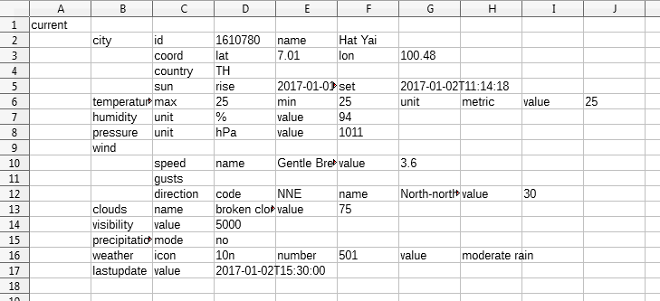

Figure 16. BuildXMLSheet Applied to Weather Data.


Figure 17 shows the results for the payments data.


Figure 17. BuildXMLSheet Applied to Payments Data.


### 3.3.  JAXB Conversion of XML to Java Objects

Java Architecture for XML Binding (JAXB) provides methods for unmarshalling
(converting) XML documents into Java classes and objects, and for marshalling Java
objects back into XML documents. I'm interested in the unmarshalling parts so data
can be passed to Office as Java objects rather than as XML.

Most of the magic of the XML-to-Java conversion is performed by Java's xjc.exe tool
which comes as part of the JDK (you'll find it in %java_home%\bin\ on Windows).
xjc processes an XML schema (an XSD file)  rather than XML since the schema
contains information about the XML's underlying structure.

The good news is that there are websites, such as freeformatter.com, which can
generate XSD from supplied XML (https://freeformatter.com/xsd-generator.html).
I employed its "Salami slice" translator so that the Java code
generated later by xjc is a bit simpler to read. freeformatter.com converted pay.xml
into the following XSD:

```
<xs:schema attributeFormDefault="unqualified"
elementFormDefault="qualified"
xmlns:xs="https://w3.org/2001/XMLSchema">
  <xs:element name="purpose" type="xs:string"/>
  <xs:element name="amount" type="xs:float"/>
  <xs:element name="tax" type="xs:float"/>
  <xs:element name="maturity" type="xs:date"/>
  <xs:element name="payment">
    <xs:complexType>
      <xs:sequence>
        <xs:element ref="purpose"/>
        <xs:element ref="amount"/>
        <xs:element ref="tax"/>
        <xs:element ref="maturity"/>
      </xs:sequence>
    </xs:complexType>
  </xs:element>
  <xs:element name="payments">
    <xs:complexType>
      <xs:sequence>
        <xs:element ref="payment"
            maxOccurs="unbounded" minOccurs="0"/>
      </xs:sequence>
    </xs:complexType>
  </xs:element>
</xs:schema>
```

The schema gives the names and types for each field in a payment object, and makes
payments a sequence of payment objects.

A good tutorial on XSD can be found at w3schools.com:
https://w3schools.com/Xml/schema_intro.asp

If the resulting schema is stored in pay.xsd, then xjc generates Java classes like so:

```
xjc -p Pay pay.xsd
```

The –p option supplies a package name which causes the potentially numerous classes
to be stored in a folder of that name. Details about xjc can be found at
https://docs.oracle.com/javase/6/docs/technotes/tools/share/xjc.html, or by calling xjc -
help.

Three classes are written to the Pay\ folder: Payments.java, Payment.java, and
ObjectFactory.java. The first two are Java version of the XML elements, while
ObjectFactory is used to create the Java objects at runtime. Figure 18 shows class
diagrams for the code.


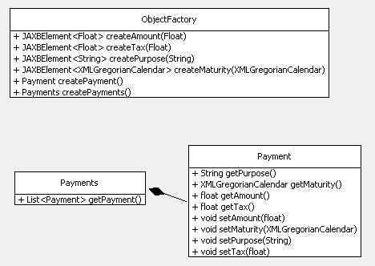

Figure 18. The Payments Class Diagrams.


As you might expect, the XML sequence of Payment objects inside Payments is
implemented as a list in Java.

The details of the ObjectFactory aren't important, but the get/set methods in the
Payments and Payment classes will be useful. My UnmarshallPay.java example
shows how to use these classes:

```java
// in UnmarshallPay.java
import java.io.*;
import java.util.*;
import javax.xml.bind.*;
import Pay.*;   // the package for the Pay classes

public class UnmarshallPay
{
  public static void main(String[] args)
  {
    try {
      // initialize the Payments objects using pay.xml
      JAXBContext jaxbContext =
               JAXBContext.newInstance(Payments.class);
      Unmarshaller jaxbUnmarshaller =
               jaxbContext.createUnmarshaller();
      Payments pays = (Payments) jaxbUnmarshaller.unmarshal(
                                     new File("pay.xml"));

      List<Payment> payList = pays.getPayment();

      // print payment names and amounts
      System.out.println("Payments");
      for(Payment p : payList)
        System.out.println("  " + p.getPurpose() +
                           ": " + p.getAmount());
    }
    catch (JAXBException e) {
      e.printStackTrace();
    }
  }  // end of main()

}  // end of UnmarshallPay class
```

main() creates an Unmarshaller object for the Payments class, which is initialized
with data from pay.xml. It then iterates through the Payment objects and prints their
purpose and amount fields. The output is:

```
Payments
  CD: 12.95
  DVD: 19.95
  Clothes: 99.95
  Book: 9.49
```

Now that the XML data is available through Java (using various get methods), it is
quite easy to extend UnmarshallPay.java to write it into an Office document.


#### clubs.xml as Java Code

The JAXB manipulation of clubs.xml follows the same steps as used on pay.xml:

1. Convert clubs.xml to XSD at freeformatter.com using the "Salami Slice" mapping.
2. Convert company.xsd into Java classes with xjc: `xjc -p Clubs clubs.xsd`
3. Compile the Clubs package: `javac Clubs/*.java`

Figure 19 shows the Clubs class diagrams.


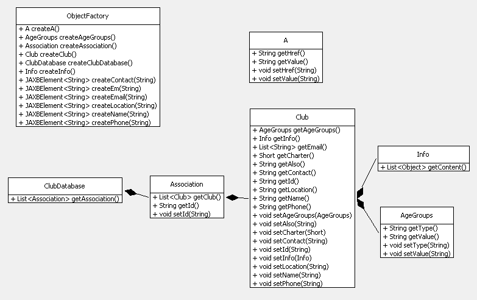

Figure 19. The Clubs Class Diagrams.


The top-level class is ClubDatabase which maintains a list of Association objects.

Each Association object holds a list of Club objects. Club contains get/set methods for
accessing its fields. My UnmarshallClubs.java example shows how to use these
classes:

```java
// in UnmarshallClubs.java
import java.io.*;
import java.util.*;
import javax.xml.bind.*;
import Clubs.*;  // the package for the Club classes


public class UnmarshallClubs
{
  public static void main(String[] args)
  {
    try {
      // initialize the Clubs objects using clubs.xml
      JAXBContext jaxbContext =
               JAXBContext.newInstance(ClubDatabase.class);
      Unmarshaller jaxbUnmarshaller =
               jaxbContext.createUnmarshaller();
      ClubDatabase cd = (ClubDatabase) jaxbUnmarshaller.unmarshal(
                                 new File("clubs.xml"));

      List<Association> assocList = cd.getAssociation();

      // print club names for all the associations
      System.out.println("Associations");
      for(Association assoc : assocList) {
        System.out.println("  " + assoc.getId());
        List<Club> clubs = assoc.getClub();
        for(Club club : clubs)
          System.out.println("    " + club.getName());
      }
    }
    catch (JAXBException e) {
      e.printStackTrace();
    }
  }  // end of main()

}  // end of UnmarshallClubs class
```

The unmarshalling is similar to before except that the ClubDatabase object is
initialized with data from clubs.xml. The code iterates through the clubs in each
association, printing their names:

```
Associations
  BAWA
    Castro Valley Wrestling Club
    Coastside Grapplers
    Dixon Ram Wrestling
    East Bay Freestylers
    Fairfield WrestlingClub
    Godfather Wrestling Club
    Golden Gate Wrestling Club
    Mat Club USA
    Pirate Wrestling Club
    SF Elite Wrestling
    Titan Wrestling Club
  CAGWA
    Big Bear Grizzlies Wrestling Club
    California Grapplers Youth Wrestling
     :
     :
    South Coast Wrestling Club
    West Hills Hawks
```

#### Naming Conflicts

The xjc tool works so well that a deep understanding of JAXB isn't usually needed.
The exception is when the XML contains a name conflict, which occurs if two or
more attributes have the same name.

There's a number of "value" name conflicts in weather.xml, which I've highlighted
below:

```
<?xml version="1.0" encoding="UTF-8"?>
<current>
    <city id="1610780" name="Hat Yai">
        <coord lat="7.01" lon="100.48"/>
        <country>TH</country>
        <sun rise="2017-01-01T23:30:31" set="2017-01-02T11:14:18"/>
    </city>
    <temperature max="25" min="25" unit="metric" value="25"/>
    <humidity unit="%" value="94"/>
    <pressure unit="hPa" value="1011"/>
    <wind>
        <speed name="Gentle Breeze" value="3.6"/>
        <gusts/>
        <direction code="NNE" name="North-northeast" value="30"/>
    </wind>
    <clouds name="broken clouds" value="75"/>
    <visibility value="5000"/>
    <precipitation mode="no"/>
    <weather icon="10n" number="501" value="moderate rain"/>
    <lastupdate value="2017-01-02T15:30:00"/>
</current>
```

The "value" attribute is used nine times in different contexts. This doesn't pose a
problem for freeformatter.com, which quietly generates weather.xsd. The name
conflict is only reported when xjc tries to generate Java classes:

```
>  xjc -p Weather weather.xsd
parsing a schema...

[ERROR] Property "Value" is already defined.

Use <jaxb:property> to resolve this conflict.

    :  // many more error messages …
```

As the error message advises, I need to add jaxb:property annotations to the XSD file
to allow xjc to correctly translate the attributes. For example, the first offender in
weather.xsd is:

```
<xs:attribute type="xs:float" name="value"/>
Its jaxb:property annotation is:

<xs:attribute type="xs:float" name="value">
    <!-- avoid "value" name conflict -->
    <xs:annotation>
        <xs:appinfo>
            <jaxb:property name="valueAttribute"/>
        </xs:appinfo>
    </xs:annotation>
</xs:attribute>
```

This same change is applied to all the other conflicting attribute names.

In addition, the new "jaxb" label must be linked to its JAXB schema at the start of the
XSD file:

```
<!-- in the xs:schema element -->
xmlns:jaxb="https://java.sun.com/xml/ns/jaxb"
jaxb:version="2.1"
```

If you want to understand what's happening in more detail, the best place to start is the
tutorial at Oracle: https://docs.oracle.com/javase/tutorial/jaxb/intro/.

When xjc is passed this modified weather.xsd file, the Java classes are correctly
generated. Figure 20 shows only the class names to reduce the diagram's size.


Figure 20. The Weather Class Diagrams.


The top-level class is Current which stores the weather attributes as objects.

My UnmarshallWeather.java example examines weather.xml to report if it was
raining on the report day:

```java
// in UnmarshallWeather.java
public class UnmarshallWeather
{
  public static void main(String[] args)
  {
    try {
      JAXBContext jaxbContext =
                    JAXBContext.newInstance(Current.class);
      Unmarshaller jaxbUnmarshaller =
                    jaxbContext.createUnmarshaller();
      Current currWeather = (Current) jaxbUnmarshaller.unmarshal(
                                 new File("weather.xml"));

      // get precipitation as a boolean
      String rainingStatus =
                currWeather.getPrecipitation().getValue();
      boolean isRaining = rainingStatus.equals("yes");

      // get date in day/month/year format
      XMLGregorianCalendar gCal =
               currWeather.getLastupdate().getValueAttribute();
      Calendar cal = gCal.toGregorianCalendar();

      SimpleDateFormat formatter =
                          new SimpleDateFormat("dd/MM/yyyy");
      formatter.setTimeZone(cal.getTimeZone());
      String dateStr = formatter.format(cal.getTime());

      if (isRaining)
        System.out.println("It was raining on " + dateStr);
      else
        System.out.println("It was NOT raining on " + dateStr);
    }
    catch (JAXBException e) {
      e.printStackTrace();
    }
  }  // end of main()

}  // end of UnmarshallWeather class
```

The output is:

```
It was NOT raining on 02/01/2017
```
